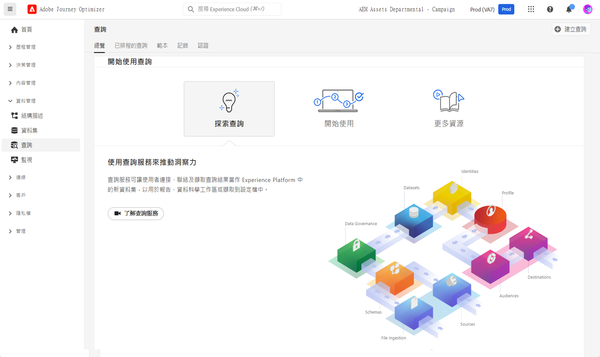

# 開始使用查詢 {#queries-gs}

>[!BEGINSHADEBOX]

**在此頁面上：**&#x200B;使用由Adobe Experience Platform查詢服務支援的查詢編輯器，以便您可以編寫、驗證和執行客戶體驗資料的查詢，以便在Adobe Journey Optimizer中分析和探索資料。

>[!ENDSHADEBOX]

查詢編輯器是 Adobe Experience Platform 查詢服務提供的互動式工具，允許您在 [!DNL Adobe Journey Optimizer] 使用者介面編寫、驗證和執行對客戶體驗資料的查詢。

查詢編輯器支援開發用於分析及資料瀏覽的查詢，並允許您執行用於開發的互動式查詢以及用於填入[資料集](get-started-datasets.md)的非互動式查詢。

在[本文件](https://experienceleague.adobe.com/docs/experience-platform/query/ui/user-guide.html?lang=zh-Hant){target="_blank"}中瞭解如何使用查詢編輯器。

>[!MORELIKETHIS]
>
>* [查詢服務文件](https://experienceleague.adobe.com/docs/experience-platform/query/home.html?lang=zh-Hant){target="_blank"}
>* [查詢服務概觀影片](https://experienceleague.adobe.com/docs/platform-learn/tutorials/queries/understanding-query-service.html?lang=zh-Hant){target="_blank"}
