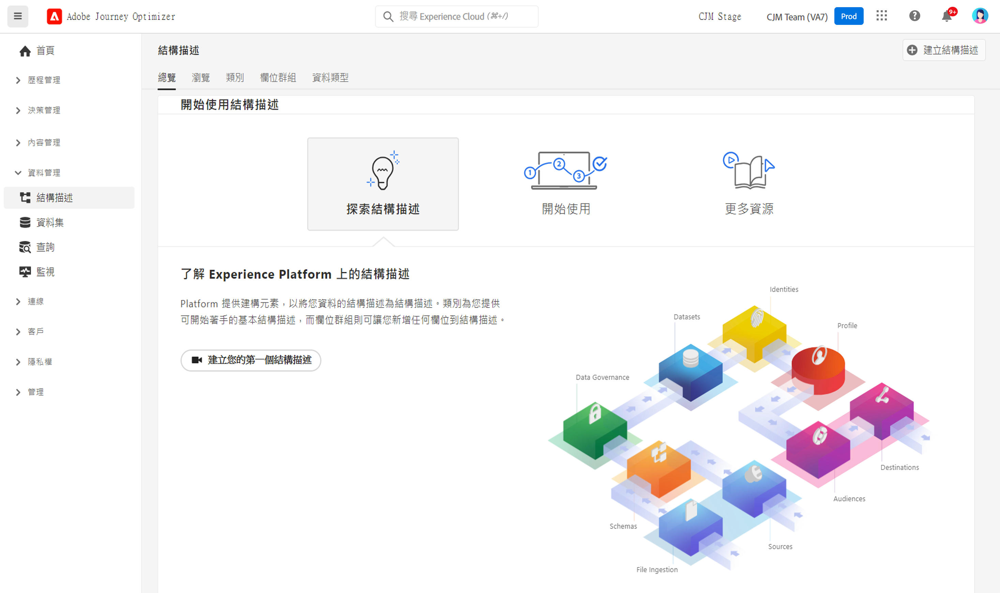

# 開始使用結構描述 {#schemas-gs}

結構描述是 Experience Platform 描述資料的標準方式，允許所有符合結構描述的資料在整個組織重複使用而不會產生衝突，甚至可在多個組織之間共用。

➡️ [了解如何在這段影片裡建立、設定結構描述](#video-schema) (影片)

結構描述是一組規則，足以代表並驗證資料的結構和格式。 從高層面來說，結構描述會提供真實物件 (例如個人) 等抽象定義，還會概述應加入物件的每個執行個體資料 (例如名字、姓氏、生日等)。

在[本文件](https://experienceleague.adobe.com/docs/experience-platform/xdm/schema/composition.html?lang=zh-Hant){target="_blank"}中，了解如何建立結構描述

此&#x200B;**結構描述**&#x200B;工作區[!DNL Adobe Journey Optimizer]使用者介面可讓您管理 Experience Data Model (XDM) 資源，包括結構描述、類別、結構描述欄位群組以及資料類型。 您可以檢視並探索 Adobe 提供的核心資源，並為貴組織建立自訂資源和結構描述。

在[本文件](https://experienceleague.adobe.com/docs/experience-platform/xdm/ui/overview.html?lang=zh-Hant){target="_blank"}中，了解如何使用結構描述的使用者介面

請參閱 [Adobe Experience Platform 文件](https://experienceleague.adobe.com/docs/experience-platform/xdm/tutorials/create-schema-ui.html?lang=zh-Hant){target="_blank"}，即可瞭解如何使用結構描述編輯器，建立結構描述的逐步操作文件。

請參閱 [Journey Optimizer 結構描述字典](https://experienceleague.adobe.com/tools/ajo-schemas/schema-dictionary.html?lang=zh-Hant){target="_blank"}，以便檢視每個結構描述的完整欄位、屬性清單。

## 操作說明影片{#video-schema}

瞭解如何建立結構、新增欄位群組、建立及設定自訂欄位群組。

>[!VIDEO](https://video.tv.adobe.com/v/334461?quality=12)

>[!MORELIKETHIS]
>
>* [建立結構描述、資料集及擷取資料，即可在 Journey Optimizer 新增測試輪廓](../audience/creating-test-profiles.md)
>* [XDM 系統概觀](https://experienceleague.adobe.com/docs/experience-platform/xdm/home.html?lang=zh-Hant){target="_blank"}
>* [資料模式的最佳做法](https://experienceleague.adobe.com/docs/experience-platform/xdm/schema/best-practices.html?lang=zh-Hant){target="_blank"}
>* [使用結構描述登錄 API，建立結構描述](https://experienceleague.adobe.com/docs/experience-platform/xdm/tutorials/create-schema-api.html?lang=zh-Hant){target="_blank"}
>* [使用結構描述編輯器，定義兩種結構描述之間的關係](https://experienceleague.adobe.com/docs/experience-platform/xdm/tutorials/relationship-ui.html?lang=zh-Hant){target="_blank"}
