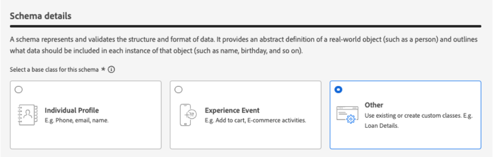
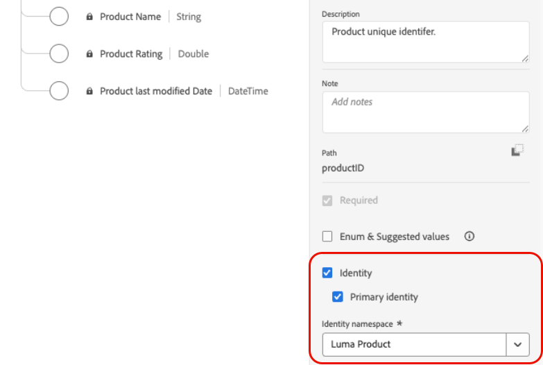
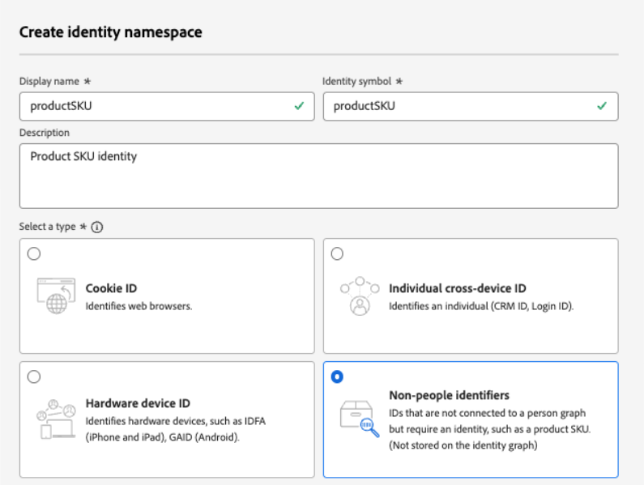
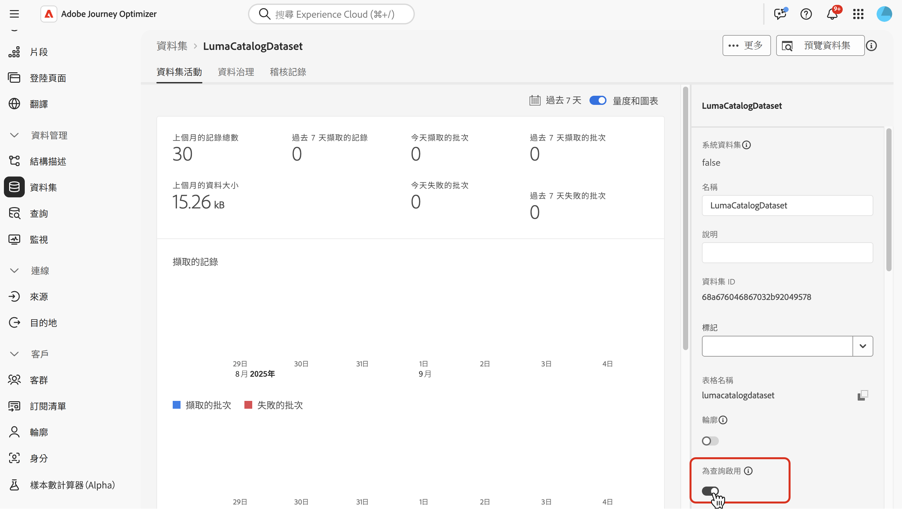
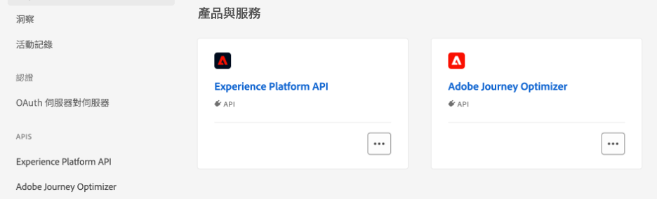
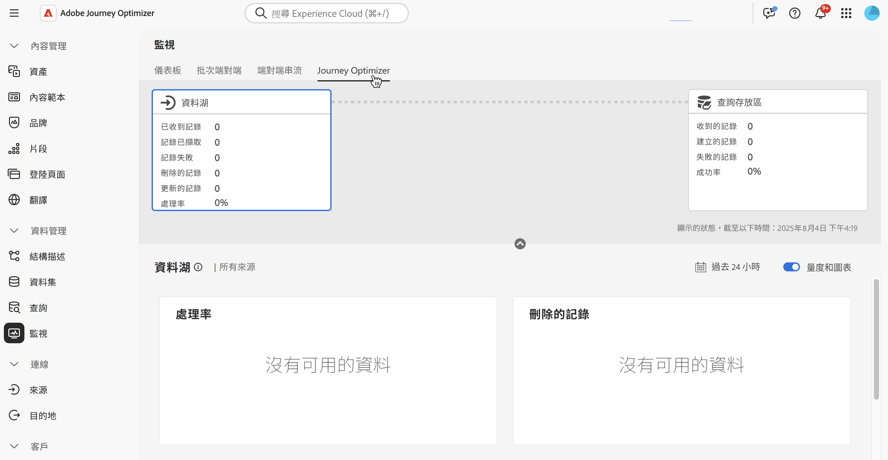

# 使用 Adobe Experience Platform 資料 {#aep-data}

>[!CONTEXTUALHELP]
>id="lookup-aep-data"
>title="啟用供查詢使用"
>abstract="啟用資料集進行查詢可讓您透過Journey Optimizer個人化和決策功能來運用其資料。"

>[!AVAILABILITY]
>
>此功能目前以有限可用性版本的形式提供給所有客戶。

Journey Optimizer可讓您透過個人化和決策功能，運用Adobe Experience Platform資料中的資料。 若要這麼做，必須先為查詢服務啟用查詢個人化所需的記錄型資料集，如下所述。

## 必讀

### 護欄和指導方針 {#guidelines}

開始之前，請檢閱下列限制和准則：

* 為查詢啟用的資料集不應包含任何個人識別資訊(PII)。
* 針對查詢啟用的資料集及用於個人化的資料集無法防止刪除。 您可以自行追蹤用於個人化的資料集，以確保不會刪除或移除這些資料集。
* 資料集必須與不屬於設定檔或事件型別的結構描述相關聯。
* 結構描述必須具有主要身分。 只有單一主索引鍵可用於查詢。

### 查閱服務的權益

| 功能元件 | 生產沙箱限制 | 附註 |
| ------- | ------- | ------- |
| 啟用查閱資料集 | 每個組織最多10個 | 可於指定時間設定查閱的資料集數目上限。 此限制適用於客戶執行個體內生產及開發沙箱中的查閱資料集總合併數量。 |
| 資料集記錄計數 | 每個資料集最多200萬筆記錄 | 單一資料集中允許的最大記錄數，以該資料集中所有批次的總數來計算。 |
| 記錄大小 | 每筆記錄最多2 KB | 支援預設最大記錄大小。 |
| 資料集大小 | 最大4 GB | 個別資料集的大小上限，而不是沙箱中所有資料集的大小組合。 記錄計數和資料集大小限制是獨立的護欄 — 兩者都必須符合。 |
| 資料集頻率更新 | 每個資料集每天最多5次更新 | 單一資料集每天允許的最大更新作業頻率。 |

>[!NOTE]
>
>如果除了上述的護欄以外，還需要其他卷冊，請聯絡您的Adobe代表。

### 其他效能考量事項

以下建議是避免傳遞延遲的指引：

| 考量 | 建議的限制 | 說明 |
| ------- | ------- | ------- |
| 每個查詢的屬性 | 最多20 | 單一查閱活動中每筆記錄擷取的資料欄位數。 |
| 查詢活動 | 每個歷程最多5個 | 每個歷程最多可包含5個個別的查詢活動。 每個查詢都可以鎖定不同的資料集。 |

## 啟用資料集以進行資料查詢 {#enable}

為了將資料集中的資料用於個人化，您需要啟用資料集以進行查詢。

### 先決條件 {#prerequisites-enable}

與您要啟用查詢的資料集關聯的結構描述必須是記錄型別。 結構描述不應屬於設定檔或事件類別。

+++範例



+++

結構描述必須定義主要身分。

+++範例



+++

如果尚未定義自訂名稱空間，請確保身分識別碼不是人員。

+++範例



+++

### 在資料集管理介面中啟用資料集以進行查詢

在資料集管理使用者介面中，使用切換開關來啟用資料集以供查閱。



>[!NOTE]
>
>我們建議不要為設定檔啟用此資料集，因為這會導致設定檔豐富度增加，而且不需要執行查詢。

### API方法

依照[本檔案](https://developer.adobe.com/journey-optimizer-apis/references/authentication/)中詳述的指示，設定您的環境以傳送API命令。

#### 先決條件

* 開發人員專案必須將Adobe Journey Optimizer和Adobe Experience Platform API新增至其專案。

  

* 您角色中必須有管理資料集許可權。

* 資料集所根據的結構描述必須包含可作為查詢金鑰的主要身分。

#### API呼叫結構

```shell
curl -s -XPATCH "https://platform.adobe.io/data/core/entity/lookup/dataSets/${DATASET_ID}/${ACTION}" \ -H "Authorization: Bearer ${ACCESS_TOKEN}" \ -H "x-api-key: ${API_KEY}" \ -H "x-gw-ims-org-id: ${IMS_ORG}" \ -H "x-sandbox-name: ${SANDBOX_NAME}" 
```

其中：

* URL為`https://platform.adobe.io/data/core/entity/lookup/dataSets/${DATASET_ID}/${ACTION}`
* 資料集ID是您要啟用的資料集。
* 動作為啟用或停用。
* 存取權杖可從開發人員控制檯中擷取。
* API金鑰可從開發人員主控台擷取。
* IMS組織ID是您的Adobe組織。
* 「沙箱名稱」是資料集所在的沙箱名稱（即生產、開發等）。

>[!NOTE]
>
>如果您在嘗試使用API呼叫啟用資料集時遇到以下錯誤，請嘗試從開發人員控制檯專案中移除Adobe Journey Optimizer API，然後重新新增它們：
>
>`"error_code": "403003",`
>`"message": "Api Key is invalid"`

## 資料集監控

資料集啟用查閱後，您可以前往&#x200B;**[!UICONTROL 監視]**&#x200B;功能表並選取&#x200B;**[!UICONTROL Journey Optimizer]**&#x200B;索引標籤，來檢閱擷取至查閱服務的狀態。

此程式指標有助於瞭解查閱服務中何時可使用新的資料批次。



<!--Ivan Mironchuk
Note - we have a bug here currently. Will need to update screenshot once the lookup service will accurately reflect the progress.-->

## 後續步驟

使用API呼叫啟用資料集進行查閱後，您就可以將該資料與[!DNL Journey Optimizer]個人化和決策功能搭配使用。 如需詳細資訊，請參閱以下區段：

* [使用 Adobe Experience Platform 資料進行個人化](../personalization/aep-data-perso.md)
* [使用 Adobe Experience Platform 資料進行決策](../experience-decisioning/aep-data-exd.md)
