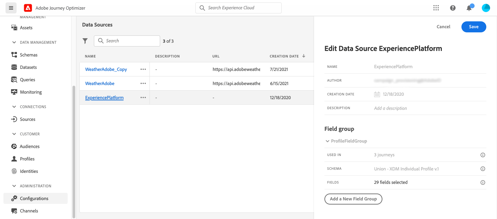
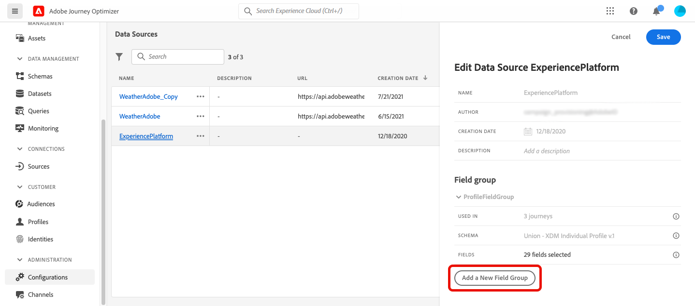

# Adobe Experience Platform 資料來源 {#adobe-experience-platform-data-source}

>[!CONTEXTUALHELP]
>id="ajo_journey_data_source_built_in"
>title="Adobe Experience Platform 資料來源"
>abstract="Adobe Experience Platform 資料來源會定義和 Adobe 即時客戶設定檔的連線。此資料來源是內建和預先設定的，並無法刪除。其旨在從即時客戶輪廓服務中擷取和使用資料 (例如，檢查進入歷程的人員是否為女性)。"

Adobe Experience Platform 資料來源會定義和 Adobe 即時客戶設定檔的連線。此資料來源是內建和預先設定的，並無法刪除。此資料來源旨在擷取及使用即時客戶個人檔案服務的資料（例如，檢查進入歷程的人員是否為女性）。 如需Adobe即時客戶個人檔案的詳細資訊，請參閱[Adobe Experience Platform檔案](https://experienceleague.adobe.com/docs/experience-platform/profile/home.html?lang=zh-Hant){target="_blank"}。

若要允許連線到即時客戶個人檔案服務，我們必須使用金鑰來識別人員，並使用名稱空間將金鑰內容化。 因此，如果您的歷程以包含索引鍵和名稱空間的事件開始，您只能使用此資料來源。 [了解更多](../building-journeys/journey.md)。

您可以編輯名為「ProfileFieldGroup」的預先設定欄位群組、新增欄位群組，以及移除未用於任何草稿或即時歷程的欄位群組。 [了解更多](../datasource/configure-data-sources.md#define-field-groups)。

>[!CAUTION]
>
>不支援在歷程運算式/條件中使用體驗事件。 如果您的使用案例需要使用體驗事件，請考慮替代方法。 [了解更多](../building-journeys/exp-event-lookup.md)

將欄位群組新增至內建資料來源的主要步驟詳述如下：

1. 從資料來源清單中，選取內建的&#x200B;**Adobe Experience Platform**&#x200B;資料來源。

   這會開啟畫面右側的資料來源設定窗格。

   

1. 選取&#x200B;**[!UICONTROL 新增欄位群組]**&#x200B;以定義[要擷取的新欄位系列](../datasource/configure-data-sources.md#define-field-groups)。

   

1. 從&#x200B;**[!UICONTROL 結構描述]**&#x200B;下拉式清單中選取結構描述。 結構描述建立是在Adobe Experience Platform中執行，而非在Adobe Journey Optimizer中執行。
1. 選取要使用的欄位，並儲存變更。

>[!TIP]
>
>將滑鼠懸停在欄位群組的名稱上，可在右側顯示兩個圖示。 使用這些來&#x200B;**複製**&#x200B;或&#x200B;**刪除**&#x200B;欄位群組。 請注意，**[!UICONTROL 刪除]**&#x200B;圖示只有在任何&#x200B;**即時**、**草稿**&#x200B;或&#x200B;**已完成**&#x200B;歷程中未使用欄位群組時才可用。 請參考&#x200B;**[!UICONTROL 用於]**&#x200B;欄位以檢查情況是否如此。
