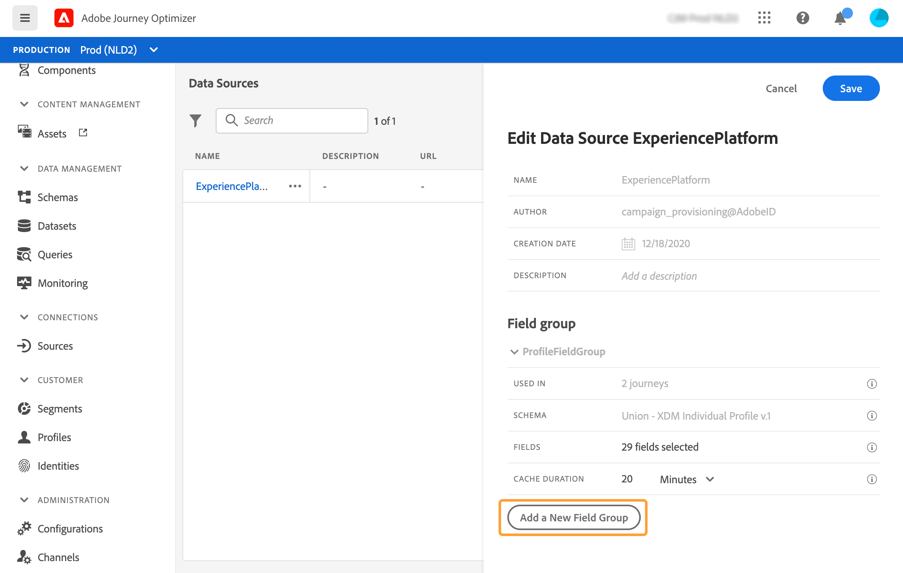

# Adobe Experience Platform 資料來源 {#concept_zrb_nqt_52b}

Adobe Experience Platform資料來源定義與即時客戶個人檔案服務的連線。 此資料來源已內建並預先設定。 無法刪除。 此資料來源的設計目的，是從即時客戶個人檔案服務中擷取和使用資料（例如，檢查進入歷程的人員是否為女性）。 它可讓您使用設定檔資料和體驗事件資料。 如需即時客戶個人檔案服務的詳細資訊，請參閱 [Adobe Experience Platform檔案](https://experienceleague.adobe.com/docs/experience-platform/profile/home.html?lang=zh-Hant){target=&quot;_blank&quot;}。

>[!NOTE]
>
>您可以擷取不到一年前建立的1000個最新體驗事件。

若要允許連線至即時客戶個人檔案服務，我們必須使用金鑰來識別人員，並使用將金鑰與之結合的命名空間。 因此，只有在您的歷程以包含索引鍵和命名空間的事件開始時，才能使用此資料來源。 請參閱[此頁面](../building-journeys/journey.md)。

您可以編輯名為「ProfileFieldGroup」的預先設定的欄位群組、新增欄位，以及移除任何草稿或即時歷程中未使用的欄位群組。 請參閱[此頁面](../datasource/configure-data-sources.md#define-field-groups)。

以下是將欄位群組新增至內建資料來源的主要步驟。

1. 從資料來源清單中，選取內建的Adobe Experience Platform資料來源。

   這會開啟畫面右側的資料來源設定窗格。

   

1. 按一下 **[!UICONTROL Add a New Field Group]** 定義要檢索的新系列欄位。 請參閱[此頁面](../datasource/configure-data-sources.md#define-field-groups)。

   

1. 從 **[!UICONTROL Schema]** 下拉式清單。 此欄位列出Adobe Experience Platform中可用的設定檔和體驗事件結構。 未在 [!DNL Journey Optimizer]. 是在Adobe Experience Platform演的。
1. 選取您要使用的欄位。
1. 按一下 **[!UICONTROL Save]**.

將游標置於欄位組的名稱上時，您會在右側看到兩個表徵圖。 它們可讓您刪除和複製欄位群組。 請注意， **[!UICONTROL Delete]** 圖示僅在欄位群組未用於任何即時或草稿歷程時(顯示於 **[!UICONTROL Used in]** 欄位)。
