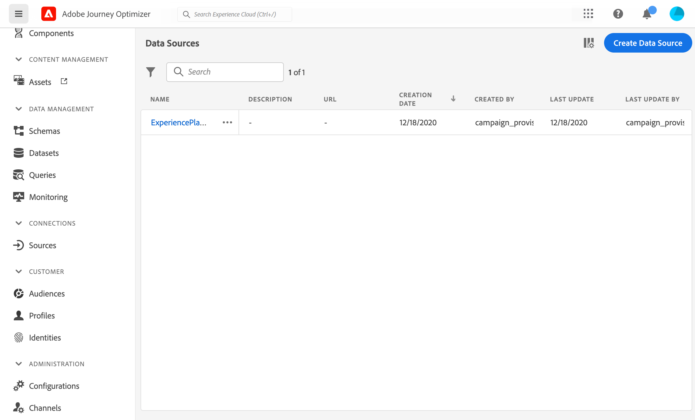
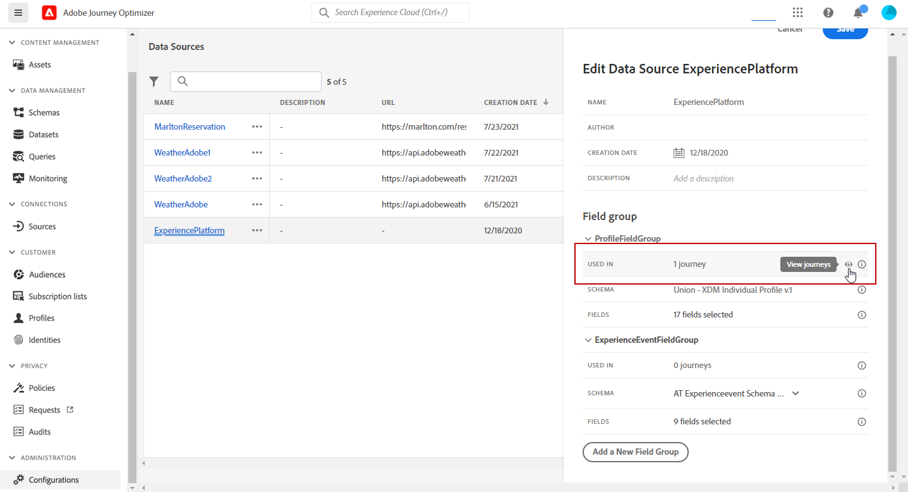

# 設定資料來源 {#configure-data-source}

>[!NOTE]
>
>資料來源設定一律會由&#x200B;**技術使用者**&#x200B;執行。

若要設定資料來源，請遵循下列步驟：

1. 在「管理」功能表區段中，選取&#x200B;**[!UICONTROL 組態]**。 在&#x200B;**[!UICONTROL 資料來源]**&#x200B;區段中，按一下&#x200B;**[!UICONTROL 管理]**。 畫面隨即顯示資料來源。如需介面的詳細資訊，請參閱[此頁面](../start/user-interface.md)。

   

1. 然後，您可以將欄位群組新增至內建的資料來源（請參閱[此頁面](../datasource/adobe-experience-platform-data-source.md)），或建立新的外部資料來源（請參閱[此頁面](../datasource/external-data-sources.md)）和相關聯的欄位群組（請參閱[此頁面](../datasource/configure-data-sources.md#define-field-groups)）。

   

1. 按一下&#x200B;**[!UICONTROL 儲存]**。

   資料來源現在已設定完畢，且可供您在歷程中使用。

## 定義欄位群組 {#define-field-groups}

欄位群組是一組欄位，您可以從資料來源擷取並在歷程中使用。

對於每個資料來源，您可以定義數個欄位群組。

例如，您可以使用電話號碼、電子郵件、名字和個人資料地址來建立欄位群組。 然後，您就可以在歷程中使用此資料來建立條件。 例如，只有在客戶已安裝行動應用程式時，您才能決定傳送推播通知。 如果空白，您可以傳送電子郵件。

即使自動新增預設名稱，我們仍建議您為欄位群組提供名稱。 事實上，[!DNL Journey Optimizer]中的其他使用者可以看到欄位群組名稱。 為欄位群組指定相關名稱是最佳做法。

當歷程中使用資料來源欄位時，系統會擷取為該欄位群組定義的所有欄位。 因此，最佳實務就是僅選取歷程所需的欄位。 這將減少歷程中的請求延遲，從而提高效能。 請注意，您稍後可輕鬆在欄位群組中新增更多欄位。

使用欄位群組的歷程次數會顯示在&#x200B;**[!UICONTROL 用於]**&#x200B;欄位中。 您可以按一下&#x200B;**[!UICONTROL 檢視歷程]**&#x200B;按鈕，以顯示使用此欄位群組的歷程清單。

>[!NOTE]
>
>請注意，如果欄位群組沒有欄位，則運算式編輯器中不會顯示該欄位。

## 欄位群組生命週期 {#field-group-lifecycle}

您可以從未用於任何草稿或即時歷程的欄位群組中新增或移除欄位。

如果欄位群組用於一個或多個草稿或即時歷程中，您可以從所選結構描述中遞增新增欄位，但無法取消選取/移除/修改已選取的欄位。 如果修改草稿或即時歷程已使用的結構描述的現有欄位（例如，變更欄位的資料型別），則不允許更新欄位群組。 這將避免中斷歷程

若要從用於一或多個歷程的欄位群組中刪除欄位，請按照以下步驟操作。 讓我們以名為「欄位群組A」的欄位群組為例。

1. 在欄位群組清單中，將游標置於「欄位群組A」上，然後按一下右側的&#x200B;**[!UICONTROL 複製]**&#x200B;圖示。 例如，將複製的欄位群組命名為「欄位群組B」。
1. 在「欄位群組B」中，移除您不再想要的欄位。
1. 在「欄位群組A」中，檢查此欄位群組的使用位置。 此資訊會顯示在&#x200B;**[!UICONTROL 用於]**&#x200B;欄位中。
1. 開啟所有使用「欄位群組A」的歷程。
1. 為每個歷程建立新版本。 使用「欄位群組A」編輯所有活動並選取「欄位群組B」。
1. 停止使用「欄位群組A」的舊版歷程。 然後，您應該沒有使用「欄位群組A」的歷程。
1. 移除「欄位群組A」，因為它已不再使用。
