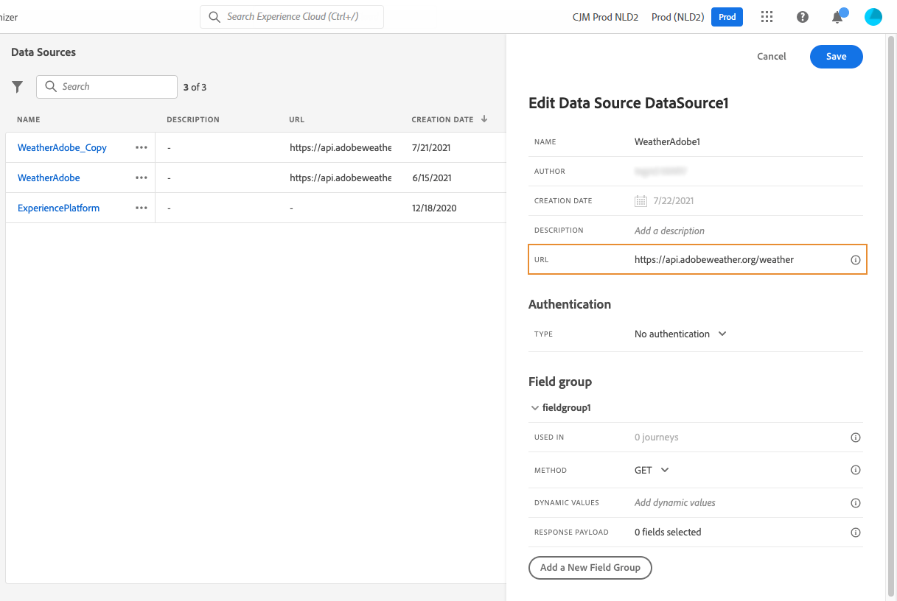

# 外部資料來源 {#external-data-sources}

>[!CONTEXTUALHELP]
>id="ajo_journey_data_source_custom"
>title="外部資料來源"
>abstract="外部資料來源可讓您定義與第三方系統的連線，例如使用飯店訂房系統檢查該人員是否已登記客房。與內建的Adobe Experience Platform資料來源不同，您可以視需要儘量建立外部資料來源。"

## 使用外部資料來源 {#gs-ext-data-sources}

外部資料來源可讓您定義與第三方系統的連線，例如使用飯店訂房系統檢查該人員是否已登記客房。與內建的Adobe Experience Platform資料來源不同，您可以視需要儘量建立外部資料來源。

>[!NOTE]
>
>* 使用外部系統時的護欄列在[此頁面](../configuration/external-systems.md)上。
>
>* 現在支援回應，因此您應該針對外部資料來源使用案例使用自訂動作，而非資料來源。 如需回應的詳細資訊，請參閱此[區段](../action/action-response.md)

支援使用 POST 或 GET 以及傳回 JSON 的 REST API。支援 API 金鑰、基本和自訂驗證模式。

我們以一個氣象 API 服務為例，我想利用它根據即時氣象資料來自訂歷程的行為。

以下是 API 呼叫的兩個範例：

* _https://api.adobeweather.org/weather?city=London,uk&amp;appid=1234_
* _https://api.adobeweather.org/weather?lat=35&amp;lon=139&amp;appid=1234_

此呼叫由主要 URL (_https://api.adobeweather.org/weather_)、兩個參數集 （&quot;city&quot; 代表城市、&quot;lat/long&quot; 代表經緯度）和 API 金鑰 (appid) 組成。

>[!TIP]
>
>我們建議在外部API的權杖有效期間與您的Journey Optimizer [`cacheDuration`設定](#custom-authentication-access-token)之間至少保留一分鐘的緩衝區，尤其是在工作負荷繁重的情況下，以避免到期不相符和401錯誤。

## 建立及設定外部資料來源 {#create-ext-data-sources}

以下是建立和設定新外部資料來源的主要步驟：

1. 從資料來源清單中，按一下&#x200B;**[!UICONTROL 建立資料Source]**&#x200B;以建立新的外部資料來源。

   

   這會開啟畫面右側的資料來源設定窗格。

   

1. 輸入您的資料來源名稱。

只允許使用英數字元和底線。 長度上限為30個字元。

1. 新增說明至您的資料來源。此步驟為選填。
1. 新增外部服務的 URL。在我們的範例中：_https://api.adobeweather.org/weather_。

   >[!CAUTION]
   >
   >基於安全考量，我們強烈建議您使用 HTTPS。另請注意，我們不允許使用非公開的Adobe位址和IP位址。

   

1. 根據外部服務組態設定驗證： **[!UICONTROL 無驗證]**、**[!UICONTROL 基本]**、**[!UICONTROL 自訂]**&#x200B;或&#x200B;**[!UICONTROL API金鑰]**。

   對於基本驗證模式，您需要填寫使用者名稱和密碼。

   >[!NOTE]
   >
   >* 執行驗證呼叫時，會在Authentication標頭中新增以base64編碼的`<username>:<password>`字串。
   >
   >* Adobe Journey Optimizer會自動加密自訂動作中定義的秘密。 每個組織的加密金鑰都會在與其組織繫結的專屬儲存庫中受到安全管理。 憑證在介面中顯示時，預設會加以遮罩，以防止意外曝光。


   如需自訂驗證模式的詳細資訊，請參閱[本節](../datasource/external-data-sources.md#custom-authentication-mode)。 在我們的範例中，我們選擇API金鑰驗證模式，如下所示：

   * **[!UICONTROL 型別]**： &quot;API金鑰&quot;
   * **[!UICONTROL 名稱]**： &quot;appid&quot; （這是API金鑰引數名稱）
   * **[!UICONTROL 值]**： &quot;1234&quot; （這是我們API金鑰的值）
   * **[!UICONTROL 位置]**： &quot;Query parameter&quot; （API金鑰位於URL）

     

1. 按一下&#x200B;**[!UICONTROL 新增欄位群組]**，為每個API引數集新增欄位群組。 欄位群組名稱中只允許使用英數字元和底線。 長度上限為30個字元。 在我們的範例中，我們需要建立兩個欄位群組，每個群各有一個參數集（city 及 long/lat）。

在 &quot;long/lat&quot; 參數集中，我們會建立包含下列資訊的欄位群組：

* **[!UICONTROL 用於]**：顯示使用欄位群組的歷程次數。 您可以按一下&#x200B;**[!UICONTROL 檢視歷程]**&#x200B;圖示，以顯示使用此欄位群組的歷程清單。
* **[!UICONTROL 方法]**：選取POST或GET方法。 在本例中，我們選取 GET 方法。
* **[!UICONTROL 動態值]**：在本例中，輸入以逗號分隔的不同引數，即「long，lat」。 由於參數值視執行內容而定，因此它們會在歷程中定義。[了解更多](../building-journeys/expression/expressionadvanced.md)
* **[!UICONTROL 回應承載]**：在&#x200B;**[!UICONTROL 承載]**&#x200B;欄位內按一下，並貼上呼叫傳回之承載的範例。 例如，我們使用了氣象 API 網站上找到的有效負載。確認欄位類型是否正確。每次呼叫 API 時，系統都會擷取有效負載範例中包含的所有欄位。請注意，如果要變更目前傳遞的裝載，可以按一下&#x200B;**[!UICONTROL 貼上新的裝載]**。
* **[!UICONTROL 已傳送裝載]**：此欄位未出現在我們的範例中。 只有選取 POST 方法時才能使用。貼上會傳送至第三方系統的有效負載。

若是GET呼叫所需的引數，您會在&#x200B;**[!UICONTROL 動態值]**&#x200B;欄位中輸入引數，系統就會在呼叫結束時自動新增這些引數。 若是 POST 呼叫，您需要：

* 在&#x200B;**[!UICONTROL 動態值]**&#x200B;欄位中列出呼叫時要傳遞的引數（在以下範例中：「識別碼」）。
* 在已傳送有效負載的正文中，也使用完全相同的語法指定它們。若要這麼做，您必須新增：&quot;param&quot;： 「name of your parameter」 （在以下範例中：「identifier」）。 請遵循下列語法：

```json
{"id":{"param":"identifier"}}
```


儲存變更後，資料來源已設定完畢，且可供您在歷程中使用，例如在您的條件或個人化電子郵件中。 如果溫度超過 30°C，您可以決定傳送特定通訊。

## 自訂驗證模式 {#custom-authentication-mode}

>[!CONTEXTUALHELP]
>id="jo_authentication_payload"
>title="關於自訂驗證"
>abstract="自訂驗證模式會用於複雜驗證，以呼叫 OAuth2 這類 API 封裝通訊協定。動作執行是兩個步驟的流程。首先，系統會執行端點呼叫以產生存取權杖。接著，存取權杖會插入到動作的 HTTP 要求中。"

自訂驗證模式會用於複雜驗證，常用來呼叫OAuth2等API封裝通訊協定，以擷取要插入到動作之實際HTTP要求中的存取權杖。

當您設定自訂驗證時，請使用&#x200B;**[!UICONTROL 按一下以檢查驗證]**&#x200B;按鈕，以控制自訂驗證裝載是否已正確設定。


測試成功時，按鈕會變成綠色。


使用此驗證模式，動作執行是兩個步驟的流程：

1. 呼叫端點以產生存取權仗。
1. 以正確的方式插入存取權仗來呼叫 REST API。


>[!NOTE]
>
>**此驗證有兩個部分。**

### 要呼叫的端點定義，用於產生存取權杖{#custom-authentication-endpoint}

* `endpoint`：用來產生端點的URL
* 端點（`GET`或`POST`）上的HTTP要求方法
* `headers`：必要時，在此呼叫中插入做為標題的機碼值組
* `body`：說明方法為POST時呼叫的主體。 我們支援有限的正文結構，如bodyParams （索引鍵值配對）中所定義。 bodyType 說明了呼叫內正文的格式和編碼：
   * `form`：表示內容型別將會是application/x-www-form-urlencoded （字元集UTF-8），而金鑰 — 值配對將會序列化為：key1=value1&amp;key2=value2&amp;...
   * `json`：表示內容型別將會是application/json （字元集UTF-8），而金鑰 — 值配對將會序列化為JSON物件，如下所示： _{ &quot;key1&quot;： &quot;value1&quot;， &quot;key2&quot;： &quot;value2&quot;， ...}_

### 存取權杖插入動作之HTTP要求必須採用的方式定義{#custom-authentication-access-token}

* **authorizationType**：定義如何將產生的存取權杖插入動作的HTTP呼叫。 可能的值包括：

   * `bearer`：表示存取權杖必須插入到Authorization標頭中，例如： _Authorization： Bearer &lt;access token>_
   * `header`：表示存取權杖必須插入為標頭，而標頭名稱是由屬性`tokenTarget`定義。 例如，如果`tokenTarget`是`myHeader`，則存取權杖將會插入為標題，如下所示： _myHeader： &lt;access token>_
   * `queryParam`：表示存取權杖必須插入為queryParam，而查詢引數名稱會由屬性tokenTarget定義。 舉例來說，若 tokenTarget 是 myQueryParam，則動作呼叫的 URL 將會是：_&lt;url>?myQueryParam=&lt;access token>_

* **tokenInResponse**：指示如何從驗證呼叫擷取存取權杖。 此屬性可以是：
   * `response`：指出HTTP回應是存取權杖
   * JSON的選擇器（假設回應為JSON，我們不支援XML等其他格式）。 此選擇器的格式為 _json://&lt;path to the access token property>_。舉例來說，若呼叫的回應是：_{ &quot;access_token&quot;: &quot;theToken&quot;, &quot;timestamp&quot;: 12323445656 }_，tokenInResponse 將會是：_json: //access_token_

此驗證的格式為：

```json
{
    "type": "customAuthorization",
    "endpoint": "<URL of the authentication endpoint>",
    "method": "<HTTP method to call the authentication endpoint, in 'GET' or 'POST'>",
    (optional) "headers": {
        "<header name>": "<header value>",
        ...
    },
    (optional, mandatory if method is 'POST') "body": {
        "bodyType": "<'form'or 'json'>,
        "bodyParams": {
            "param1": value1,
            ...
        }
    },
    "tokenInResponse": "<'response' or json selector in format 'json://<field path to access token>'",
    "cacheDuration": {
        (optional, mutually exclusive with 'duration') "expiryInResponse": "<json selector in format 'json://<field path to expiry>'",
        (optional, mutually exclusive with 'expiryInResponse') "duration": <integer value>,
        "timeUnit": "<unit in 'milliseconds', 'seconds', 'minutes', 'hours', 'days', 'months', 'years'>"
    },
    "authorizationType": "<value in 'bearer', 'header' or 'queryParam'>",
    (optional, mandatory if authorizationType is 'header' or 'queryParam') "tokenTarget": "<name of the header or queryParam if the authorizationType is 'header' or 'queryParam'>",
}
```

>[!NOTE]
>
>Encode64是驗證裝載中唯一可用的函式。

您可以針對自訂驗證資料來源變更權杖之快取期間的資訊。以下是自訂驗證有效負載的範例。快取期間在`cacheDuration`引數中定義。 其會指定快取中產生權杖的保留期間。單位可能是毫秒、秒、分鐘、小時、天、月、年。

以下是持有人驗證型別的範例：

```json
{
    "type": "customAuthorization",
    "endpoint": "https://<your_auth_endpoint>/epsilon/oauth2/access_token",
    "method": "POST",
    "headers": {
      "Authorization": "Basic EncodeBase64(<epsilon Client Id>:<epsilon Client Secret>)"
    },
    "body": {
      "bodyType": "form",
      "bodyParams": {
        "scope": "cn mail givenname uid employeeNumber",
        "grant_type": "password",
        "username": "<epsilon User Name>",
        "password": "<epsilon User Password>"
      }
    },
    "tokenInResponse": "json://access_token",
    "cacheDuration": {
      "duration": 5,
      "timeUnit": "minutes"
    },
  },
```

>[!NOTE]
>
>* 每個歷程都會快取驗證Token：如果兩個歷程使用相同的自訂動作，每個歷程都會快取其自己的Token。 該權杖不會在這些歷程之間共用。
>
>* 快取持續時間有助於避免對驗證端點的過多呼叫。 驗證權杖保留在服務中會快取，沒有持續性。 如果重新啟動服務，它會從乾淨的快取開始。 快取持續時間預設為1小時。 在自訂驗證裝載中，可透過指定另一個保留期間來調整它。
>

以下是標頭驗證型別的範例：

```json
{
  "type": "customAuthorization",
  "endpoint": "https://myapidomain.com/v2/user/login",
  "method": "POST",
  "headers": {
    "x-retailer": "any value"
  },
  "body": {
    "bodyType": "form",
    "bodyParams": {
      "secret": "any value",
      "username": "any value"
    }
  },
  "tokenInResponse": "json://token",
  "cacheDuration": {
    "expiryInResponse": "json://expiryDuration",
    "timeUnit": "minutes"
  },
  "authorizationType": "header",
  "tokenTarget": "x-auth-token"
} 
```

以下是登入API呼叫的回應範例：

```json
{
  "token": "xDIUssuYE9beucIE_TFOmpdheTqwzzISNKeysjeODSHUibdzN87S",
  "expiryDuration" : 5
}
```

>[!CAUTION]
>
>設定自訂動作的自訂驗證時，請注意，巢狀JSON物件（例如`bodyParams`內的子物件）是&#x200B;**支援**。