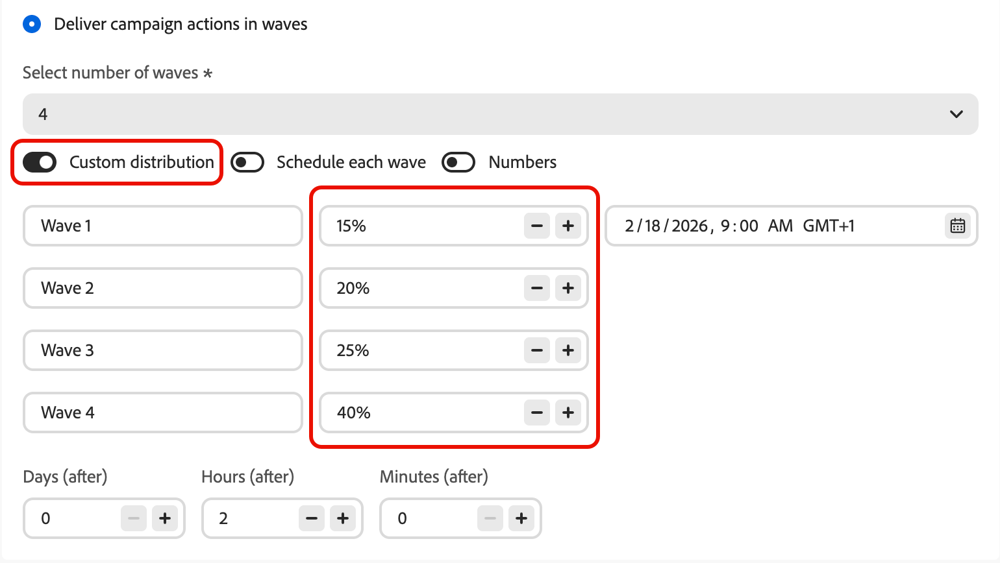
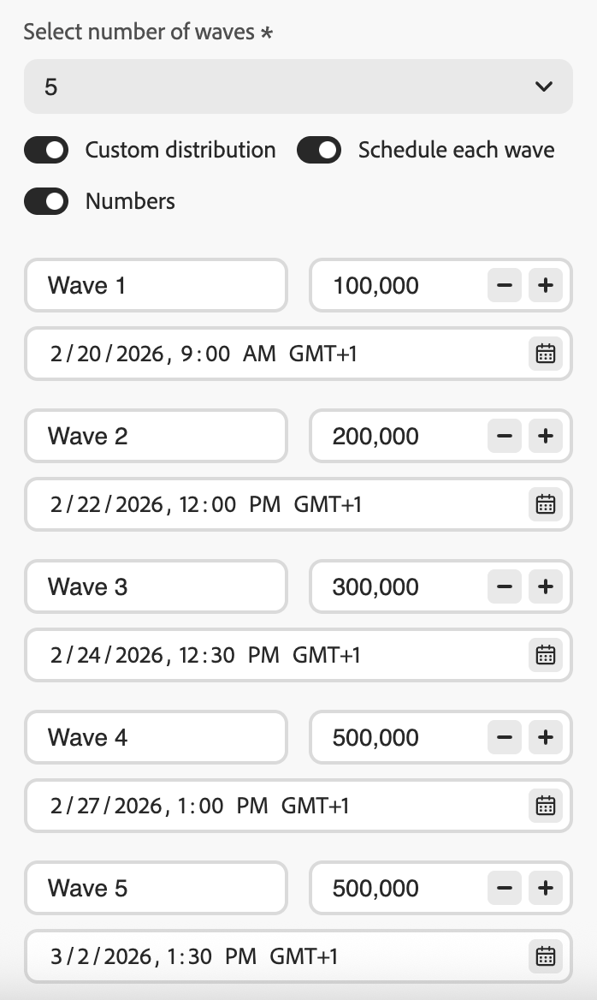

# 使用波段傳送 {#send-using-waves}

>[!BEGINSHADEBOX]

**在此頁面上：**&#x200B;瞭解如何將傳出訊息傳遞分割為排程批次（波段），以平衡負載、保護寄件者信譽並改善傳遞能力 — 可在讀取對象歷程、動作行銷活動和協調行銷活動中使用。

>[!ENDSHADEBOX]

您可以排程在名為&#x200B;**波段**&#x200B;的受控批次中傳送，而不是一次傳送所有訊息。 波次傳送可協助您：

* 平衡負載並保護下游系統（例如客服中心或登陸頁面）不被淹沒
* 支援傳遞能力與傳送者信譽，特別是針對大量傳送時
* 預熱新IP或平台時逐步增加傳遞量

您可以定義波段數量、波段大小（以對象百分比或絕對數字表示），以及每個波段執行的時機。

## 限制和護欄 {#limitations-guardrails}

下列限制適用於所有內容：

* 您必須定義至少&#x200B;**2個波段**，最多可新增&#x200B;**10個波段**。
* 兩個波段開始的最小間隔為&#x200B;**30分鐘**。
* 波次開始不能設定在過去。

其他上下文特定限制適用：

>[!BEGINTABS]

>[!TAB 讀取對象歷程]

* 波次傳送僅適用於具有&#x200B;**[!DNL As soon as possible]**&#x200B;和&#x200B;**[!UICONTROL 一次]**&#x200B;排程器型別的讀取對象歷程。 [進一步瞭解歷程排程](../building-journeys/read-audience.md#schedule)。
* 波動傳送不適用於週期性、事件觸發、業務事件、測試模式或模擬執行歷程。
* 波段開始不能早於歷程開始。
* 將對象分割成波段最多可能需要1小時。 在完成分割之前，設定檔無法進入歷程。
* 在單一歷程版本中，兩個波段絕不會同時執行。 下一個波段只在上一個波段完成後開始。 例如，如果波段間隔1小時排程，但第一個波段執行2小時，則第二個波段會在第一個結束時開始，而不是在它的原始排程時間。
* 當平台套用配額限制或系統容量負載較重時，波次啟動可能會延遲。

>[!TAB 動作行銷活動]

* 波動傳送僅適用於&#x200B;**傳出**&#x200B;動作（電子郵件、簡訊、推播、直接郵件）。
* 波段開始不能早於行銷活動開始。

<!--
>[!TAB Orchestrated campaigns]

* Wave sending applies to **outbound** channel activities only (Email, SMS, Push, Direct mail).
* Wave sending is configured at the **channel activity level**, independently for each channel activity in the campaign.
-->

>[!ENDTABS]

## 設定波段傳送 {#configure-wave-sending}

>[!CONTEXTUALHELP]
>id="ajo_wave_sending"
>title="使用波段傳送"
>abstract="將訊息傳遞分割為排定的批次（波段），以控制一段時間的數量。 您最多可以定義10個相同或自訂大小和時間的波段。"

>[!CONTEXTUALHELP]
>id="ajo_orchestration_wave_sending"
>title="使用波段傳送"
>abstract="將訊息傳遞分割為排定的批次（波段），以控制一段時間的數量。 您最多可以定義10個相同或自訂大小和時間的波段。"

啟用波段傳送的步驟取決於您的上下文 — 讀取對象歷程或動作行銷活動。 選取下列相關標籤，然後參考[波次大小和時間](#wave-options)區段以完成設定。

>[!BEGINTABS]

>[!TAB 讀取對象歷程]

1. 以[讀取對象](../building-journeys/read-audience.md)活動開始您的歷程。

1. 連按兩下&#x200B;**[!UICONTROL 讀取對象]**&#x200B;活動以開啟其屬性，並選取&#x200B;**[!UICONTROL 以波形傳送歷程動作]**&#x200B;選項。

   {width="100%"}

1. 設定&#x200B;**波段數** （例如4）。

   {width="80%"}

   >[!NOTE]
   >
   >您至少必須定義2個波段，最多可新增10個波段。

1. 選擇如何定義波次大小與時間，詳細資訊見下方的[波次大小與時間](#wave-options)區段。

>[!TAB 動作行銷活動]

1. 建立或開啟包含傳出動作（電子郵件、簡訊、推播或直接郵件）的[動作行銷活動](../campaigns/create-campaign.md)。

1. 在行銷活動的&#x200B;**[!UICONTROL 排程]**&#x200B;索引標籤中，選取&#x200B;**[!UICONTROL 以波段傳送行銷活動動作]**。

   ![已選取[以波段傳送行銷活動動作]選項的[行銷活動排程]索引標籤](assets/campaign-wave-option.png){width="100%"}

   >[!NOTE]
   >
   >只有在行銷活動的&#x200B;**[!UICONTROL 動作]**&#x200B;索引標籤中選取傳出動作時，才會顯示&#x200B;**[!UICONTROL 以波段傳送行銷活動動作]**&#x200B;選項。 [了解更多](../campaigns/campaign-action.md)

1. 設定波段數（例如4）。

   >[!NOTE]
   >
   >您至少必須定義2個波段，最多可新增10個波段。

1. 選擇如何定義波次大小與時間，詳細資訊見下方的[波次大小與時間](#wave-options)區段。

<!--
>[!TAB Orchestrated campaigns]

1. Open a channel activity (Email, SMS, Push, or Direct mail) in your orchestrated campaign canvas.

1. Go to the **[!UICONTROL Schedule]** tab of the channel activity.

1. Under **[!UICONTROL Wave schedule]**, enable the **[!UICONTROL Deliver in waves]** toggle.

    {width="90%"}

1. Set the number of waves using the **[!UICONTROL Select number of waves]** dropdown.

   >[!NOTE]
   >
   >You must define at least 2 waves and can add up to 10 waves.

1. Choose how to define wave size and timing as detailed in the [Wave size and timing](#wave-options) section below.
-->

>[!ENDTABS]

## 波段大小和計時 {#wave-options}

設定好波段數後，請定義對象在它們中的分佈方式以及每個波段的執行時間。 有三個可用選項：

* [相等波段](#equal-waves) — 將對象分割為大小相等的部分，波段開始之間有固定的間隔。 最適合直接、平均定時的傳送。
* [自訂分佈](#custom-distribution) — 以百分比或設定檔絕對數的形式手動設定每個波段的大小。 最適合漸進式提升或不均勻的對象分割。
* [自訂排程](#custom-schedule) — 為每個波段指定特定的開始日期和時間。 最適合您需要不遵循固定間隔的精確計時。

### 等波 {#equal-waves}

依預設，對象會分割成大小相等的波段。 設定每個波段開始之間的固定間隔（例如2小時）。 系統接著會自動排程後續波段，例如，第一波於上午9:00、第二波於上午11:00、第三波於下午1:00、第四波於下午3:00。

{width="80%"}

>[!NOTE]
>
>兩個波段開始的最小間隔為&#x200B;**30分鐘**。

### 自訂分佈 {#custom-distribution}

選取&#x200B;**[!UICONTROL 自訂分佈]**&#x200B;選項，將每個波段的大小定義為總受眾的百分比（例如15%、20%、25%、40%）。

{width="80%"}

選取&#x200B;**[!UICONTROL 數字]**&#x200B;將每個波段的大小定義為設定檔的絕對數（例如10,000； 50,000）。

{width="80%"}

>[!NOTE]
>
>* 使用百分比時，所有波段總計必須為100%。 如果不是這種情況，則會顯示警告。
>
>* 使用數字時，系統不會驗證總涵蓋範圍，請確認您的波段大小涵蓋了目標受眾。 [了解更多](#faq)

### 自訂排程 {#custom-schedule}

選取&#x200B;**[!UICONTROL 排程每個波段]**&#x200B;以定義每個波段的特定開始日期和時間。 波段不需要均勻隔開（例如，上午9:00、上午11:00、下午5:00、晚上8:30）。

{width="80%"}

>[!NOTE]
>
>兩個波段開始的最小間隔為&#x200B;**30分鐘**。

## 使用案例 {#use-cases}

Wave傳送可協助您控制何時傳送以及傳送多少訊息，改善傳遞能力、保護傳送者信譽，並使傳送符合您的營運容量。 考慮在以下情況下使用波段：

* **客服中心或回應管理：**&#x200B;限制每天或每小時傳出的訊息數目，以便下游團隊（例如客戶服務）能夠以可管理的速率處理回應。

  {width="50%"}

* **高音量和傳遞能力：**&#x200B;請避免一次傳送大量對象。 隨時間散佈傳遞內容有助於維護寄件者的信譽，並降低被標示為垃圾郵件的風險。

  {width="50%"}

* **IP熱身：**&#x200B;使用新平台或IP位址時，逐步增加音量（例如，第一波為10%，然後為15%、20%等）以逐步建立傳送信譽。

  {width="50%"}

## 常見問題 {#faq}

+++ 如果我的波段大小總和不等於對象總數，會發生什麼情況？

* 如果總和&#x200B;**超過**&#x200B;個對象（例如，您排程在第一個波段中為80,000個對象設定100,000），則第一個波段會傳送給完整對象，而其餘波段沒有剩餘的設定檔 — 這些設定檔不會執行。
* 如果&#x200B;**的總和小於受眾**（例如，您為100,000的受眾定義了四個波次，總計為40,000個設定檔），則只有這些波段中包含的設定檔會收到訊息。 其餘的設定檔不會收到通訊，且不會在後續批次中重試。

+++

+++ 我可以指派不同的內容或受眾區段給個別波段嗎？

沒有。 您只能定義每個波段的大小和時間。 相同的對象和訊息內容會套用至所有波段 — 您無法鎖定不同的區段，或針對每個波段使用不同的內容。

+++

+++ 對象是在每個波段之前重新評估，還是在啟用時修正？

對象在啟動時（觸發歷程或啟動行銷活動/活動時）為&#x200B;**評估一次**。 屆時會拍攝合格設定檔的快照，並用於所有波段 — 在後續每個波段之前，不會重新評估對象成員資格。

但是，每個波段處理&#x200B;**時都會讀取**&#x200B;設定檔屬性，而不是在啟動時讀取。 這表示對於橫跨多天的波段：

* Personalization屬性（例如設定檔的名字或忠誠度等級）會反映該設定檔在批次執行時的狀態。
* **在傳送時，會針對每個波段重新套用同意和隱藏檢查。** 如果設定檔在兩個波段之間選擇退出，則他們將不會在後續波段中接收訊息。

總而言之：預先固定包含&#x200B;*誰*，但&#x200B;*用來個人化並傳送給這些設定檔的資料*&#x200B;會在處理其波段時反映其目前狀態。

+++

+++ 波段傳送是否適用於傳入頻道？

沒有。 波段傳送僅適用於&#x200B;**傳出**&#x200B;頻道動作：電子郵件、簡訊、推播通知和直接郵件。 傳入頻道（例如網頁、應用程式內或程式碼型體驗）不受波次傳送設定影響。

+++

## 另請參閱 {#see-also}

* [在歷程中使用對象](../building-journeys/read-audience.md) — 設定讀取對象活動
* [排程動作行銷活動](../campaigns/campaign-schedule.md) — 設定開始日期、結束日期和頻率
<!-- * [Channel activities in Orchestrated campaigns](../orchestrated/activities/channels.md) — configure channel activities in the orchestrated canvas -->

+++ AI知識參考

本節包含結構化知識，用於支援與本主題相關的解譯、擷取和問答。

如需完整瞭解，此資訊應結合本頁的檔案。 兩者皆非獨立來源；頁面說明功能，本節提供額外內容，以協助去除術語、意圖、適用性和限制條件的歧義。

* **TL；DR：**&#x200B;此頁面說明如何在Adobe Journey Optimizer中設定波動傳送，以控管批次隨時間傳遞傳出訊息，改善傳遞能力並保護寄件者信譽。 波次傳送可用於讀取對象歷程、動作行銷活動和協調的行銷活動。

**意圖：**
* 在讀取對象歷程、動作行銷活動或協調的行銷活動頻道活動上啟用波次傳送
* 設定每個波段之間間隔固定的相等波段
* 將自訂波段大小定義為百分比或絕對設定檔計數
* 以特定開始日期和時間排程每個波段
* 控制傳遞量，以保護寄件者的信譽或與營運容量一致

**字彙表：**
* **批次傳送**：一種傳送模式，可將對象分割成批次（批次），並按排程間隔傳送訊息給每個批次，而非一次傳送所有訊息&#x200B;*（產品特定）*
* **相等波段**：將對象分割為相等大小的部分的設定，波段開始&#x200B;*（產品特定）*&#x200B;之間有固定的間隔
* **自訂分佈**：手動定義每個波段大小為設定檔百分比或絕對數的設定&#x200B;*（產品專屬）*
* **自訂排程**：每個波段都有特定開始日期和時間的設定，允許不一致的間距&#x200B;*（產品特定）*

**有波次傳送可用的內容：**
* 讀取對象歷程（僅限「儘快」或「一次」排程器 — 不適用於循環、事件觸發、業務事件、測試或試執行歷程）
* 動作行銷活動（僅限傳出頻道動作）
<!-- * Orchestrated campaigns (outbound channel activities only, configured per channel activity) -->

**公用護欄（所有內容）：**
* 最小2個波段，最大10個波段
* 兩個連續波段開始之間至少30分鐘
* 波段開始時間不能是過去
* 以百分比為根據的自訂分配總和必須是100%
* 以數字為基礎的自訂分配不會自動驗證總涵蓋範圍

**歷程專用護欄：**
* 波段開始時間不能早於歷程開始時間
* 對象分割最多可能需要1小時；設定檔可能延遲
* 兩個波段絕不會在同一歷程版本中同時執行
* 波次啟動可能會因平台配額限制或系統負載過重而延遲

**常見問題集：**
* **問：波段傳送是否適用於傳入頻道？**  — 否；僅傳出（電子郵件、簡訊、推播、直接郵件）。
* **問：我可以指派不同的內容給個別波段嗎？**  — 否；所有波段都有相同的對象和內容。 只有大小和時間可以不同。
* **問：兩個波段之間的最小時間是多少？**  — 兩個連續波段開始之間的30分鐘。
* **問：如果波段大小超過或少於對象，會發生什麼情況？**  — 超出：第一個波段會傳送給完整受眾，其餘波段則不會執行。 不足：僅已定義的批次設定為接收訊息，其餘的批次則不會重試。
* **問：每個波段是否重新評估對象？**  — 否；啟用時會擷取對象。 在Wave處理時讀取設定檔屬性（個人化、同意）。

+++
