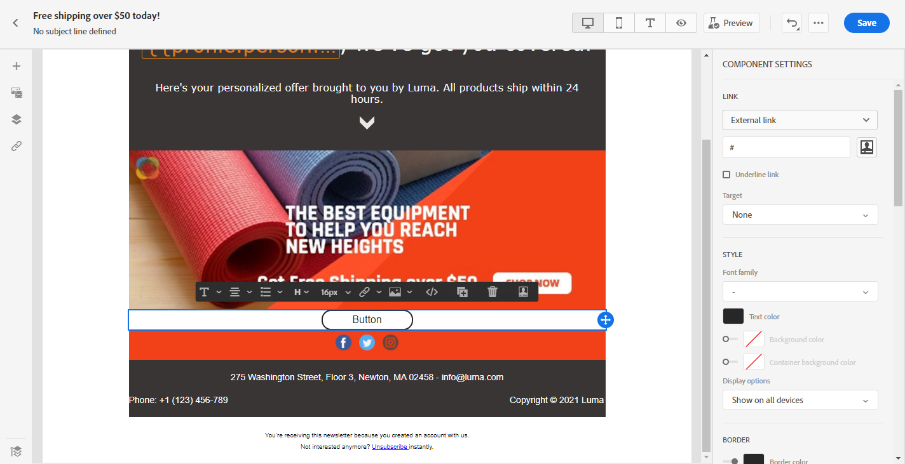
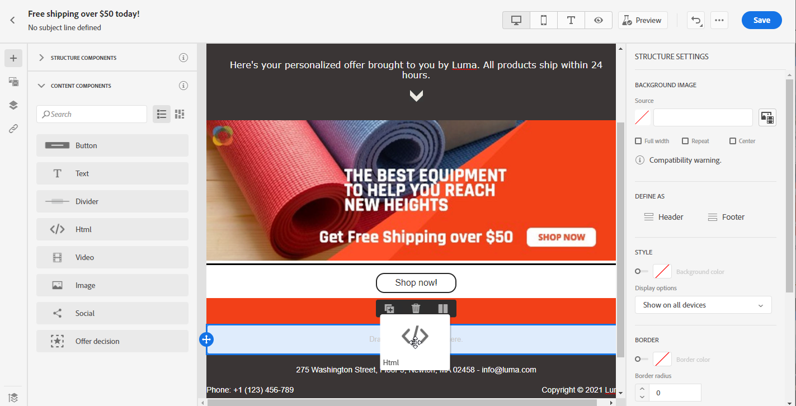
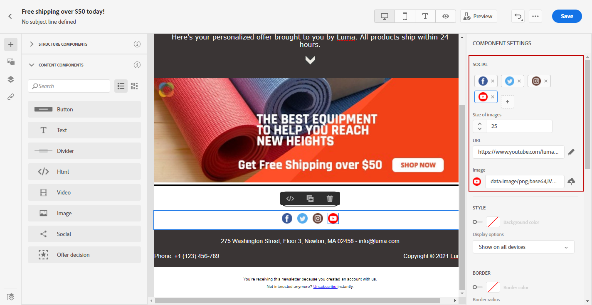

# 使用電子郵件設計器內容元件 {#content-components}

>[!CONTEXTUALHELP]
>id="ac_content_components"
>title="關於內容元件"
>abstract="內容元件是空內容佔位符，可用於建立電子郵件佈局。"

從頭建立電子郵件內容時， **[!UICONTROL Content components]** 允許您使用原始的空元件進一步個性化您的電子郵件，這些元件一旦放入電子郵件中就可以使用。
可以添加盡可能多的 **[!UICONTROL Content components]** 你需要進屋 **[!UICONTROL Structure component]** 定義了電子郵件的佈局。

## 按鈕 {#buttons}

使用 **[!UICONTROL Button]** 元件，用於在電子郵件中插入多個按鈕並將電子郵件受眾重定向到其他頁面。

1. 從 **[!UICONTROL Content components]**，拖放 **[!UICONTROL Button]** 在 **[!UICONTROL Structure component]**。

   

1. 按一下新添加的按鈕以個性化文本並訪問 **[!UICONTROL Components Settings]** 的子菜單。

   

1. 在 **[!UICONTROL Link]** 的 **[!UICONTROL Components Settings]**，在按一下按鈕時添加希望受眾重定向到的URL。

1. 選擇您的受眾將如何與 **[!UICONTROL Target]** 下拉：

   * **[!UICONTROL None]**:在按一下連結的同一幀中開啟該連結（預設）。
   * **[!UICONTROL Blank]**:在新窗口或頁籤中開啟連結。
   * **[!UICONTROL Self]**:在按一下連結的同一幀中開啟該連結。
   * **[!UICONTROL Parent]**:開啟父框架中的連結。
   * **[!UICONTROL Top]**:在窗口的整個正文中開啟連結。

   

1. 現在，您可以通過更改 **[!UICONTROL Style]**。 **[!UICONTROL Margin]** 和 **[!UICONTROL Border]** 例如。

## 文字 {#text}

使用 **[!UICONTROL Text]** 元件以在電子郵件中插入文本。 您可以調整文本的顏色、樣式和大小 **[!UICONTROL Component Settings]**。

1. 在 **[!UICONTROL Content Components]**，拖放 **[!UICONTROL Text]** 在 **[!UICONTROL Structure component]**。

   

1. 按一下新添加的元件以個性化文本並訪問 **[!UICONTROL Components Settings]** 的子菜單。

1. 使用工具欄中的以下選項更改文本：

   

   * **[!UICONTROL Change text style]**:對文本應用粗體、斜體、下划線或直線。
   * **更改對齊方式**:選擇文本的左對齊、右對齊、居中對齊或對齊對齊對齊。
   * **[!UICONTROL Create list]**:將項目符號或編號清單添加到文本中。
   * **[!UICONTROL Set heading]**:在文本中最多添加6個標題級別。
   * **字型大小**:選擇文本的字型大小（以像素為單位）。
   * **[!UICONTROL Edit image]**:將影像或資產添加到文本元件。 [瞭解有關資產管理的更多資訊](assets-essentials.md)。
   * **[!UICONTROL Show the source code]**:顯示文本的原始碼。 無法修改。
   * **[!UICONTROL Duplicate]**:添加文本元件的副本。
   * **[!UICONTROL Delete]**:從電子郵件中刪除所選文本元件。
   * **[!UICONTROL Add personalization]**:添加個性化欄位以自定義配置檔案資料中的內容。 [瞭解有關內容個性化的更多資訊](../personalization/personalize.md)。

1. 為了獲得更好的用戶體驗，您可以添加個性化欄位以針對您的受眾。 如需詳細資訊，請參閱本[區段](../personalization/personalize.md)。

1. 調整 **[!UICONTROL Text color]**。 **[!UICONTROL Font family]** 和 **[!UICONTROL Size]** 的 **[!UICONTROL Components Settings]**。

   

## 除法器 {#divider}

使用 **[!UICONTROL Divider]** 元件，插入分隔線以組織電子郵件的佈局和內容。
可以在中選擇斷線的顏色、樣式和大小 **[!UICONTROL Component Settings]**。

## HTML {#HTML}

使用 **[!UICONTROL HTML]** 複製貼上現有HTML的不同部分。 這使您能夠建立免費的模組化HTML元件。

要使外部內容與電子郵件設計器相容，Adobe建議從頭開始建立郵件，並將現有電子郵件的內容複製到元件中。

1. 在 **[!UICONTROL Content Components]**，拖放 **[!UICONTROL HTML]** 在 **[!UICONTROL Structure component]**。

   

1. 按一下新添加的元件，然後 **[!UICONTROL Show the source code]** 添加HTML。

   

1. 複製並貼上要添加到電子郵件中的HTML代碼，然後按一下 **[!UICONTROL Save]**。

1. 您現在可以通過更改 **[!UICONTROL Style]**。 **[!UICONTROL Margin]** 和 **[!UICONTROL Border]** 例如，或添加連結以將受眾重定向到其他內容。

## 影像 {#image}

使用 **[!UICONTROL Image]** 元件，以在電子郵件中插入電腦中的影像檔案。

1. 在 **[!UICONTROL Content Components]**，拖放 **[!UICONTROL Image]** 在 **[!UICONTROL Structure component]**。

   

1. 按一下 **[!UICONTROL Browse]** 從資源中選擇影像檔案。

   瞭解更多 [!DNL Assets Essentials]，請參閱 [Adobe Experience Manager Assets Essentials文檔](https://experienceleague.adobe.com/docs/experience-manager-assets-essentials/help/introduction.html){target=&quot;_blank&quot;}。

1. 按一下新添加的元件以開始配置 **[!UICONTROL Content Components]** 並能夠訪問 **[!UICONTROL Components Settings]** 的子菜單。

1. 設定映像屬性：

   * **[!UICONTROL Image Title]** 用於定義影像的標題。
   * **[!UICONTROL Alt text]** 用於定義連結到影像的標題。 這對應於altHTML屬性。

   

1. 您現在可以通過更改 **[!UICONTROL Style]**。 **[!UICONTROL Margin]** 和 **[!UICONTROL Border]** 例如，或添加連結以將受眾重定向到其他內容。

## 影片 {#Video}

>[!CONTEXTUALHELP]
>id="ac_edition_video"
>title="視頻設定"
>abstract="使用此元件在電子郵件中插入視頻。 請注意，視頻不適用於所有電子郵件客戶端。 我們建議設定備用映像。"
>additional-url="https://www.emailonacid.com/blog/article/email-development/a_how_to_guide_to_embedding_html5_video_in_email/" text="其他資訊"

使用 **[!UICONTROL Video]** 元件，通過URL連結在電子郵件中插入視頻。

1. 在 **[!UICONTROL Content Components]**，拖放 **[!UICONTROL Video]** 在 **[!UICONTROL Structure component]**。

   

1. 按一下新添加的元件以開始配置 **[!UICONTROL Content Components]** 並能夠訪問 **[!UICONTROL Components Settings]** 的子菜單。

1. 在 **[!UICONTROL Video link]** 的 **[!UICONTROL Components Settings]**，添加視頻URL。

   

1. 可以添加 **[!UICONTROL Poster image]** 指定要顯示的影像，直到觀眾按一下播放按鈕。

1. 您現在可以通過更改 **[!UICONTROL Style]**。 **[!UICONTROL Margin]** 和 **[!UICONTROL Border]** 例如。

## 社交 {#social}

使用 **[!UICONTROL Social]** 元件，以在電子郵件中插入到社交媒體頁面的連結。

1. 在 **[!UICONTROL Content Components]**，拖放 **[!UICONTROL Social]** 在 **[!UICONTROL Structure component]**。

   

1. 按一下新添加的元件以開始配置 **[!UICONTROL Content Components]** 並能夠訪問 **[!UICONTROL Components Settings]** 的子菜單。

1. 在 **[!UICONTROL Social]** 的 **[!UICONTROL Components Settings]**，選擇要添加或刪除的社交媒體。

   

1. 選擇表徵圖的大小 **[!UICONTROL Size of images]** 的子菜單。

1. 按一下每個社交媒體表徵圖以配置 **[!UICONTROL URL]** 您的受眾將被重定向到。

   

1. 如果需要，您還可以在 **[!UICONTROL Image]** 的子菜單。

1. 您現在可以通過更改 **[!UICONTROL Style]**。 **[!UICONTROL Margin]** 和 **[!UICONTROL Border]**。

## 提供決定 {#offer-decision}

使用 **[!UICONTROL Offer decision]** 元件，將決策插入消息中。 決策將利用決策管理來選擇向客戶提供的最佳服務。

相關主題：

* [開始使用決策管理](../offers/get-started/starting-offer-decisioning.md).
* [將個性化優惠添加到消息中](deliver-personalized-offers.md)。
