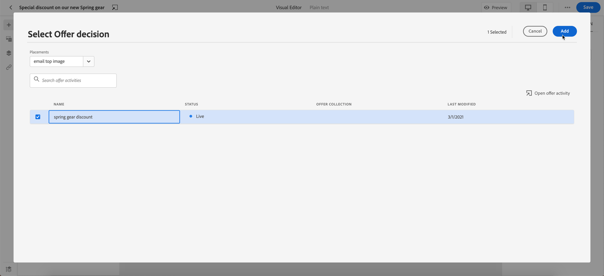

# 新增個人化優惠方案 {#deliver-personalized-offers}

在 [!DNL Journey Optimizer] 電子郵件，您可以插入利用「優惠決定引擎」的決策，以便選擇向客戶提供的最佳優惠。

例如，您可以添加一個將在電子郵件中顯示特殊折扣優惠的決定，該折扣優惠會因收件人的忠誠度而有所不同。

有關如何建立和管理產品的詳細資訊，請參閱 [此部分](../offers/get-started/starting-offer-decisioning.md)。

對於 **全端到端示例** 顯示如何配置優惠、在決策中使用優惠以及在電子郵件中利用此決策、簽出 [此部分](../offers/offers-e2e.md#insert-decision-in-email)。

➡️ [瞭解如何在此視頻中添加個性化服務](#video-offers)

## 在電子郵件中插入決定 {#insert-offers}

>[!CAUTION]
>
>開始前，必須 [定義聘用決定](../offers/offer-activities/create-offer-activities.md)。

要在電子郵件中插入決定，請執行以下步驟：

1. 建立電子郵件，然後開啟電子郵件設計器以配置其內容。

1. 添加 **[!UICONTROL Offer decision]** 內容元件。

   

   瞭解如何在 [此部分](content-components.md)。

1. 的 **[!UICONTROL Offer decision]** 頁籤。 按一下「**[!UICONTROL Select Offer decision]**」。

   

1. 在顯示的窗口中，選擇與要顯示的優惠相對應的位置。

   [放置](../offers/offer-library/creating-placements.md) 是用來展示您優惠的容器。 在本示例中，我們將使用「電子郵件頂部影像」位置。 此位置已在「提供庫」中建立，以顯示位於消息頂部的影像類型提供。

1. 與所選放置顯示匹配的決定。 選擇要在內容元件中使用的決定，然後按一下 **[!UICONTROL Add]**。

   >[!NOTE]
   >
   >清單中只顯示與所選放置相容的決定。 在此示例中，只有一個服務活動與「電子郵件頂部影像」位置匹配。

   

現在，將提供活動添加到元件中。

保存更改後，一旦發佈消息，您的優惠就可以在將消息作為行程的一部分發送時顯示在相關配置檔案中。

>[!NOTE]
>
>當您更新在已發佈消息中直接或間接引用的聘用、回退聘用、聘用集合或聘用決定時，更新將自動反映在相應消息中，而無需重新發佈。

## 通過電子郵件預覽優惠 {#preview-offers-in-email}

您可以使用 **[!UICONTROL Offers]** 或內容元件箭頭。

要在客戶配置檔案中顯示作為決策一部分的不同優惠，請執行以下步驟。

1. 按一下「**[!UICONTROL Preview]**」。

   

   >[!NOTE]
   >
   >您需要有test配置檔案才能預覽郵件。 瞭解如何 [建立test配置檔案](../segment/creating-test-profiles.md)。

1. 要選擇用於標識test配置檔案的命名空間，請選擇 **[!UICONTROL Email]** 從 **[!UICONTROL Identity namespace]** 的子菜單。

   >[!NOTE]
   >
   >在此示例中，我們將使用 **電子郵件** 命名空間。 瞭解有關Adobe Experience Platform標識命名空間的詳細資訊 [此部分](../segment/get-started-identity.md)。

1. 在標識命名空間清單中，選擇 **[!UICONTROL Email]** 按一下 **[!UICONTROL Select]**。

1. 在 **[!UICONTROL Identity value]** 欄位中，輸入用於標識test配置檔案的值。 在此示例中，輸入test配置檔案的電子郵件地址。

   <!--For example enter smith@adobe.com and click the **[!UICONTROL Add profile]** button.-->

1. 添加其他配置檔案，以便根據配置檔案資料test消息的不同變型。

   

1. 按一下 **[!UICONTROL Preview]** 頁籤test消息。

1. 選擇test配置檔案。 顯示與所選簡檔（女性）對應的要約。

   

1. 選擇其他test配置檔案以預覽郵件每個變體的電子郵件內容。 在消息內容中，現在顯示與所選test配置檔案（現在是人）相對應的服務。

   

瞭解有關詳細步驟的詳細資訊，以在中查看消息預覽 [此部分](#preview-your-messages)。

## How-to視頻{#video-offers}

瞭解如何將offer decisioning元件添加到 [!DNL Journey Optimizer]。

>[!VIDEO](https://video.tv.adobe.com/v/334088?quality=12)

