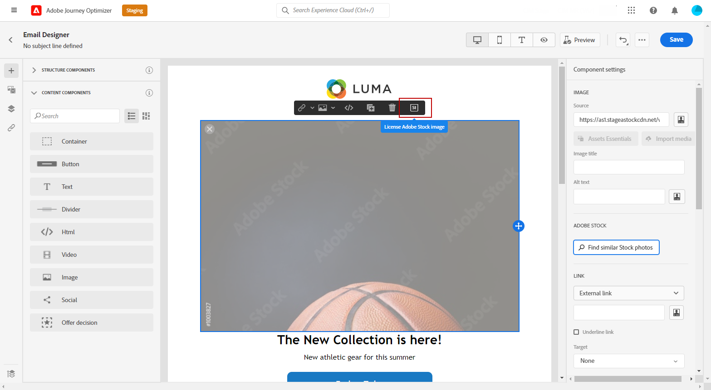

# 管理 [!DNL Adobe Stock] 影像 {#stock}

## 開始使用 [!DNL Adobe Stock] {#get-started-stock}

>[!IMPORTANT]
>
> 使用 [!DNL Adobe Stock] 整合當前僅可提前訪問選定用戶。 如果您想利用此功能，請與Adobe客戶經理聯繫。

[!DNL Adobe Stock] 提供對數百萬高質量、可策劃、免版稅照片、視頻、插圖和向量圖形的訪問。 您可以選擇購買信用包以授權資產，或僅購買所需資產的一個標準或擴展許可證。 Adobe Stock還提供免費的資產收集服務。

有關 [!DNL Adobe Stock]，請參閱 [Adobe Stock入門](https://helpx.adobe.com/stock/get-started.html)。

與 [!DNL Adobe Journey Optimizer]您可以直接從 [!DNL Adobe Stock] 並將其添加到Assets資料夾。 的 **[!UICONTROL Find Similar Image]** 選項將幫助您查找與交付中使用的資產的內容、顏色和組成相匹配的影像。
[瞭解有關電子郵件設計的詳細資訊](design-emails.md)。

## 插入和導入 [!DNL Adobe Stock] 影像 {#add-stock-image}

編輯和個性化電子郵件後，您可以從 [!DNL Adobe Stock] 到模板：

1. 拖放影像 **[!UICONTROL Content components]** 郵件。

   

1. 從 **[!UICONTROL Component settings]** 菜單，選擇 **[!UICONTROL Find Adobe Stock photos]**。

   

1. 瀏覽庫或在欄位中輸入搜索詞。 選擇所選影像並按一下 **[!UICONTROL Save]**。

   

1. 要許可和下載您的映像，請選擇您的映像 **[!UICONTROL Content components]** 按一下 **[!UICONTROL License Adobe Stock image]**。 您將被重定向到 [!DNL Adobe Stock] 的子菜單。

   >[!NOTE]
   > 如果映像已獲得許可，則將由  表徵圖 在這種情況下，您可以跳到步驟7。

   

1. 從 [!DNL Adobe Stock] 網站，您需要購買資產才能下載影像並刪除水印。

   此購買將取決於您的Adobe Stock計畫或訂購。 如需關於此項目的詳細資訊，請參閱此[頁面](https://stock.adobe.com/plans)。

   >[!WARNING]
   > 如果發送包含未授權影像的電子郵件，則影像將保留其未授權的表單和水印。

   

1. 購買完成後，您現在可以回到 [!DNL Adobe Journey Optimizer] 選擇 **[!UICONTROL Import stock image]** 將許可映像導入到資產。

   

1. 選擇資產將儲存在哪個資料夾中。 有關 [!DNL Assets Essentials]，請參閱 [頁](assets-essentials.md#get-started-assets-essentials)。

   

1. 從中選擇影像後 [!DNL Adobe Stock]，使用 **[!UICONTROL Find similar Stock photos]** 選項，以查找與影像的內容、顏色和組成匹配的資源。

   請注意，此選項可用於Assets資料夾中的許可/未許可的Stock影像和影像。

   

1. 使用 **[!UICONTROL Components settings]** 的子菜單。 [瞭解有關元件設定的詳細資訊](content-components.md)

   

建立並個性化您的郵件後，您可以發佈它以使其可用於執行。 [了解更多](../messages/publish-manage-message.md)