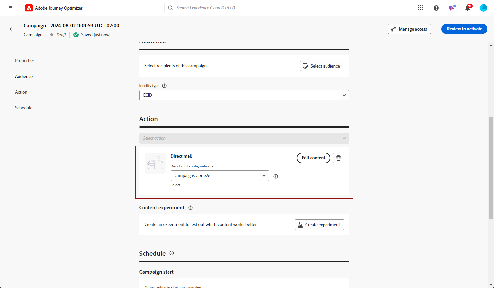

# 建立新的直接郵件訊息 {#create-direct}

>[!CONTEXTUALHELP]
>id="ajo_direct_mail"
>title="直接郵件建立"
>abstract="在排程的行銷活動中建立直接郵件訊息，並設計直接郵件提供者向您的客戶傳送郵件所需的解壓縮檔案。"

若要建立直接郵件訊息、建立排程的行銷活動，並設定解壓縮檔案。 直接郵件提供者需要此檔案，才能將郵件傳送給您的客戶。

>[!IMPORTANT]
>
>在建立直接郵件訊息之前，請確定您已設定：
>
>1. [檔案路由組態](../direct-mail/direct-mail-configuration.md#file-routing-configuration)，指定應該上傳及儲存解壓縮檔案的伺服器，
>1. 將參考檔案路由設定的[直接郵件設定](../direct-mail/direct-mail-configuration.md#direct-mail-surface)。

## 建立直接郵件行銷活動{#create-dm-campaign}

>[!AVAILABILITY]
>
>Direct Mail支援Holdout功能，但目前不支援Threads。

若要建立直接郵件行銷活動，請遵循下列步驟：

1. 存取&#x200B;**[!UICONTROL 促銷活動]**&#x200B;功能表，然後按一下&#x200B;**[!UICONTROL 建立促銷活動]**。

1. 選取您要執行的行銷活動型別

   * **已排程 — 行銷**：立即或在指定日期執行行銷活動。 已排程的行銷活動旨在傳送行銷訊息。 可從使用者介面設定及執行。

   * **API觸發 — 行銷/異動**：使用API呼叫執行行銷活動。 API觸發的行銷活動旨在傳送行銷或交易式訊息，也就是在個人執行動作後傳送的訊息：密碼重設、購物車購買等。

1. 在&#x200B;**[!UICONTROL 屬性]**&#x200B;區段中，編輯行銷活動的&#x200B;**[!UICONTROL 標題]**&#x200B;和&#x200B;**[!UICONTROL 描述]**。

1. 若要定義您的目標對象，請按一下&#x200B;**[!UICONTROL 選取對象]**&#x200B;按鈕，然後從可用的Adobe Experience Platform對象中選擇。 [了解更多](../audience/about-audiences.md)。

   >[!IMPORTANT]
   >
   >目前，受眾選擇限製為3百萬個設定檔。 如有要求，您可向Adobe代表解除此限制。

1. 在&#x200B;**[!UICONTROL 身分識別名稱空間]**&#x200B;欄位中，選取適當的名稱空間以識別所選對象中的個人。 [了解更多](../event/about-creating.md#select-the-namespace)。

1. 在&#x200B;**[!UICONTROL 動作]**&#x200B;區段中，選擇&#x200B;**[!UICONTROL 直接郵件]**。

1. 選取或建立要使用的&#x200B;**[!UICONTROL 直接郵件組態]**。 [瞭解如何建立直接郵件設定](direct-mail-configuration.md#direct-mail-surface)。

   {width="800" align="center"}

1. 行銷活動可以排程為特定日期，或設定為定期重複。 在&#x200B;**[!UICONTROL 本節]**&#x200B;中瞭解如何設定行銷活動的[排程](../campaigns/create-campaign.md#schedule)。

您現在可以開始設定擷取檔案，以傳送給直接郵件提供者。

## 設定摘取檔案 {#extraction-file}

>[!CONTEXTUALHELP]
>id="ajo_direct_mail_data_fields"
>title="資料欄位"
>abstract="依直接郵件提供者之要求，新增並設定在摘取檔案中要顯示的欄位和資訊，才能把郵件寄送給你的客戶。你可以新增最多 50 欄。"

>[!CONTEXTUALHELP]
>id="ajo_direct_mail_formatting"
>title="摘取檔案格式"
>abstract="使用個人化編輯器指定每個欄位的標籤以及要顯示的資訊。  您可以透過「<b>排序方式</b>」選項，使用選定的欄位作為摘取檔案的欄排序依據。"

直接郵件供應商需要擷取檔案，才能傳送郵件給您的客戶。 若要定義解壓縮檔案組態，請執行下列步驟：

1. 在行銷活動設定畫面中，按一下&#x200B;**[!UICONTROL 編輯內容]**&#x200B;按鈕以設定擷取檔案內容。

1. 調整解壓縮檔案屬性：

   1. 在&#x200B;**[!UICONTROL 檔案名稱]**&#x200B;欄位中，指定解壓縮檔案的名稱。

      >[!NOTE]
      >
      >依預設，檔案會寫入伺服器上的根目錄中。 **[!UICONTROL Filename]**&#x200B;欄位也接受格式「/your/path/here/Filename.csv」，其中指定的路徑是所選伺服器上的目標目錄。<!--TBC if for SFTP and Azure only, or for all servers including S3-->

   1. 如果要將自動時間戳記新增到指定的檔案名稱，請選擇性地啟用&#x200B;**[!UICONTROL 附加時間戳記以匯出檔案名稱]**&#x200B;選項。

   1. 有時候，您可能需要在解壓縮檔案的開頭或結尾新增資訊。若要這麼做，請使用&#x200B;**[!UICONTROL 附註]**&#x200B;欄位，然後指定是否要以頁首或頁尾形式包含附註。

      {width="800" align="center"}

1. 設定要在擷取檔案中顯示的欄和資訊：

   1. 按一下「**[!UICONTROL 新增]**」按鈕以建立新欄。

   1. **[!UICONTROL 格式]**&#x200B;窗格會顯示在右側，讓您設定選取的欄。 指定資料行的&#x200B;**[!UICONTROL 標籤]**。

   1. 在&#x200B;**[!UICONTROL 資料]**&#x200B;欄位中，使用[個人化編輯器](../personalization/personalization-build-expressions.md)選取要顯示的設定檔屬性。

   1. 若要使用欄來排序擷取檔案，請選取該欄並開啟&#x200B;**[!UICONTROL 排序依據]**&#x200B;選項。 **[!UICONTROL 排序依據]**&#x200B;圖示會顯示在&#x200B;**[!UICONTROL 資料欄位]**&#x200B;區段中資料行的標籤旁。

      {width="800" align="center"}

   1. 重複這些步驟，視需要為解壓縮檔案新增任意數目的欄。 請注意，您最多可以新增50欄。

      若要變更欄的位置，請將其拖放至&#x200B;**[!UICONTROL 資料欄位]**&#x200B;區段中的所需位置。 若要刪除欄，請選取該欄，然後按一下&#x200B;**[!UICONTROL 格式]**&#x200B;窗格中的&#x200B;**[!UICONTROL 移除]**&#x200B;按鈕。

您現在可以測試直接郵件訊息，並將其傳送給您的對象。 [瞭解如何測試和傳送直接郵件訊息](test-send-direct-mail.md)

