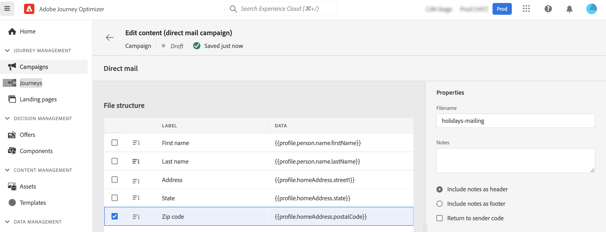

# 建立直接郵件訊息 {#create-direct}

>[!CONTEXTUALHELP]
>id="ajo_direct_mail"
>title="直接郵件建立"
>abstract="在排程的行銷活動中建立直接郵件訊息，並設計直接郵件提供者傳送郵件給客戶所需的解壓縮檔案。"

直接郵件是離線通道，可讓您個人化並產生直接郵件提供者傳送郵件給客戶所需的解壓縮檔案。

建立直接郵件時，Journey Optimizer會產生一個檔案，其中包含所有目標設定檔和選取的資料（郵遞區號、設定檔屬性等）。 然後，您的直接郵件提供者便能擷取該檔案，並處理實際傳送。

直接郵件訊息只能在已排程促銷活動的內容中建立。 它們無法用於API觸發的行銷活動或歷程中。

>[!IMPORTANT]
>
>傳送直接郵件訊息之前，請確定您已設定：
>
>1. A [檔案路由配置](../direct-mail/direct-mail-configuration.md#file-routing-configuration) 它指定應上載和儲存解壓縮檔案的伺服器，
>1. A [直接郵件報文表面](../direct-mail/direct-mail-configuration.md#direct-mail-surface) 將引用檔案路由配置。

## 建立直接郵件訊息 {#create}

建立和傳送直接郵件訊息的步驟如下：

1. 建立新的排程促銷活動，請選取 **[!UICONTROL 直接郵件]** 作為操作，並選擇要使用的通道曲面。 [了解如何建立直接郵件表面](../direct-mail/direct-mail-configuration.md#direct-mail-surface)

   

1. 按一下 **[!UICONTROL 建立]** 然後定義行銷活動的基本資訊（名稱、說明）。 [了解如何設定行銷活動](../campaigns/create-campaign.md)

   

1. 按一下 **[!UICONTROL 編輯內容]** 按鈕來設定要傳送至直接郵件提供者的解壓縮檔案。

1. 在 **[!UICONTROL 檔案名]** 欄位。

   有時候，您可能需要在解壓縮檔案的開頭或結尾新增資訊。若要這麼做，請使用 **[!UICONTROL 附註]** 欄位，然後指定是否要將注釋作為頁眉或頁腳。

   <!--Click on the button to the right of the Output file field and enter the desired label. You can use personalization fields, content blocks and dynamic text (see Defining content). For example, you can complete the label with the delivery ID or the extraction date.-->

   

1. 使用左側區域來定義要在解壓縮檔案中顯示為列的資訊：

   1. 按一下 **[!UICONTROL 新增]** 按鈕來添加新列，然後從清單中選擇該列。

   1. 在 **[!UICONTROL 格式]** 區段，指定欄的標籤，然後定義要使用 [運算式編輯器](../personalization/personalization-build-expressions.md).

      

   1. 若要使用選取的欄來排序解壓縮檔案，請切換 **[!UICONTROL 排序依據]** 選項。 此 **[!UICONTROL 排序依據]** 圖示便會顯示在檔案結構中欄標籤旁。

1. 重複這些步驟，視需要新增多欄，以建立解壓縮檔案。 請注意，您最多可以新增50欄。

   

   您隨時可以選取欄並按一下 **[!UICONTROL 移除]** 按鈕 **[!UICONTROL 格式]** 區段。

1. 定義直接郵件內容後，請完成促銷活動的設定。

   當促銷活動開始時，解壓縮檔案會自動產生並匯出至您 [檔案路由配置](../direct-mail/direct-mail-configuration.md).
