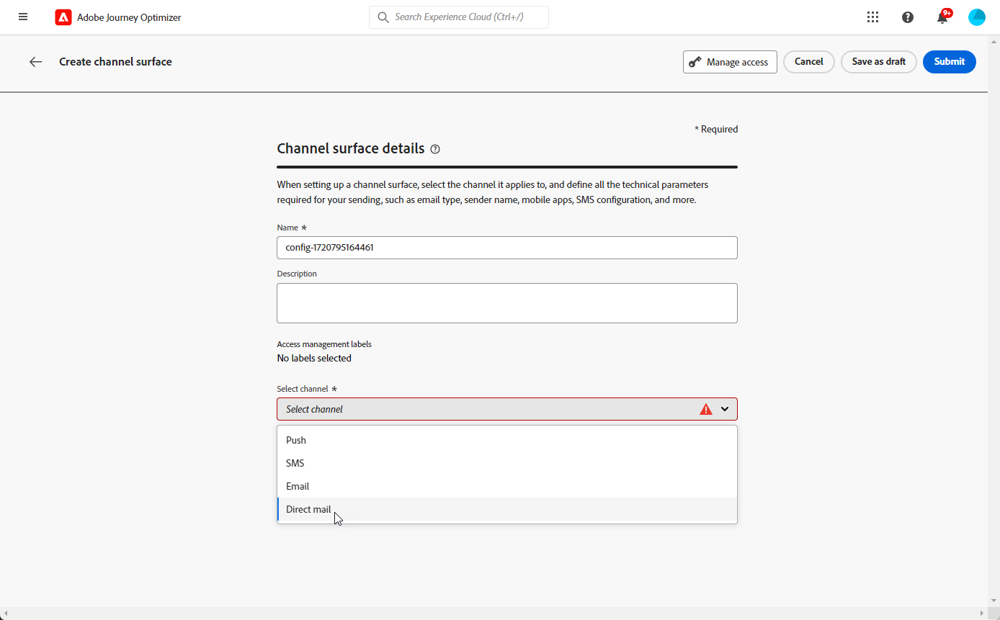

# 直接郵件設定 {#direct-mail-configuration}

[!DNL Journey Optimizer] 可讓您個人化並產生直接郵件供應商傳送郵件給客戶所需的檔案。

時間 [建立直接郵件訊息](../direct-mail/create-direct-mail.md)，您可以定義目標對象資料，包括選取的聯絡資訊（例如郵寄地址）。 然後，包含此資料的檔案會自動產生並匯出至伺服器，您的直接郵件提供者將能夠擷取該檔案，並處理實際傳送。

在能夠產生此檔案之前，您需要建立：

1. A [檔案路由設定](#file-routing-configuration) 指定要匯出檔案的伺服器，並在必要時加密檔案。

1. A [直接郵件表面](#direct-mail-surface) 會參照檔案路由組態。

>[!CAUTION]
>
>如果您尚未設定任何檔案路由選項，您將無法建立直接郵件表面。

## 設定檔案路由 {#file-routing-configuration}

>[!CONTEXTUALHELP]
>id="ajo_dm_file_routing_details"
>title="定義檔案路由設定"
>abstract="建立直接郵件訊息後，會產生包含目標對象資料的檔案並將其匯出到伺服器。您需要指定伺服器的詳細資訊，以便您的直接郵件提供者可以存取和使用該檔案來傳遞直接郵件。"
>additional-url="https://experienceleague.adobe.com/docs/journey-optimizer/using/direct-mail/create-direct-mail.html" text="建立新的直接郵件訊息"

>[!CONTEXTUALHELP]
>id="ajo_dm_file_routing_details_header"
>title="定義檔案路由設定"
>abstract="您需要定義將檔案匯出到何處以供直接郵件提供者使用。"

>[!CONTEXTUALHELP]
>id="ajo_dm_select_file_routing"
>title="檔案路由設定"
>abstract="選取您選擇的檔案路由設定，這會定義將檔案匯出到何處以供您的直接郵件提供者使用。"

>[!CONTEXTUALHELP]
>id="ajo_dm_file_routing_type"
>title="選取您的檔案的伺服器類型"
>abstract="選擇要用於匯出直接郵件檔案的伺服器類型。Journey Optimizer 目前僅支援 Amazon S3 和 SFTP。"

>[!CONTEXTUALHELP]
>id="ajo_dm_file_routing_aws_region"
>title="選擇 AWS 區域"
>abstract="選取要將直接郵件檔案匯出到哪個 AWS 伺服器的地理區域。一般做法是，最好選擇離您的直接郵件提供者所在位置最近的區域。"

若要傳遞直接郵件訊息， [!DNL Journey Optimizer] 產生包含目標受眾資料的檔案，並將其匯出至伺服器。

您必須指定伺服器詳細資料，以便直接郵件提供者可以存取及使用該檔案來傳遞郵件。

若要設定檔案路由，請遵循下列步驟。

1. 存取 **[!UICONTROL 管理]** > **[!UICONTROL 頻道]** > **[!UICONTROL 檔案路由設定]** > **[!UICONTROL 檔案路由]** 功能表，然後按一下 **[!UICONTROL 建立路由設定]**.

   {width="800" align="center"}

1. 設定組態的名稱。

1. 選取 **[!UICONTROL 伺服器型別]** 要用於匯出直接郵件檔案的檔案。

   {width="800" align="center"}

   >[!NOTE]
   >
   >目前支援Amazon S3、SFTP和Azure [!DNL Journey Optimizer].

1. 填寫伺服器的詳細資料和認證，例如伺服器位址、存取金鑰等。

   

1. 如果您已選取 **[!UICONTROL Amazon S3]**，選擇 **[!UICONTROL AWS地區]** 伺服器基礎結構的位置。

   {width="800" align="center"}

   >[!NOTE]
   >
   >AWS區域是AWS用來託管其雲端基礎結構的地理區域。 一般而言，建議您選擇距離直接郵件提供者位置最近的區域。

1. 若要加密檔案，請複製您的加密金鑰並貼到 **[!UICONTROL pgp/GPG加密金鑰]** 欄位。

1. 選取「**[!UICONTROL 提交]**」。檔案路由組態是使用 **[!UICONTROL 作用中]** 狀態。 現在已準備好用於 [直接郵件表面](#direct-mail-surface).

   >[!NOTE]
   >
   >您也可以選取 **[!UICONTROL 另存為草稿]** 來建立檔案繞線組態，但您無法在曲面中選取它，直到它 **[!UICONTROL 作用中]**.

## 建立直接郵件表面 {#direct-mail-surface}

>[!CONTEXTUALHELP]
>id="ajo_dm_surface_settings"
>title="定義直接郵件設定"
>abstract="直接郵件表面包含檔案格式的設定，其中會包含目標對象資料並將由郵件提供者使用。您還必須選取檔案路由設定以定義檔案匯出的位置。"
>additional-url="https://experienceleague.adobe.com/docs/journey-optimizer/using/direct-mail/direct-mail-configuration.html?lang=zh-Hant#file-routing-configuration" text="設定檔案路由"

<!--
>[!CONTEXTUALHELP]
>id="ajo_dm_surface_sort"
>title="Define the sort order"
>abstract="If you select this option, the sort will be by profile ID, ascending or descending. If you unselect it, the sorting configuration defined when creating the direct mail message within a journey or a campaign."-->

>[!CONTEXTUALHELP]
>id="ajo_dm_surface_split"
>title="定義檔案分割臨界值"
>abstract="您必須為包含對象資料的每個檔案設定最大記錄數。您可以選取 1 到 200,000 筆記錄之間的任一數字。達到指定的臨界值後，將為剩餘記錄建立另一個檔案。"

若要能夠傳送直接郵件，使用 [!DNL Journey Optimizer]，您必須建立管道表面，以定義郵件提供者將使用的檔案格式設定。

直接郵件表面還必須包含檔案路由設定，該設定定義了直接郵件檔案將匯出的伺服器。

1. 建立管道表面。 [了解更多](../configuration/channel-surfaces.md)

1. 選取 **[!UICONTROL 直接郵件]** 頻道。

   {width="800" align="center"}

1. 在管道表面設定的專用區段中定義直接郵件設定。

   {width="800" align="center"}

   <!---->

1. 選取檔案格式： **[!UICONTROL CSV]** 或 **[!UICONTROL 文字分隔]**.

1. 如果您選取 **[!UICONTROL 文字分隔]**，定義您選擇的欄分隔符號：表格、分號、垂直號或&amp;符號。

   

1. 選取 **[!UICONTROL 檔案路由設定]** 在您建立的報表中。 這會定義檔案將匯出至何處以供直接郵件提供者使用。

   >[!CAUTION]
   >
   >如果您尚未設定任何檔案路由選項，您將無法建立直接郵件表面。 [了解更多](#file-routing-configuration)

   {width="800" align="center"}

   <!---->

1. 提交直接郵件介面。

您現在可以 [建立直接郵件訊息](../direct-mail/create-direct-mail.md) 在行銷活動內。 行銷活動開始後，包含目標對象資料的檔案會自動匯出至您定義的伺服器。 然後，直接郵件提供者將能夠擷取該檔案，並繼續直接郵件傳送。

>[!NOTE]
>
>系統會自動移除重複的列。
>
>如果每個包含設定檔資料的檔案的記錄數上限（即列）過高，系統會自動為剩餘的記錄建立另一個檔案。

<!--
    In the **[!UICONTROL Insertion]** section, you can choose to automatically remove duplicate rows.

    Define the maximum number of records (i.e. rows) for each file containing profile data. After the specified threshold is reached, another file will be created for the remaining records.

    

    For example, if there are 100,000 records in the file and the threshold limit is set to 60,000, the records will be split into two files. The first file will contain 60,000 rows, and the second file will contain the remaining 40,000 rows.

    >[!NOTE]
    >
    >NOTE You can set any number between 1 and 200,000 records, meaning each file must contain at least 1 row and no more than 200,000 rows.

-->