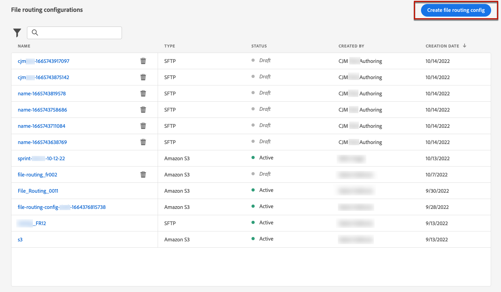

# 直接郵件配置 {#direct-mail-configuration}

>[!BEGINSHADEBOX]

本文件提供下列內容：

* [建立直接郵件](create-direct-mail.md)
* **[設定直接郵件](direct-mail-configuration.md)**

>[!ENDSHADEBOX]

[!DNL Journey Optimizer] 允許您個性化並生成直接郵件提供商向客戶發送郵件所需的檔案。

當 [建立直接郵件](../direct-mail/create-direct-mail.md)，定義目標受眾資料，包括所選聯繫資訊（例如，郵政地址）。 然後，將自動生成包含此資料的檔案並將其導出到伺服器，您的直接郵件提供商將能夠在伺服器中檢索此資料並處理實際發送。

在能夠生成此檔案之前，您需要建立：

1. A [檔案路由配置](#file-routing-configuration) 指定要導出檔案的伺服器。

1. A [直接郵件表](#direct-mail-surface) 引用檔案路由配置。

>[!CAUTION]
>
>如果尚未配置任何檔案路由選項，則將無法建立直接郵件表面。

## 設定檔案路由 {#file-routing-configuration}

>[!CONTEXTUALHELP]
>id="ajo_dm_file_routing_details"
>title="定義檔案路由設定"
>abstract="建立直接郵件訊息後，會產生包含目標對象資料的檔案並將其匯出到伺服器。您需要指定伺服器的詳細資訊，以便您的直接郵件提供者可以存取和使用該檔案來傳遞直接郵件。"

<!--
>additional-url="https://experienceleague.adobe.com/docs/journey-optimizer/using/direct-mail/create-direct-mail.html" text="Create a direct mail message"-->

>[!CONTEXTUALHELP]
>id="ajo_dm_file_routing_details_header"
>title="定義檔案路由設定"
>abstract="您需要定義將檔案匯出到何處以供直接郵件提供者使用。"

>[!CONTEXTUALHELP]
>id="ajo_dm_select_file_routing"
>title="檔案路由設定"
>abstract="選取您選擇的檔案路由設定，這會定義將檔案匯出到何處以供您的直接郵件提供者使用。"

>[!CONTEXTUALHELP]
>id="ajo_dm_file_routing_type"
>title="選取您的檔案的伺服器類型"
>abstract="選擇要用於匯出直接郵件檔案的伺服器類型。Journey Optimizer 目前僅支援 Amazon S3 和 SFTP。"

>[!CONTEXTUALHELP]
>id="ajo_dm_file_routing_aws_region"
>title="選擇 AWS 區域"
>abstract="選取要將直接郵件檔案匯出到哪個 AWS 伺服器的地理區域。一般做法是，最好選擇離您的直接郵件提供者所在位置最近的區域。"

要傳遞直郵郵件， [!DNL Journey Optimizer] 生成包含目標受眾資料的檔案並將其導出到伺服器。

您需要指定該伺服器詳細資訊，以便您的直接郵件提供商可以訪問和使用該檔案傳送郵件。

要配置檔案路由，請執行以下步驟。

1. 訪問 **[!UICONTROL 管理]** > **[!UICONTROL 頻道]** > **[!UICONTROL 檔案路由配置]** > **[!UICONTROL 檔案路由]** 菜單，然後按一下 **[!UICONTROL 建立路由配置]**。

   

1. 為配置設定名稱。

1. 選擇 **[!UICONTROL 伺服器類型]** 要用於導出直接郵件檔案。

   

   >[!NOTE]
   >
   >目前僅支援AmazonS3和SFTP [!DNL Journey Optimizer]。

1. 填寫伺服器的詳細資訊和憑據，如伺服器地址、訪問密鑰等。

   

1. 如果已選擇 **[!UICONTROL AmazonS3]**&#x200B;的子菜單。 **[!UICONTROL AWS]** 伺服器基礎架構所在的位置。

   

   >[!NOTE]
   >
   >AWS地區是AWS用來托管其雲基礎架構的地理區域。 通常，您最好選擇與直接郵件提供商的位置最接近的區域。

1. 選取「**[!UICONTROL 提交]**」。檔案路由配置是使用 **[!UICONTROL 活動]** 狀態。 現在，它已準備好用於 [直接郵件表](#direct-mail-surface)。

   >[!NOTE]
   >
   >也可以選擇 **[!UICONTROL 另存為草稿]** 建立檔案路由配置，但在曲面中選取它之前 **[!UICONTROL 活動]**。

## 建立直接郵件表面 {#direct-mail-surface}

>[!CONTEXTUALHELP]
>id="ajo_dm_surface_settings"
>title="定義直接郵件設定"
>abstract="直接郵件表面包含檔案格式的設定，其中會包含目標對象資料並將由郵件提供者使用。您還必須選取檔案路由設定以定義檔案匯出的位置。"
>additional-url="https://experienceleague.adobe.com/docs/journey-optimizer/using/direct-mail/direct-mail-configuration.html?lang=zh-Hant#file-routing-configuration" text="設定檔案路由"

<!--
>[!CONTEXTUALHELP]
>id="ajo_dm_surface_sort"
>title="Define the sort order"
>abstract="If you select this option, the sort will be by profile ID, ascending or descending. If you unselect it, the sorting configuration defined when creating the direct mail message within a journey or a campaign."-->

>[!CONTEXTUALHELP]
>id="ajo_dm_surface_split"
>title="定義檔案分割臨界值"
>abstract="您必須為包含對象資料的每個檔案設定最大記錄數。您可以選取 1 到 200,000 筆記錄之間的任一數字。達到指定的臨界值後，將為剩餘記錄建立另一個檔案。"

能夠將直郵 [!DNL Journey Optimizer]，您需要建立通道曲面，以定義將由郵件提供程式使用的檔案格式設定。

直接郵件表面還必須包括檔案路由配置，該配置定義了要導出直接郵件檔案的伺服器。

1. 建立通道曲面。 [了解更多](../configuration/channel-surfaces.md)

1. 選擇 **[!UICONTROL 直郵]** 頻道。

   

1. 在通道表面配置的專用部分中定義直接郵件設定。

   

   <!---->

1. 選擇檔案格式： **[!UICONTROL CSV]** 或 **[!UICONTROL 文本分隔]**。

1. 選擇 **[!UICONTROL 檔案路由配置]** 就在你創造的那些作品中。 這定義了將檔案導出到何處，以供直接郵件提供商使用。

   >[!CAUTION]
   >
   >如果尚未配置任何檔案路由選項，則將無法建立直接郵件表面。 [了解更多](#file-routing-configuration)

   

   <!---->

1. 提交直接郵件表面。

你現在可以 [建立直接郵件](../direct-mail/create-direct-mail.md) 在競選中。 市場活動啟動後，包含目標受眾資料的檔案將自動導出到您定義的伺服器。 然後，直接郵件提供商將能夠檢索該檔案並繼續直接郵件傳送。

>[!NOTE]
>
>將自動刪除重複行。
>
>如果每個包含配置檔案資料的檔案的最大記錄數（即行）過高，將為其餘記錄自動建立另一個檔案。

<!--
    In the **[!UICONTROL Insertion]** section, you can choose to automatically remove duplicate rows.

    Define the maximum number of records (i.e. rows) for each file containing profile data. After the specified threshold is reached, another file will be created for the remaining records.

    

    For example, if there are 100,000 records in the file and the threshold limit is set to 60,000, the records will be split into two files. The first file will contain 60,000 rows, and the second file will contain the remaining 40,000 rows.

    >[!NOTE]
    >
    >NOTE You can set any number between 1 and 200,000 records, meaning each file must contain at least 1 row and no more than 200,000 rows.

-->