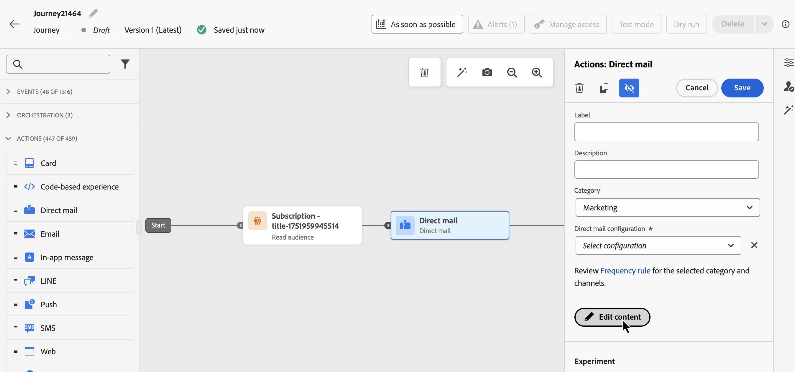
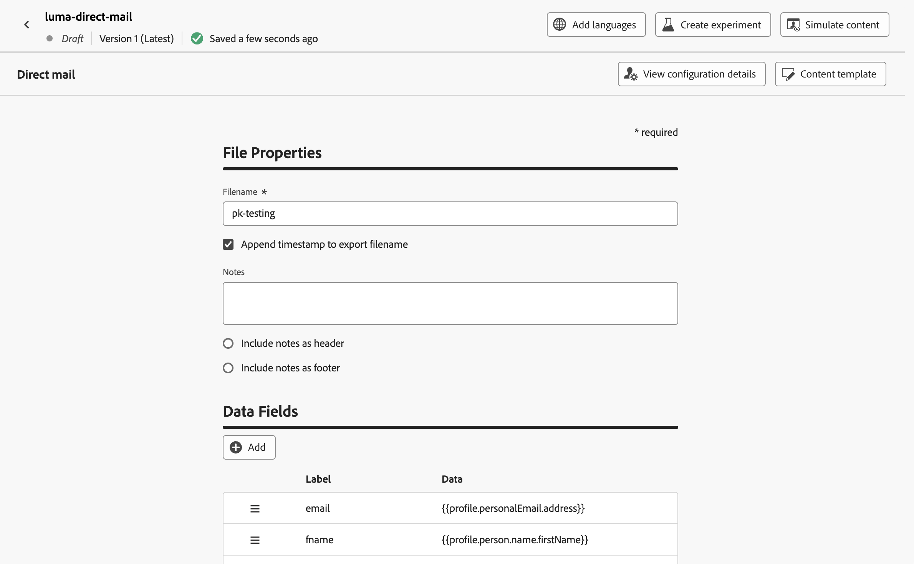

# 傳送包含歷程的直接郵件 {#direct-mail-journeys}

>[!CONTEXTUALHELP]
>id="ajo_journey_direct_mail"
>title="結束活動"
>abstract="直接郵件是離線管道，可讓您個人化和產生第三方直接郵件提供者傳送郵件給客戶所需的擷取檔案。"

>[!AVAILABILITY]
>
>此功能僅適用於一組組織（可用性限制）。

直接郵件是離線管道，可讓您個人化和產生第三方直接郵件提供者傳送郵件給客戶所需的擷取檔案。

建立直接郵件訊息時，[!DNL Journey Optimizer]會自動產生包含所有目標設定檔和選取資料的檔案，例如郵寄地址和設定檔屬性。 此檔案會傳送至您選擇的伺服器，供您選擇的第三方直接郵件提供者存取，來為您處理實際的郵寄流程。

您需要與所選的協力廠商直接郵件提供者合作，以取得客戶的任何必要同意（若適用），以便您的客戶可以接收來自您的郵件。 您使用郵寄服務時，須遵守適用的協力廠商直接郵件提供者提供的其他條款與條件。 Adobe 無法控制您對第三方產品的使用，也不承擔任何責任。 若您有關於直接郵件訊息郵寄的任何問題或協助請求，請連絡您選擇的協力廠商直接郵件提供者。

>[!NOTE]
>
>此頁面詳細說明建立和傳送歷程直接郵件訊息的程式。 如需直接郵件通道以及如何建立直接郵件行銷活動的詳細資訊，請參閱本節： [開始使用直接郵件](../direct-mail/get-started-direct-mail.md)。

## 建立檔案路由設定

>[!CONTEXTUALHELP]
>id="ajo_dm_file_routing_frequency"
>title="選擇 AWS 區域"
>abstract="如果您的檔案路由設定將使用歷程進行傳送，您可以指定檔案將傳送到伺服器的頻率。"

在建立直接郵件訊息之前，請確定您已設定檔案路由設定，該設定會指定應該上傳及儲存解壓縮檔案的伺服器。 若要這麼做，請依照以下步驟進行：

1. 存取&#x200B;**[!UICONTROL 管理]** > **[!UICONTROL 管道]** > **[!UICONTROL 直接郵件設定]** > **[!UICONTROL 檔案路由]**&#x200B;功能表，然後按一下&#x200B;**[!UICONTROL 建立檔案路由設定]**。

1. 定義檔案路由組態屬性，例如其名稱以及要使用的伺服器型別。 有關如何設定檔案路由設定的詳細資訊，請參閱[直接郵件設定](../direct-mail/direct-mail-configuration.md#file-routing-configuration)區段。

   如果您的檔案路由設定將使用歷程進行傳送，您可以指定檔案將傳送到伺服器的頻率。

   

1. 按一下&#x200B;**[!UICONTROL 提交]**&#x200B;以確認檔案路由組態建立。 組態是以&#x200B;**[!UICONTROL 作用中]**&#x200B;狀態建立的。 現在已準備好在直接郵件設定中參照。

## 建立直接郵件設定 {#direct-mail-surface}

直接郵件設定包含檔案格式的設定；該檔案包含目標對象資料，且將由郵件提供者使用。您也必須透過選取檔案路由組態來定義檔案的匯出位置。 有關如何建立直接郵件組態的詳細資訊，請參閱[直接郵件組態](../direct-mail/direct-mail-configuration.md#file-routing-configuration)區段。

直接郵件設定就緒後，您就可以將直接郵件動作新增到歷程中。

## 將直接郵件動作新增至您的歷程

若要在歷程中新增直接郵件動作，請遵循下列步驟：

1. 開啟您的歷程，然後從浮動視窗的&#x200B;**[!UICONTROL 動作]**&#x200B;區段拖放&#x200B;**直接郵件**&#x200B;活動。

1. 提供訊息的基本資訊（標籤、說明、類別），然後選擇要使用的訊息設定。 根據預設，**[!UICONTROL 組態]**&#x200B;欄位會預先填入使用者用於該頻道的最後一個組態。 如需如何設定歷程的詳細資訊，請參閱[此頁面](../building-journeys/journey-gs.md)。

1. 設定要傳送給直接郵件提供者的擷取檔案。 若要這麼做，請按一下&#x200B;**[!UICONTROL 編輯內容]**&#x200B;按鈕。

   

1. 調整解壓縮檔案屬性，例如檔案名稱或要顯示的欄。 如需如何設定解壓縮檔案屬性的詳細資訊，請參閱本節： [建立直接郵件訊息](../direct-mail/create-direct-mail.md#extraction-file)。

   

1. 定義解壓縮檔案的內容後，您就可以使用測試設定檔來預覽。 如果您已插入個人化內容，您可以使用測試設定檔資料檢查此內容在訊息中的顯示方式。

   若要這麼做，請按一下&#x200B;**[!UICONTROL 模擬內容]**，然後新增測試設定檔，以使用測試設定檔資料檢查擷取檔案的呈現方式。 有關如何選取測試設定檔及預覽內容的詳細資訊，請參閱[內容管理](../content-management/preview-test.md)區段。

   {width="800" align="center"}

當您的擷取檔案準備就緒時，請完成[歷程](../building-journeys/journey-gs.md)的設定以傳送它。
