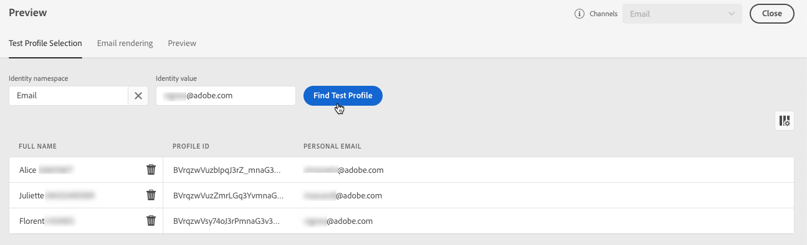

# 新增個人化產品建議 {#deliver-personalized-offers}

在[!DNL Journey Optimizer]封電子郵件中，您可以插入將運用決定管理引擎的決定，以挑選要提供給客戶的最佳優惠方案。

例如，您可以新增會在電子郵件中顯示特殊折扣優惠的決定，該優惠會根據收件者的忠誠度等級而有所不同。

>[!IMPORTANT]
>
>如果對歷程訊息中使用的優惠決定進行變更，您需要取消發佈歷程並重新發佈。  這將確保將變更納入歷程的訊息中，並且該訊息與最新更新一致。

* 如需如何建立和管理優惠方案的詳細資訊，請參閱[本節](../offers/get-started/starting-offer-decisioning.md)。
* 如需說明如何設定優惠的&#x200B;**完整端對端範例**、在決定中使用優惠並在電子郵件中運用此決定，請檢視[此章節](../offers/offers-e2e.md#insert-decision-in-email)。

➡️ [在此影片中瞭解如何新增優惠方案作為個人化](#video-offers)

## 在電子郵件中插入決定 {#insert-offers}

>[!CAUTION]
>
>開始之前，您必須[定義優惠決定](../offers/offer-activities/create-offer-activities.md)。

若要將決定插入電子郵件訊息，請遵循下列步驟：

1. 建立您的電子郵件，然後開啟「電子郵件Designer」以設定其內容。

1. 新增&#x200B;**[!UICONTROL 優惠決定]**&#x200B;內容元件。

   

   在[本節](content-components.md)中瞭解如何使用內容元件。

1. **[!UICONTROL 優惠決定]**&#x200B;索引標籤會顯示在右側浮動視窗中。 按一下&#x200B;**[!UICONTROL 選取優惠決定]**：

   1. 在顯示的視窗中，選取與您要顯示之優惠方案對應的版位。

      [位置](../offers/offer-library/creating-placements.md)是用來展示您的優惠方案的容器。 在此範例中，我們將使用「電子郵件上層影像」位置。 此位置已在選件資料庫中建立，以顯示位於訊息頂端的影像型別選件。

   1. 與所選位置相符的決定隨即顯示。 選取要在內容元件中使用的決定，然後按一下[新增]。****

      >[!NOTE]
      >
      >只有與所選位置相容的決定才會顯示在清單中。 在此範例中，只有一個優惠方案活動符合「電子郵件頂端影像」位置。

      

決定現在已新增至元件。 儲存變更後，您的優惠方案就可以在傳送訊息做為歷程的一部分時，顯示給相關的設定檔。

>[!NOTE]
>
>當您更新訊息中直接或間接參考的優惠、遞補優惠、優惠集合或優惠決定時，更新會自動反映在相對應的訊息中。

## 預覽電子郵件中的優惠方案 {#preview-offers-in-email}

您可以使用&#x200B;**[!UICONTROL 優惠]**&#x200B;區段或內容元件箭頭，預覽加入電子郵件之決定中的不同優惠。

若要透過客戶設定檔顯示屬於決策一部分的不同優惠方案，請遵循下列步驟。

1. 選取要用於預覽優惠方案的測試設定檔：

   1. 按一下「**[!UICONTROL 模擬內容」按鈕]**&#x200B;按鈕，然後從&#x200B;**[!UICONTROL 身分識別名稱空間]**&#x200B;欄位中選擇要用來識別測試設定檔的名稱空間。

      >[!NOTE]
      >
      >在此範例中，我們使用&#x200B;**電子郵件**&#x200B;名稱空間。 在本節[中進一步瞭解Adobe Experience Platform識別名稱空間](../audience/get-started-identity.md)。

   1. 在&#x200B;**[!UICONTROL 識別值]**&#x200B;欄位中，輸入識別測試設定檔的值。 在此範例中，輸入測試設定檔的電子郵件地址。

   <!--For example enter smith@adobe.com and click the **[!UICONTROL Add profile]** button.-->

   1. 新增其他設定檔，以便您根據設定檔資料測試訊息的不同變體。

      

1. 按一下&#x200B;**[!UICONTROL 預覽]**&#x200B;標籤以測試您的訊息，然後選取測試設定檔。 與所選設定檔（女性）相對應的優惠方案隨即顯示。

   

   您可以選取其他測試設定檔，以預覽訊息每個變體的電子郵件內容。 訊息內容中現在會顯示與所選測試設定檔（現在為男性）對應的選件。

深入瞭解在[本節](#preview-your-messages)中檢查訊息預覽的詳細步驟。

## 作法影片{#video-offers}

瞭解如何在[!DNL Journey Optimizer]中新增決定管理元件至訊息。

>[!VIDEO](https://video.tv.adobe.com/v/334088?quality=12)
