# 對您的電子郵件內容套用主題 {#apply-email-themes}

>[!CONTEXTUALHELP]
>id="ajo_use_theme"
>title="對您的電子郵件套用主題"
>abstract="為您的電子郵件選擇主題，以快速套用符合品牌形象與設計的特定樣式。"

>[!AVAILABILITY]
>
>此功能限量提供。 請聯絡您的 Adobe 代表以取得存取權。

透過主題，非技術使用者能藉由在標準範本<!-- to achieve brand specific results-->上新增自訂樣式，建立符合特定品牌和設計語言的可重複使用內容。

此功能可讓行銷人員更快且更輕鬆地運用視覺上吸引人、品牌一致的電子郵件，同時提供進階自訂選項以滿足獨特的設計需求。

## 護欄與限制 {#themes-guardrails}

* 從頭開始建立電子郵件時，您可以選擇使用主題開始建立內容，以快速套用符合您的品牌和設計的特定樣式。

  如果您選擇「手動樣式化」模式，除非重設電子郵件，否則您將無法套用任何主題。

* [片段](../content-management/fragments.md)在使用主題和手動樣式模式之間不相容。

   * 若要在主題內容中利用[片段](../content-management/fragments.md)，此片段必須已使用主題自行建立。 [了解更多](#leverage-themes-fragment)

   * 在電子郵件內容中使用片段時，請務必套用您為此片段定義的主題。 若未這麼做，可能會導致顯示問題，尤其是在Outlook 2021和舊版中。 [了解更多](#leverage-themes-fragment)

* 如果使用在HTML中建立的內容，您將處於[相容性模式](existing-content.md)，而且您無法直接將主題套用至此內容。

   * 若要套用主題，您必須先將匯入的內容[儲存為新範本](../content-management/create-content-templates.md#save-as-template)，然後將此範本轉換為主題相容的內容。 然後，您可以使用此範本建立您的電子郵件內容。 在[本節](#theme-convertor)中瞭解如何轉換使用手動樣式建立的範本。

   * 您仍然可以轉換匯入的HTML內容。 [了解更多](existing-content.md)

  <!--To fully leverage all the capabilities of the Email Designer, including themes, you must either create a new content in Use Themes mode, or convert your imported HTML content. [Learn more](existing-content.md)-->

<!--If you apply a theme to a content using a [fragment](../content-management/fragments.md) created with Manual Styling mode, the rendering may not be optimal.-->

## 建立主題 {#create-and-edit-themes}

若要定義您可在未來電子郵件內容中運用的主題，請遵循下列步驟。

1. 若要開始，請建立新的[內容範本](../content-management/create-content-templates.md)。

1. 選取&#x200B;**[!UICONTROL 建立或編輯主題]**&#x200B;選項。

   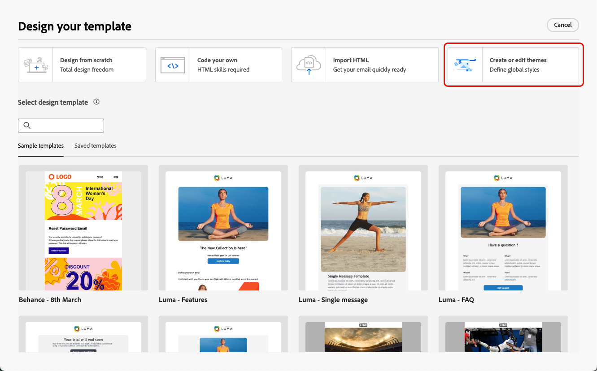

1. 選取Adobe主題。 在此範例中，選取&#x200B;**[!UICONTROL 預設主題]**&#x200B;並按一下&#x200B;**[!UICONTROL 建立]**。

   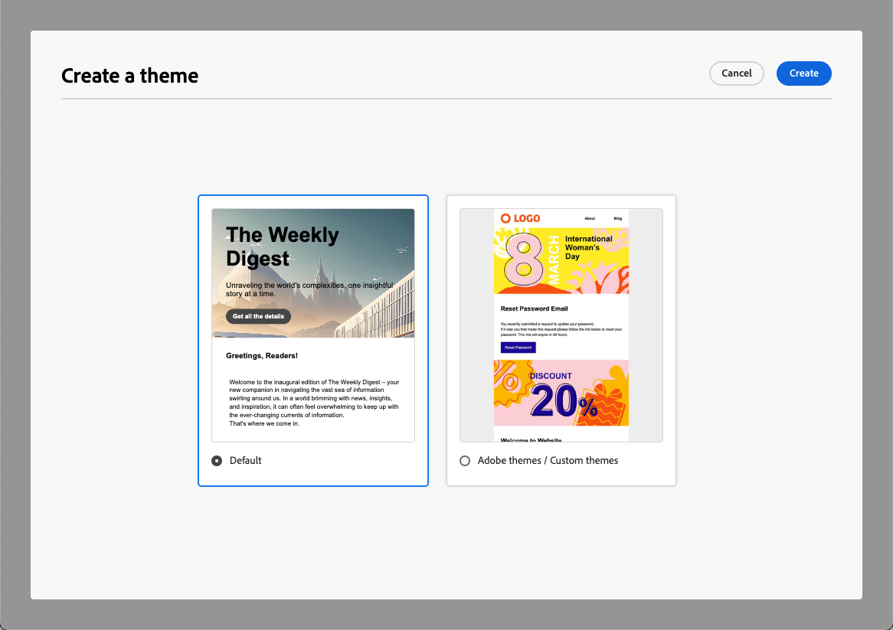

1. 您也可以從&#x200B;**[!UICONTROL 我的佈景主題]**&#x200B;標籤中選取自訂範本，然後按一下&#x200B;**[!UICONTROL 編輯]**&#x200B;進行更新。

   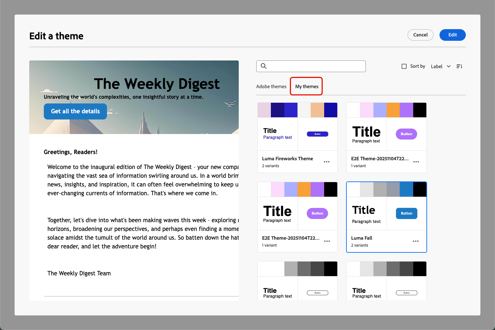

1. 在&#x200B;**[!UICONTROL 一般設定]**&#x200B;標籤中，透過提供適合您品牌的特定名稱來開始定義您的主題。 您可以調整電子郵件的預設檢視區寬度，也可以將目前主題匯出為[在沙箱間共用](../configuration/copy-objects-to-sandbox.md)。

   <!--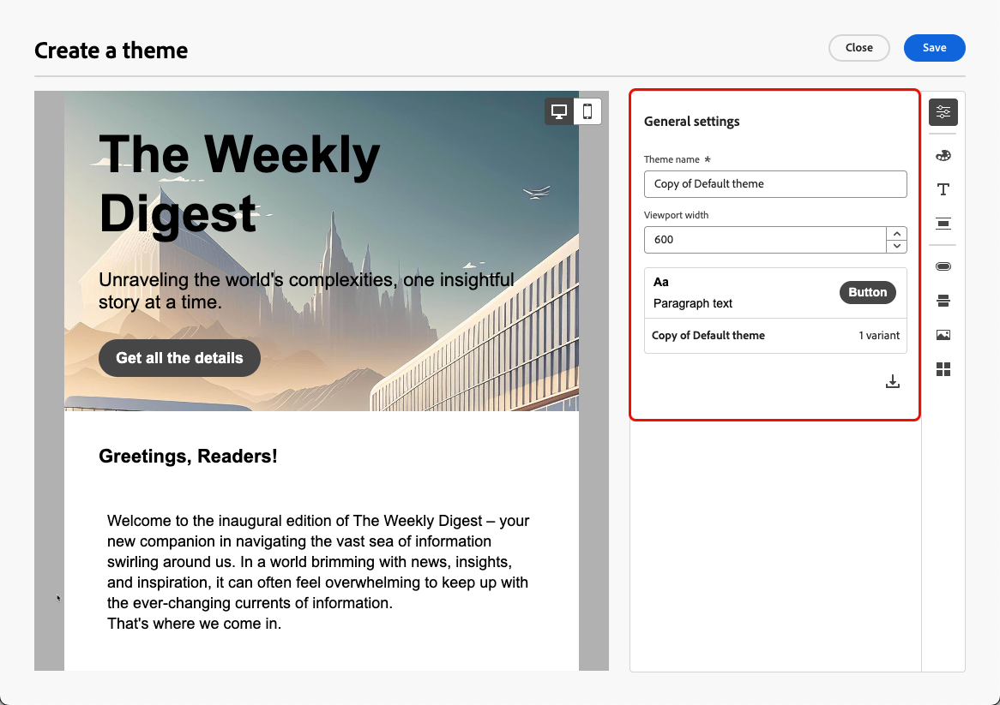-->

1. 使用右側的邊欄瀏覽不同的標籤並更新您的設計設定。

   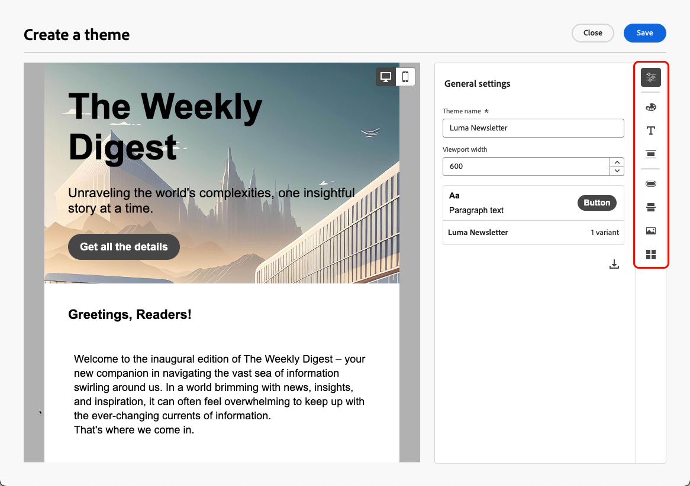

1. 從&#x200B;**[!UICONTROL 色彩]**&#x200B;索引標籤：

   * 使用&#x200B;**[!UICONTROL 編輯]**&#x200B;按鈕，為您的品牌設定預設顏色的&#x200B;**[!UICONTROL 調色盤]**。 選取&#x200B;**[!UICONTROL 預設集]**&#x200B;以快速建立色彩配置，或個別調整佈景主題的每種顏色。 您也可以使用兩者的組合。

     

   * 按一下&#x200B;**[!UICONTROL 新增變體]**&#x200B;以建立多種顏色變體，例如淺色和深色模式，其中您主題的每種變體都有自己的調色盤和細微控制項。

     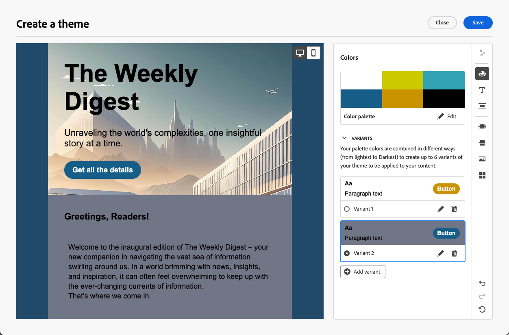

   * 對於每個變體，按一下&#x200B;**[!UICONTROL 編輯]**&#x200B;圖示以編輯任何個別元素。 您可以使用已建立的預設調色盤或任何自訂顏色。

     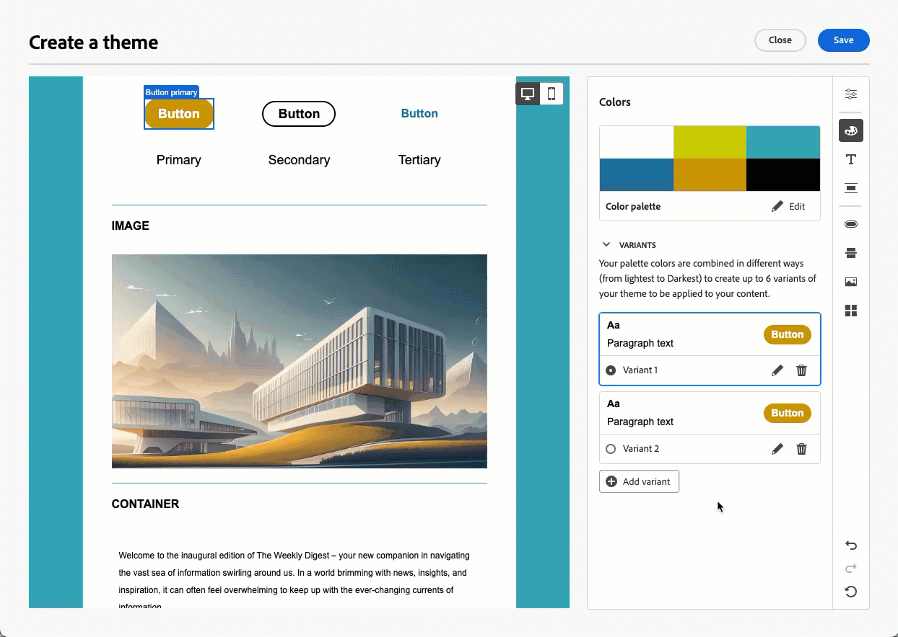

1. 在&#x200B;**[!UICONTROL 文字設定]**&#x200B;中，您可以設定要用於整個佈景主題的全域字型。 如需更細微的控制項，您也可以編輯每個標題和段落型別，以調整字型、大小、樣式等。

   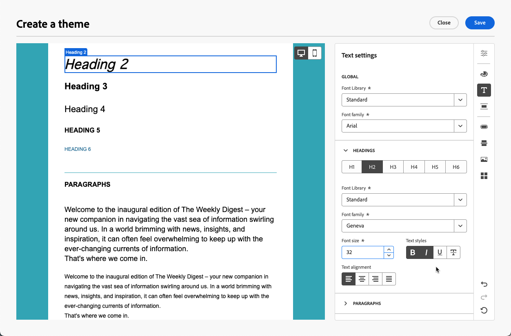

1. 在&#x200B;**[!UICONTROL 間距]**&#x200B;索引標籤中，從清單中選取個別元素，以便在不同元件之間適當地間隔該元素。

   <!--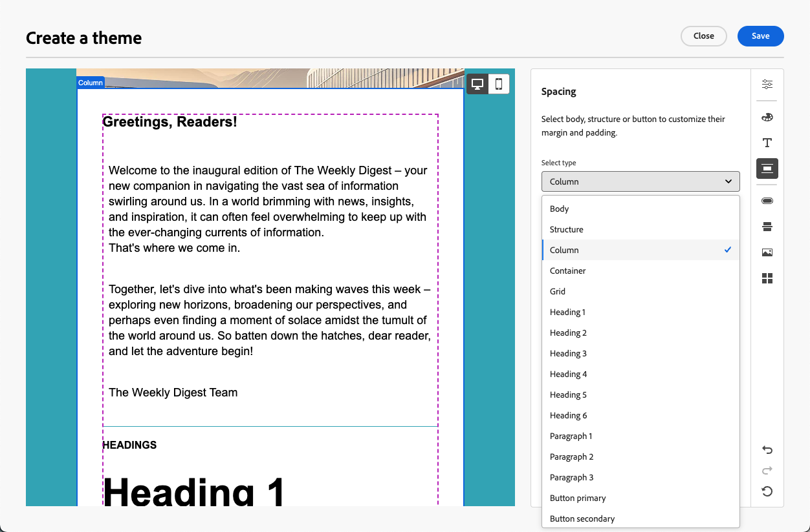-->

1. 使用右側的其他索引標籤，您可以分別管理此主題的每個按鈕元素、分隔線、其他影像格式和格線版面間距。

   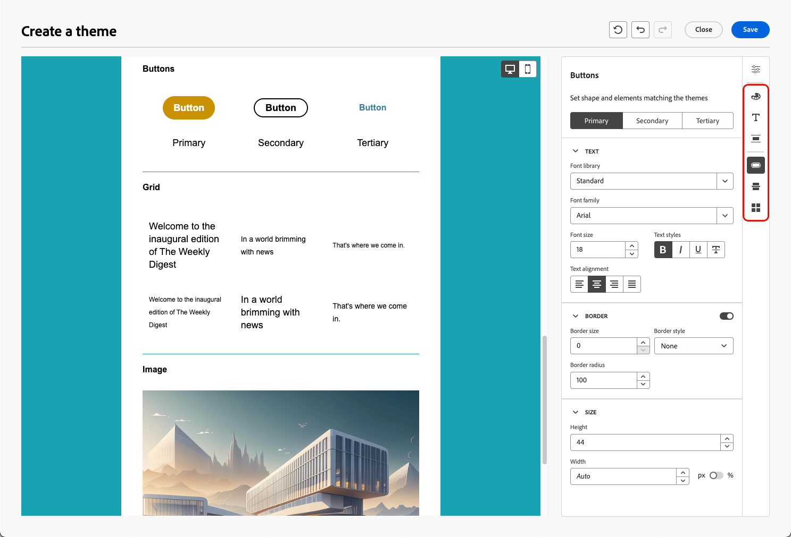

1. 按一下[儲存]儲存此佈景主題以供日後使用。 **&#x200B;**&#x200B;它現在顯示在&#x200B;**[!UICONTROL 我的主題]**&#x200B;標籤中。

<!--A little strange upon hitting Save, because once the theme is created, you need to hit Close to go back to Design your template screen, then click Cancel if you don't want to proceed with template creation.-->

## 將主題套用至電子郵件內容 {#apply-themes-email}

若要將預設或自訂樣式主題套用至內容範本或電子郵件，請遵循下列步驟。

1. 在[!DNL Journey Optimizer]中，[將電子郵件](create-email.md)動作新增至歷程或行銷活動，或建立電子郵件[內容範本](../content-management/create-content-templates.md#create-template-from-scratch)，並[編輯電子郵件內文](get-started-email-design.md#key-steps)。

1. 您可以選取下列其中一個動作：

   * 選取內建的[電子郵件範本](use-email-templates.md)，以開啟電子郵件Designer。 系統會自動套用每個範本專屬的預設主題。

   * 從頭開始設計[新內容](content-from-scratch.md)，並選取&#x200B;**[!UICONTROL 使用主題]**&#x200B;以預先定義的樣式主題開始。

     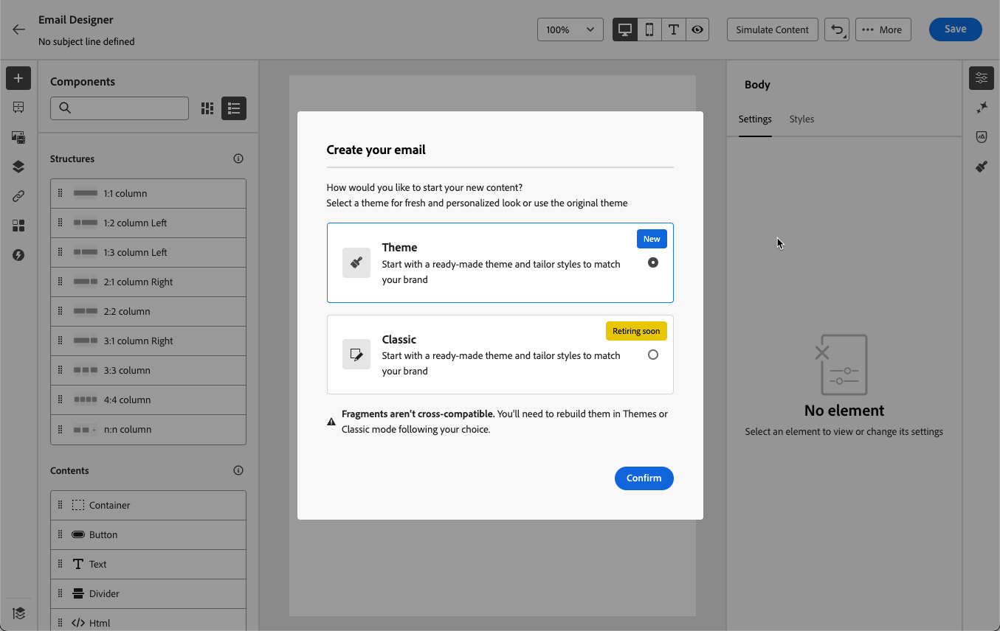

     >[!CAUTION]
     >
     >如果您選擇「手動樣式化」模式，除非您重設設計，否則無法套用任何主題。
     >
     >若要在主題內容中利用[片段](../content-management/fragments.md)，此片段必須已使用主題自行建立。 [了解更多](#leverage-themes-fragment)

1. 在電子郵件Designer中，按一下右側邊欄上的&#x200B;**[!UICONTROL 主題]**&#x200B;按鈕。 預設主題或範本主題隨即顯示。 您可以在此佈景主題的兩個顏色變體之間切換。

   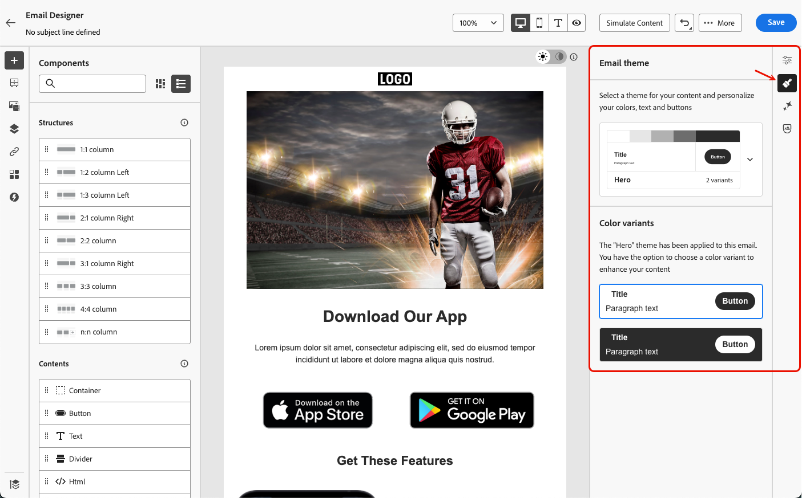

1. 按一下目前使用之主題旁的箭頭。 可用的自訂和Adobe主題清單隨即顯示。

   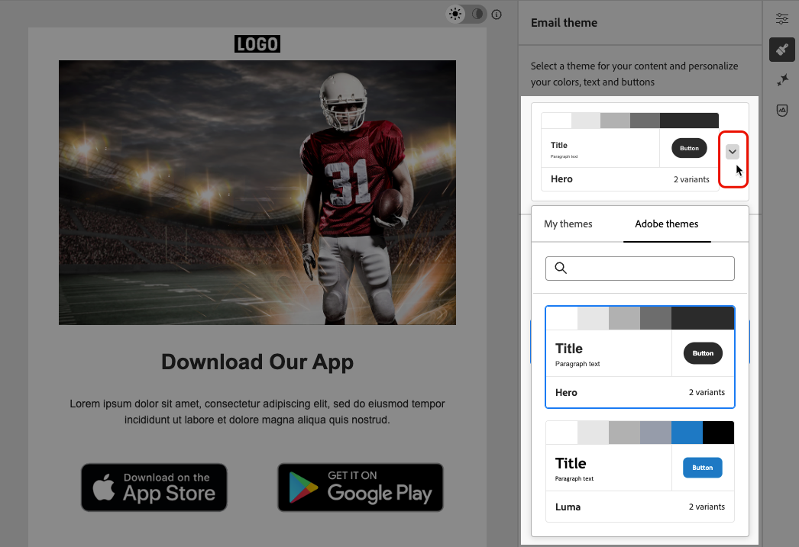

1. 按一下&#x200B;**[!UICONTROL 我的佈景主題]**，然後選取您建立的主題。

   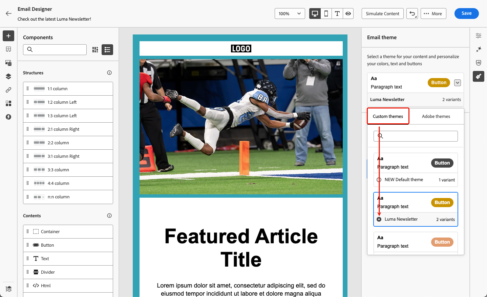

1. 按一下下拉式清單外部。 新選取的自訂主題會自動將其樣式套用至所有電子郵件元件。 您可以切換顏色變體（如果有的話）。

1. 在內容範本中選取佈景主題時，您可以按一下&#x200B;**[!UICONTROL 編輯佈景主題]**&#x200B;按鈕進行更新。 [了解更多](#create-and-edit-themes)

   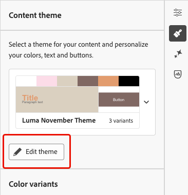{width="40%"}

   >[!NOTE]
   >
   >在電子郵件內容中使用主題時，此選項無法使用。

1. 如果您使用數個顏色變體來利用主題，則可針對指定結構元件選擇特定變體。 這可讓您為整個內容定義顏色變體，並針對一個特定結構使用不同的變體。

   >[!NOTE]
   >
   >您無法在內容元件上執行此動作。

   若要這麼做，請選取結構元件，從右側的&#x200B;**[!UICONTROL 樣式]**&#x200B;索引標籤按一下&#x200B;**[!UICONTROL 使用特定主題的變體選項]**，然後將所需的變體套用至該結構。

   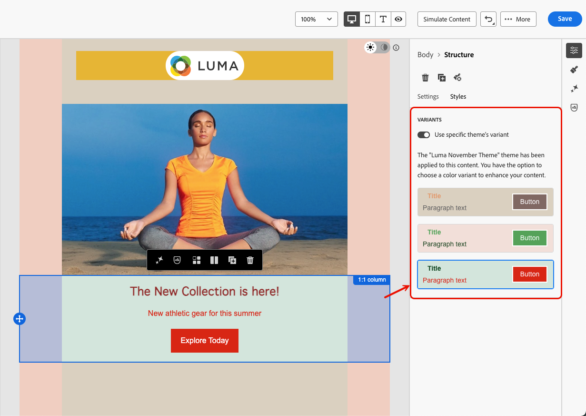

   在此範例中，目前主題的第一個顏色變體會套用至整個電子郵件內容，但第三個顏色變體則套用至所選結構。 您可以看到該特定結構的內文和檢視區背景顏色與其餘內容不同。

您可以隨時切換主題。 電子郵件內容保持不變，但樣式會更新以反映新主題。

### 解除鎖定樣式 {#unlocking-styles}

選取元件時，您可以使用&#x200B;**[!UICONTROL 樣式]**&#x200B;索引標籤中的專用圖示來解除鎖定其樣式。

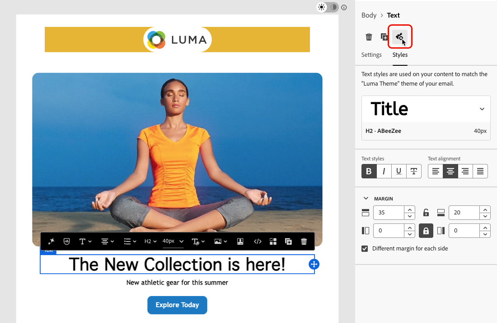{width="90%"}

選取的主題仍會套用到該元件，但您可以覆寫其樣式元素。 如果您變更主題，新主題只會套用至未覆寫的樣式元素。<!--can you revert this action?-->

例如，如果您解除鎖定文字元件，您就可以將<!--the font size from 11 to 14 and -->字型顏色從黑色變更為紅色：

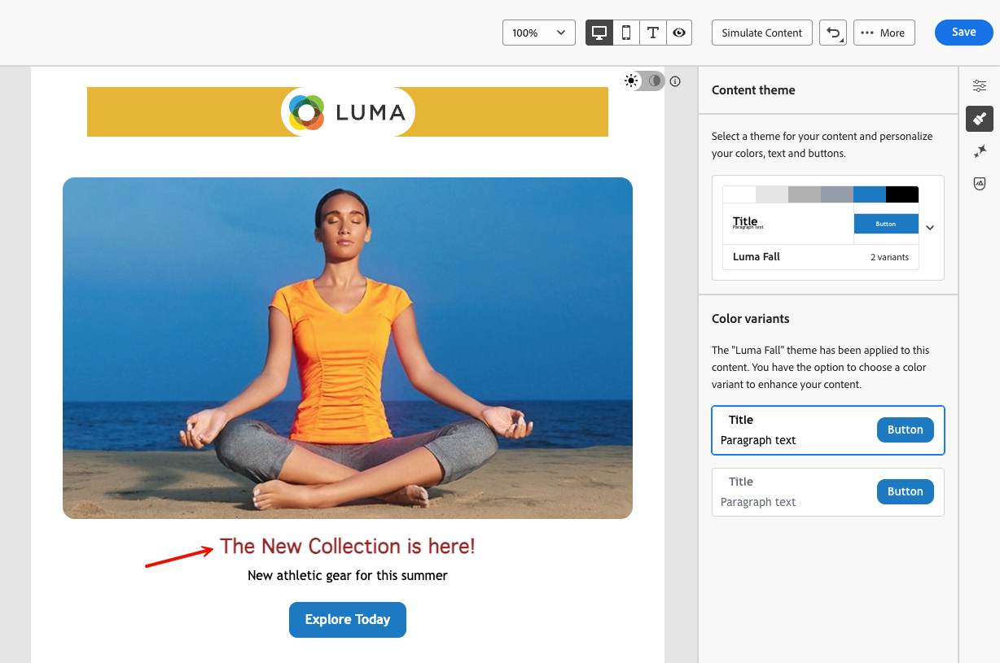{width="80%" align="center" zoomable="yes"}

如果您變更主題，<!--the font size is still 14 and -->該元件的字型顏色仍為紅色，但此元件的背景顏色會隨著新主題而變更：

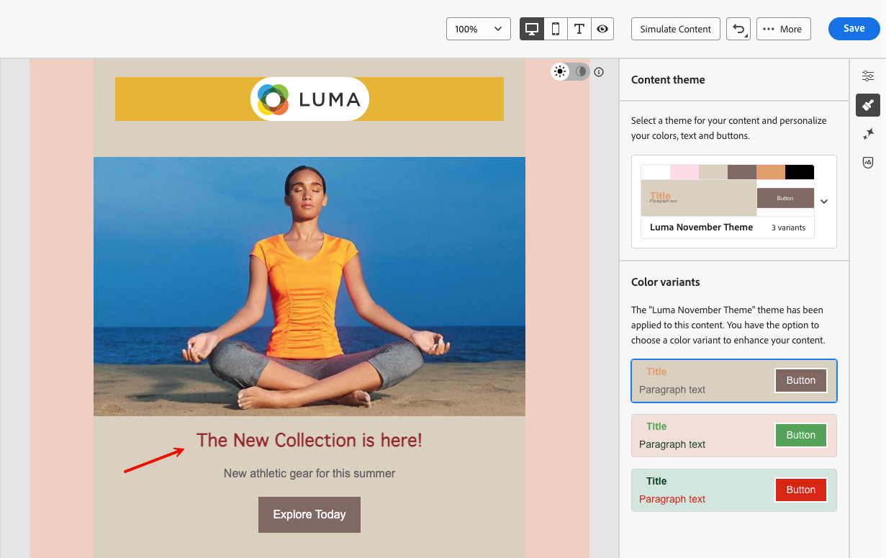{width="80%"}

## 在片段中善用主題 {#leverage-themes-fragment}

若要在套用[佈景主題](#apply-themes-email)的範本或電子郵件中善用片段，必須使用佈景主題自行建立此片段。 否則，您將無法在您的主題內容中使用此片段。

若要建立與主題相容的片段，請遵循下列步驟。

1. 在[!DNL Journey Optimizer]中建立視覺化片段，然後按一下&#x200B;**[!UICONTROL 建立]**&#x200B;來設計片段的內容。 [了解作法](../content-management/create-fragments.md)

1. 選取&#x200B;**[!UICONTROL 使用佈景主題]**&#x200B;以預先定義的樣式佈景主題開始。

   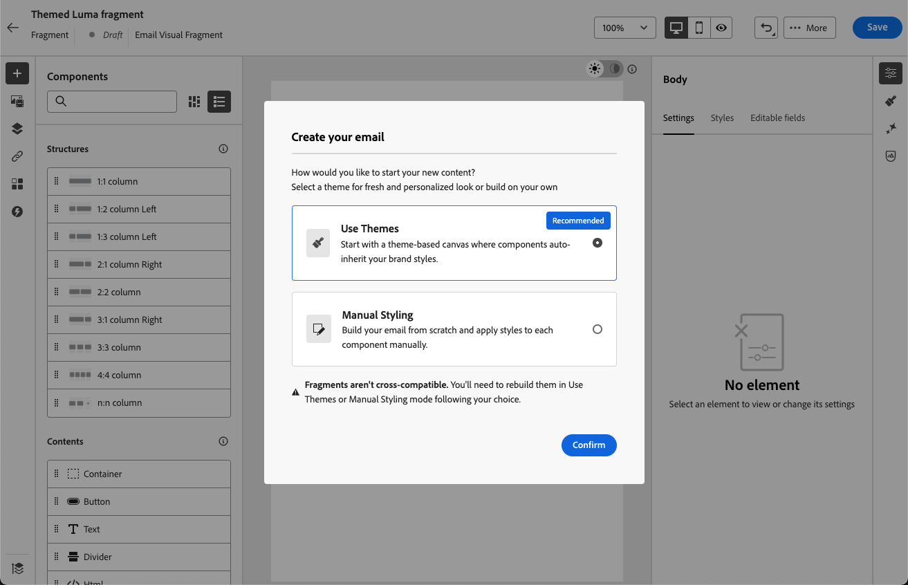{width="100%"}

   >[!CAUTION]
   >
   >如果您選擇「手動樣式化」模式，除非您重設片段設計，否則無法套用任何主題。

1. 在電子郵件Designer中，您可以開始建立片段。

1. 按一下右側邊欄上的&#x200B;**[!UICONTROL 主題]**&#x200B;按鈕。 預設主題隨即顯示。 您可以在此佈景主題的不同顏色變體之間切換。

   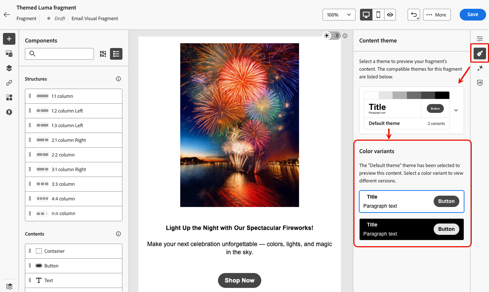{width="100%" align="center" zoomable="yes"}

1. 您可以選取其他主題來預覽片段內容。 若要這麼做，請選取預設主題旁的箭頭，然後按一下&#x200B;**[!UICONTROL 選取主題]**。

   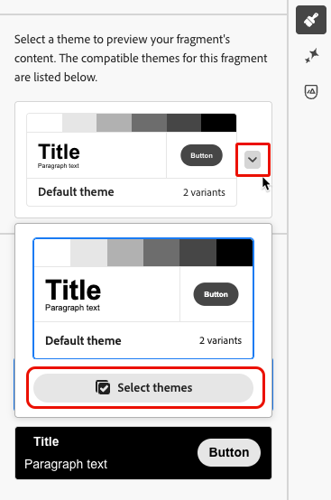{width="40%"}

1. 您可以在&#x200B;**[!UICONTROL Adobe主題]**&#x200B;和&#x200B;**[!UICONTROL 我的主題]**&#x200B;標籤之間導覽，並為您的片段選取最多5個相容的主題（從這兩個標籤）。

   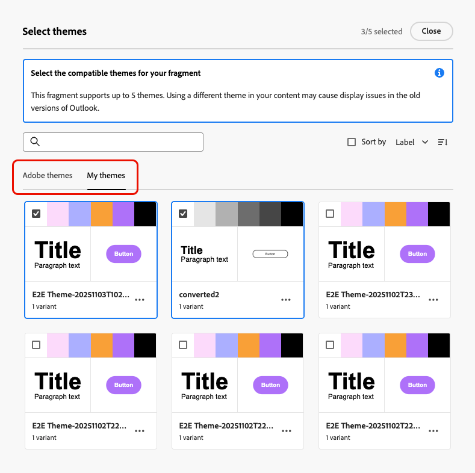{width=70%}

   >[!CAUTION]
   >
   >在電子郵件內容中使用片段時，請務必[套用您為此片段定義的主題](#apply-themes-email)。 若未這麼做，可能會導致顯示問題，尤其是在Outlook 2021和舊版中。

1. 按一下 **[!UICONTROL 關閉]**。

1. 再次選取&#x200B;**[!UICONTROL 預設佈景主題]**&#x200B;旁的箭頭。 您現在可以在您剛選取的不同主題之間切換，以預覽每個樣式演算。

   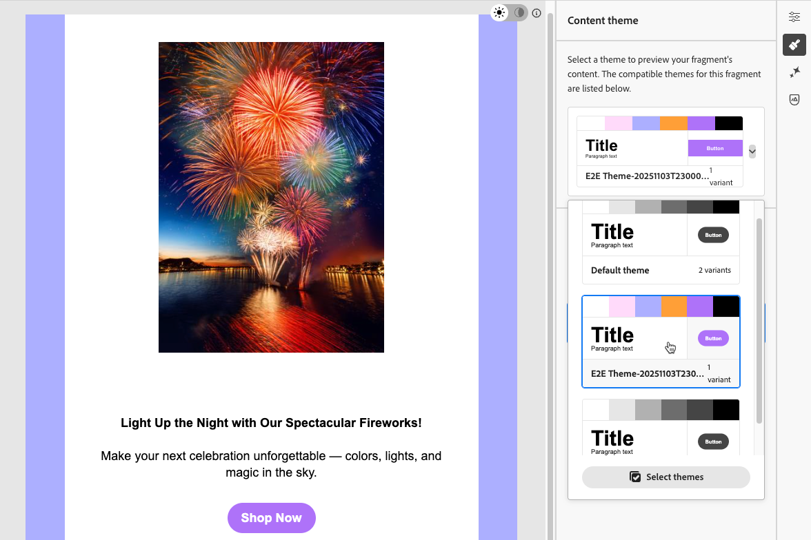{width=90%}

1. 再按一下&#x200B;**[!UICONTROL 選取主題]**&#x200B;以新增更多主題或變更您的選擇。

## 讓範本與主題相容 {#theme-convertor}

[!DNL Journey Optimizer]可讓您將使用手動樣式建立的範本轉換為與主題相容的內容。 如果您是在將主題引入[!DNL Journey Optimizer]之前建立內容範本，或您正在匯入外部內容，這會特別有用。

1. 開啟電子郵件[內容範本](../content-management/create-content-templates.md)，並使用電子郵件Designer編輯其內容。

1. 選取右側邊欄上的&#x200B;**[!UICONTROL 主題]**&#x200B;圖示，然後按一下&#x200B;**[!UICONTROL 從內容產生主題]**&#x200B;按鈕。

   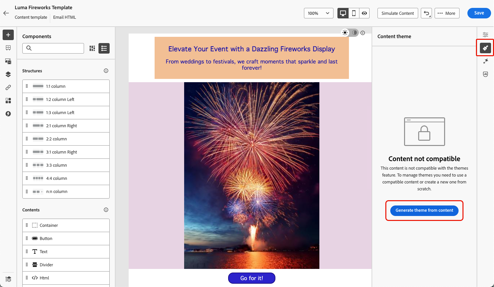{width=100%}

1. **[!UICONTROL 建立佈景主題]**&#x200B;視窗隨即開啟。 [!DNL Journey Optimizer]會自動偵測樣式元素並將它們合併成新的主題。

   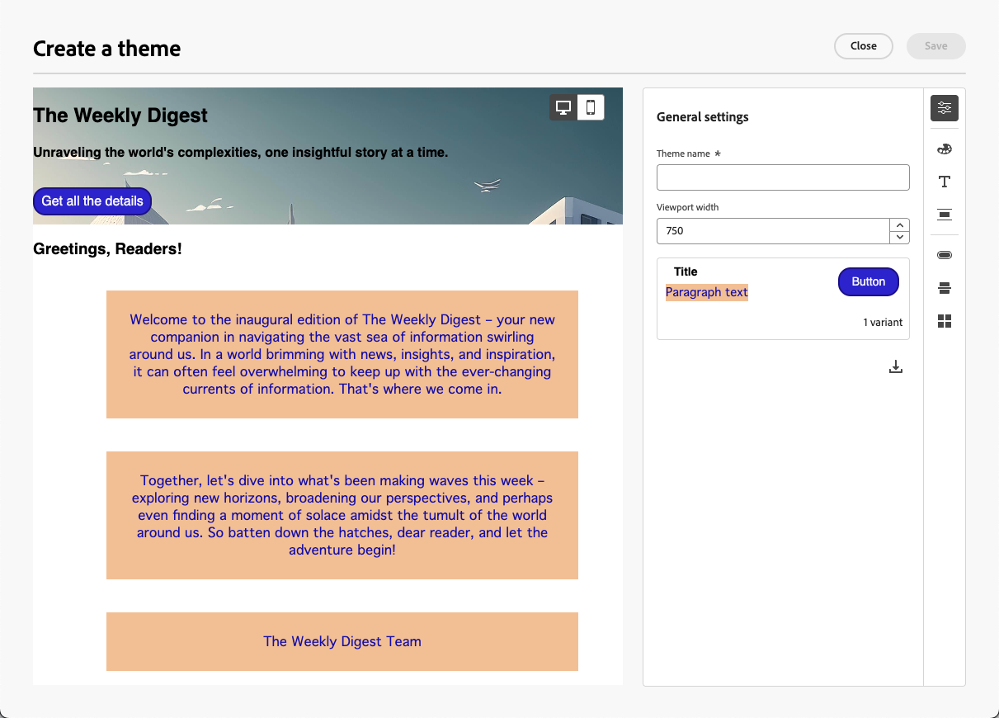{width=90%}

1. 提供主題的名稱。

1. 視需要自行調整，就像從頭開始建立主題時一樣，例如新增顏色變體、編輯字型等。 [了解作法](#create-and-edit-themes)

   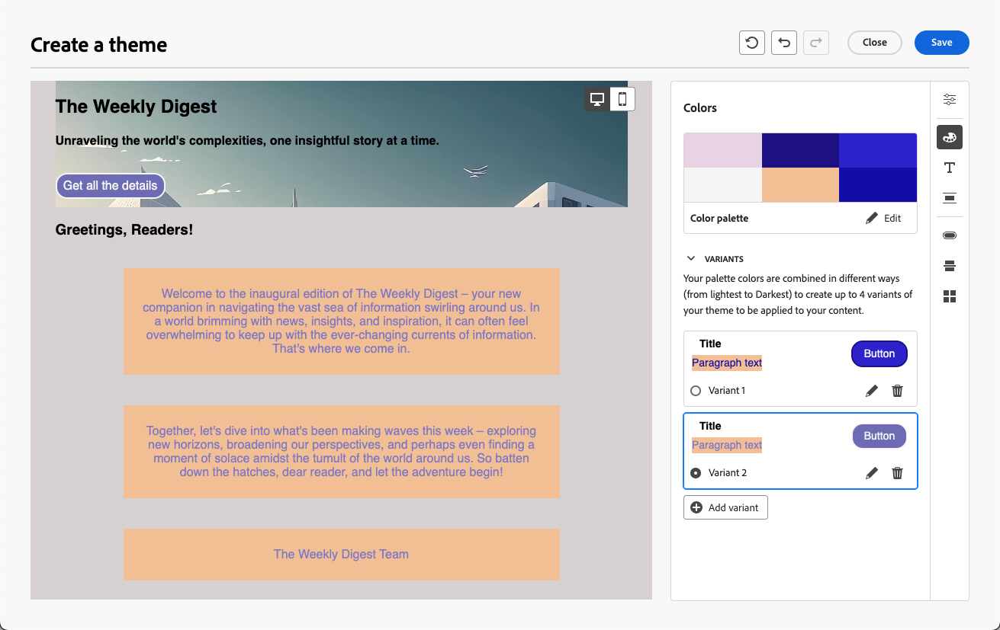{width=90%}

1. 按一下[儲存]&#x200B;**&#x200B;**&#x200B;儲存此新主題以供重複使用。 您現在可以將此主題套用至您的內容，例如任何其他主題。 [了解作法](#leverage-themes-fragment)