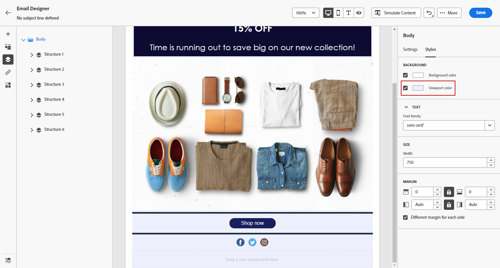

# 個人化您的電子郵件背景 {#backgrounds}

>[!CONTEXTUALHELP]
>id="ac_edition_backgroundimage"
>title="背景設定"
>abstract="您可以個人化內容的背景顏色或背景影像。 請注意，並非所有電子郵件用戶端都支援背景影像。"

有關使用電子郵件設計工具設定背景的問題，Adobe建議執行以下操作：

1. 如果設計需要，請將背景顏色套用至電子郵件的正文。
1. 通常在列級別設定背景顏色。
1. 請盡量不要在影像或文字元件上使用背景顏色，因為這些顏色難以管理。

以下是您可使用的可用背景設定。

* 設定 **[!UICONTROL Background color]** 整封電子郵件。 請務必在導覽樹狀結構中選取可從左側浮動視窗存取的內文設定。

   

* 通過選擇 **[!UICONTROL Viewport background color]**. 此選項可讓您從背景顏色中選取不同的設定。

   

* 為每個結構元件設定不同的背景顏色。 在導航樹中選擇一個結構，可從左側調色板訪問，以僅將特定背景顏色應用於該結構。

   請確定您未設定檢視區背景顏色，因為它可能會隱藏結構背景顏色。

   

* 設定 **[!UICONTROL Background image]** （對於結構元件的內容）。

   >[!NOTE]
   >
   >有些電子郵件程式不支援背景影像。 若不支援，則會改用列背景顏色。 請務必選取適當的後援背景顏色，以備影像無法顯示時使用。

   

* 在列級別設定背景顏色。

   >[!NOTE]
   >
   >這是最常見的使用案例。 Adobe建議您在欄層級設定背景顏色，因為這樣在編輯整個電子郵件內容時可有更大的彈性。

   您也可以在欄層級設定背景影像，但此功能很少使用。

   
