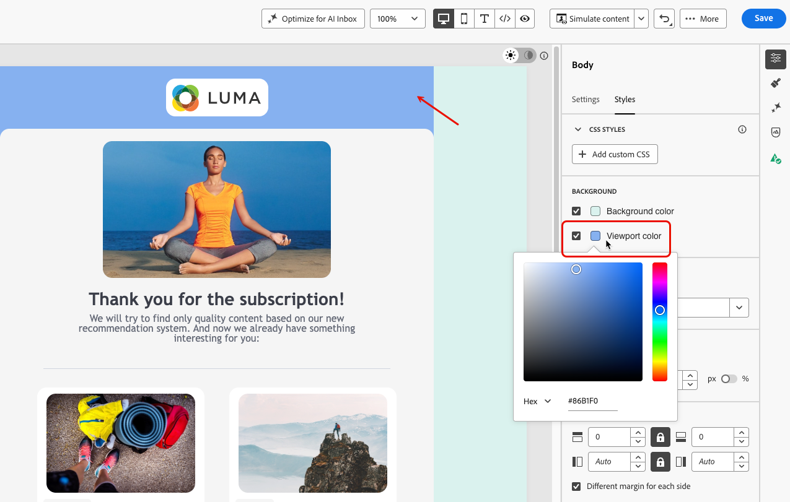

# 個人化您的電子郵件背景 {#backgrounds}

>[!BEGINSHADEBOX]

**在此頁面上：**&#x200B;瞭解如何在電子郵件設計工具中設定電子郵件正文、檢視區、結構和欄位層級的背景色彩和影像。

>[!ENDSHADEBOX]

>[!CONTEXTUALHELP]
>id="ac_edition_backgroundimage"
>title="背景設定"
>abstract="您可以將內容的背景顏色或背景影像個人化。 請注意，並非所有的電子郵件用戶端都支援背景影像。"

背景可協助您強化品牌識別，並吸引讀者注意電子郵件中的關鍵領域。 在電子郵件Designer中，您可以在內容的不同層級設定背景顏色或影像 — 從整體內文到個別結構和欄 — 讓您精確控制背景在電子郵件中的呈現方式。

在電子郵件Designer中設定背景時，請記住以下最佳實務：

* 只有在您的設計需要時，才將背景顏色套用至內文。
* 儘可能在欄層級設定背景顏色。
* 避免在影像或文字元件上使用背景顏色，因為這些顏色較難管理。
* 在傳送之前，跨實際電子郵件使用者端測試背景影像，因為轉譯可能會與電子郵件Designer預覽不同。

下列設定可讓您在電子郵件內容的任何層級套用背景顏色或影像，從內文向下套用至個別結構和欄。

>[!TIP]
>
>如果主題套用至電子郵件，則無法直接覆寫指定元件之主題設定的背景顏色。 您必須先使用&#x200B;**[!UICONTROL 樣式]**&#x200B;索引標籤中的專用圖示解除鎖定該樣式。 [了解做法](apply-email-themes.md#unlocking-styles)

## 設定背景顏色 {#background-color}

1. **內文背景色彩** — 設定整個電子郵件的&#x200B;**[!UICONTROL 背景色彩]**。 請確定您在可從左側浮動視窗存取的&#x200B;**[!UICONTROL 導覽樹狀結構]**&#x200B;中選取&#x200B;**[!UICONTROL 內文]**，並使用右側的&#x200B;**[!UICONTROL 樣式]**&#x200B;索引標籤中的專用選項。

   

1. **檢視區背景色彩** — 設定&#x200B;**[!UICONTROL 檢視區色彩]**，以在所有結構元件上套用相同的背景色彩，不受主體背景色彩影響。

   

1. **結構背景顏色** — 若要將背景顏色套用至單一結構元件，請直接在畫布中或從左側色盤中選取它，然後為該結構設定特定顏色。

   

   >[!TIP]
   >
   >在此情況下，請確定您未設定檢視區背景顏色，因為它可能會隱藏結構背景顏色。

1. **資料行背景色彩** — 設定資料行層級的背景色彩。 同樣地，請確定您從左側浮動視窗中選取想要的欄，並設定該欄的特定顏色。

   

   >[!TIP]
   >
   >這是最常見的使用案例和最佳實務，因為它可讓您在編輯其餘電子郵件內容時擁有更多彈性。

## 設定背景影像 {#background-image}

您也可以為結構或資料行元件的內容設定&#x200B;**[!UICONTROL 背景影像]**。 這最常用於結構層級；在欄層級設定一個是可能的，但很少使用。

>[!NOTE]
>
>某些電子郵件程式不支援背景影像。 如果不支援，則改用列背景顏色。 確保選取合適的後備背景顏色，以防影像無法顯示。

>[!TIP]
>
>在傳送前，預覽您在實際電子郵件使用者端中的背景影像，而不僅僅是在電子郵件Designer預覽中。 相同的影像和位置可以在編輯器中正確轉譯，但在某些使用者端中看起來會以不同方式拉伸或裁切，例如iOS上的Outlook。

設定背景影像後，請使用&#x200B;**[!UICONTROL 影像位置]**&#x200B;下拉式清單來控制影像如何填滿結構或欄。 以下選項可供選取：

{width=80%}

**縮放以填滿，置中：**

* **[!UICONTROL 符合]** — 延展影像以在兩個軸上填滿容器，而不保留其外觀比例。
* **[!UICONTROL 完整寬度]** — 依照容器的寬度比例縮放影像，並將其垂直置中。
* **[!UICONTROL 全高]** — 依照容器的高度比例縮放影像，並將其水準置中。

**縮放以填滿，錨定到邊緣：**

* **[!UICONTROL 完整寬度 — 頂端]** — 與&#x200B;**[!UICONTROL 完整寬度]**&#x200B;相同，錨定在容器頂端。 溢位會在底部裁切。
* **[!UICONTROL 全寬 — 底部]** — 與&#x200B;**[!UICONTROL 全寬]**&#x200B;相同，錨定在容器底部。 頂端會裁切溢位。
* **[!UICONTROL 全高 — 左側]** — 與&#x200B;**[!UICONTROL 全高]**&#x200B;相同，錨定在容器的左側。 溢位會在右側裁切。
* **[!UICONTROL 全高 — 右]** — 與&#x200B;**[!UICONTROL 全高]**&#x200B;相同，錨定在容器的右側。 左邊會裁切溢位。

**圖磚：**

* **[!UICONTROL 重複]** — 將影像以原始大小並排填滿容器。

**位置（不縮放）：**

* **[!UICONTROL 左]**、**[!UICONTROL 右]**、**[!UICONTROL 中]**、**[!UICONTROL 上]**、**[!UICONTROL 下]** — 將影像定位為其原始大小，錨定至容器的對應邊緣或中心。

>[!NOTE]
>
>與上方置中的選項相比，邊緣錨定選項可讓您在不符合結構比例時，更能控制影像的哪一部分會保留在檢視中。

{{$include /help/_includes/do-not-localize/email/ai-augmented-backgrounds.md}}
