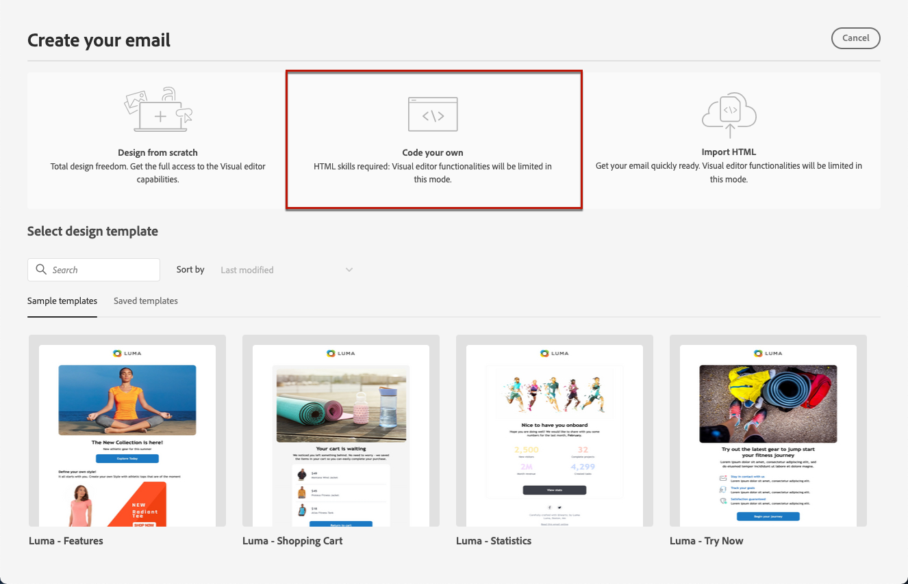
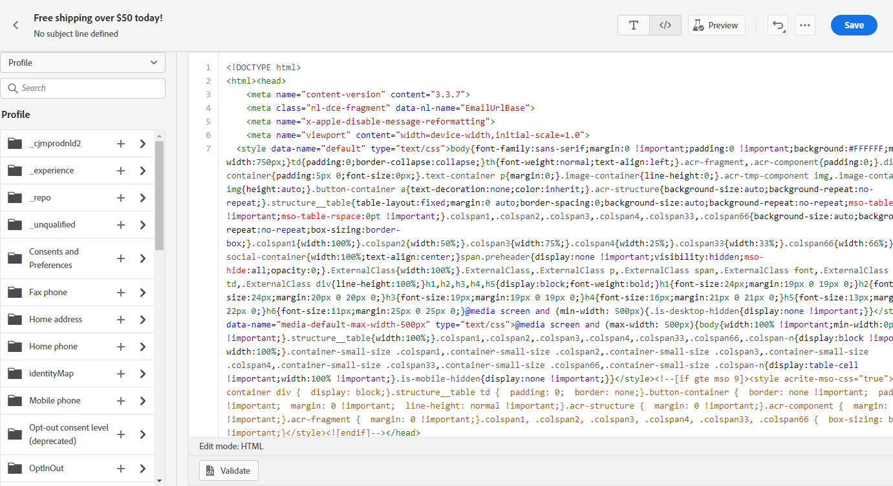

# 為您自己的內容撰寫程式碼 {#code-content}

**[!UICONTROL 自行編碼]**&#x200B;可讓您撰寫或貼上原始HTML，以直接在[!DNL Journey Optimizer]電子郵件Designer中建置電子郵件內容。 當您需要完全控制標籤或匯入現有HTML時，請使用此模式。

您必須具備HTML技能，而且一旦選擇此模式，您就會停留在程式碼編輯器中 — 無法切換到視覺化編輯器。

➡️ [在影片中探索此功能](#video)

>[!NOTE]
>
>**[!UICONTROL 您自己的程式碼]**&#x200B;與內容範本中的進階HTML編輯器不同。 進階HTML編輯器可讓您隨時在HTML檢視和視覺（案頭）檢視之間切換，而不是程式碼編輯器。 [進一步瞭解進階HTML編輯器](../content-management/email-template-expert-mode.md)。

## 使用程式碼編輯器 {#use-code-editor}

若要使用程式碼編輯器建立或編輯電子郵件內容，請執行下列步驟。

1. 從[電子郵件Designer](get-started-email-design.md)首頁，選取&#x200B;**[!UICONTROL 自行編碼]**。

   

1. 輸入或貼上原始 HTML 程式碼。

1. 使用左窗格以運用[!DNL Journey Optimizer]個人化功能。 [了解更多](../personalization/personalize.md)

   

   >[!NOTE]
   >
   >與歷程運算式相比，電子郵件Designer中的個人化編輯器有一些功能限制。 [進一步瞭解日期/時間函式限制](#date-time-limitations)

1. 如果您想要清除您的電子郵件內容並重新設計電子郵件，請從選項選單選取「**[!UICONTROL 變更你的設計]**」。

   

   >[!NOTE]
   >
   >此動作會在電子郵件設計工具中開啟選取的範本。從那裡，您可以完成電子郵件的設計，或者使用「**[!UICONTROL 切換到程式碼編輯器]**」選項回到程式碼編輯器。

1. 按一下&#x200B;**[!UICONTROL 預覽]**&#x200B;按鈕，以使用測試設定檔檢查訊息設計和個人化。 [了解更多](../content-management/preview-test.md)

   

1. 程式碼準備就緒後，按一下「**[!UICONTROL 儲存]**」，然後回到訊息建立畫面以完成您的訊息。

   

>[!CAUTION]
>
>使用您自己的程式碼方法時，無法參考[Adobe Experience Manager Assets](../integrations/assets.md)中的影像。 將HTML程式碼中參照的影像儲存至公共位置。

## 日期和時間函式限制 {#date-time-limitations}

在電子郵件Designer程式碼編輯器中使用個人化時，`now()`函式無法用於動態日期計算。

>[!IMPORTANT]
>
>在電子郵件產生器的運算式語言中，`now()`函式&#x200B;**不受支援**。 雖然`now()`可在歷程條件中使用，但無法用於電子郵件內容或程式碼編輯器。

**可用的替代方案：**

使用下列功能處理電子郵件個人化中的目前日期和時間：

* **`getCurrentZonedDateTime()`** — 傳回目前日期和時間，並附上時區資訊。 這是`now()`的建議替代方案。

  範例： ``傳回`2024-12-06T17:22:02.281067+05:30[Asia/Kolkata]`

* **`currentTimeInMillis()`** — 傳回目前時間（以Epoch毫秒為單位）。

  範例：``

**建議的因應措施：**

如果您需要在電子郵件內容中執行日期計算：

* **預先計算日期欄位** — 在傳送電子郵件之前，先計算資料管道或設定檔屬性中的必要日期值，然後在您的個人化中參考這些預先計算的值。

  範例：``

* **使用日期操作函式** — 使用[日期/時間函式](../personalization/functions/dates.md) （例如`dayOfYear()`或`diffInDays()`）搭配設定檔屬性的日期值。

  範例：``

* **使用計算屬性** — 建立執行複雜日期計算的[計算屬性](../audience/computed-attributes.md)，使結果可做為設定檔屬性。

如需支援函式的完整清單，請參閱[日期與時間函式](../personalization/functions/dates.md)。
