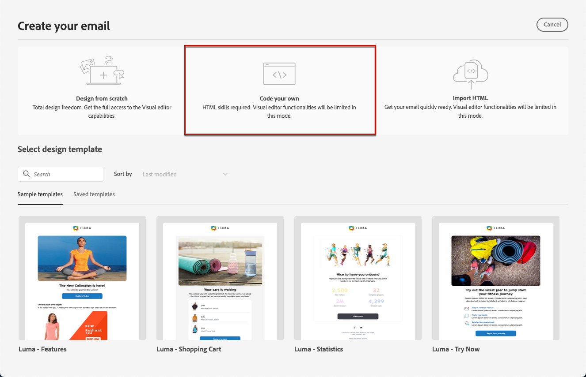

# 為您自己的內容撰寫程式碼 {#code-content}

使用&#x200B;**[!UICONTROL 自己撰寫程式碼]**&#x200B;模式匯入原始 HTML 和/或撰寫您電子郵件內容的程式碼。此方法需要 HTML 技能。

➡️ [在影片中探索此功能](#video)

>[!CAUTION]
>
> 使用此方法時，無法參考[Adobe Experience Manager Assets](../integrations/assets.md)中的影像。 您的HTML程式碼中參照的影像必須儲存到公共位置。

1. 從電子郵件Designer首頁，選取&#x200B;**[!UICONTROL 自行編碼]**。

   

1. 輸入或貼上原始 HTML 程式碼。

1. 使用左窗格以運用[!DNL Journey Optimizer]個人化功能。 [了解更多](../personalization/personalize.md)

   

1. 如果您想要清除您的電子郵件內容並重新設計電子郵件，請從選項選單選取「**[!UICONTROL 變更你的設計]**」。

   

   >[!NOTE]
   >
   >此動作會在電子郵件設計工具中開啟選取的範本。從那裡，您可以完成電子郵件的設計，或者使用「**[!UICONTROL 切換到程式碼編輯器]**」選項回到程式碼編輯器。

1. 按一下&#x200B;**[!UICONTROL 預覽]**&#x200B;按鈕，以使用測試設定檔檢查訊息設計和個人化。 [了解更多](../content-management/preview-test.md)

   

1. 程式碼準備就緒後，按一下「**[!UICONTROL 儲存]**」，然後回到訊息建立畫面以完成您的訊息。

   
