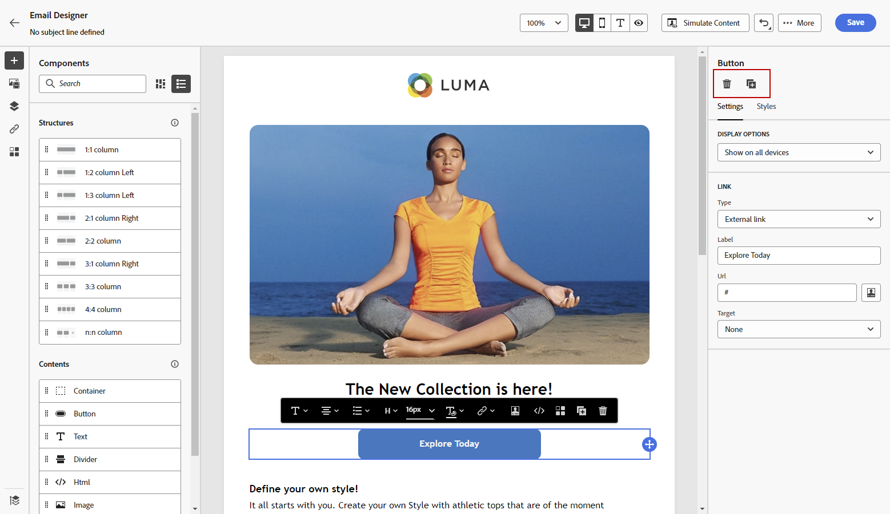
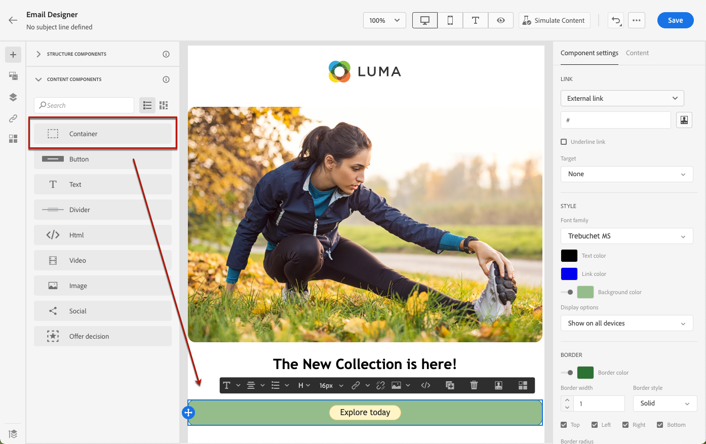
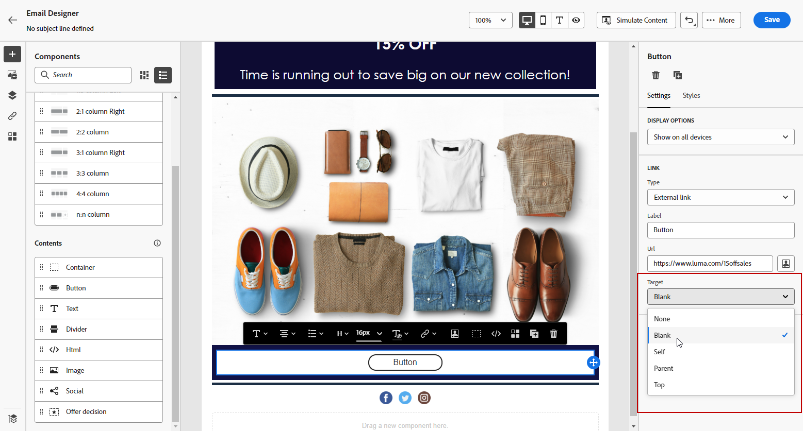
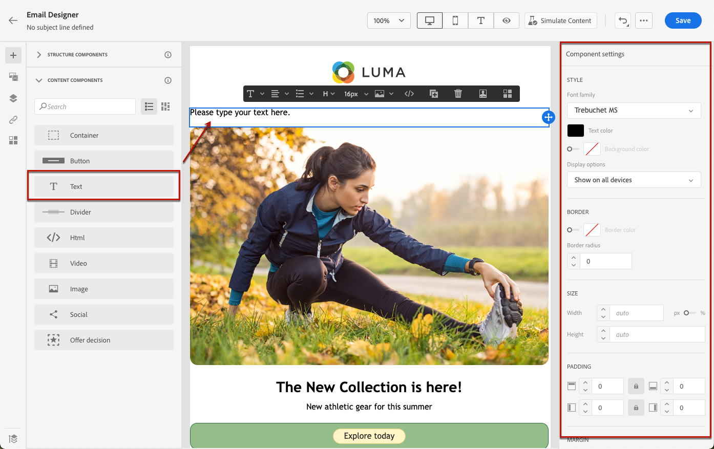
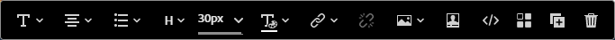
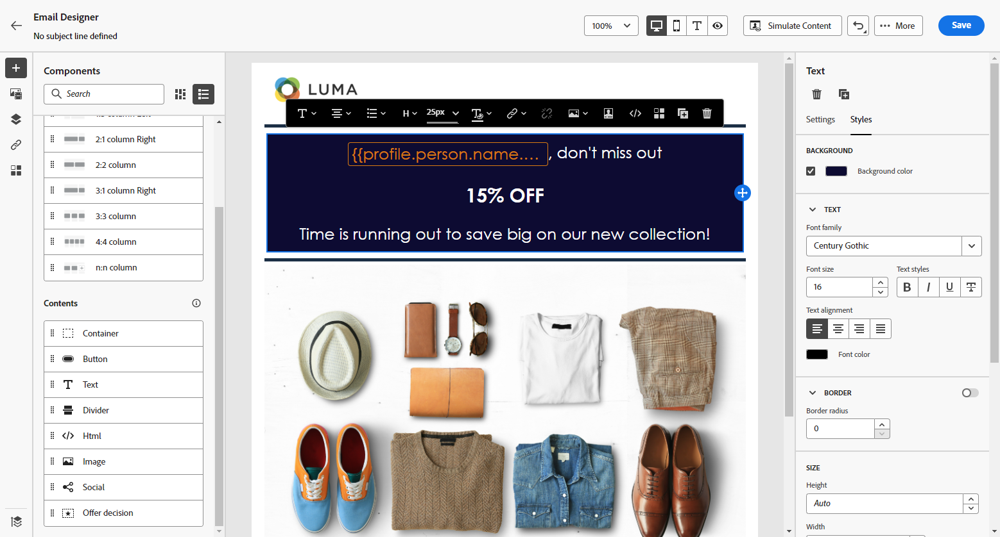
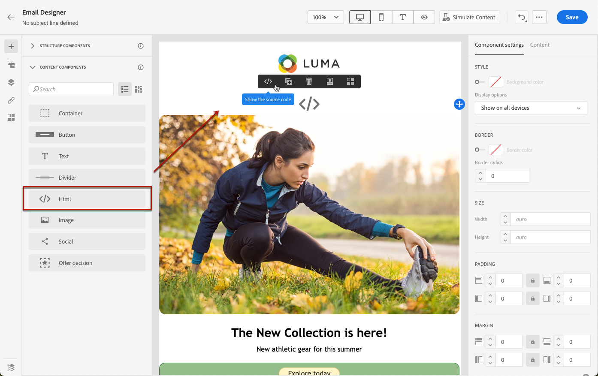

# 使用電子郵件設計工具內容元件 {#content-components}

>[!CONTEXTUALHELP]
>id="ac_content_components_email"
>title="關於內容元件"
>abstract="內容元件指可用於建立電子郵件版面的空白內容預留位置。"

>[!CONTEXTUALHELP]
>id="ac_content_components_landing_page"
>title="關於內容元件"
>abstract="內容元件是可以用來建立登陸頁面版面的空白內容預留位置。"

>[!CONTEXTUALHELP]
>id="ac_content_components_fragment"
>title="關於內容元件"
>abstract="內容元件指可用於建立片段版面的空白內容預留位置。"

>[!CONTEXTUALHELP]
>id="ac_content_components_template"
>title="關於內容元件"
>abstract="內容元件指可用於建立範本版面的空白內容預留位置。"

建立電子郵件內容時，**[!UICONTROL 內容元件]**&#x200B;可讓您使用原始元件進一步個人化電子郵件，一旦放入電子郵件中即可編輯原始元件。

您可以視需要在一個或多個結構元件中新增任意數量的內容元件，這些元件定義電子郵件的版面。

>[!NOTE]
>
>[歐洲協助工具法](https://eur-lex.europa.eu/legal-content/EN/TXT/?uri=CELEX%3A32019L0882){target="_blank"}規定所有數位通訊都應該可供存取。 使用內容元件在[中設計電子郵件時（例如使用無障礙字型、可讀取的格式及提供影像的替代文字），請務必遵循](accessible-content.md)此頁面[!DNL Journey Optimizer]所列的特定准則。

## 新增內容元件 {#add-content-components}

若要將內容元件新增到電子郵件並根據您的需要進行調整，請依照以下步驟操作。

1. 在電子郵件設計工具中，使用現有內容或將&#x200B;**[!UICONTROL 結構元件]**&#x200B;拖放到您的空白內容以定義電子郵件的版面。[了解作法](content-from-scratch.md)

1. 若要存取「**[!UICONTROL 內容元件]**」區段，從電子郵件設計工具左窗格選取對應的按鈕。

   

1. 將您選擇的內容元件拖放到相關結構元件內部。

   

   >[!NOTE]
   >
   >您可以將多個元件新增到單一結構元件和結構元件的每個欄中。

1. 使用右側的&#x200B;**[!UICONTROL 設定]**&#x200B;和&#x200B;**[!UICONTROL 樣式]**&#x200B;索引標籤，調整每個元件的屬性和樣式。 例如，您可以變更每個元件的文字樣式、邊框間距或邊界。[了解對齊方式和邊框間距的詳細資訊](alignment-and-padding.md)

   

1. 從&#x200B;**[!UICONTROL 內容元件]**&#x200B;的進階功能表，您可以視需要輕鬆刪除或複製任何內容元件。

   

## 容器 {#container}

若要將特定樣式套用至一組內容元件，您可以新增&#x200B;**[!UICONTROL Container]**&#x200B;元件，然後在其中新增您想要的內容元件。 這可讓您將不同的樣式套用至容器，這會與套用至內部內容元件的樣式不同。

例如，新增&#x200B;**[!UICONTROL 容器]**&#x200B;元件，然後在該容器內部新增[按鈕](#button)元件。您可以為容器使用特定背景，為按鈕使用另一個背景。

## 按鈕 {#button}

使用&#x200B;**[!UICONTROL 按鈕]**&#x200B;元件將一個或多個按鈕插入您的電子郵件，並將您的電子郵件客群重新導向到另一個頁面。

1. 從&#x200B;**[!UICONTROL 內容元件]**，將&#x200B;**[!UICONTROL 按鈕]**&#x200B;元件拖放到&#x200B;**[!UICONTROL 結構元件]**&#x200B;中。

1. 按一下您新新增的按鈕以個人化文字，並存取[電子郵件Designer]右窗格中的&#x200B;**[!UICONTROL 設定]**&#x200B;和&#x200B;**[!UICONTROL 樣式]**&#x200B;標籤。

   

1. 從&#x200B;**[!UICONTROL 連結]**&#x200B;功能表，新增您要在按一下按鈕時重新導向的URL。

1. 透過&#x200B;**[!UICONTROL Target]**&#x200B;下拉式清單，選擇將您的對象重新導向的方式：

   * **[!UICONTROL 無]**：當框架被點按時在相同框架中開啟連結 (預設)。
   * **[!UICONTROL 空白]**：在新的視窗或索引標籤中開啟連結。
   * **[!UICONTROL 自我]**：當框架被點按時在相同框架中開啟連結。
   * **[!UICONTROL 父系]**：在父框架中開啟連結。
   * **[!UICONTROL 頂端]**：在視窗的完整內文中開啟連結。

   

1. 您可以變更樣式屬性 (例如&#x200B;**[!UICONTROL 邊框]**、**[!UICONTROL 大小]**、**[!UICONTROL 邊界]**&#x200B;等) 來進一步個人化您的按鈕。從「**[!UICONTROL 元件設定]**」窗格。

## 文字 {#text}

使用&#x200B;**[!UICONTROL Text]**&#x200B;元件將文字插入您的電子郵件，並使用&#x200B;**[!UICONTROL 樣式]**&#x200B;索引標籤調整樣式（邊框、大小、邊框間距等）。

1. 從&#x200B;**[!UICONTROL Content元件]**，將&#x200B;**[!UICONTROL Text]**&#x200B;元件拖放到&#x200B;**[!UICONTROL Structure元件]**&#x200B;中。

1. 按一下您新新增的元件，以個人化文字，並存取電子郵件Designer右窗格中的&#x200B;**[!UICONTROL 設定]**&#x200B;和&#x200B;**[!UICONTROL 樣式]**&#x200B;標籤。

1. 使用以下工具列的選項變更文字：

   

   * **[!UICONTROL 變更文字樣式]**：將粗體、斜體、底線或刪除線套用到文字。
   * **變更對齊方式**：選擇文字靠左對齊、靠右對齊、置中或左右對齊。
   * **[!UICONTROL 建立清單]**：新增項目符號清單或編號清單新增到文字。
   * **[!UICONTROL 設定標題]**：為文字新增標題，最多六層。
   * **字型大小**：選取文字的字型大小 (以像素為單位)。
   * **[!UICONTROL 變更字型顏色]**：選擇字型的顏色。
   * **[!UICONTROL 插入連結]**：新增任何型別的連結至您的內容。
   * **[!UICONTROL 編輯影像]**：將影像或資產新增至文字元件。 [進一步瞭解資產管理](../integrations/assets.md)
   * **[!UICONTROL 變更字型顏色]**：選擇字型的顏色。
   * **[!UICONTROL 新增個人化]**：新增個人化欄位，以自訂設定檔資料的內容。 [進一步了解內容個人化](../personalization/personalize.md)
   * **[!UICONTROL 顯示原始碼]**：顯示文字的原始碼。原始碼無法變更。
   * **[!UICONTROL 啟用條件式內容]**：新增條件式內容，以將元件的內容調整至目標設定檔。 [進一步瞭解動態內容](../personalization/get-started-dynamic-content.md)
   * **[!UICONTROL 複製]**：新增文字元件的副本。
   * **[!UICONTROL 刪除]**：從電子郵件刪除選取的文字元件。

1. 調整其他樣式屬性，例如文字顏色、字型系列、邊框、邊框間距、邊界等。從&#x200B;**[!UICONTROL 樣式]**&#x200B;索引標籤。

   

## 分隔線 {#divider}

使用&#x200B;**[!UICONTROL 分隔線]**&#x200B;元件以插入分隔線來組織電子郵件的版面和內容。

您可以從「**[!UICONTROL 設定]**」和「**[!UICONTROL 樣式]**」索引標籤調整樣式屬性，例如線條顏色、樣式和高度。

## HTML {#HTML}

使用 **[!UICONTROL HTML]**&#x200B;元件將現有 HTML 的不同部分進行複製貼上。這可讓您建立免費的模組化 HTML 元件以重複使用一些外部內容。

1. 從&#x200B;**[!UICONTROL 內容元件]**，將 **[!UICONTROL HTML]** 元件拖放到&#x200B;**[!UICONTROL 結構元件]**。

1. 按一下您新增的元件，然後選取「**[!UICONTROL 顯示原始碼]**」從內容關聯式工具列新增至 HTML。

   

1. 複製並貼上您要新增至電子郵件的HTML程式碼，然後按一下[儲存]。**&#x200B;**

   

>[!NOTE]
>
>為了簡單地使外部內容與電子郵件設計工具相容，Adobe 建議從頭開始建立訊息，然後將現有電子郵件的內容複製到元件中。

## 影像 {#image}

使用&#x200B;**[!UICONTROL Image]**&#x200B;元件，將影像檔案從電腦插入電子郵件內容。

1. 從&#x200B;**[!UICONTROL Content元件]**，將&#x200B;**[!UICONTROL Image]**&#x200B;元件拖放到&#x200B;**[!UICONTROL 結構元件]**&#x200B;中。

   

1. 在&#x200B;**[!UICONTROL 設定]**&#x200B;標籤中，按一下&#x200B;**[!UICONTROL 瀏覽]**&#x200B;以從您的資產選擇影像檔案，或按一下&#x200B;**[!UICONTROL 匯入媒體]**&#x200B;以將資產上傳到Adobe Experience Manager Assets。

   若要深入瞭解[!DNL Adobe Experience Manager Assets]，請參閱[Adobe Experience Manager Assets檔案](https://experienceleague.adobe.com/docs/experience-manager-assets-essentials/help/introduction.html){target="_blank"}。

   >[!NOTE]
   >
   > 為確保您的連結維持作用中狀態並避免任何到期問題，我們建議您使用Adobe Assets，而不是仰賴影像的來源URL。

1. 您也可以使用&#x200B;**[!UICONTROL 尋找Adobe Stock像片]**&#x200B;選項，直接在Adobe Stock中搜尋。

1. 按一下您新增的元件，然後設定影像屬性：

   * **[!UICONTROL 影像標題]**&#x200B;可讓您定義影像的標題。
   * **[!UICONTROL 替代文字]**&#x200B;可讓您定義連結到影像的註解。這會對應至alt HTML屬性。 [了解更多](../email/accessible-content.md#alt-text)

   

1. 您也可以選擇&#x200B;**[!UICONTROL 尋找類似的像片]**。 [了解更多](../integrations/stock.md)

1. 從&#x200B;**[!UICONTROL 樣式]**&#x200B;索引標籤，調整其他樣式屬性，例如邊界、邊框等。 或新增連結以將客群重新導向到「**[!UICONTROL 元件設定]**」窗格中的另一個內容。

## 社交 {#social}

使用&#x200B;**[!UICONTROL 社交]**&#x200B;元件將社交媒體頁面連結插入到電子郵件內容中。

1. 從&#x200B;**[!UICONTROL 內容元件]**，將&#x200B;**[!UICONTROL 社交]**&#x200B;元件拖放到&#x200B;**[!UICONTROL 結構元件]**&#x200B;中。

1. 選取您新新增的元件。

1. 在「**[!UICONTROL 設定]**」索引標籤的「**[!UICONTROL 社交]**」欄位中，選擇要新增或移除的社交媒體。

   

1. 透過專用欄位選擇圖示的大小。

1. 按一下您的每個社群媒體圖示來設定您的對象將重新導向到的&#x200B;**[!UICONTROL URL]**。

   

1. 如有需要，您也可以從Assets變更每個社群媒體的圖示。

1. 調整其他樣式屬性，例如樣式、邊界、邊框等。從&#x200B;**[!UICONTROL 樣式]**&#x200B;索引標籤。

## 優惠決定 {#offer-decision}

使用&#x200B;**[!UICONTROL 優惠決定]**&#x200B;元件將優惠插入您的訊息。 [決定管理](../offers/get-started/starting-offer-decisioning.md)引擎會挑選要遞送給客戶的最佳優惠方案。

1. 從&#x200B;**[!UICONTROL 內容元件]**，將&#x200B;**[!UICONTROL 優惠決定]**&#x200B;元件拖放到&#x200B;**[!UICONTROL 結構元件]**&#x200B;中。

1. 按一下&#x200B;**[!UICONTROL 新增]**&#x200B;以選取您的&#x200B;**[!UICONTROL 優惠決定]**。

   

1. 從下拉式清單中，選取您的&#x200B;**[!UICONTROL 位置]**。  接著，選取您要新增至內容的&#x200B;**[!UICONTROL 優惠決定]**，然後按一下&#x200B;**[!UICONTROL 新增]**。

   

1. 從&#x200B;**[!UICONTROL 優惠決定]**&#x200B;索引標籤，您可以預覽或變更插入的優惠。

瞭解如何在[本節](add-offers-email.md)中將個人化優惠新增至電子郵件。

>[!IMPORTANT]
>
>如果對歷程訊息中使用的優惠決定進行變更，您需要取消發佈歷程並重新發佈。  這將確保將變更納入歷程的訊息中，並且該訊息與最新更新一致。
