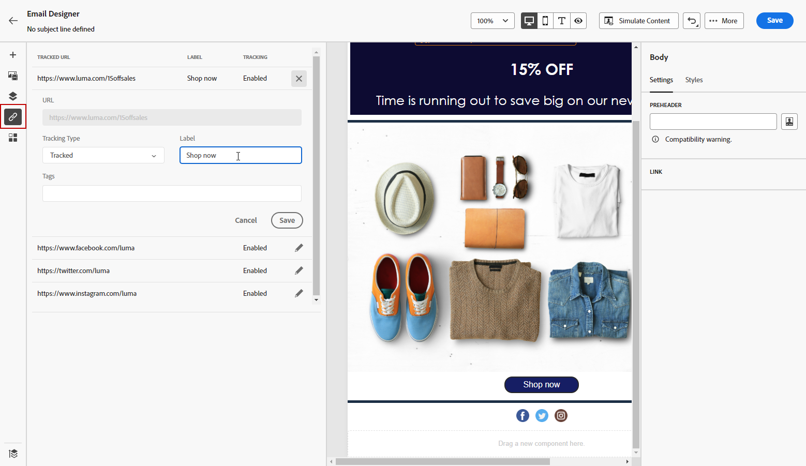

# 使用電子郵件設計工具從頭開始設計內容 {#content-from-scratch}

>[!BEGINSHADEBOX]

**在此頁面上：**&#x200B;瞭解如何在Adobe Journey Optimizer Email Designer中從頭開始設計電子郵件內容，方法是新增結構和內容元件，然後個人化和預覽您的電子郵件。

>[!ENDSHADEBOX]

>[!CONTEXTUALHELP]
>id="ac_structure_components_email"
>title="新增結構元件"
>abstract="結構元件會定義電子郵件的版面。 將&#x200B;**結構**&#x200B;元件拖放到畫布中開始設計您的電子郵件內容。"

>[!CONTEXTUALHELP]
>id="ac_structure_components_landing_page"
>title="新增結構元件"
>abstract="結構元件會定義登陸頁面的版面。 將&#x200B;**結構**&#x200B;元件拖放到畫布中開始設計您的登入頁面內容。"

>[!CONTEXTUALHELP]
>id="ac_structure_components_fragment"
>title="新增結構元件"
>abstract="結構元件會定義區段的版面。 將&#x200B;**結構**&#x200B;元件拖放到畫布中開始設計您的片段內容。"

>[!CONTEXTUALHELP]
>id="ac_structure_components_template"
>title="新增結構元件"
>abstract="結構元件會定義範本的版面。 將&#x200B;**結構**&#x200B;元件拖放到畫布中開始設計您的範本內容。"

>[!CONTEXTUALHELP]
>id="ac_edition_columns_email"
>title="定義電子郵件欄"
>abstract="電子郵件設計工具可讓您透過選取欄結構輕鬆定義電子郵件的版面。"

>[!CONTEXTUALHELP]
>id="ac_edition_columns_landing_page"
>title="定義登陸頁面欄"
>abstract="Designer 可讓您透過選取欄結構輕鬆定義登陸頁面的版面。"

>[!CONTEXTUALHELP]
>id="ac_edition_columns_fragment"
>title="定義片段欄"
>abstract="Designer 可讓您透過選取欄結構輕鬆定義片段的版面。"

>[!CONTEXTUALHELP]
>id="ac_edition_columns_template"
>title="定義範本欄"
>abstract="Designer 可讓您透過選取欄結構輕鬆定義範本的版面。"

使用[!DNL Adobe Journey Optimizer]電子郵件Designer以輕鬆定義內容結構。 透過使用簡單的拖放動作新增和移動結構元素，您可以在數秒內設計內容的形狀。

>[!NOTE]
>
>[歐洲無障礙法案](https://eur-lex.europa.eu/legal-content/EN/TXT/?uri=CELEX%3A32019L0882){target="_blank"}規定所有數位通訊都應該能透過無障礙方式取得。 在[!DNL Journey Optimizer]中設計內容時，請務必遵循[此頁面](accessible-content.md)上列出的特定准則。

若要開始建立您的內容，請遵循下列步驟：

1. 從Designer首頁，選取&#x200B;**[!UICONTROL 從頭開始設計]**&#x200B;選項。

   

1. 若要快速入門，請使用&#x200B;**[!UICONTROL 模組]** （即用即用的預先設計內容區塊，例如頁首、主圖區段和頁尾）來加速電子郵件建立，並保持您的行銷活動在視覺上保持一致。 [進一步瞭解模組](email-modules.md)

   

1. 否則，請將&#x200B;**[!UICONTROL Structures]**&#x200B;拖放到畫布中，以定義電子郵件的版面配置，來設計您的內容。

   >[!TIP]
   >
   >或者，使用「產生內容」來加速您的電子郵件建立，以產生完整的電子郵件內容，包括文字和影像，使用[使用AI產生完整內容](../content-management/generative-full-content.md)。 接著，您可以直接預覽及驗證內容。

1. 視需要新增多個&#x200B;**[!UICONTROL 結構]**，並在右側的專用窗格中編輯其設定。

   

   >[!NOTE]
   >
   >在窄熒幕（例如行動熒幕）中，欄預設會垂直棧疊以供閱讀。 有些電子郵件使用者端不支援此行為，在這種情況下，欄會並排保留。 您也可以使用&#x200B;**[!UICONTROL 設定]**&#x200B;索引標籤中的&#x200B;**[!UICONTROL 不要棧疊行動裝置上的欄]**&#x200B;切換來關閉此專案。

1. 大部分的結構（**[!UICONTROL 1:1欄]**、**[!UICONTROL 2:2欄]**、**[!UICONTROL 1:2欄左]**&#x200B;等）都是固定的預設集。 請改為選取&#x200B;**[!UICONTROL n:n欄]**&#x200B;元件，以定義您選擇的任何欄數（介於3到10之間）。

   

   您可以隨時從&#x200B;**[!UICONTROL 設定]**&#x200B;索引標籤增加現有結構的&#x200B;**[!UICONTROL 欄數]**，即使新增內容後亦然 — 您的現有內容會保留，而不會遺失。

   您也可以直接在畫布上調整每欄的寬度，或是在&#x200B;**[!UICONTROL 設定]**&#x200B;索引標籤中編輯百分比。

   >[!NOTE]
   >
   >每個欄的大小不能小於結構元件總寬度的 10%。 如果欄不是空的，則無法移除。

1. 從&#x200B;**[!UICONTROL Contents]**&#x200B;區段，新增您所需數量的元素至一或多個結構元件。 [進一步了解內容元件](content-components.md)

1. 每個元件都可以使用右方功能表中的&#x200B;**[!UICONTROL 設定]**&#x200B;或&#x200B;**[!UICONTROL 樣式]**&#x200B;標籤進一步自訂。 例如，您可以變更每個元件的文字樣式、邊框間距或邊界。 [了解對齊方式和邊框間距的詳細資訊](alignment-and-padding.md)

   

1. 您可以從&#x200B;**[!UICONTROL 資產選擇器]**&#x200B;直接選取儲存在&#x200B;**[!UICONTROL Assets資料庫]**&#x200B;中的資產。 [進一步瞭解資產管理](../integrations/assets.md)

   連按兩下包含資產的資料夾。 將其拖放至結構元件中。

   

1. 插入個人化欄位，從設定檔屬性、對象成員資格、內容屬性等自訂內容。 [進一步了解內容個人化](../personalization/personalize.md)

   

1. 按一下&#x200B;**[!UICONTROL 啟用條件內容]**&#x200B;以新增動態內容，並根據條件規則將內容調整至目標設定檔。 [開始使用動態內容](../personalization/get-started-dynamic-content.md)

   

1. 從左窗格按一下&#x200B;**[!UICONTROL 連結]**&#x200B;索引標籤，以顯示您要追蹤之內容的所有URL。 您可以修改其&#x200B;**[!UICONTROL 追蹤型別]**&#x200B;或&#x200B;**[!UICONTROL 標籤]**，並視需要新增&#x200B;**[!UICONTROL 標籤]**。 [進一步瞭解連結和追蹤](message-tracking.md)

   

1. 如果需要，您可以按一下「進階」選單中的「**[!UICONTROL 切換到程式碼編輯器]**」進一步個人化您的電子郵件。 這可讓您編輯電子郵件原始碼，例如新增追蹤或自訂 HTML 標記。 [進一步了解程式碼編輯器](code-content.md)

   >[!CAUTION]
   >
   >切換到程式碼編輯器後，您無法恢復到此電子郵件的視覺化設計工具。

1. 內容準備就緒後，請使用任一模擬方法來檢查轉譯。 您可以選擇桌面或行動檢視。 詳細資訊可在[內容管理](../content-management/preview-test.md)區段中取得。

   

1. 您也可以驗證內容品質，以評估可讀性、有效性和內容一致性。 [了解更多關於內容品質驗證的資訊](../content-management/brands-score.md#validate-quality)

1. 當您的內容準備就緒時，請按一下[儲存]。****

{{$include /help/_includes/do-not-localize/email/ai-augmented-content-from-scratch.md}}
