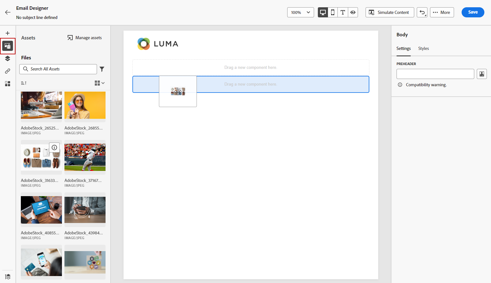
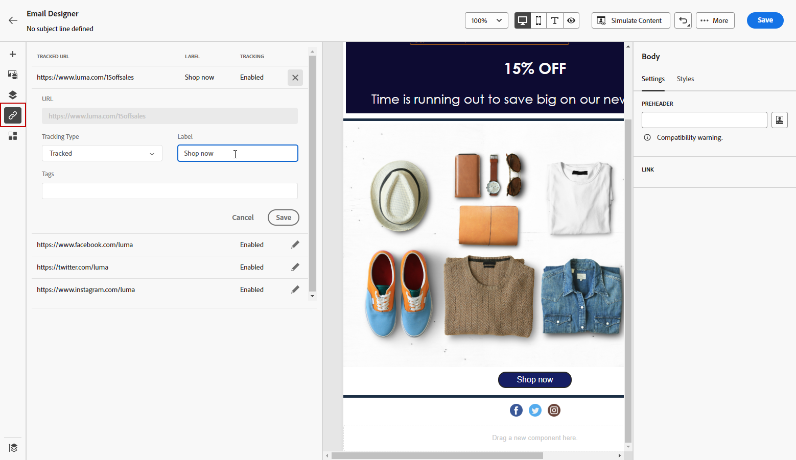

# 從頭開始設計內容 {#content-from-scratch}

>[!CONTEXTUALHELP]
>id="ac_structure_components_email"
>title="新增結構元件"
>abstract="結構元件會定義電子郵件的版面。將&#x200B;**結構**&#x200B;元件拖放到畫布中開始設計您的電子郵件內容。"

>[!CONTEXTUALHELP]
>id="ac_structure_components_landing_page"
>title="新增結構元件"
>abstract="結構元件會定義登陸頁面的版面。將&#x200B;**結構**&#x200B;元件拖放到畫布中開始設計您的登入頁面內容。"

>[!CONTEXTUALHELP]
>id="ac_structure_components_fragment"
>title="新增結構元件"
>abstract="結構元件會定義區段的版面。將&#x200B;**結構**&#x200B;元件拖放到畫布中開始設計您的片段內容。"

>[!CONTEXTUALHELP]
>id="ac_structure_components_template"
>title="新增結構元件"
>abstract="結構元件會定義範本的版面。將&#x200B;**結構**&#x200B;元件拖放到畫布中開始設計您的範本內容。"

>[!CONTEXTUALHELP]
>id="ac_edition_columns_email"
>title="定義電子郵件欄"
>abstract="電子郵件設計工具可讓您透過選取欄結構輕鬆定義電子郵件的版面。"

>[!CONTEXTUALHELP]
>id="ac_edition_columns_landing_page"
>title="定義登陸頁面欄"
>abstract="Designer 可讓您透過選取欄結構輕鬆定義登陸頁面的版面。"

>[!CONTEXTUALHELP]
>id="ac_edition_columns_fragment"
>title="定義片段欄"
>abstract="Designer 可讓您透過選取欄結構輕鬆定義片段的版面。"

>[!CONTEXTUALHELP]
>id="ac_edition_columns_template"
>title="定義範本欄"
>abstract="Designer 可讓您透過選取欄結構輕鬆定義範本的版面。"

使用Adobe Journey Optimizer設計器可輕鬆定義內容的結構。 通過添加和移動具有簡單拖放操作的結構元素，可以在幾秒鐘內設計內容的形狀。

要開始構建內容，請執行以下步驟：

1. 在設計器首頁中，選擇 **[!UICONTROL 從頭開始設計]** 的雙曲餘切值。

   

1. 通過拖放開始設計內容 **[!UICONTROL 結構]** 在畫布中定義電子郵件的佈局。

   >[!NOTE]
   >
   >堆疊欄與所有電子郵件程式都不相容。不支援時，將不堆疊列。

   <!--Once placed in the email, you cannot move nor remove your components unless there is already a content component or a fragment placed inside. This is not true in AJO - TBC?-->

1. 添加多個 **[!UICONTROL 結構]** 根據需要，在右側的專用窗格中編輯其設定。

   

   選取&#x200B;**[!UICONTROL n:n 欄]**&#x200B;元件來定義您選擇的欄數 (3 到 10 之間)。您也可以移動每個欄底部的箭頭來定義其寬度。

   >[!NOTE]
   >
   >每個欄的大小不能小於結構元件總寬度的 10%。如果欄不是空的，則無法移除。

1. 展開 **[!UICONTROL 內容]** 將所需的元素添加到一個或多個結構元件中。 [進一步了解內容元件](content-components.md)

1. 每個元件可以使用 **[!UICONTROL 設定]** 或 **[!UICONTROL 樣式]** 頁籤 例如，您可以變更每個元件的文字樣式、邊框間距或邊界。[進一步了解對齊方式和邊框間距](alignment-and-padding.md)

   

1. 從 **[!UICONTROL 資產選取器]**，您可以直接選擇儲存在 **[!UICONTROL 資產庫]**。 [瞭解有關資產管理的更多資訊](assets-essentials.md)

   按兩下包含您的資產的資料夾。 將它們拖放到結構元件中。

   

1. 插入個性化欄位以根據配置檔案屬性、段成員資格、上下文屬性等自定義內容。 [進一步了解內容個人化](../personalization/personalize.md)

   

1. 按一下 **[!UICONTROL 啟用條件內容]** 添加動態內容並根據條件規則將內容調整為目標配置檔案。 [開始使用動態內容](../personalization/get-started-dynamic-content.md)

   

1. 按一下 **[!UICONTROL 連結]** 的子菜單。 您可以修改 **[!UICONTROL 跟蹤類型]** 或 **[!UICONTROL 標籤]** 添加 **[!UICONTROL 標籤]** 如果需要。 [瞭解有關連結和跟蹤的詳細資訊](message-tracking.md)

   

1. 如果需要，您可以按一下「進階」選單中的「**[!UICONTROL 切換到程式碼編輯器]**」進一步個人化您的電子郵件。這可讓您編輯電子郵件原始碼，例如新增追蹤或自訂 HTML 標記。[進一步了解程式碼編輯器](code-content.md)

   >[!CAUTION]
   >
   >切換到程式碼編輯器後，您無法恢復到此電子郵件的視覺化設計工具。

1. 內容準備好後，按一下 **[!UICONTROL 模擬內容]** 按鈕以檢查呈現。 您可以選擇桌面或行動檢視。[進一步了解如何預覽您的電子郵件](preview.md)

   

1. 內容準備好後，按一下 **[!UICONTROL 保存]**。

