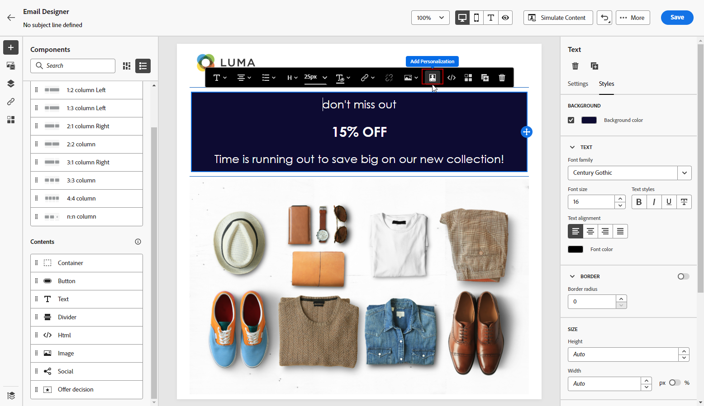

# 從頭開始設計內容 {#content-from-scratch}

>[!CONTEXTUALHELP]
>id="ac_structure_components_email"
>title="新增結構元件"
>abstract="結構元件會定義電子郵件的版面。將&#x200B;**結構**&#x200B;元件拖放到畫布中開始設計您的電子郵件內容。"

>[!CONTEXTUALHELP]
>id="ac_structure_components_landing_page"
>title="新增結構元件"
>abstract="結構元件會定義登陸頁面的版面。將&#x200B;**結構**&#x200B;元件拖放到畫布中開始設計您的登入頁面內容。"

>[!CONTEXTUALHELP]
>id="ac_structure_components_fragment"
>title="新增結構元件"
>abstract="結構元件會定義區段的版面。將&#x200B;**結構**&#x200B;元件拖放到畫布中開始設計您的片段內容。"

>[!CONTEXTUALHELP]
>id="ac_structure_components_template"
>title="新增結構元件"
>abstract="結構元件會定義範本的版面。將&#x200B;**結構**&#x200B;元件拖放到畫布中開始設計您的範本內容。"

>[!CONTEXTUALHELP]
>id="ac_edition_columns_email"
>title="定義電子郵件欄"
>abstract="電子郵件設計工具可讓您透過選取欄結構輕鬆定義電子郵件的版面。"

>[!CONTEXTUALHELP]
>id="ac_edition_columns_landing_page"
>title="定義登陸頁面欄"
>abstract="Designer 可讓您透過選取欄結構輕鬆定義登陸頁面的版面。"

>[!CONTEXTUALHELP]
>id="ac_edition_columns_fragment"
>title="定義片段欄"
>abstract="Designer 可讓您透過選取欄結構輕鬆定義片段的版面。"

>[!CONTEXTUALHELP]
>id="ac_edition_columns_template"
>title="定義範本欄"
>abstract="Designer 可讓您透過選取欄結構輕鬆定義範本的版面。"

使用Adobe Journey Optimizer Designer可輕鬆定義內容的結構。 通過添加和移動具有簡單拖放操作的結構元素，您可以在數秒內設計內容的形狀。

若要開始建立內容，請遵循下列步驟：

1. 從設計器首頁中，選擇 **[!UICONTROL 從頭設計]** 選項。

   

1. 透過拖放功能開始設計內容 **[!UICONTROL 結構]** 填入畫布以定義電子郵件的版面。

   >[!NOTE]
   >
   >堆疊欄與所有電子郵件程式不相容。 不支援時，不會堆疊欄。

   <!--Once placed in the email, you cannot move nor remove your components unless there is already a content component or a fragment placed inside. This is not true in AJO - TBC?-->

1. 新增最多 **[!UICONTROL 結構]** 視需要，並在右側的專用窗格中編輯其設定。

   

   選取 **[!UICONTROL n:n欄]** 元件，定義您選取的欄數（介於3和10之間）。 您也可以移動每欄底部的箭頭，以定義每欄的寬度。

   >[!NOTE]
   >
   >每個列大小不能低於結構元件總寬度的10%。 無法刪除非空的列。

1. 展開 **[!UICONTROL 內容]** 區段，並視需要新增多個元素至一或多個結構元件。 [深入了解內容元件](content-components.md)

1. 每個元件可透過 **[!UICONTROL 設定]** 或 **[!UICONTROL 樣式]** 標籤。 例如，您可以變更每個元件的文字樣式、邊框間距或邊界。 [進一步了解對齊方式和邊框間距](alignment-and-padding.md)

   

1. 從 **[!UICONTROL 資產選擇器]**，您可以直接選取儲存在中的資產 **[!UICONTROL Assets資料庫]**. [深入了解資產管理](assets-essentials.md)

   連按兩下包含資產的資料夾。 將它們拖放到結構元件中。

   

1. 插入個人化欄位，從設定檔屬性、區段成員資格、內容屬性等自訂內容。 [深入了解內容個人化](../personalization/personalize.md)

   

1. 按一下 **[!UICONTROL 啟用條件內容]** 新增動態內容並根據條件規則調整內容以定位設定檔。 [開始使用動態內容](../personalization/get-started-dynamic-content.md)

   

1. 按一下 **[!UICONTROL 連結]** 標籤，以顯示要追蹤之內容的所有URL。 您可以修改其 **[!UICONTROL 追蹤類型]** 或 **[!UICONTROL 標籤]** 新增 **[!UICONTROL 標籤]** 如有需要。 [深入了解連結和追蹤](message-tracking.md)

   

1. 如有需要，您可以按一下 **[!UICONTROL 切換至程式碼編輯器]** 的上界。 這可讓您編輯電子郵件原始碼，例如新增追蹤或自訂HTML標籤。 [進一步了解程式碼編輯器](code-content.md)

   >[!CAUTION]
   >
   >切換到代碼編輯器後，無法回復到此電子郵件的可視設計器。

1. 內容準備就緒後，按一下 **[!UICONTROL 模擬內容]** 按鈕以檢查呈現。 您可以選擇案頭或行動檢視。 [進一步了解如何預覽您的電子郵件](preview.md)

   

1. 內容準備就緒時，按一下 **[!UICONTROL 儲存]**.

