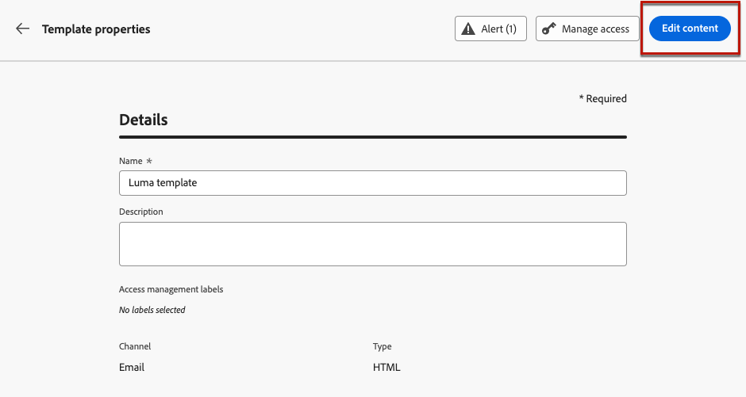
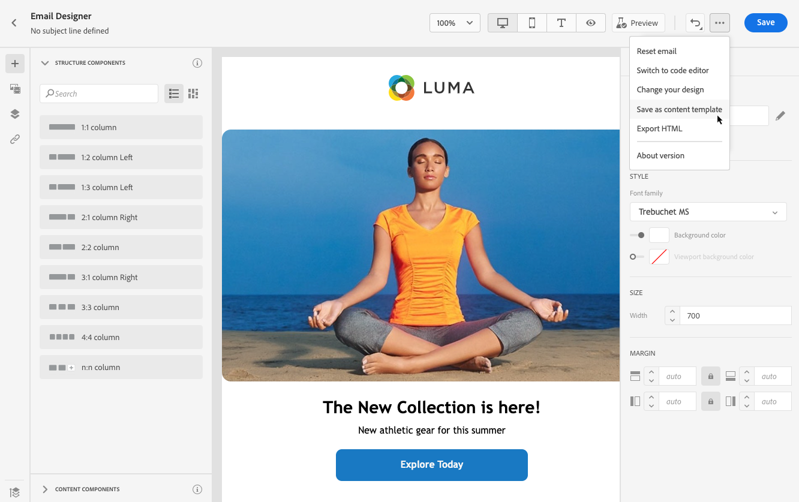

# 使用內容範本 {#content-templates}

為加快並改善設計流程，您可以建立獨立範本，輕鬆在 [!DNL Journey Optimizer] 行銷活動和歷程。

此功能可讓內容導向的使用者在行銷活動或歷程之外處理範本。 然後，行銷使用者可以在自己的歷程或行銷活動中重複使用和調整這些獨立內容範本。

例如，您公司內的使用者只負責內容，因此無法存取促銷活動或歷程。 不過，此使用者可以建立電子郵件範本，供您組織的行銷人員選取，以便用於所有電子郵件。

➡️ [了解如何在此影片中建立和使用範本](#video-templates)

>[!CAUTION]
>
>若要建立、編輯和刪除內容範本，您必須具備 **[!DNL Manage Library Items]** 包含在 **[!DNL Content Library Manager]** 產品設定檔。 [了解更多](../administration/ootb-product-profiles.md#content-library-manager)

## 存取和管理範本 {#access-manage-templates}

若要存取內容範本清單，請選取 **[!UICONTROL 內容管理]** > **[!UICONTROL 內容範本]** 的上界。

在目前沙箱中建立的所有範本(來自歷程或使用 [另存為範本](#save-as-template) 選項，可從 **[!UICONTROL 內容範本]** 功能表。

您可以依建立或修改日期來排序內容範本。 您也可以選擇只顯示您建立或修改的項目。

若要編輯範本內容，請從清單中按一下所需項目並選取 **[!UICONTROL 編輯內容]**.

若要刪除範本，請選取所需範本旁的垃圾桶圖示。

>[!NOTE]
>
>編輯或刪除範本時，促銷活動或歷程（包括使用此範本建立的電子郵件）不會受到影響。

## 建立內容範本 {#create-content-templates}

>[!CONTEXTUALHELP]
>id="ajo_create_template"
>title="定義您自己的內容範本"
>abstract="從頭開始建立獨立的自訂範本，使得您的內容可在多個歷程和行銷活動中重複使用。"

建立內容範本的方式有兩種：

* 使用左側邊欄，從草稿開始建立內容範本 **[!UICONTROL 內容範本]** 功能表。 [了解作法](#create-template-from-scratch)

* 在行銷活動或歷程中設計電子郵件時，請將電子郵件內容儲存為範本。 [了解作法](#save-as-template)

儲存後，您的內容範本便可用於行銷活動或歷程。 無論是從草稿開始建立，還是從先前的電子郵件建立，您現在都可以在建置任何 [電子郵件](get-started-email-design.md) with [!DNL Journey Optimizer]. [了解作法](email-templates.md)

>[!NOTE]
>
>* 對內容範本所做的變更不會傳播至行銷活動或歷程，無論是即時或草稿。
>
>* 同樣地，當範本用於促銷活動或歷程時，您對促銷活動和歷程內容所做的任何編輯都不會影響先前使用的內容範本。

### 從頭建立模板 {#create-template-from-scratch}

若要從頭建立內容範本，請遵循下列步驟。

1. 透過 **[!UICONTROL 內容管理]** > **[!UICONTROL 內容範本]** 左菜單。

   

1. 選擇 **[!UICONTROL 建立範本]**.

1. 填寫範本詳細資訊。

   

   >[!NOTE]
   >
   >目前僅 **電子郵件** 頻道和 **HTML** 支援類型。

1. 若要將自訂或核心資料使用量標籤指派至範本，請選取 **[!UICONTROL 管理存取]**. [進一步了解物件層級存取控制(OLAC)](../administration/object-based-access.md).

1. 按一下 **[!UICONTROL 建立]** 並從不同的選項中選擇您如何設計電子郵件：

   * [從草稿開始設計您的電子郵件](content-from-scratch.md) 透過電子郵件設計工具的介面。

   * [程式碼或複製貼上原始HTML](code-content.md) 直接進入電子郵件設計工具。

   * [匯入現有HTML內容](existing-content.md) 或.zip資料夾。

   * 使用內建或自訂範本清單中的現有內容。 在電子郵件中使用內容範本的步驟如下： [本節](email-templates.md).

   

1. 此 [電子郵件設計工具](get-started-email-design.md) 顯示。 視需要編輯內容，如同根據您選取的選項，對歷程或行銷活動內的任何電子郵件所執行的操作。

   您可以視需要測試內容。 [了解作法](#test-template)

1. 範本準備就緒後，按一下 **[!UICONTROL 儲存]**.

1. 如有需要，按一下範本名稱旁的箭頭，返回 **[!UICONTROL 詳細資料]** 畫面並編輯範本。

   

此範本現在已準備好在內建置任何電子郵件時使用 [!DNL Journey Optimizer]. [了解作法](email-templates.md)

### 另存為範本 {#save-as-template}

>[!CONTEXTUALHELP]
>id="ajo_messages_depecrated_inventory"
>title="了解如何移轉訊息"
>abstract="在 2022 年 7 月 25 日，「訊息」選單已消失，現在會直接從歷程編寫訊息。如果您要在歷程中重複使用舊訊息，則需要將它們另存為範本。"

設計 [電子郵件](get-started-email-design.md) 在行銷活動或歷程中，您可以儲存電子郵件內容以供日後重複使用。 請依照下列步驟以執行此操作。

1. 在電子郵件設計工具中，按一下螢幕右上方的刪節號。

1. 選擇 **[!UICONTROL 另存為內容範本]** 從下拉式功能表。

   

1. 為此模板添加名稱和說明。

   

1. 按一下&#x200B;**[!UICONTROL 儲存]**。

1. 範本會儲存至 **[!UICONTROL 內容範本]** 清單，可從 [!DNL Journey Optimizer] 專用功能表。 它會變成獨立內容範本，可作為該清單上的任何其他項目加以存取、編輯和刪除。 [了解更多](#access-manage-templates)

您現在可以在建立任何 [電子郵件](get-started-email-design.md) with [!DNL Journey Optimizer]. [了解作法](email-templates.md)

>[!NOTE]
>
>對該新範本所做的任何變更都不會傳播至其寄自的電子郵件。 同樣地，當在該電子郵件內編輯原始內容時，不會修改新範本。

## 測試您的內容範本 {#test-template}

您可以測試任何電子郵件內容範本的轉譯，不論是從草稿開始或從電子郵件建立。 若要這麼做，請遵循下列步驟。

>[!CAUTION]
>
>若要模擬內容，您必須具備 **[!DNL Manage Simulate Content]** 包含在 **[!DNL Content Library Manager]** 產品設定檔。 [了解更多](../administration/ootb-product-profiles.md#content-library-manager)

1. 透過 **[!UICONTROL 內容管理]** > **[!UICONTROL 內容範本]** ，然後選取任何範本。

1. 按一下 **[!UICONTROL 編輯內容]** 從 **[!UICONTROL 範本屬性]**.

1. 按一下 **[!UICONTROL 模擬內容]** 並選取測試設定檔，以檢查您的電子郵件呈現。 您可以選擇案頭或行動檢視。 [了解更多](preview.md)

   

1. 您可以在歷程或行銷活動中使用內容之前，先傳送校樣以測試內容，並讓部分內部使用者核准。

   * 若要這麼做，請按一下 **[!UICONTROL 傳送校樣]** 按鈕，並遵循 [本節](preview.md#send-proofs).

   * 傳送校樣之前，您必須選取 [電子郵件表面](../configuration/channel-surfaces.md) 會用來測試您的內容。

      

## 作法影片 {#video-templates}

了解如何在 [!DNL Journey Optimizer].

>[!VIDEO](https://video.tv.adobe.com/v/3413743/?quality=12)
