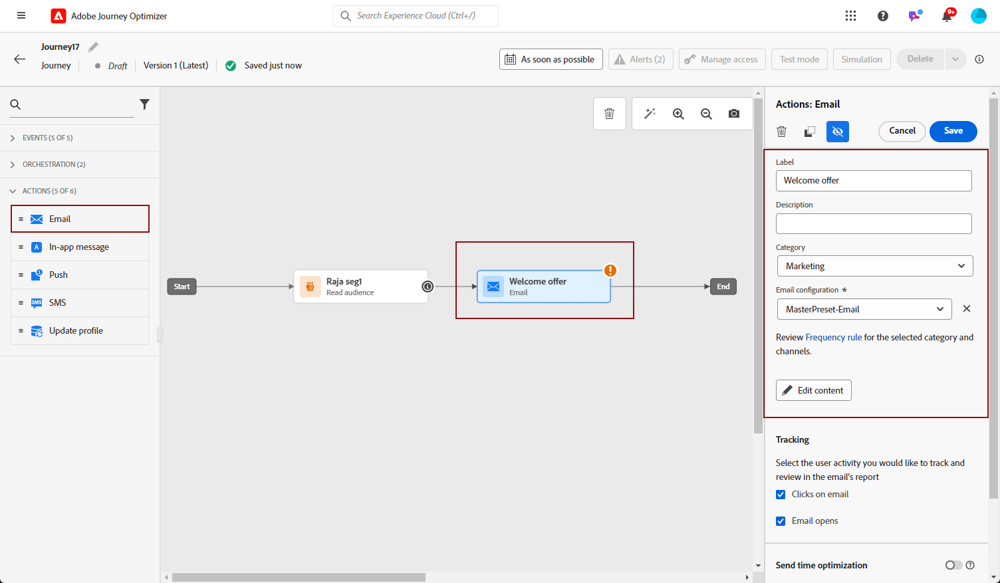
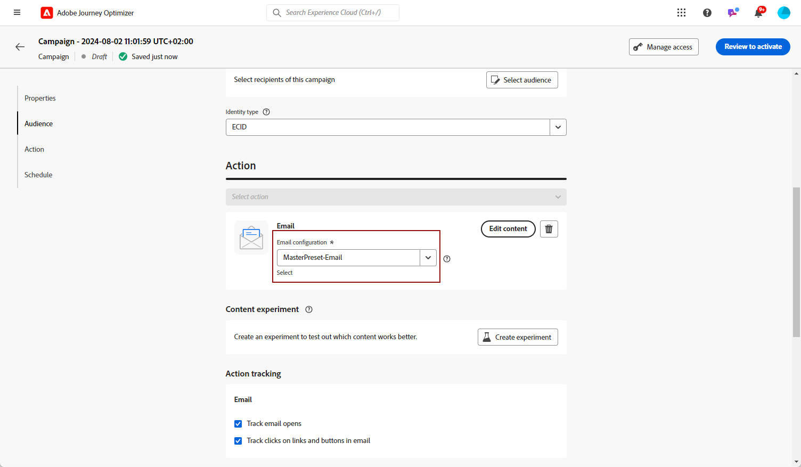
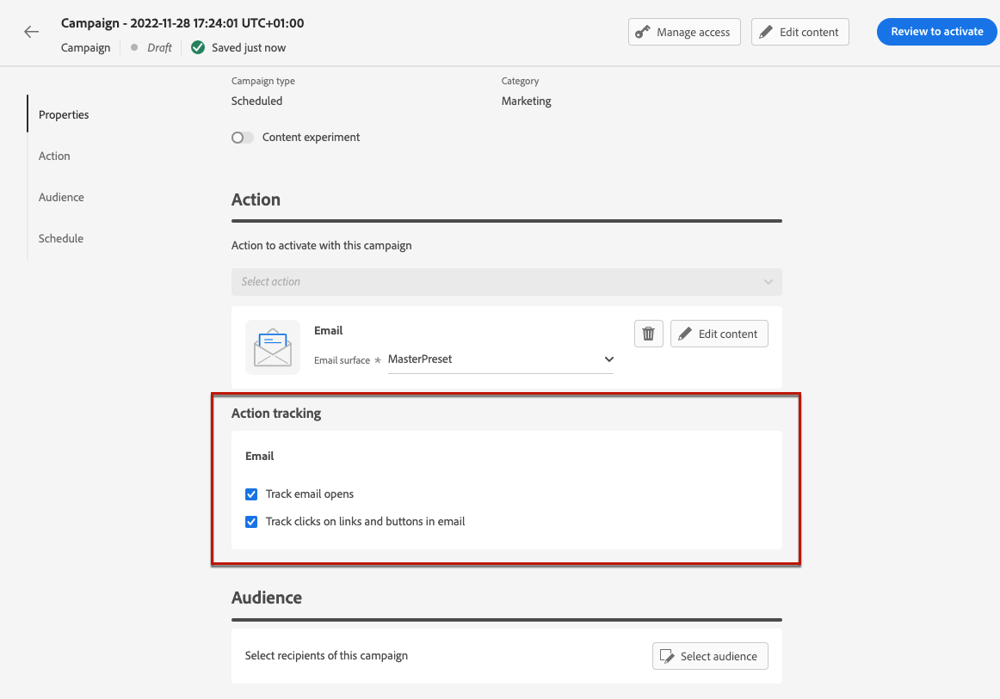
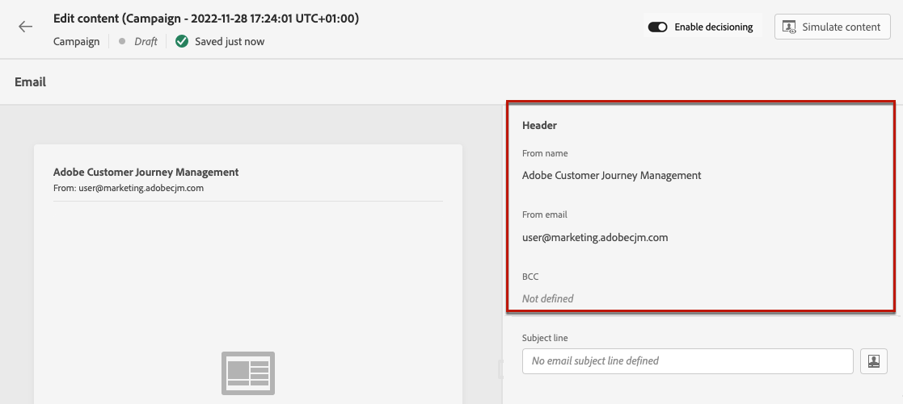
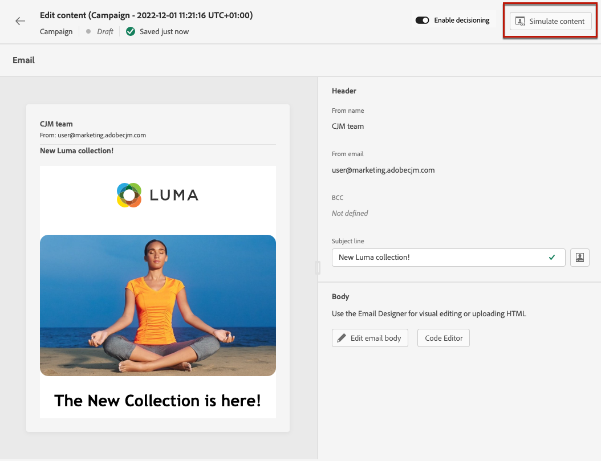
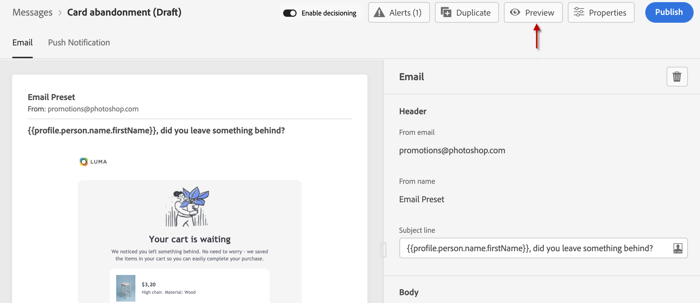

# 建立電子郵件 {#create-email}

>[!CONTEXTUALHELP]
>id="ajo_message_email"
>title="電子郵件建立"
>abstract="定義您的電子郵件主旨行，然後開啟「電子郵件設計工具」以建立電子郵件的內容。"

## 新增電子郵件動作 {#email-action}

若要在中建立電子郵件 [!DNL Journey Optimizer]，新增 **[!UICONTROL 電子郵件]** 歷程或行銷活動的動作。 然後根據您的情況，遵循下列步驟。

>[!BEGINTABS]

>[!TAB 將電子郵件新增至歷程]

1. 開啟您的歷程，然後拖放 **[!UICONTROL 電子郵件]** 活動來自 **[!UICONTROL 動作]** 區段。

1. 提供訊息的基本資訊（標籤、說明、類別）。

1. 選擇 [電子郵件表面](email-settings.md) 以使用。

   

   依預設，此欄位會預先填入使用者用於該管道的最後一個表面。

>[!NOTE]
>
>您可以使用傳送時間最佳化選項，根據歷史開啟率和點按率，預測傳送訊息的最佳時機，以最大化參與程度。 [瞭解如何使用傳送時間最佳化](../building-journeys/journeys-message.md#send-time-optimization)

有關如何設定歷程的詳細資訊，請參閱 [此頁面](../building-journeys/journey-gs.md).

>[!TAB 新增電子郵件至行銷活動]

1. 建立新的排程或API觸發的行銷活動，並選取 **[!UICONTROL 電子郵件]** 作為您的動作。

1. 選擇 [電子郵件表面](email-settings.md) 以使用。

   

1. 按一下&#x200B;**[!UICONTROL 建立]**。

1. 完成步驟以建立電子郵件行銷活動，例如行銷活動屬性 [對象](../audience/about-audiences.md)、和 [排程](../campaigns/create-campaign.md#schedule).

   

<!--
From the **[!UICONTROL Action]** section, specify if you want to track how your recipients react to your delivery: you can track email opens, and/or clicks on links and buttons in your email.

-->

有關如何設定行銷活動的詳細資訊，請參閱 [此頁面](../campaigns/get-started-with-campaigns.md).

>[!ENDTABS]

## 定義您的電子郵件內容 {#define-email-content}

<!-- update the quarry component with right ID value-->

>[!CONTEXTUALHELP]
>id="test_id"
>title="設定電子郵件內容"
>abstract="建立您的電子郵件內容。定義其主旨，然後利用電子郵件設計工具建置和個人化電子郵件內文。"

1. 在歷程或行銷活動設定畫面中，按一下 **[!UICONTROL 編輯內容]** 按鈕以設定電子郵件內容。 [了解更多](get-started-email-design.md)

   

   在 **[!UICONTROL 頁首]** 的區段 **[!UICONTROL 編輯內容]** 畫面， **[!UICONTROL 寄件者姓名]**， **[!UICONTROL 來自電子郵件]** 和 **[!UICONTROL 密件副本]** 欄位是在您選取的電子郵件介面中設定。 [瞭解更多](email-settings.md) <!--check if same for journey-->

   

1. 新增訊息的主旨列。 若要使用運算式編輯器設定和個人化主旨行，請按一下 **[!UICONTROL 開啟個人化對話方塊]** 圖示。 [了解更多](../personalization/personalization-build-expressions.md)

1. 按一下 **[!UICONTROL 編輯電子郵件內文]** 按鈕以存取電子郵件設計工具並開始建置您的內容。 [了解更多](get-started-email-design.md)

   

1. 如果您在行銷活動中，也可以按一下 **[!UICONTROL 代碼編輯器]** 按鈕使用顯示的快顯視窗，以純HTML編碼您自己的內容。

   

   >[!NOTE]
   >
   >如果您已透過電子郵件設計工具建立或匯入內容，此內容將會以HTML顯示。

## 檢查警報 {#check-email-alerts}

在設計訊息時，如果缺少關鍵設定，警示會顯示在介面（畫面右上方）中。

>[!NOTE]
>
>如果您沒有看到此按鈕，則表示未偵測到任何警報。

下面列出系統檢查的設定和元素。 您也會找到有關如何調整設定以解決相應問題的資訊。

可能會發生兩種型別的警報：

* **警告** 請參閱建議與最佳實務，例如：

   * **[!UICONTROL 電子郵件內文中不存在選擇退出連結]**：最佳做法是在您的電子郵件內文中新增取消訂閱連結。 瞭解如何在中進行設定 [本節](../privacy/opt-out.md#opt-out-management).

     >[!NOTE]
     >
     >行銷類電子郵件務必要加入選擇退出連結，管理異動類的訊息則非必要。 訊息類別(**[!UICONTROL 行銷]** 或 **[!UICONTROL 異動]**)定義於 [頻道介面](email-settings.md#email-type) 等級與時間 [建立訊息](#create-email-journey-campaign) 從歷程或行銷活動中。

   * **[!UICONTROL HTML的文字版本為空白]**：別忘了定義電子郵件內文的文字版本，因為當HTML內容無法顯示時會使用此版本。 瞭解如何在中建立文字版本 [本節](text-version-email.md).

   * **[!UICONTROL 電子郵件內文中存在空白連結]**：檢查電子郵件中的所有連結是否正確。 瞭解如何在中管理內容和連結 [本節](content-from-scratch.md).

   * **[!UICONTROL 電子郵件大小已超過100KB的限制]**：為達到最佳傳遞效果，請確定您的電子郵件大小不超過100KB。 瞭解如何在中編輯電子郵件內容 [本節](content-from-scratch.md).

* **錯誤** 防止您測試或啟動歷程/行銷活動，只要它們未解決，例如：

   * **[!UICONTROL 缺少主旨列]**：電子郵件主旨列是必填欄位。 瞭解如何在中定義及個人化該功能 [本節](create-email.md).

  <!--HTML is empty when Amp HTML is present-->

   * **[!UICONTROL 訊息的電子郵件版本為空白]**：尚未設定電子郵件內容時，會顯示此錯誤。 瞭解如何在中設計電子郵件內容 [本節](get-started-email-design.md).

   * **[!UICONTROL 表面不存在]**：如果您選取的表面在訊息建立後即被刪除，則無法使用訊息。 如果發生此錯誤，請在訊息中選取另一個曲面 **[!UICONTROL 屬性]**. 瞭解更多有關管道表面的 [本節](../configuration/channel-surfaces.md).

>[!CAUTION]
>
>若要能夠使用電子郵件測試或啟動歷程/行銷活動，您必須解決所有 **錯誤** 警報。

## 檢查並傳送您的電子郵件

定義訊息內容後，您就可以使用測試設定檔來預覽、傳送校樣並控制它在熱門案頭、行動裝置和網頁型使用者端中的轉譯。 如果您已插入個人化內容，您可以使用測試設定檔資料檢查此內容在訊息中的顯示方式。

若要這麼做，請按一下 **[!UICONTROL 模擬內容]** 然後新增測試設定檔，以使用測試設定檔資料檢查您的訊息。

有關如何選取測試設定檔及預覽內容的詳細資訊，請參閱 [內容管理](../content-management/preview-test.md) 區段。

當您的電子郵件準備就緒時，請完成 [歷程](../building-journeys/journey-gs.md) 或 [行銷活動](../campaigns/create-campaign.md)，並啟用它以傳送訊息。

>[!NOTE]
>
>若要透過電子郵件開啟和/或互動追蹤收件者的行為，請確定 **[!UICONTROL 追蹤]** 區段在歷程的啟用 [電子郵件活動](../building-journeys/journeys-message.md) 或在電子郵件中 [行銷活動](../campaigns/create-campaign.md).<!--to move?-->

<!--

## Define your email content {#email-content}

Use [!DNL Journey Optimizer] Email Designer to [design your email from scratch](../email/content-from-scratch.md). If you have an existing content, you can [import it in the Email Designer](../email/existing-content.md), or [code your own content](../email/code-content.md) in [!DNL Journey Optimizer]. 

[!DNL Journey Optimizer] comes with a set of [built-in templates](email-templates.md) to help you start. Any email can also be saved as a template.

Use [!DNL Journey Optimizer] Expression editor to personalize your messages with profiles' data. For more on personalization, refer to [this section](../personalization/personalize.md).

Adapt the content of your messages to the targeted profiles by using [!DNL Journey Optimizer] dynamic content capabilities. [Get started with dynamic content](../personalization/get-started-dynamic-content.md)

## Email tracking {#email-tracking}

If you want to track the behavior of your recipients through openings and/or clicks on links, enable the following options: **[!UICONTROL Email opens]** and **[!UICONTROL Click on email]**. 

Learn more about tracking in [this section](message-tracking.md).

## Validate your email content {#email-content-validate}

Control the rendering of your email, and check personalization settings with test profiles, using the preview section on the left-hand side. For more on this, refer to [this section](preview.md).

You must also check alerts in the upper section of the editor.  Some of them are simple warnings, but others can prevent you from using the message. 

-->

