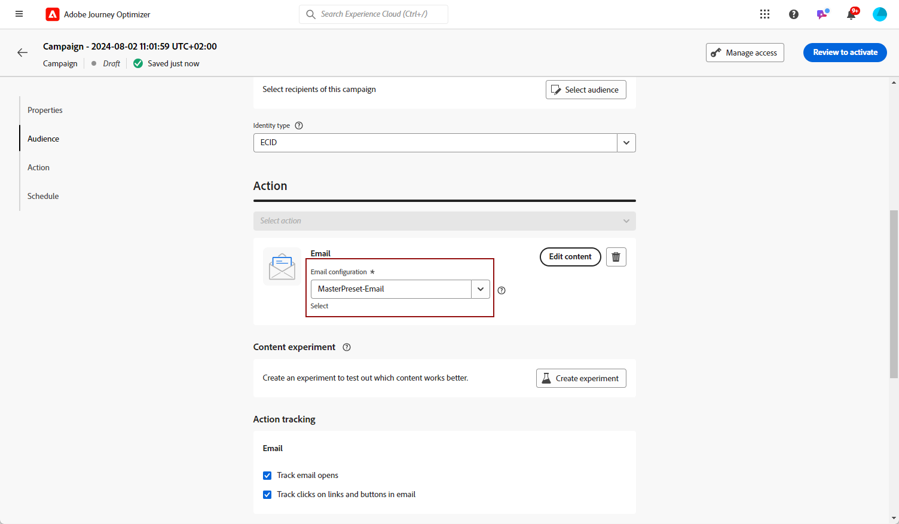
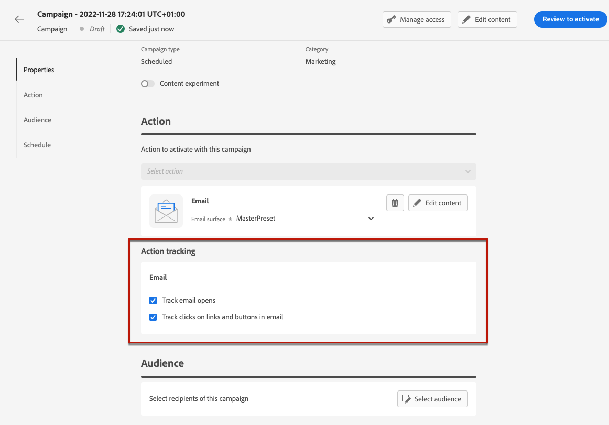
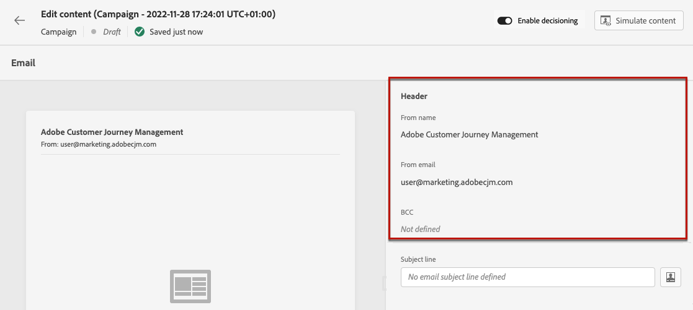
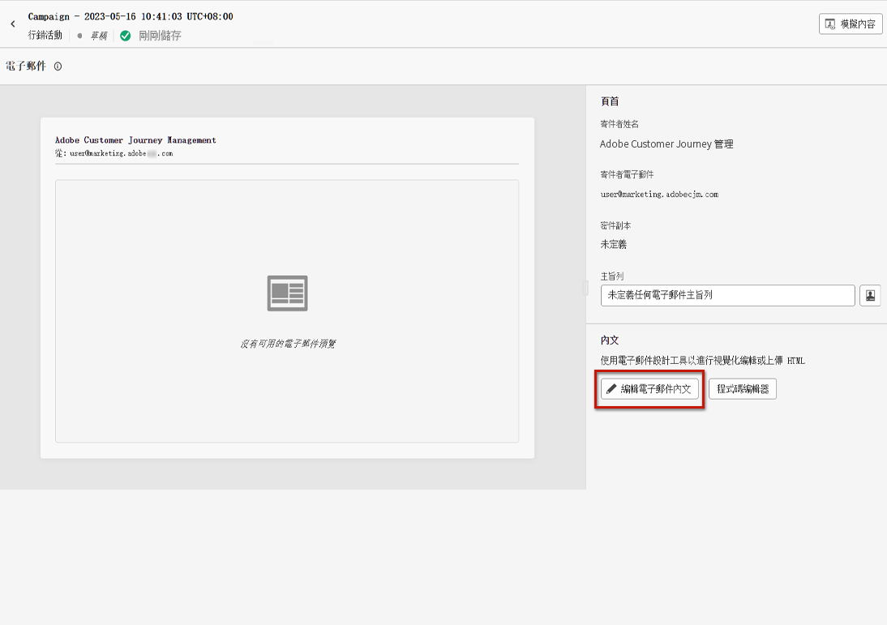
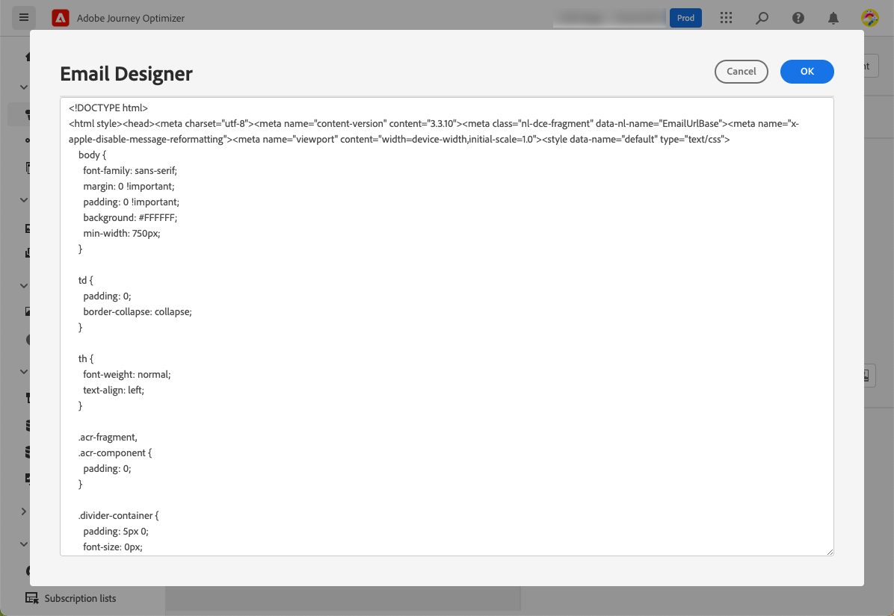
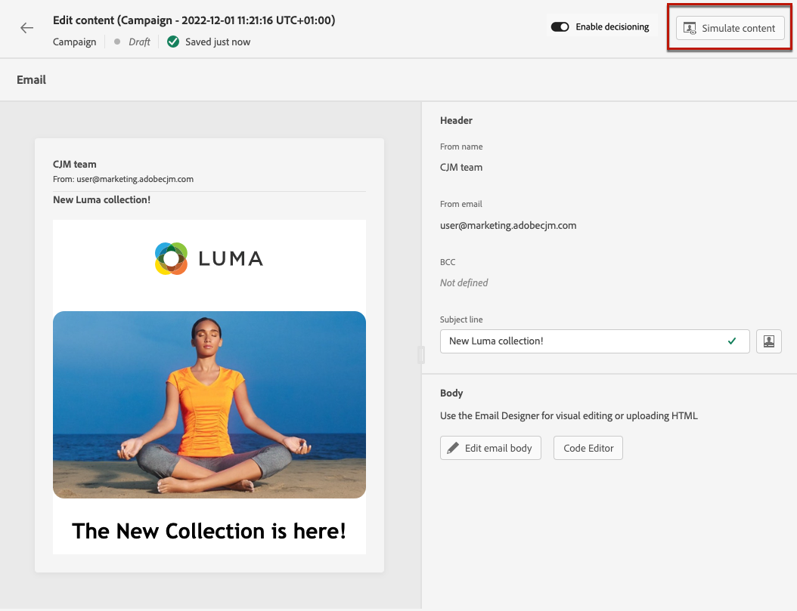

# 建立電子郵件 {#create-email}

>[!BEGINSHADEBOX]

**在此頁面上：**&#x200B;瞭解如何在Adobe Journey Optimizer中將電子郵件動作新增至歷程或行銷活動、定義其主題和內容、檢查警報，以及在傳送前進行預覽。

>[!ENDSHADEBOX]

>[!CONTEXTUALHELP]
>id="ajo_message_email"
>title="電子郵件建立"
>abstract="定義您的電子郵件主旨行，然後開啟電子郵件設計工具來建立電子郵件內容。"

## 新增電子郵件動作 {#email-action}

>[!CONTEXTUALHELP]
>id="ajo_journey_action_email"
>title="電子郵件動作"
>abstract="電子郵件管道動作會在輪廓到達歷程的此步驟時，向輪廓傳送電子郵件。 標籤會識別歷程畫布中的活動，而動作則會參考定義所傳送內容的電子郵件設定。 「**最佳化**」區段可包含內容實驗或定向規則、「**多語言**」區段可用多種語言提供內容，而「**逾時或錯誤**」區段則可定義動作失敗時的替代路徑。"
>additional-url="https://experienceleague.adobe.com/zh-hant/docs/journey-optimizer/using/orchestrate-journeys/about-journey-building/journey-action#add-action" text="開始使用管道動作"

若要在[!DNL Journey Optimizer]中建立電子郵件，請新增&#x200B;**[!UICONTROL 電子郵件]**&#x200B;動作至歷程或行銷活動。 然後根據您的情況，遵循下列步驟。

>[!BEGINTABS]

>[!TAB 新增電子郵件至歷程]

1. 開啟您的歷程，然後從浮動視窗的&#x200B;**[!UICONTROL 動作]**&#x200B;區段拖放&#x200B;**[!UICONTROL 動作]**&#x200B;活動。 深入瞭解[動作活動](../building-journeys/journey-action.md)。

   >[!IMPORTANT]
   >
   >舊版原生管道活動（電子郵件、推播、簡訊、應用程式內、網頁、程式碼型體驗和內容卡）自2026年3月版本起即已淘汰。 使用這些活動的現有歷程仍可繼續運作，不會有任何變更，無需移轉。

1. 選取&#x200B;**[!UICONTROL 電子郵件]**&#x200B;作為動作型別。

   

1. 輸入&#x200B;**[!UICONTROL 標籤]**&#x200B;以識別您在歷程畫布中的動作。

1. 按一下&#x200B;**[!UICONTROL 設定動作]**&#x200B;按鈕。

1. 您被導向到&#x200B;**[!UICONTROL 動作]**&#x200B;標籤。 從那裡，選取或建立要使用的電子郵件設定。 [了解更多](email-settings.md)

   

1. 此外：

   * 您可以在&#x200B;**[!UICONTROL 商業規則]**&#x200B;下拉式清單中選取規則集，將上限規則套用至您的電子郵件動作。 [了解更多](../conflict-prioritization/channel-capping.md)

   * 您可以使用&#x200B;**[!DNL Send time optimization]**&#x200B;選項，根據歷史開啟率和點按率，預測傳送訊息的最佳時機，以最大化參與度。 [了解作法](../building-journeys/send-time-optimization.md)

1. 選取「**[!UICONTROL 編輯內容]**」按鈕，並視需要使用「電子郵件Designer」建立您的內容。 [了解更多](#define-email-content)

1. 返回歷程畫布。 如有必要，請拖放其他動作或事件以完成您的歷程流程。 [了解更多](../building-journeys/about-journey-activities.md)

有關如何建立、設定和發佈歷程的詳細資訊，請參閱[此頁面](../building-journeys/journey-gs.md)。

>[!TAB 新增電子郵件至行銷活動]

1. [建立行銷活動](../campaigns/create-campaign.md)，並選取&#x200B;**[!UICONTROL 電子郵件]**&#x200B;作為您的動作。

1. 完成步驟以建立電子郵件行銷活動，例如行銷活動屬性、[對象](../audience/about-audiences.md)和[排程](../campaigns/campaign-schedule.md)。

   

1. 選取&#x200B;**[!UICONTROL 電子郵件]**&#x200B;動作。

1. 選取或建立電子郵件設定。 [了解更多](email-settings.md)

   

<!--
From the **[!UICONTROL Action]** section, specify if you want to track how your recipients react to your delivery: you can track email opens, and/or clicks on links and buttons in your email.

-->
如需如何建立、設定和啟動行銷活動的詳細資訊，請參閱[此頁面](../campaigns/get-started-with-campaigns.md)。

>[!ENDTABS]

## 定義您的電子郵件內容 {#define-email-content}

<!-- update the quarry component with right ID value-->

>[!CONTEXTUALHELP]
>id="test_id"
>title="設定電子郵件內容"
>abstract="建立您的電子郵件內容。 定義其主旨，然後利用電子郵件設計工具建置和個人化電子郵件內文。"

將電子郵件動作新增至您的歷程或行銷活動後，您需要使用電子郵件Designer定義電子郵件內容，包括主旨行、寄件者資訊和電子郵件內文。 請依照下列步驟操作：

1. 在歷程或行銷活動設定畫面中，按一下&#x200B;**[!UICONTROL 編輯內容]**&#x200B;按鈕以設定電子郵件內容。 [了解更多](get-started-email-design.md)

   

1. 若要在電子郵件中新增決定原則，請切換&#x200B;**[!UICONTROL 啟用決定]**。

   決策原則是產品建議的容器，可運用決策引擎以動態方式傳回最佳內容，以傳送給每個客群成員。 [瞭解如何在電子郵件中新增決定原則](../experience-decisioning/create-decision.md#create-decision)

   

   >[!AVAILABILITY]
   >
   >目前，在「有限可用性」中可取得電子郵件中的決定原則建立。 請聯絡您的 Adobe 代表以取得存取權。

1. 在&#x200B;**[!UICONTROL 標題]**&#x200B;區段中，檢查&#x200B;**[!UICONTROL 寄件者名稱]**、**[!UICONTROL 寄件者電子郵件]**&#x200B;和&#x200B;**[!UICONTROL 密件副本]**&#x200B;欄位。 它們是在您選取的電子郵件設定中設定。 [深入瞭解](email-settings.md) <!--check if same for journey-->

   

1. 新增訊息的主旨列。 若要使用個人化編輯器設定並個人化主旨列，請按一下&#x200B;**[!UICONTROL 開啟個人化對話方塊]**&#x200B;圖示。 [了解更多](../personalization/personalization-build-expressions.md)

   >[!NOTE]
   >
   >主旨列是必填欄位。 其中不可包含分行符號。

1. 按一下&#x200B;**[!UICONTROL 編輯電子郵件內文]**&#x200B;按鈕以存取電子郵件Designer並開始建立您的內容。 [了解更多](get-started-email-design.md)

   

1. 如果您在行銷活動中，也可以按一下&#x200B;**[!UICONTROL 代碼編輯器]**&#x200B;按鈕，使用顯示的快顯視窗在普通HTML中編碼您自己的內容。

   

   >[!NOTE]
   >
   >如果您已透過電子郵件Designer建立或匯入內容，此內容將會顯示在HTML中。

1. 如有需要，請啟用&#x200B;**[!UICONTROL 最佳化HTML大小]**&#x200B;選項，以在發佈程式期間減少電子郵件HTML的大小。 [了解更多](#optimize-html-size)

## 檢查警報 {#check-email-alerts}

在設計訊息時，如果缺少關鍵設定，警示會顯示在介面（畫面右上方）中。

>[!NOTE]
>
>如果您沒有看到此按鈕，則表示未偵測到任何警報。

下面列出系統檢查的設定和元素。 您也會找到有關如何調整設定以解決相應問題的資訊。

可能會發生兩種型別的警報：

* **警告**&#x200B;參考建議和最佳實務，例如：

   * **[!UICONTROL 電子郵件內文中不存在選擇退出的連結]**：將取消訂閱連結新增至您的電子郵件內文是最佳做法。 在[本節](../privacy/opt-out.md#opt-out-decision-management)中瞭解如何進行設定。

     >[!NOTE]
     >
     >行銷類電子郵件務必要加入選擇退出連結，管理異動類的訊息則非必要。 訊息類別（**[!UICONTROL 行銷]**&#x200B;或&#x200B;**[!UICONTROL 異動]**）是在[頻道設定](email-settings.md#email-type)層級，以及[從歷程或行銷活動建立訊息](#create-email-journey-campaign)時定義的。

   * **[!UICONTROL HTML的文字版本是空的]**：別忘了定義您的電子郵件內文的文字版本，因為當HTML內容無法顯示時，將會使用此版本。 瞭解如何在[本節](text-version-email.md)中建立文字版本。

   * **[!UICONTROL 電子郵件內文中出現空白連結]**：檢查您電子郵件中的所有連結是否正確。 在[本節](content-from-scratch.md)中瞭解如何管理內容和連結。

   * **[!UICONTROL 電子郵件大小已超過100KB的限制]**：若要取得最佳傳遞，請確定您的電子郵件大小不超過100KB。 若要減少HTML大小，請使用&#x200B;**[!UICONTROL 最佳化HTML大小]**&#x200B;選項。 [了解更多](#optimize-html-size)

* **錯誤**&#x200B;會阻止您測試或啟用歷程/行銷活動，只要這些錯誤未解決，例如：

   * **[!UICONTROL 主旨列遺失]**：電子郵件主旨列是必要的。 在[本節](create-email.md)中瞭解如何定義和個人化它。

  <!--HTML is empty when Amp HTML is present-->

   * **[!UICONTROL 郵件的電子郵件版本是空的]**：尚未設定電子郵件內容時，會顯示此錯誤。 在[本節](get-started-email-design.md)中瞭解如何設計電子郵件內容。

   * **[!UICONTROL 設定不存在]**：如果您選取的設定在建立訊息之後被刪除，則無法使用訊息。 如果發生此錯誤，請在訊息&#x200B;**[!UICONTROL 屬性]**&#x200B;中選取其他設定。 在[本節](../configuration/channel-surfaces.md)中進一步瞭解通道設定。

>[!CAUTION]
>
>若要能夠使用電子郵件測試或啟動歷程/行銷活動，您必須解決所有&#x200B;**錯誤**&#x200B;警示。

## 最佳化電子郵件 HTML 大小 {#optimize-html-size}

>[!CONTEXTUALHELP]
>id="ajo_email_minification"
>title="縮減 HTML 大小"
>abstract="啟用此選項可移除不必要的空白字元、縮排及非必要的註解，以便在發佈時壓縮電子郵件 HTML。 這樣可以避免在 Gmail 一類用戶端中發生電子郵件內容截斷的狀況，因為用戶端會截斷超過 100 KB 大小的郵件。 請注意，使用多語言電子郵件時，所有地區設定都預設啟用此選項。"

[!DNL Journey Optimizer]可讓您移除不必要的空白字元、縮排及不必要的註解，在發佈程式期間壓縮電子郵件HTML版本。 保持HTML小型化可協助您：

* 避免&#x200B;**電子郵件剪輯** — 某些使用者端（例如Gmail）會截斷大於~100 KB的郵件，使收件者無法檢視完整內容。
* 改善收件者收件匣中的&#x200B;**電子郵件載入時間**。
* 改善&#x200B;**傳遞能力**&#x200B;並減少頻寬使用量。

此最佳化不會自動套用 — 您必須在[編輯內容](#define-email-content)畫面中手動啟用它。

>[!IMPORTANT]
>
> HTML大小縮減僅適用於發佈時。

最佳化是電子郵件使用者端安全：

* 它會保留MSO/Outlook條件式註解。
* 這不會改變您的實際內容、影像或視訊。

>[!NOTE]
>
>電子郵件大小的縮減取決於電子郵件原始HTML結構。 如果內容已壓縮或電子郵件承載非常大，縮減量可能極小，並且可能在所有情況下都無法完全防止剪輯。

您可以在傳送校樣時先測試HTML大小最佳化的影響，然後再發佈。 [了解更多](#optimize-html-proof)

### 在多語言電子郵件中最佳化HTML大小 {#optimize-html-multilingual}

使用[多語言電子郵件變體](../content-management/multilingual-gs.md)時，**[!UICONTROL 最佳化HTML大小]**&#x200B;設定會在電子郵件層級追蹤，而非根據地區設定追蹤。

因此，在任何一個地區設定上啟用此設定，會在發佈時套用至該電子郵件的所有地區設定，甚至在UI中核取方塊仍顯示為未勾選的地區設定也是如此。 您不需要針對每個地區設定重複此動作。

若要停用HTML大小最佳化，您必須取消勾選每個地區設定的&#x200B;**[!UICONTROL 最佳化HTML大小]**。 即使在一個地區設定中將其保持啟用狀態，就足以在所有地區設定中套用最佳化。

>[!NOTE]
>
>如果您正在執行[內容實驗](../content-management/content-experiment.md)，每個處理會分別管理&#x200B;**[!UICONTROL 最佳化HTML大小]**&#x200B;設定，因為每個處理都被視為個別的訊息。

## 檢查並傳送您的電子郵件

定義訊息內容後，您可以使用任一模擬方法來預覽其內容：

* 按一下&#x200B;**[!UICONTROL 模擬內容]**&#x200B;以測試內容變數與範例輸入資料或AI自動產生。 [瞭解如何模擬內容變化](../test-approve/simulate-sample-input.md)
* 按一下&#x200B;**[!UICONTROL 模擬內容]**，然後從下拉式清單中選取&#x200B;**[!UICONTROL 模擬內容（AEP設定檔）]**，以使用測試設定檔預覽、傳送校樣並檢查電子郵件呈現。

您也可以驗證內容品質，以評估可讀性、有效性和內容一致性。 [了解更多關於內容品質驗證的資訊](../content-management/brands-score.md#validate-quality)

有關如何選取測試設定檔及預覽內容的詳細資訊，請參閱[內容管理](../content-management/preview-test.md)區段。

當您的電子郵件準備就緒時，請完成您的[歷程](../building-journeys/journey-gs.md)或[行銷活動](../campaigns/create-campaign.md)的設定，並啟動它以傳送訊息。

>[!NOTE]
>
>若要透過電子郵件開啟和/或互動追蹤收件者的行為，請確定&#x200B;**[!UICONTROL 追蹤]**&#x200B;區段中的專用選項已在歷程的[電子郵件活動](../building-journeys/journey-action.md)或電子郵件[行銷活動](../campaigns/create-campaign.md).<!--to move?-->中啟用

### 測試HTML大小最佳化 {#optimize-html-proof}

如果您已啟用[HTML大小最佳化](#optimize-html-size)選項，您可以在傳送校樣時先評估其影響，然後再發佈。 請遵循下列步驟。

1. 在電子郵件Designer中，按一下右側欄中的「問題」圖示。 如果轉譯的電子郵件大小超過100 KB，會顯示一則訊息，警告您這可能會導致某些電子郵件使用者端發生截斷。<!--Learn more about content checks in [this section](#check-email-alerts).-->

   

1. 按一下&#x200B;**[!UICONTROL 模擬內容]**。

   <!---->

1. 若要測試最佳化版本，請按一下&#x200B;**[!UICONTROL 傳送校樣]**&#x200B;按鈕，然後選取&#x200B;**[!UICONTROL 最佳化HTML大小]**&#x200B;選項。 這會將縮減的HTML大小的校樣傳送給測試收件者。

   

   >[!NOTE]
   >
   >此設定獨立於電子郵件編輯器 — 校樣會反映您在校樣中選擇的任何內容，無論選項在電子郵件本身中是啟用還是停用。

1. 選取測試收件者並按一下&#x200B;**[!UICONTROL 傳送校樣]**&#x200B;按鈕。 在[本節](../content-management/proofs.md)中進一步瞭解傳送校樣。
1. 傳送後，在&#x200B;**[!UICONTROL Simulate]**&#x200B;畫面中，按一下&#x200B;**[!UICONTROL 檢視校樣]**&#x200B;按鈕。
1. 按一下校樣狀態旁邊的資訊圖示。 最佳化詳細資訊會顯示在快顯視窗中，包括原始HTML大小、最佳化HTML大小和大小縮減百分比。

   

   使用此資訊來驗證最佳化的輸出，並確認電子郵件在發佈之前保持在建議的100 KB臨界值內。

<!--
## Define your email content {#email-content}

Use [!DNL Journey Optimizer] Email Designer to [design your email from scratch](../email/content-from-scratch.md). If you have an existing content, you can [import it in the Email Designer](../email/existing-content.md), or [code your own content](../email/code-content.md) in [!DNL Journey Optimizer]. 

[!DNL Journey Optimizer] comes with a set of [built-in templates](email-templates.md) to help you start. Any email can also be saved as a template.

Use [!DNL Journey Optimizer] personalization editor to personalize your messages with profiles' data. For more on personalization, refer to [this section](../personalization/personalize.md).

Adapt the content of your messages to the targeted profiles by using [!DNL Journey Optimizer] dynamic content capabilities. [Get started with dynamic content](../personalization/get-started-dynamic-content.md)

## Email tracking {#email-tracking}

If you want to track the behavior of your recipients through openings and/or clicks on links, enable the following options: **[!UICONTROL Email opens]** and **[!UICONTROL Click on email]**. 

Learn more about tracking in [this section](message-tracking.md).

## Validate your email content {#email-content-validate}

Control the rendering of your email, and check personalization settings with test profiles, using the preview section on the left-hand side. For more on this, refer to [this section](preview.md).

You must also check alerts in the upper section of the editor.  Some of them are simple warnings, but others can prevent you from using the message. 
-->
