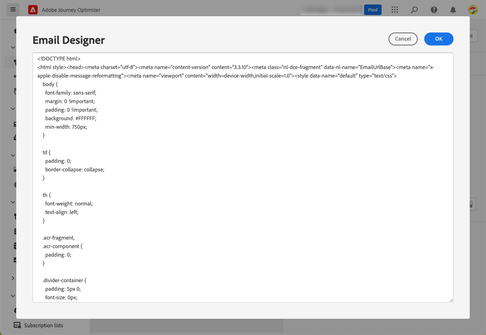

# 建立電子郵件 {#create-email}

>[!CONTEXTUALHELP]
>id="ajo_message_email"
>title="電子郵件建立"
>abstract="僅需三個簡單的步驟即可定義您的電子郵件參數。"

在中建立電子郵件 [!DNL Journey Optimizer]，請執行以下步驟。

## 在行程或市場活動中建立電子郵件 {#create-email-journey-campaign}

添加 **[!UICONTROL 電子郵件]** 到旅程或活動的操作，並根據您的案例執行以下步驟。

>[!BEGINTABS]

>[!TAB 將電子郵件添加到旅程]

1. 開啟行程，然後拖放 **[!UICONTROL 電子郵件]** 活動 **[!UICONTROL 操作]** 的子菜單。

1. 提供有關郵件（標籤、說明、類別）的基本資訊。

1. 選擇 [電子郵件曲面](email-settings.md) 的下界。

   

   預設情況下，該欄位預填充用戶用於該通道的最後一個曲面。

>[!NOTE]
>
>如果您從旅途中發送電子郵件，您可以利用Adobe Journey Optimizer的「發送時間優化」功能來預測發送郵件的最佳時間，以便根據歷史開啟和點擊率來最大限度地提高項目的價值。 [瞭解如何使用發送時間優化](../building-journeys/journeys-message.md#send-time-optimization)

有關如何配置行程的詳細資訊，請參閱 [此頁](../building-journeys/journey-gs.md)。

>[!TAB 向市場活動添加電子郵件]

1. 建立新的計畫市場活動或API觸發的市場活動，然後選擇 **[!UICONTROL 電子郵件]** 作為你的行動。

1. 選擇 [電子郵件曲面](email-settings.md) 的下界。

   

1. 按一下&#x200B;**[!UICONTROL 建立]**。

1. 完成建立電子郵件市場活動的步驟，如市場活動屬性、 [觀眾](../segment/about-segments.md), [計畫](../campaigns/create-campaign.md#schedule)。

   

<!--
From the **[!UICONTROL Action]** section, specify if you want to track how your recipients react to your delivery: you can track email opens, and/or clicks on links and buttons in your email.

-->

有關如何配置市場活動的詳細資訊，請參閱 [此頁](../campaigns/get-started-with-campaigns.md)。

>[!ENDTABS]

## 定義您的電子郵件內容 {#define-email-content}

<!-- update the quarry component with right ID value-->

>[!CONTEXTUALHELP]
>id="test_id"
>title="設定電子郵件內容"
>abstract="建立您的電子郵件內容。定義其主旨，然後利用電子郵件設計工具建置和個人化電子郵件內文。"

1. 在行程或市場活動配置螢幕中，按一下 **[!UICONTROL 編輯內容]** 按鈕來配置電子郵件內容。 [了解更多](get-started-email-design.md)

   

1. 在 **[!UICONTROL 標題]** 的下界 **[!UICONTROL 編輯內容]** 螢幕， **[!UICONTROL 從名稱]**。 **[!UICONTROL 從電子郵件]** 和 **[!UICONTROL 密件抄送]** 欄位來自您選擇的電子郵件表面。 [了解更多](email-settings.md) <!--check if same for journey-->

   

1. 可以添加主題行。 將純文字檔案直接鍵入到相應的欄位中，或使用 [表達式編輯器](../personalization/personalization-build-expressions.md) 個性化主題行。

1. 按一下 **[!UICONTROL 編輯電子郵件正文]** 按鈕開始使用 [!DNL Journey Optimizer] 電子郵件設計器。 [了解更多](get-started-email-design.md)

   

1. 如果您處於市場活動中，也可以按一下 **[!UICONTROL 代碼編輯器]** 按鈕，使用顯示的彈出窗口在純HTML中對您自己的內容進行代碼。

   

   >[!NOTE]
   >
   >如果您已通過電子郵件設計器建立或導入內容，則此內容將以HTML顯示。

## 檢查警報 {#check-email-alerts}

在設計消息時，當缺少鍵設定時，會在介面（螢幕右上角）中顯示警報。

>[!NOTE]
>
>如果未看到此按鈕，則未檢測到任何警報。

下面列出了系統檢查的設定和元素。 您還將找到有關如何調整配置以解決相應問題的資訊。

可以發生兩種類型的警報：

* **警告** 建議和最佳做法，例如：

   * **[!UICONTROL 電子郵件正文中不存在選擇退出連結]**:將未訂閱連結添加到電子郵件正文是最佳做法。 瞭解如何在 [此部分](../privacy/opt-out.md#opt-out-management)。

      >[!NOTE]
      >
      >行銷類電子郵件務必要加入選擇退出連結，管理異動類的訊息則非必要。 消息類別(**[!UICONTROL 營銷]** 或 **[!UICONTROL 事務性]**) [通道表面](email-settings.md#email-type) 級別和時間 [建立消息](#create-email-journey-campaign) 從旅途或競選中消失。

   * **[!UICONTROL HTML的文本版本為空]**:不要忘記定義電子郵件正文的文本版本，因為當無法顯示HTML內容時，將使用它。 瞭解如何在中建立文本版本 [此部分](text-version-email.md)。

   * **[!UICONTROL 電子郵件正文中存在空連結]**:檢查電子郵件中的所有連結是否正確。 瞭解如何管理中的內容和連結 [此部分](content-from-scratch.md)。

   * **[!UICONTROL 電子郵件大小已超過100KB的限制]**:要獲得最佳傳送，請確保電子郵件大小不超過100KB。 瞭解如何在中編輯電子郵件內容 [此部分](content-from-scratch.md)。

* **錯誤** 只要未解決行程/促銷活動，就不會測試或激活行程/促銷活動，例如：

   * **[!UICONTROL 主題行丟失]**:電子郵件主題行是必填項。 瞭解如何在中定義和個性化它 [此部分](create-email.md)。

   <!--HTML is empty when Amp HTML is present-->

   * **[!UICONTROL 郵件的電子郵件版本為空]**:未配置電子郵件內容時，將顯示此錯誤。 瞭解如何在 [此部分](get-started-email-design.md)。

   * **[!UICONTROL 曲面不存在]**:如果在建立消息後刪除了所選曲面，則不能使用消息。 如果出現此錯誤，請在消息中選擇另一個曲面 **[!UICONTROL 屬性]**。 瞭解有關中的通道曲面的詳細資訊 [此部分](../configuration/channel-surfaces.md)。

>[!CAUTION]
>
>要能夠使用電子郵件test或激活行程/市場活動，必須解決所有 **錯誤** 警報。

## 預覽併發送電子郵件

定義郵件內容後，您可以預覽它以控制電子郵件的呈現，並使用test配置式檢查個性化設定。 [了解更多](preview.md)

當您的電子郵件準備好後，請完成您的 [旅程](../building-journeys/journey-gs.md) 或 [活動](../campaigns/create-campaign.md)，並激活它以發送消息。

>[!NOTE]
>
>要通過電子郵件開放和/或交互來跟蹤收件人的行為，請確保 **[!UICONTROL 跟蹤]** 部分在行程中啟用 [電子郵件活動](../building-journeys/journeys-message.md) 或在電子郵件中 [活動](../campaigns/create-campaign.md)。<!--to move?-->

<!--

## Define your email content {#email-content}

Use [!DNL Journey Optimizer] Email Designer to [design your email from scratch](../email/content-from-scratch.md). If you have an existing content, you can [import it in the Email Designer](../email/existing-content.md), or [code your own content](../email/code-content.md) in [!DNL Journey Optimizer]. 

[!DNL Journey Optimizer] comes with a set of [built-in templates](email-templates.md) to help you start. Any email can also be saved as a template.

Use [!DNL Journey Optimizer] Expression editor to personalize your messages with profiles' data. For more on personalization, refer to [this section](../personalization/personalize.md).

Adapt the content of your messages to the targeted profiles by using [!DNL Journey Optimizer] dynamic content capabilities. [Get started with dynamic content](../personalization/get-started-dynamic-content.md)

## Email tracking {#email-tracking}

If you want to track the behavior of your recipients through openings and/or clicks on links, enable the following options: **[!UICONTROL Email opens]** and **[!UICONTROL Click on email]**. 

Learn more about tracking in [this section](message-tracking.md).

## Validate your email content {#email-content-validate}

Control the rendering of your email, and check personalization settings with test profiles, using the preview section on the left-hand side. For more on this, refer to [this section](preview.md).

You must also check alerts in the upper section of the editor.  Some of them are simple warnings, but others can prevent you from using the message. 

-->

