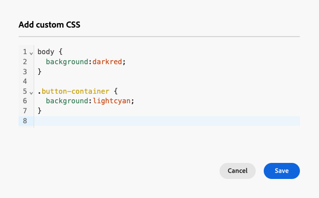

# 將自訂 CSS 新增至您的電子郵件內容 {#email-metadata}

>[!CONTEXTUALHELP]
>id="ac_edition_css"
>title="輸入自己的 CSS"
>abstract="若想要擁有更大的彈性與控制力來決定內容的外觀，您可以直接在電子郵件設計工具中新增自訂 CSS 來套用進階和特定樣式。"

在設計電子郵件時，您可以直接在[!DNL Journey Optimizer] [電子郵件Designer](get-started-email-design.md)中新增您自己的自訂CSS。 此功能可讓您套用進階和特定的樣式，從而獲得更大的靈活性並控制內容的外觀。

## 定義自訂CSS {#define-custom-css}

若要將自訂CSS新增至您的電子郵件內容，請遵循下列步驟。

1. 新增至少一個[元件](content-components.md)，確定電子郵件Designer中已定義某些內容。

1. 從左側的&#x200B;**[!UICONTROL 導覽樹狀結構]**&#x200B;或右窗格頂端選取&#x200B;**[!UICONTROL 內文]**。 **[!UICONTROL CSS樣式]**&#x200B;區段會顯示在右側。

   ![選取[新增自訂CSS]按鈕](assets/email-body-css-styles.png){width="85%"}

   >[!NOTE]
   >
   >**[!UICONTROL CSS樣式]**&#x200B;區段僅在內容已存在於編輯器中時才能使用。

1. 按一下&#x200B;**[!UICONTROL 新增自訂CSS]**&#x200B;按鈕。

   >[!NOTE]
   >
   >**[!UICONTROL 新增自訂CSS]**&#x200B;按鈕僅在選取&#x200B;**[!UICONTROL 內文]**&#x200B;時可用。 不過，您可以將自訂CSS樣式套用至內容內的所有元件。

1. 在彈出的專用文字區域中輸入您的CSS代碼。 請確定自訂CSS有效並遵循正確語法。 [了解更多](#use-valid-css)

   {width="65%"}

   >[!NOTE]
   >
   >使用具有鎖定內容[的](../content-management/content-locking.md#use)範本時，您無法新增自訂CSS至您的內容。 按鈕標籤變更為&#x200B;**[!UICONTROL 檢視自訂CSS]**，而且內容中已存在的任何自訂CSS都是唯讀的。

1. 儲存自訂CSS並確認自訂CSS已正確套用至您的內容。 如果不是這種情況，請檢視[疑難排解](#troubleshooting)區段。

   ![選取[新增自訂CSS]按鈕](assets/email-body-custom-css-applied.png){width="85%"}

1. 如果您移除所有內容，該區段會消失，並且先前定義的自訂CSS將不再套用。

1. 將內容新增回編輯器，以使&#x200B;**[!UICONTROL CSS樣式]**&#x200B;區段重新出現。 再次套用自訂CSS。

## 確保使用有效的CSS {#use-valid-css}

您可以在&#x200B;**[!UICONTROL 新增自訂CSS]**&#x200B;文字區域中輸入任何有效的CSS字串。 格式正確的CSS會立即套用至內容。

>[!CAUTION]
>
>使用者須負責其自訂CSS的安全性。 確保您的CSS不會引進漏洞或與現有內容衝突。
>
>避免使用可能無意中破壞內容版面或功能的CSS。

+++ CSS範例

以下是有效CSS的範例。

```css
.acr-component[data-component-id="form"] {
  display: flex;
  justify-content: center;
  background: none;
}

.acr-Form {
  width: 100%;
  padding: 20px 100px;
  border-spacing: 0px 8px;
  box-sizing: border-box;
  margin: 0;
}

.acr-Form .spectrum-FieldLabel {
  width: 20%;
}

.acr-Form.spectrum-Form--labelsAbove .spectrum-FieldLabel,
.acr-Form [data-form-item="checkbox"] .spectrum-FieldLabel {
  width: auto;
}

.acr-Form .spectrum-Textfield {
  width: 100%;
}

#acr-form-error,
#acr-form-confirmation {
  width: 100%;
  padding: var(--spectrum-global-dimension-static-size-500);
  display: flex;
  align-items: center;
  flex-direction: column;
  justify-content: center;
  gap: var(--spectrum-global-dimension-static-size-200);
}

.spectrum-Form-item.is-required .spectrum-FieldLabel:after{
  content: '*';
  font-size: 1.25rem;
  margin-left: 5px;
  position: absolute;
}

/* Error field placeholder */
.spectrum-HelpText {
  display: none !important;
}

.spectrum-HelpText.is-invalid,
.is-invalid ~ .spectrum-HelpText {
  display: flex !important;
}
```

```css
@media only screen and (min-width: 600px) {
  .acr-paragraph-1 {
    width: 100% !important;
  }
}
```

+++


+++ 無效CSS的範例

如果輸入的CSS無效，則會顯示錯誤訊息，指出CSS無法儲存。 以下是無效的CSS範例。

不接受使用`<style>`標籤：

```html
<style type="text/css">
  .acr-Form {
    width: 100%;
    padding: 20px 100px;
    border-spacing: 0px 8px;
    box-sizing: border-box;
    margin: 0;
  }
</style>
```

不接受無效語法，例如缺少大括弧：

```css
body {
  background: red;
```

+++

## 技術實作 {#implementation}

您的自訂CSS已新增到`<head>`區段的結尾，做為具有`<style>`屬性的`data-name="global-custom"`標籤的一部分，如下面的範例所示。 這可確保自訂樣式可全域套用至內容。

+++ 請參閱範例 

```html
<!DOCTYPE html>
<html>
  <head>
    <meta charset="utf-8">
    <meta name="content-version" content="3.3.31">
    <meta name="x-apple-disable-message-reformatting">
    <meta name="viewport" content="width=device-width,initial-scale=1.0">
    <style data-name="default" type="text/css">
      td { padding: 0; }
      th { font-weight: normal; }
    </style>
    <style data-name="grid" type="text/css">
      .acr-grid-table { width: 100%; }
    </style>
    <style data-name="acr-theme" type="text/css" data-theme="default" data-variant="0">
      body { margin: 0; font-family: Arial; }
    </style>
    <style data-name="media-default-max-width-500px" type="text/css">
      @media screen and (max-width: 500px) {
        body { width: 100% !important; }
      }
    </style>
    <style data-name="global-custom" type="text/css">
      /* Add you custom CSS here */
    </style>
  </head>
  <body>
    <!-- Minimal content -->
  </body>
</html>
```

+++


電子郵件Designer的&#x200B;**[!UICONTROL 設定]**&#x200B;窗格不會解譯或驗證自訂CSS。 它是完全獨立的，而且只能透過&#x200B;**[!UICONTROL 新增自訂CSS]**&#x200B;選項進行修改。

### 護欄 — 匯入內容

如果您想要搭配匯入電子郵件Designer的內容使用自訂CSS，請考慮下列事項：

* 如果匯入包含CSS的外部HTML內容，除非轉換該內容，否則將會在&#x200B;**[!UICONTROL 相容性模式]**&#x200B;中，其中&#x200B;**[!UICONTROL CSS樣式]**&#x200B;區段無法使用。 [進一步瞭解匯入現有內容](existing-content.md)

* 如果匯入使用電子郵件Designer建立的內容，包括透過&#x200B;**[!UICONTROL 新增自訂CSS]**&#x200B;選項套用的CSS，則先前套用的CSS將可透過相同選項顯示和編輯。

<!--
* If importing content created with the Email Designer with CSS applied externally, the CSS code previously applied cannot be accessed within the **[!UICONTROL Add custom CSS]** pop-up window, but you can still override it with new custom CSS.-->

## 疑難排解 {#troubleshooting}

如果未套用您的自訂CSS，請考慮下列選項。

* 請確定您的CSS有效，且沒有語法錯誤（例如缺少大括弧、屬性名稱不正確）。 [了解作法](#use-valid-css)

* 確定您的CSS已新增至具有`<style>`屬性的`data-name="global-custom"`標籤。

* 檢查`global-custom`樣式標籤是否已將屬性`data-disabled`設定為`true`。 若是如此，則不會套用自訂CSS。

  +++ 例如：

  ```html
  <style data-name="global-custom" type="text/css" data-disabled="true"> body: { color: red; } </style>
  ```

  +++

* 確保您的CSS不會被其他CSS規則覆寫，包括任何套用至您內容的[主題](apply-email-themes.md)。

   * 使用您的瀏覽器開發人員工具來檢查內容，並確認您的CSS是否鎖定正確的選取器。

   * 請考慮將`!important`加入宣告中，以確保它們優先。

     +++ 例如：

     ```css
     .acr-Form {
       background: red !important;
     }
     ```

     +++
