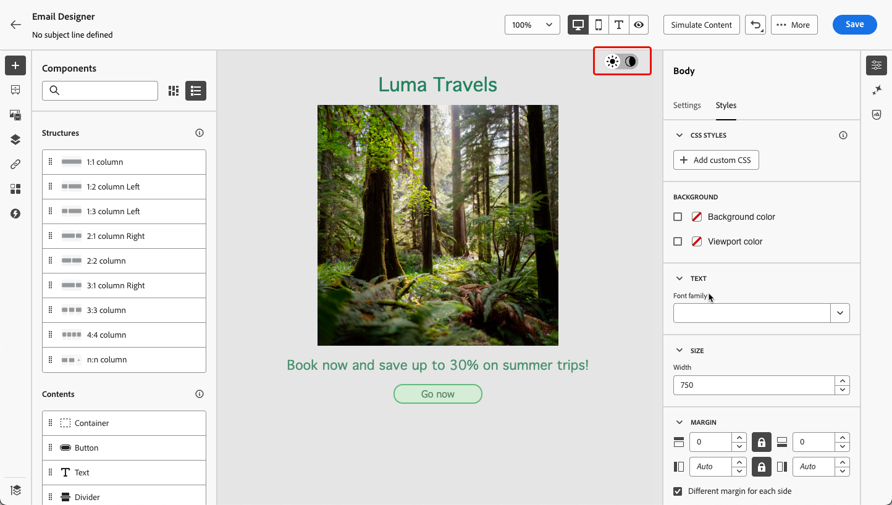
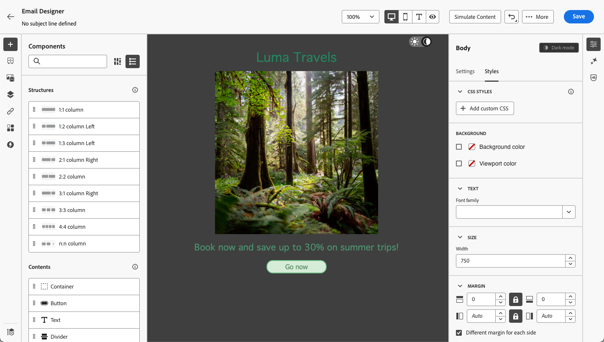
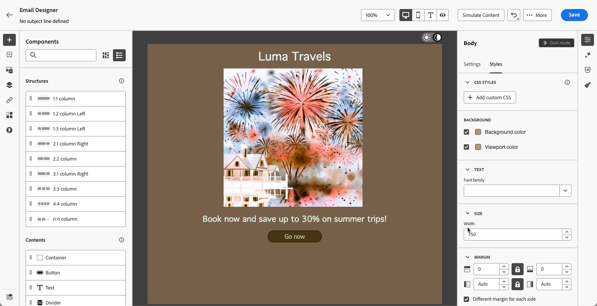
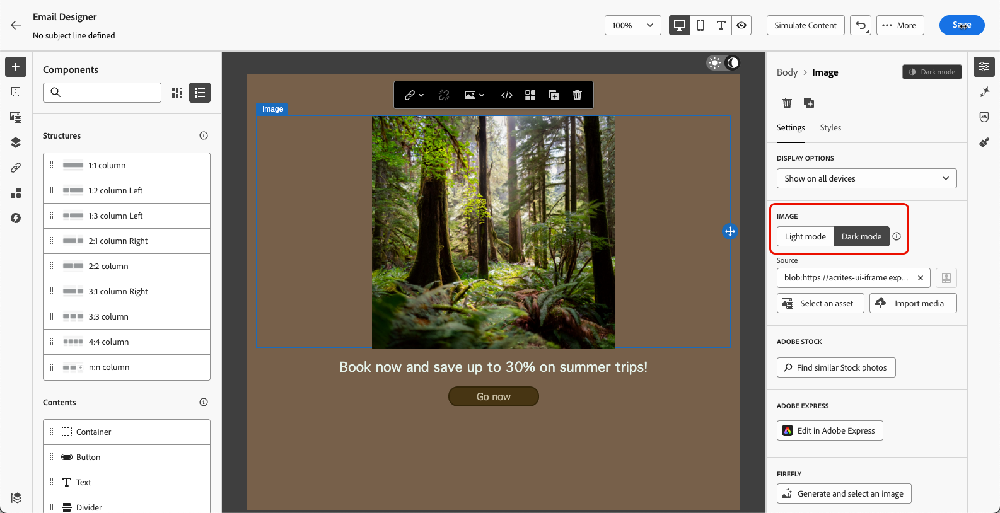
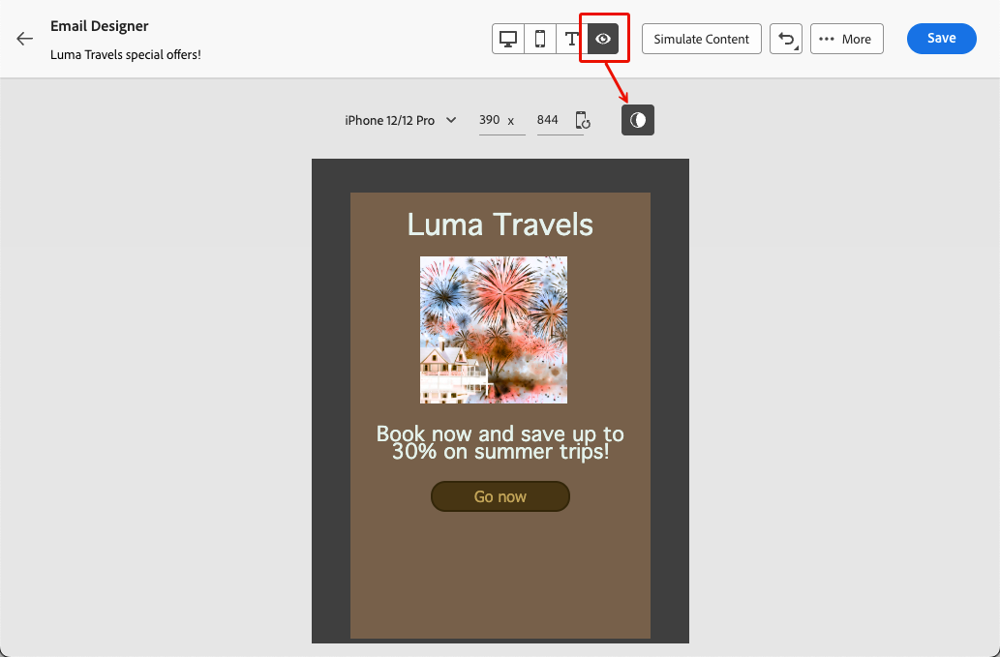
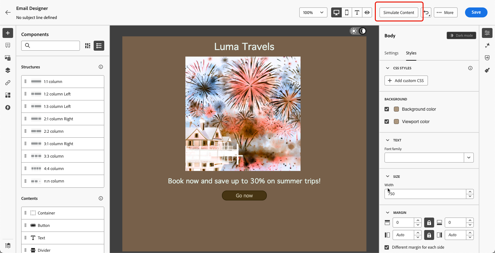

# 管理深色模式內容 {#dark-mode}

>[!CONTEXTUALHELP]
>id="ac_edition_darkmode"
>title="切換至深色模式"
>abstract="切換至深色模式，您可以預覽其呈現方式並定義特定的自訂設定。 警告：最終呈現結果取決於收件者的電子郵件用戶端。並非所有電子郵件用戶端都支援自訂深色模式。"

>[!CONTEXTUALHELP]
>id="ac_edition_darkmode_image"
>title="將特定影像用於深色模式"
>abstract="您可以選取另一張影像，以在深色模式開啟時顯示。 警告：為深色模式新增特定影像並不能保證它將在所有電子郵件用戶端中正確呈現。並非所有電子郵件用戶端都支援自訂深色模式。"

>[!CONTEXTUALHELP]
>id="ac_edition_darkmode_preview"
>title="切換至深色模式"
>abstract="切換至深色模式，以預覽它在支援的電子郵件用戶端上的呈現方式。 警告：最終呈現結果取決於收件者的電子郵件用戶端。並非所有電子郵件用戶端都支援自訂深色模式。"

>[!AVAILABILITY]
>
>此功能目前為 Beta 版本，僅供 Beta 版客戶使用。若要加入 Beta 版計畫，請聯絡 Adobe 代表。

設計電子郵件時，[!DNL Journey Optimizer] [電子郵件Designer](get-started-email-design.md)可讓您切換至&#x200B;**[!UICONTROL 深色模式]**&#x200B;檢視。

在這個<!--Email Designer -->深色模式檢視中，您也可以定義特定的自訂設定，當支援的電子郵件使用者端開啟深色模式時，這些設定將會顯示。

<!--When designing your emails, the Journey Optimizer Email Designer allows you to switch to Dark mode where you can define specific custom settings. When dark mode is on, the supporting email clients will display the settings that you defined for this mode.-->

## 什麼是深色模式？ {#what-is-dark-mode}

在各種電子郵件使用者端中呈現深色模式的方式很複雜。 讓我們先定義深色模式。

深色模式可讓支援的電子郵件使用者端和應用程式針對文字、按鈕和其他UI元素，顯示背景較暗且顏色較淺的電子郵件。 它可減輕眼睛疲勞、節省電池壽命，並改善低光環境的可讀性，提供更舒適的觀賞體驗。

<!--Dark Mode uses a dark color palette with light text and UI elements to reduce eye strain, save battery life, and improve readability in low-light environments.-->

隨著主要作業系統和應用程式<!-- (Apple Mail, Gmail, Outlook, Twitter, Slack)-->的不斷發展，它已成為現代電子郵件設計的重要考量，以確保內容清晰易讀，且對所有使用者都具有吸引力。

## 護欄 {#guardrails}

在深色模式演算方面，您必須謹慎考量您的期望，因為不同的電子郵件使用者端的套用方式可能大不相同。

<!--The dark mode final rendering depends on the recipient's email client. It is not possible to guarantee that your email will look the same in dark mode across all devices.-->

在[!DNL Journey Optimizer]電子郵件Designer中使用深色模式之前，瞭解主要電子郵件使用者端如何處理該模式至關重要。 區分的案例有三種：

<!--
* Check out the list of [email clients supporting dark mode](https://www.caniemail.com/search/?s=dark){target="_blank"}

* Learn more on Dark mode in this [Litmus blog post](https://www.litmus.com/blog/the-ultimate-guide-to-dark-mode-for-email-marketers){target="_blank"}
-->

### 使用者端不支援深色模式 {#not-supporting}

有些電子郵件使用者端完全不支援此功能，例如：
* Yahoo！Mail
* AOL

無論您是否在Email Designer中定義深色模式自訂設定，這些電子郵件使用者端都不會顯示任何深色模式轉譯。<!--Regardless of whether the interface is in light or dark mode, your email will render the same.-->

### 使用者端套用自己的深色模式 {#default-support}

有些電子郵件使用者端會系統地將其本身的預設深色模式套用至所收到的所有電子郵件。 顏色、背景、影像等 會使用電子郵件使用者端特有的深色模式設定自動調整。

例如，這些使用者端為：

* Gmail (案頭網頁郵件、iOS、Android、行動網頁郵件)
* Outlook Windows
* Outlook Windows Mail

在此案例中，如果您在電子郵件Designer中定義自訂深色模式設定，則這些設定會被電子郵件使用者端設定覆寫。

請務必瞭解，這些電子郵件使用者端確實會處理深色模式，但您的特定深色模式設計將不會呈現。

<!--In this case, the custom settings that you defined in the Email Designer cannot be rendered.-->

<!--Some visual changes may also be caused by the email app or device overriding the original design.-->

### 支援自訂深色模式的使用者端 {#custom-support}

其他電子郵件使用者端提供以`@media (prefers-color-scheme: dark)`查詢呈現自訂深色模式的選項，這是[!DNL Journey Optimizer]電子郵件Designer所使用的方法。

以下是處理此選項的主要使用者端清單：

* Apple Mail macOS
* Apple Mail iOS
* Outlook macOS
* Outlook.com
* Outlook iOS
* Outlook Android

在此情況下，應顯示您在電子郵件Designer中定義的特定設定。

>[!NOTE]
>
>在[本節](#define-custom-dark-mode)中瞭解如何使用電子郵件Designer定義自訂深色模式設定。

但是，可能會有某些限制。 例如，如果電子郵件內容中存在影像，某些電子郵件使用者端(例如Apple Mail 16 (macOs 13))將不會產生深色模式。

## 電子郵件設計工具中的深色模式 {#dark-mode-email-designer}

在電子郵件Designer中，若要使用深色模式，必須考量兩個方面：

* 您可以預覽預設深色模式在大多數支援的電子郵件使用者端中的呈現方式。 [了解更多](#preview-dark-mode)

<!--
    >[!CAUTION]
    >
    >The final rendering may vary according to the recipient's email client. To see the exact rendering for each email client, use the [Email rendering](../content-management/rendering.md) option.-->

* 如果您想要覆寫支援電子郵件使用者端的預設設定，可以定義套用至正在編輯之電子郵件的自訂深色模式設定。 [了解更多](#define-custom-dark-mode)

<!--
    >[!WARNING]
    >
    >Not all email clients support custom dark mode. Some email clients only apply their own default dark mode for all emails that are received. In this case, the custom settings that you defined in the Email Designer cannot be rendered. [Learn more](#guardrails)-->

### 預覽預設深色模式 {#preview-dark-mode}

若要存取電子郵件Designer中的深色模式，並取得預設深色模式設定的預覽，請遵循下列步驟。

1. 從電子郵件Designer首頁，選取&#x200B;**[!UICONTROL 從草稿開始設計]**&#x200B;選項。 [了解更多](content-from-scratch.md)

<!--Should work with templates and themes, NOT for LP and fragments - but TBC with eng.
    >[!NOTE]
    >
    >Currently you may not be able to switch to dark mode if you select an [email template](use-email-templates.md) or if you apply a [theme](apply-email-themes.md).-->

1. 將[結構](content-from-scratch.md)和[內容元件](content-components.md)新增至您的內容。

1. 在中央畫布的右上方，切換至&#x200B;**[!UICONTROL 深色模式]**。

   

1. 預設深色模式預覽隨即顯示。

   

依預設，電子郵件Designer深色模式預覽會將「全色反轉」色彩配置套用至影像和圖示以外的所有元素。

這表示它會偵測含有明暗元素的區域，並加以反轉，讓淺色背景變成深色，深色文字變成淺色，而深色背景變成淺色，淺色文字變成深色。

>[!CAUTION]
>
>最終呈現內容可能會因收件者的電子郵件使用者端而異。 若要檢視儘可能接近每個電子郵件使用者端最終結果的模擬，請使用[電子郵件呈現](../content-management/rendering.md)選項。

<!--This is custom dark mode:

  

Here you can see that we have applied a different background, defined another image and change the color of the text and button.-->

### 定義自訂深色模式 {#define-custom-dark-mode}

切換至&#x200B;**[!UICONTROL 深色模式]**&#x200B;後，您可以選擇編輯內容的特定樣式元素，這些樣式元素只有在收件者的電子郵件使用者端中啟用深色模式時才會顯示，前提是它支援該功能。

>[!WARNING]
>
>深色模式的最終呈現取決於每個電子郵件使用者端，因此結果可能因人而異。 [了解更多](#guardrails)

<!--
>[!WARNING]
>
>Not all email clients support dark mode. Moreover, some email clients only apply their own default dark mode for all emails that are received. In both cases, the custom settings that you defined in the Email Designer cannot be rendered.-->

若要運用Email Designer自訂深色模式樣式，Journey Optimizer會使用<!-- `@media (prefers-color-scheme: dark)` method--> `@media (prefers-color-scheme: dark)` CSS查詢，會偵測使用者的電子郵件使用者端是否已設為深色模式，並套用您電子郵件中定義的深色主題設計。

若要定義自訂深色模式設定，請遵循下列步驟。

1. 請務必在電子郵件Designer中切換至&#x200B;**[!UICONTROL 深色模式]**&#x200B;預覽。 [了解作法](#preview-dark-mode)

1. 編輯任何樣式色彩屬性，例如文字、背景、按鈕等。

1. 您無法變更影像和圖示的顏色，但只能為深色模式定義特定資產。 若要這麼做，請選取任何影像。 使用&#x200B;**[!UICONTROL 設定]**&#x200B;窗格中的專用切換開關切換至&#x200B;**[!UICONTROL 深色模式]**&#x200B;並選取其他資產。

   

   <!---->

1. 您隨時可以&#x200B;**[!UICONTROL 切換到即時檢視]**，以檢查您的內容在各種裝置大小上可能會如何呈現。 從這個檢視中，選取畫面頂端的「深色模式」切換按鈕，即可預覽不同裝置上的深色模式內容版本。

   {width="80%" align="center"}

   >[!CAUTION]
   >
   >即時檢視是通用的預覽，用來比較各種裝置大小下的轉譯效果。 最終呈現內容可能會因收件者的電子郵件使用者端而異。

1. 在您滿意深色模式的變更後，請按一下&#x200B;**[!UICONTROL 模擬內容]**。

   

1. 選取&#x200B;**[!UICONTROL 轉譯電子郵件]**&#x200B;並連線至您的Litmus帳戶。 您可以看到各種電子郵件使用者端的最終深色模式演算。 深入瞭解[電子郵件呈現](../content-management/rendering.md)。

   >[!WARNING]
   >
   >雖然模擬非常接近電子郵件在深色模式下的顯示方式，但由於電子郵件服務提供者或裝置層級設定的差異，實際呈現可能會有所不同。

## 最佳做法 {#best-practices}

隨著主要電子郵件使用者端採用深色模式的人數增加，您必須考量您的電子郵件在明暗環境中呈現的方式，不論您是否使用[自訂深色模式](#define-custom-dark-mode)。

深色模式可以改變顏色、背景和影像 — 有時會覆寫設計選擇。 為確保視覺一致性、協助工具及品牌完整性，請遵循下列最佳實務。

**最佳化您的影像和標誌**

* 將圖志和圖示儲存為具有透明背景的PNG，以避免在深色模式中看到白色方塊。

* 避免使用硬式編碼白色或淺色背景的影像。

* 如果無法使用透明度，請在設計中將影像置於純色背景上，以防止發生尷尬的顏色倒轉。

**觀看您的背景**

* 確保文字和背景顏色之間有足夠的對比，以便在淺色和深色模式中都能閱讀。

* 避免僅依賴背景顏色處理重要內容。 有些使用者端會以深色模式覆寫背景顏色，因此請確定關鍵資訊仍然可見。

<!--**Inline critical styles**

Inline CSS helps maintain more control over styling, as some clients strip external styles in dark mode.-->

**在深色模式中設計可存取的內容**

<!--KEEP dark mode accessibility best practices IN ONE SINGLE LOCATION - for now listed on this page.
If needed, it can be moved to the Design accessible content page:
The best practices for designing accesible content in dark mode are listed in [this section](accessible-content.md#dark-mode).-->

* 使用顏色組合，可輕鬆區別色盲人士。

* 使用中間調調色盤，確保與淺色和深色背景的對比。

* 使用具有高對比度的無障礙色彩組合，以改善可讀性，並符合網頁內容可及性指引(WCAG)標準。 使用WebAIM的「對比檢查器」等工具，驗證色彩對比。

* 避免使用精簡字型，因為這會影響可讀性。 如果您的品牌需要細字型，請在深色模式中將其粗體。

* 略過純黑色的純白色，因為它可能會導致眼睛疲勞，並且可能會由某些電子郵件使用者端自動反轉。

* 如果深色模式不受支援，請提供可存取的遞補樣式。

**在深色模式環境中測試您的電子郵件**

* 使用電子郵件Designer的[深色模式預覽](#preview-dark-mode)，它使用反轉的色彩配置來提早發現問題。

* 使用[電子郵件呈現](../content-management/rendering.md)選項，利用Litmus在主要電子郵件使用者端(Apple Mail、Gmail、Outlook)間模擬您的設計，並瞭解色彩和影像在深色模式下的行為。

<!--

## Email clients supporting dark mode {#supporting-email-clients}

Below is a list of the main email clients supporting dark mode using the with the `@media (prefers-color-scheme: dark)` query.

>[!NOTE]
>
>Some versions of these email clients do not support dark mode, so they are also presented in this table for the sake of clarity.

| Email clients supporting custom dark mode| Compatible versions | *Unsupported versions* |
|---------|----------|---------|
| Apple Mail macOS| 12.4, 16.0 | *10.3* |
| Apple Mail iOS | 13.0, 16.1 | *12.2* |
| Outloook macOS | 2019, 16.70, 16.80 | NA |
| Outlook.com | 2019-07, 2022-12 | NA |
| Outloook iOS | 2020-01, 2022-12 | NA |
| Outloook Android | 2023-03 | *2020-01, 2022-12* |

| Other email clients supporting custom dark mode| Compatible versions | *Unsupported versions* |
|---------|----------|---------|
| Samsung Email (Android) | 6.1 | *6.0* |
| Mozilla Thunderbird (macOS) | 68.4 | *60.8, 78.5, 91.13* |
| Fastmail (Desktop Webmail)| 2022-12 | *2021-07* |
| HEY (Desktop Webmail)| 2020-06 | *2022-12* |
| Orange Desktop Webmail| 2019-08, 2021-03, 2022-12, 2024-04 | NA |
| Orange iOS | 2022-12, 2024-04 | *2020-01* |
| Orange Android | 2024-04 | *2020-01, 2022-12* |
| LaPoste.net | 2021-08, 2022-12 | NA |
| SFR  Desktop Webmail | 2019-08, 2022-12 | NA |
| GMX (iOs and Android) | 2022-06 | NA |
| 1&1 (Desktop Webmail and Android) | 2022-06 | NA |
| WEB.DE (iOs and Android) | 2022-06 | NA |
| Free.fr | 2022-12 | NA |

>[!WARNING]
>
>The dark mode final rendering depends on each email client, so results can vary from one to another.

## Email clients not supporting dark mode {#non-supporting-email-clients}

Some email clients allow users to switch their interface to dark mode, but this setting does not affect how HTML emails are displayed.  Here is a list of those clients:

| Main email clients with their own dark mode| 
|---------|
| Gmail (Desktop Webmail, iOS, Android, Mobile Webmail) | 
| Outloook Windows |
| Outlook Windows Mail |

Other email clients do not support dark mode at all:

| Main email clients not supporting dark mode| 
|---------|
| Yahoo!Mail | 
| AOL | 

| Other mail clients not supporting dark mode| 
|---------|
| ProtonMail |
| SFR iOS |
| SFR Android | 
| GMX Desktop Webmail | 
| Mail.ru | 
| WEB.DE Desktop Webmail | 
| T-online.de |

-->