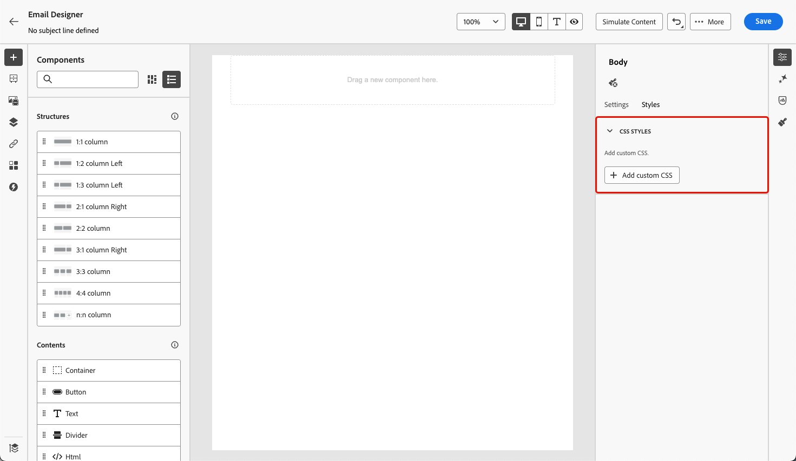

# 將中繼資料新增至電子郵件內容 {#email-metadata}

>[!CONTEXTUALHELP]
>id="ac_edition_css"
>title="新增自訂CSS"
>abstract="xxx."

在設計電子郵件時，您可以直接在[!DNL Journey Optimizer] [電子郵件Designer](get-started-email-design.md)中新增您自己的自訂CSS。

新增自訂CSS文字區域中的預期專案是有效的CSS字串。



可用性條件

新增自訂CSS功能只有在編輯器中定義內容時才能使用。 若要檢視新增自訂CSS區段，使用者必須在編輯器中新增內容。 如果使用者移除其所有內容，該區段將會消失，且不會套用自訂css。 如果使用者將內容新增回，將可使用區段並套用自訂CSS。

**無效的CSS輸入範例**

無效的CSS無法儲存，如果CSS無效，將會出現紅色快顯通知以表示無法儲存CSS。

`<style>`未被接受


```
<style type="text/css">
  .acr-Form {
    width: 100%;
    padding: 20px 100px;
    border-spacing: 0px 8px;
    box-sizing: border-box;
    margin: 0;
  }
</style>
```


缺少大括弧無效

```
body {
 background: red; 
```
