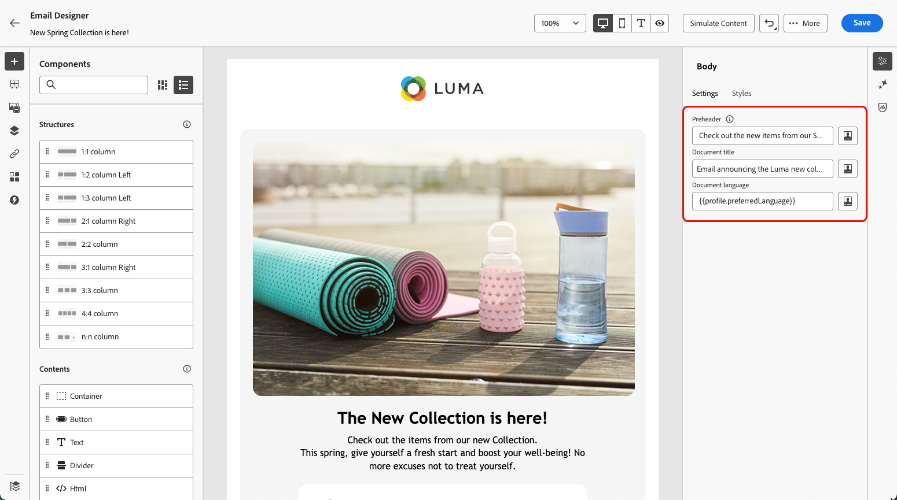
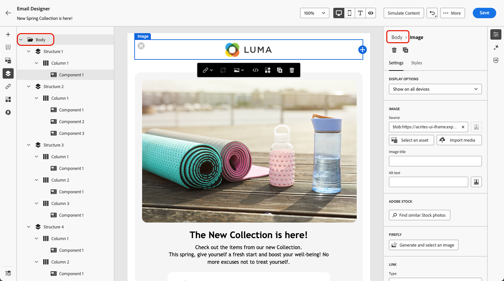
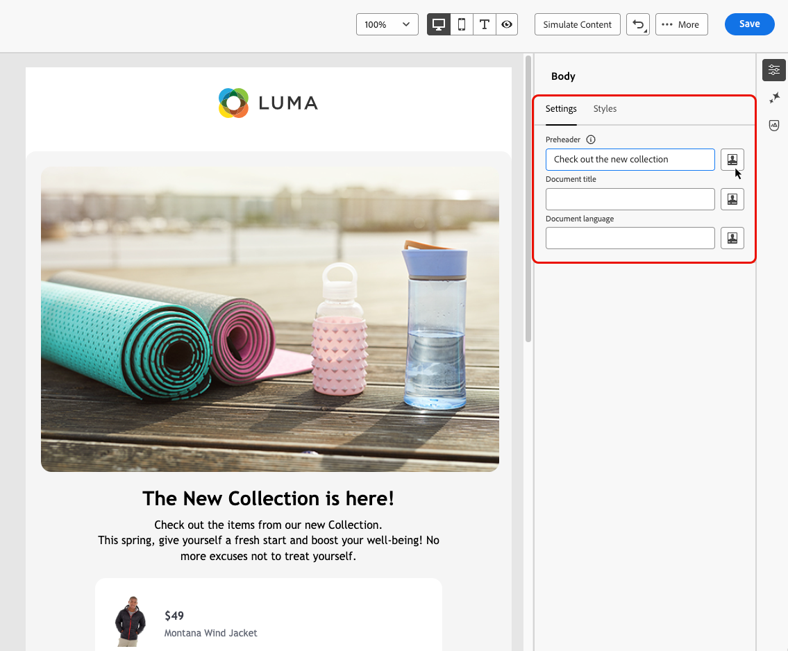

# 將中繼資料新增至電子郵件內容 {#email-metadata}

>[!CONTEXTUALHELP]
>id="ac_edition_preheader"
>title="定義預覽文字"
>abstract="預覽文字指在檢視來自您的電子郵件用戶端的電子郵件時接在主旨行後面的簡短摘要文字。在許多情況下，這段文字會提供電子郵件的簡短摘要，並且長度通常只有一個句子。"

在設計電子郵件時，為了提高可讀性和可存取性，您可以為內容定義其他中繼屬性。 [!DNL Journey Optimizer] [電子郵件Designer](get-started-email-design.md)可讓您指定下列元素：

* **[!UICONTROL 預覽文字]**：預覽文字是簡短摘要文字，當從您的電子郵件使用者端檢視電子郵件時，會跟隨主旨行。 在許多情況下，這段文字會提供電子郵件的簡短摘要，並且長度通常只有一個句子。

  >[!NOTE]
  >
  >並非所有電子郵件用戶端都支援預覽文字。如果不支援，就不會顯示預覽文字。

* **[!UICONTROL 檔案標題]**：此欄位對應至`<title>`元素，提供有關電子郵件內容的描述性資訊，通常會在滑鼠懸停時顯示為工具提示。 它可提供額外的內容，以協助殘障使用者更好地瞭解您的內容。

* **[!UICONTROL 檔案語言]**：若要確保無障礙環境，您可以指定熒幕朗讀程式將文字和影像轉換為語音或盲文的語言 — 適用於視障或學習障礙人士。 此設定對應至`lang`專案中的`<html>`屬性。

若要進行這些設定，請遵循下列步驟。

1. 從[電子郵件Designer](content-from-scratch.md)，新增至少&#x200B;**[!UICONTROL 結構元件]**&#x200B;以開始設計您的電子郵件。

1. 按一下&#x200B;**[!UICONTROL 內文]** （從左邊的&#x200B;**[!UICONTROL 導覽樹狀結構]**&#x200B;或右窗格頂端）。

   

1. 從&#x200B;**[!UICONTROL 設定]**&#x200B;索引標籤中，在&#x200B;**[!UICONTROL Preheader]**、**[!UICONTROL 檔案標題]**&#x200B;和/或&#x200B;**[!UICONTROL 檔案語言]**&#x200B;欄位中鍵入一些文字。

1. 您也可以按一下每個欄位旁的個人化圖示，從設定檔屬性、對象、內容屬性等自訂您的內容。 [進一步瞭解個人化](../personalization/personalization-build-expressions.md)

   

1. 按一下&#x200B;**[!UICONTROL 儲存]**，以確認您所做的變更。