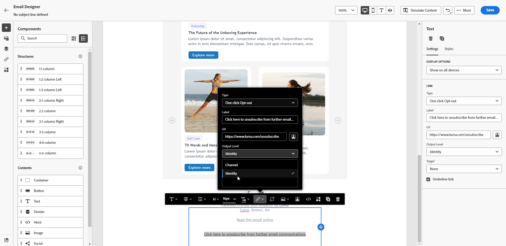
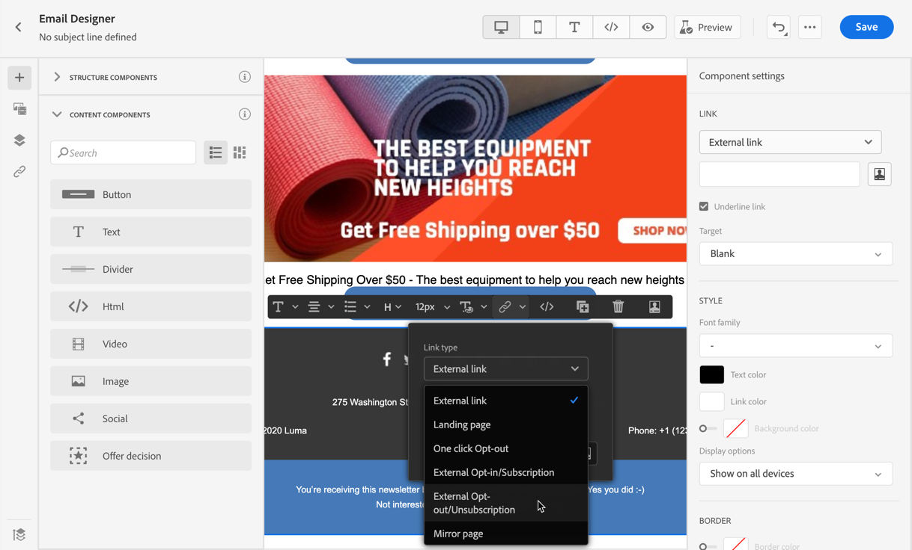

# 電子郵件選擇退出管理 {#email-opt-out}

從歷程或行銷活動傳送訊息時，您必須一律確保客戶可取消訂閱未來的通訊。 取消訂閱後，設定檔會自動從未來行銷訊息的對象中移除。  [進一步瞭解隱私權與選擇退出管理](../privacy/opt-out.md)

>[!NOTE]
>
>您的所有行銷訊息都必須包含選擇退出連結。 異動訊息不需要此屬性。 訊息類別 — **[!UICONTROL 行銷]**&#x200B;或&#x200B;**[!UICONTROL 異動]** — 是在[頻道設定](email-settings.md#email-type)層級及建立訊息時定義。

若要在電子郵件內容中插入取消訂閱連結，您可以：

* 在電子郵件標題中新增一鍵取消訂閱URL。 頻道設定層級的&#x200B;**[!UICONTROL 啟用List-Unsubscribe]**&#x200B;選項會將選擇退出連結新增至電子郵件標題。 [進一步瞭解電子郵件標頭中的選擇退出](#unsubscribe-header)

* 為您的電子郵件啟用&#x200B;**一鍵退出連結**。  [瞭解如何新增一鍵退出連結](#one-click-opt-out)

* 插入登陸頁面&#x200B;**的**&#x200B;連結。 [瞭解如何新增選擇退出的登陸頁面](#opt-out-external-lp)

當收件者按一下選擇退出連結時，則會據此處理其取消訂閱請求。

若要檢查對應的設定檔選擇是否已更新，請前往Experience Platform並[瀏覽至該設定檔](https://experienceleague.adobe.com/en/docs/experience-platform/profile/ui/user-guide?lang=en#browse-tab){target="_blank"}。 在[屬性標籤](https://experienceleague.adobe.com/en/docs/experience-platform/profile/ui/user-guide#attributes){target="_blank"}中，您可以看到&#x200B;**[!UICONTROL 選擇]**&#x200B;的值已變更為&#x200B;**[!UICONTROL no]**。 在[Experience Platform檔案](https://experienceleague.adobe.com/docs/experience-platform/landing/governance-privacy-security/consent/adobe/overview.html){target="_blank"}中進一步瞭解同意處理。


>[!NOTE]
>
>有時，由於下游資料處理的緣故，取消訂閱事件可能需要更長的時間才能反映在設定檔層級。 留出一些時間讓系統更新。

## 一步選擇退出 {#opt-out-one-step}

透過[!DNL Adobe Journey Optimizer]，您可以使用自動產生的一鍵式取消訂閱URL和電子郵件標題中的mailto位址來設定[電子郵件組態設定](email-settings.md#list-unsubscribe)，或在您的電子郵件內文中包含一鍵式選擇退出URL。

### 電子郵件標頭中的一鍵取消訂閱 URL {#unsubscribe-header}

一鍵式清單取消訂閱URL是電子郵件寄件者資訊旁邊顯示的取消訂閱連結或按鈕，可讓收件者只要按一下即可立即選擇退出您的郵寄清單。 瞭解如何管理&#x200B;**[!UICONTROL 本節]**&#x200B;中的[清單取消訂閱](list-unsubscribe.md)選項。

### 一鍵式選擇退出電子郵件內容 {#one-click-opt-out}

若要設定個人化取消訂閱URL，請在電子郵件內容中插入一鍵退出連結，然後輸入您選擇的URL，如下所述：

1. 存取您的電子郵件內容，並[插入連結](../email/message-tracking.md#insert-links)。
1. 選取&#x200B;**[!UICONTROL 按一下退出]**&#x200B;作為連結型別。

   

1. 輸入登陸頁面的URL，一旦取消訂閱，就會將使用者重新導向。 此頁用於確認選擇退出成功。

   >[!NOTE]
   >
   >如果您在&#x200B;**[!UICONTROL 通道組態層級]**&#x200B;啟用[List-Unsubscribe](email-settings.md#list-unsubscribe)選項，且取消核取預設的&#x200B;**[!UICONTROL 一鍵取消訂閱URL]**&#x200B;選項，則當使用者按一下電子郵件標頭的取消訂閱連結時，也會使用此登陸頁面URL。 [了解更多](list-unsubscribe.md)

   

   您可以個人化連結。 在[本節](../personalization/personalization-syntax.md)中進一步瞭解個人化URL。

1. 選取您要套用選擇退出的方式：在頻道或身分層級。

   

   * **[!UICONTROL 頻道]**：選擇退出適用於未來的訊息，傳送到目前頻道的輪廓目標 (即電子郵件地址)。 如果輪廓連結數個目標，選擇退出將套用於該頻道輪廓的所有目標 (即電子郵件地址)。
   * **[!UICONTROL 身分識別]**：選擇退出適用於未來的訊息，傳送給目前郵件使用的特定目標 (即電子郵件地址)。
     <!--* **[!UICONTROL Subscription]**: The opt-out applies to future messages associated with a specific subscription list. This option can only be selected if the current message is associated with a subscription list.-->

1. 儲存您的變更。


## 兩步驟選擇退出 {#opt-out-external-lp}

標準的選擇退出機制取決於兩個步驟：訂閱者按一下電子郵件中的選擇退出連結，然後被重新導向至選擇退出登陸頁面，以確認取消訂閱。

若要實作此取消訂閱模式，您必須建立並發佈選擇退出登陸頁面，並在電子郵件訊息中新增取消訂閱連結，連同登陸頁面的連結。 這些步驟概述如下。


### 先決條件 {#prereq-lp}

若要設定兩步驟選擇退出機制，您必須建立自己的取消訂閱登入頁面。 第一個登入頁面將會從您的訊息連結，而且必須包含call-to-action按鈕。 當使用者按一下按鈕時，應顯示確認訊息。

瞭解如何在Adobe Journey Optimizer中建立登陸頁面，以管理[此頁面](../landing-pages/lp-use-cases.md#opt-out)上的取消訂閱。

您也可以使用外部登入頁面。 在此情況下，請設定API以在收件者取消訂閱時將資訊傳送至Adobe Journey Optimizer。

+++ 瞭解如何實作選擇退出API呼叫

要在收件者從登陸頁面提交選擇時選擇退出，您必須實施&#x200B;**訂閱API呼叫** (透過[Adobe Developer](https://developer.adobe.com){target="_blank"})以更新對應設定檔的偏好設定。

此 POST 呼叫如下：

端點：https://platform.adobe.io/journey/imp/consent/preferences

查詢參數：

* **params**：包含加密的裝載
* **pid**：加密的輪廓 ID

這兩個引數將包含在傳送給收件者的第三方登陸頁面URL中：


標頭要求：

* x-api-key
* x-gw-ims-org-id
* x-sandbox-name
* 授權 (用於技術帳戶驗證的使用者權杖)

請求內文：

```
{
   "marketing": [
       {
            "type": "email",           
            "choice": "no",          
            "scope": "channel"       
        }
    ],
 
}
```

[!DNL Journey Optimizer]會使用這些引數，透過[Adobe Developer](https://developer.adobe.com){target="_blank"} API呼叫更新對應設定檔的選擇。

+++


### 新增取消訂閱連結 {#add-unsubscribe-link}

您首先需要在訊息中加入取消訂閱連結。 請依照下列步驟執行此操作：

1. 使用內容工具列建立訊息並[插入連結](../email/message-tracking.md#insert-links)。

   

1. 從&#x200B;**[!UICONTROL 型別]**&#x200B;下拉式清單中選取&#x200B;**[!UICONTROL 登陸頁面]**，然後在&#x200B;**[!UICONTROL 登陸頁面]**&#x200B;欄位中選取您的選擇退出登陸頁面。

   如果您使用外部登陸頁面，請從&#x200B;**[!UICONTROL 型別]**&#x200B;下拉式清單中選取&#x200B;**[!UICONTROL 外部選擇退出/取消訂閱]**。

   

   在&#x200B;**[!UICONTROL 連結]**&#x200B;欄位貼上第三方登陸頁面的連結。

   

1. 按一下「**[!UICONTROL 儲存]**」。


### 傳送包含取消訂閱連結的訊息 {#send-message-unsubscribe-link}

設定好取消訂閱的登陸頁面連結後，您就可以建立並傳送訊息。

1. 使用取消訂閱連結設定您的訊息，並將其傳送給訂閱者。

1. 收到訊息後，如果收件者按一下取消訂閱連結，就會顯示您的登陸頁面。

   

1. 如果收件者提交表單 — 在此按一下登陸頁面中的&#x200B;**[!UICONTROL 取消訂閱]**&#x200B;按鈕 — 會透過API呼叫更新設定檔資料。

1. 然後，選擇退出的收件者會被重新導向至確認訊息畫面，表示成功選擇退出。

   

   因此，除非再次訂閱，否則此使用者將不會收到您品牌的通訊。

