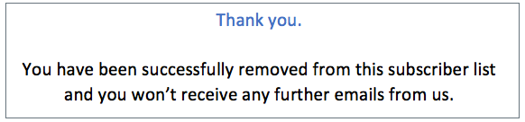

# 電子郵件選擇退出管理 {#email-opt-out}

從歷程或行銷活動傳送訊息時，您必須一律確保客戶可取消訂閱未來的通訊。 取消訂閱後，設定檔會自動從未來行銷訊息的對象中移除。  [進一步瞭解隱私權與選擇退出管理](../privacy/opt-out.md)

>[!NOTE]
>
>您的所有行銷訊息都必須包含選擇退出連結。 異動訊息不需要此屬性。 訊息類別 —  **[!UICONTROL 行銷]** 或 **[!UICONTROL 異動]**  — 定義於 [頻道介面](../configuration/channel-surfaces.md#email-type) 層級和建立訊息時。

若要在電子郵件內容中插入取消訂閱連結，您可以：

* 在電子郵件標題中新增一鍵取消訂閱URL。 啟用 **[!UICONTROL List-Unsubscribe標頭]** 頻道介面層級的選項會在電子郵件標題中新增選擇退出連結。 [進一步瞭解電子郵件標題中的選擇退出](#unsubscribe-header)

* 啟用 **一鍵退出連結** 用於您的電子郵件。  [瞭解如何新增一鍵退出連結](#one-click-opt-out)

* 插入 **連結至登入頁面**. [瞭解如何新增選擇退出登陸頁面](#opt-out-external-lp)


## 單步驟選擇退出 {#opt-out-one-step}

### 在電子郵件標題中按一下「取消訂閱URL」 {#unsubscribe-header}

<!--Do not modify - Legal Review Done -->

>[!CONTEXTUALHELP]
>id="ajo_admin_preset_unsubscribe"
>title="在電子郵件標題中新增取消訂閱URL"
>abstract="啟用List-Unsubscribe Header以在電子郵件標題中新增取消訂閱URL。 若要設定取消訂閱 URL，請在電子郵件內容插入一鍵式選擇退出連結。"
>additional-url="https://experienceleague.adobe.com/docs/journey-optimizer/using/privacy/consent/opt-out.html?lang=zh-Hant#one-click-opt-out" text="一鍵選擇退出"

一鍵式清單取消訂閱URL是電子郵件寄件者資訊旁邊顯示的取消訂閱連結或按鈕，可讓收件者只要按一下即可立即選擇退出您的郵寄清單。 在Adobe Journey Optimizer中，當 **啟用清單取消訂閱** 選項已切換，依預設，電子郵件標題同時包含郵件和/或URL，收件者可使用這些URL取消訂閱您的郵寄清單。

此 [啟用清單取消訂閱](email-settings.md#list-unsubscribe) 必須在頻道介面層級啟用切換，以便使用此介面的電子郵件在電子郵件標題中包含一鍵式取消訂閱URL。

>[!NOTE]
>
>若要在電子郵件標題中顯示一鍵式取消訂閱URL，收件者的電子郵件使用者端必須支援此功能。


例如，按一下取消訂閱URL會在Gmail中顯示取消訂閱連結，如下所示：


透過Adobe Journey Optimizer，您可以透過自動產生的一鍵式取消訂閱URL和電子郵件標題中的mailto地址來設定電子郵件介面設定，或在您的電子郵件內文中包含一鍵式選擇退出URL：當收件者按一下一鍵式選擇退出連結時，收件者的取消訂閱請求會據此處理。

<!--
>[!AVAILABILITY]
>
>One-click Unsubscribe URL Header will be available in Adobe Journey Optimizer starting June 3, 2024.
>
-->

根據電子郵件使用者端及 [電子郵件表面取消訂閱設定](email-settings.md#list-unsubscribe)，按一下電子郵件標題中的取消訂閱連結將產生下列影響：

* 當 **Mailto （取消訂閱）** 功能由您啟用，系統會根據您建立的子網域將取消訂閱請求傳送至預設的取消訂閱位址。
* 當 **一鍵式取消訂閱URL** 功能由您啟用（或如果您在電子郵件內文內容中插入取消訂閱URL），當收件者按一下一鍵取消訂閱URL （根據您建立的子網域）時，收件者會直接在頻道層級或ID層級（取決於同意的設定方式）選擇退出。

在這兩種情況下，收件者的對應設定檔會立即退出，而此選項會在Experience Platform中更新。 進一步瞭解 [Experience Platform檔案](https://experienceleague.adobe.com/docs/experience-platform/profile/ui/user-guide.html?lang=zh-Hant){target="_blank"}.

如果您已切換 **[!UICONTROL 啟用清單取消訂閱]** 有關List Unsubscribe標題的選項，我們建議您啟用這兩種方法 —  **Mailto （取消訂閱）** 和 **一鍵式取消訂閱URL**. 並非所有電子郵件使用者端都支援HTTP方法。 透過提供Mailto清單 — 取消訂閱功能，您可選取替代方案，更能保護您的寄件者信譽，且您的所有收件者都能夠存取取消訂閱功能。 [了解更多](email-settings.md#list-unsubscribe)


### 一鍵選擇退出電子郵件內容 {#one-click-opt-out}

若要設定個人化取消訂閱URL，請在電子郵件內容中插入一鍵退出連結，然後輸入您選擇的URL，如下所述：

1. 存取您的電子郵件內容並 [插入連結](../email/message-tracking.md#insert-links).
1. 選取 **[!UICONTROL 一鍵選擇退出]** 做為連結型別。

   

1. 輸入登陸頁面的URL，一旦取消訂閱，就會將使用者重新導向。 此頁用於確認選擇退出成功。

   >[!NOTE]
   >
   >如果您已啟用 **[!UICONTROL 清單 — 取消訂閱]** 選項於 [頻道介面層級](email-settings.md#list-unsubscribe) 和取消核取預設的一鍵式選擇退出URL選項，然後當使用者按一下電子郵件標題中的取消訂閱連結時，就會使用此URL。 [了解更多](#unsubscribe-header)

   

   您可以個人化連結。 進一步瞭解[本章節](../personalization/personalization-syntax.md)的個人化 URL。

1. 選擇要如何套用選擇退出：在頻道、身分或訂閱項目層級。

   

   * **[!UICONTROL 頻道]**：選擇退出適用於未來的訊息，傳送到目前頻道的設定檔目標 (即電子郵件地址)。 如果設定檔連結數個目標，選擇退出將套用於該頻道設定檔的所有目標 (即電子郵件地址)。
   * **[!UICONTROL 識別]**：選擇退出適用於未來的訊息，傳送給目前郵件使用的特定目標 (即電子郵件地址)。
   * **[!UICONTROL 訂閱]**：選擇退出適用於未來的訊息，連結特定訂閱項目清單。 僅當目前的訊息連結訂閱項目清單時，才能選擇此選項。

1. 儲存您的變更。


## 兩步驟選擇退出 {#opt-out-external-lp}

標準的選擇退出機制取決於兩個步驟：訂閱者按一下電子郵件中的選擇退出連結，然後被重新導向至選擇退出登陸頁面，以確認取消訂閱。

若要實作此取消訂閱模式，您必須建立並發佈選擇退出登陸頁面，並在電子郵件訊息中新增取消訂閱連結，連同登陸頁面的連結。 這些步驟概述如下。


### 先決條件 {#prereq-lp}

若要設定兩步驟選擇退出機制，您必須建立自己的取消訂閱登入頁面。 第一個登入頁面將會從您的訊息連結，而且必須包含行動號召按鈕。 當使用者按一下按鈕時，應顯示確認訊息。

瞭解如何在Adobe Journey Optimizer中建立登陸頁面，以管理中的取消訂閱 [此頁面](../landing-pages/lp-use-cases.md#opt-out).

您也可以使用外部登入頁面。 在此情況下，請設定API以在收件者取消訂閱時將資訊傳送至Adobe Journey Optimizer。

+++ 瞭解如何實作選擇退出API呼叫

要在收件者從登陸頁面提交選擇時選擇退出，您必須實作 **訂閱API呼叫** 到 [Adobe Developer](https://developer.adobe.com){target="_blank"} 以更新對應設定檔的偏好設定。

此 POST 呼叫如下：

端點：https://platform.adobe.io/journey/imp/consent/preferences

查詢參數：

* **params**：包含加密的裝載
* **pid**：加密的設定檔 ID

這三個參數將包括在傳送給收件者的第三方登陸頁面 URL 中：


頁首需求：

* x-api-key
* x-gw-ims-org-id
* x-sandbox-name
* 授權 (來自您技術帳戶的使用者權杖)

請求內文：

```
{
   "marketing": [
       {
            "type": "email",           
            "choice": "no",          
            "scope": "channel"       
        }
    ],
 
}
```

[!DNL Journey Optimizer] 使用這些引數透過 [Adobe Developer](https://developer.adobe.com){target="_blank"} API呼叫。

+++


### 新增取消訂閱連結 {#add-unsubscribe-link}

您首先需要在訊息中加入取消訂閱連結。 請依照下列步驟執行此操作：

1. 建立訊息並 [插入連結](../email/message-tracking.md#insert-links) 使用內容工具列。

   

1. 選取 **[!UICONTROL 登陸頁面]** 從 **[!UICONTROL 型別]** 下拉式清單，並在 **[!UICONTROL 登陸頁面]** 欄位。

   如果您使用外部登陸頁面，請選取 **[!UICONTROL 外部選擇退出/取消訂閱]** 從 **[!UICONTROL 型別]** 下拉式清單。

   

   在&#x200B;**[!UICONTROL 連結]**&#x200B;欄位貼上第三方登陸頁面的連結。

   

1. 按一下「**[!UICONTROL 儲存]**」。


### 傳送包含取消訂閱連結的訊息 {#send-message-unsubscribe-link}

設定好取消訂閱的登陸頁面連結後，您就可以建立並傳送訊息。

1. 使用取消訂閱連結設定您的訊息，並將其傳送給訂閱者。

1. 收到訊息後，如果收件者按一下取消訂閱連結，就會顯示您的登陸頁面。

   

1. 如果收件者提交表單 — 在此按一下 **[!UICONTROL 取消訂閱]** 按鈕時 — 設定檔資料會透過API呼叫進行更新。

1. 然後，選擇退出的收件者會被重新導向至確認訊息畫面，表示成功選擇退出。

   

   因此，除非再次訂閱，否則此使用者將不會收到您品牌的通訊。

1. 若要檢查對應的設定檔選擇是否已更新，請前往 Experience Platform，並透過選取識別名稱空間和對應的識別值來存取設定檔。 進一步瞭解 [Experience Platform檔案](https://experienceleague.adobe.com/docs/experience-platform/profile/ui/user-guide.html?lang=zh-Hant){target="_blank"}.

   

   在&#x200B;**[!UICONTROL 屬性]**&#x200B;標籤中，您可以看到&#x200B;**[!UICONTROL 選擇]**&#x200B;的值已變更為&#x200B;**[!UICONTROL 否]**。

