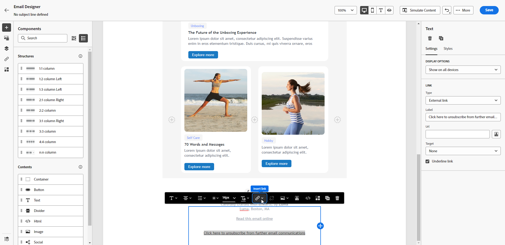

# 電子郵件選擇退出管理 {#email-opt-out}

為了讓收件者能夠取消訂閱收件者的電子郵件通訊，您必須一律包含 **取消訂閱連結** 寄送給收件者的每封電子郵件。 [深入了解隱私權和選擇退出管理](../privacy/opt-out.md)

若要這麼做，您可以：

* 插入 **連結至外部登錄頁面** 封電子郵件，讓使用者得以取消訂閱，而無法接收您品牌的通訊。 [了解如何新增外部選擇退出連結](#opt-out-external-lp)

* 新增 **一鍵式選擇退出連結** 填入您的電子郵件內容。 此連結可讓您的收件者快速取消訂閱您的通訊內容，而不需重新導向至需要確認選擇的登陸頁面，進而加速取消訂閱程式。 [了解如何新增一鍵式選擇退出連結](#one-click-opt-out)

此外，若 **[!UICONTROL List-Unsubscribe]** 選項，則隨Journey Optimizer傳送的對應電子郵件會在電子郵件標題中包含取消訂閱連結。 [進一步了解電子郵件標題中的選擇退出](#unsubscribe-header)

>[!NOTE]
>
>行銷類型的電子郵件訊息必須包含選擇退出連結，這對於交易式訊息並非必要。 訊息類別(**[!UICONTROL Marketing]** 或 **[!UICONTROL Transactional]**)是在 [通道表面](../configuration/channel-surfaces.md#email-type) （即訊息預設集）層級和建立訊息時)。

## 外部選擇退出 {#opt-out-external-lp}

### 新增取消訂閱連結 {#add-unsubscribe-link}

您必須先將取消訂閱連結新增至訊息中。 若要這麼做，請遵循下列步驟：

1. 建立您自己的取消訂閱登錄頁面。

1. 在您所選擇的協力廠商系統上托管。

1. 在歷程中建立訊息。

1. 選取內容中的文字，並 [插入連結](../email/message-tracking.md#insert-links) 使用內容工具列。

   

1. 選擇 **[!UICONTROL External Opt-out/Unsubscription]** 從 **[!UICONTROL Link type]** 下拉式清單。

   

1. 在 **[!UICONTROL Link]** 欄位中，將連結貼上至您的第三方登陸頁面。

   

1. 按一下 **[!UICONTROL Save]**.

### 實作選擇退出的API呼叫 {#opt-out-api}

若要讓收件者在從登錄頁面提交其選擇時選擇退出，您必須實作 **訂閱API呼叫** through [Adobe Developer](https://developer.adobe.com){target=&quot;_blank&quot;}以更新對應的設定檔偏好設定。

此POST呼叫如下：

端點：platform.adobe.io/journey/imp/consent/preferences

查詢參數：

* **params**:包含加密的裝載
* **sig**:簽名
* **pid**:加密的配置檔案ID

傳送給收件者的協力廠商登陸頁面URL會包含這三個參數：


標題要求：

* x-api-key
* x-gw-ims-org-id
* x-sandbox-name
* 授權（來自您技術帳戶的使用者代號）

要求內文：

```
{
   "marketing": [
       {
            "type": "email",           
            "choice": "no",          
            "scope": "channel"       
        }
    ],
 
}
```

[!DNL Journey Optimizer] 會使用這些參數，透過 [Adobe Developer](https://developer.adobe.com){target=&quot;_blank&quot;} API呼叫。

### 使用取消訂閱連結傳送訊息 {#send-message-unsubscribe-link}

一旦您設定登錄頁面的取消訂閱連結並實作API呼叫後，您的訊息即可傳送。

1. 透過傳送訊息，包括連結 [歷程](../building-journeys/journey.md).

1. 收到訊息後，如果收件者按一下取消訂閱連結，便會顯示您的登錄頁面。

   

1. 如果收件者提交表單(在此處，按一下 **取消訂閱** 按鈕)，則設定檔資料會透過 [API呼叫](#opt-out-api).

1. 接著，退出收件者會重新導向至確認訊息畫面，指出退出是否成功。

   

   因此，除非再次訂閱，否則此使用者將不會收到您品牌的通訊。

1. 若要檢查對應設定檔的選項是否已更新，請前往Experience Platform並選取身分命名空間和對應的身分值來存取設定檔。 了解更多 [Experience Platform檔案](https://experienceleague.adobe.com/docs/experience-platform/profile/ui/user-guide.html#getting-started){target=&quot;_blank&quot;}。

   

   在 **[!UICONTROL Attributes]** 標籤中，您可以看到 **[!UICONTROL choice]** 已變更為 **[!UICONTROL no]**.

## 按一下選擇退出 {#one-click-opt-out}

若要在電子郵件中新增選擇退出連結，請遵循下列步驟。

1. [插入連結](../email/message-tracking.md#insert-links) 選取 **[!UICONTROL One click Opt-out]** 作為連結的類型。

   

1. 選擇如何應用選擇退出：在通道、身分或訂閱層級。

   

   * **[!UICONTROL Channel]**:選擇退出會套用至目前通道之設定檔目標（即電子郵件地址）的未來訊息。 如果有數個目標與某個設定檔相關聯，則選擇退出會套用至該管道設定檔中的所有目標（即電子郵件地址）。
   * **[!UICONTROL Identity]**:選擇退出會套用至未來傳送給目前訊息所使用之特定目標（即電子郵件地址）的訊息。
   * **[!UICONTROL Subscription]**:選擇退出會套用至與特定訂閱清單相關聯的未來訊息。 只有當當前消息與訂閱清單關聯時，才能選擇此選項。

1. 輸入登錄頁面的URL，在取消訂閱後，系統會將使用者重新導向。 此頁面僅供確認選擇退出是否成功使用。

   >[!NOTE]
   >
   >如果您已啟用 **清單 — 取消訂閱** 選項，當使用者按一下電子郵件標題中的「取消訂閱」連結時，也會使用此URL。 [深入了解](#unsubscribe-header)

   

   您可以個人化您的連結。 進一步了解個人化URL，位於 [本節](../personalization/personalization-syntax.md).

1. 儲存您的變更。

透過 [歷程](../building-journeys/journey.md)，如果收件者按一下選擇退出連結，則會立即選擇退出其設定檔。

## 電子郵件標題中的取消訂閱連結 {#unsubscribe-header}

>[!CONTEXTUALHELP]
>id="ajo_admin_preset_unsubscribe"
>title="將取消訂閱連結新增至電子郵件標題"
>abstract="啟用List-Unsubscribe，將取消訂閱連結新增至電子郵件標題。 若要設定取消訂閱的URL，請在電子郵件內容中插入一鍵式選擇退出連結。"
>additional-url="https://experienceleague.adobe.com/docs/journey-optimizer/using/privacy/consent/opt-out.html#one-click-opt-out" text="按一下選擇退出"

若 [List-Unsubscribe選項](../configuration/channel-surfaces.md#list-unsubscribe) 在通道表面層級啟用，則會傳送與 [!DNL Journey Optimizer] 會在電子郵件標題中包含取消訂閱連結。

例如，取消訂閱連結在Gmail中的顯示如下：


>[!NOTE]
>
>若要在電子郵件標題中顯示取消訂閱連結，收件者的電子郵件用戶端必須支援此功能。

預設為取消訂閱地址 **[!UICONTROL Mailto (unsubscribe)]** 顯示於相應通道表面的地址。 [深入了解](../configuration/channel-surfaces.md#list-unsubscribe).

若要設定個人化的取消訂閱URL，請在電子郵件訊息內容中插入一鍵式選擇退出連結，然後輸入您所選擇的URL。 [深入了解](#one-click-opt-out)

根據電子郵件用戶端，從標題按一下取消訂閱連結可能會產生下列影響：

* 取消訂閱請求會傳送至預設的取消訂閱地址。

* 收件者會導向至您在將選擇退出連結新增至訊息時指定的登錄頁面URL。

   >[!NOTE]
   >
   >若您未在訊息內容中新增一鍵式選擇退出連結，則不會顯示任何登錄頁面。

* 對應的設定檔會立即退出，而此選項會在Experience Platform中更新。 了解更多 [Experience Platform檔案](https://experienceleague.adobe.com/docs/experience-platform/profile/ui/user-guide.html#getting-started){target=&quot;_blank&quot;}。
