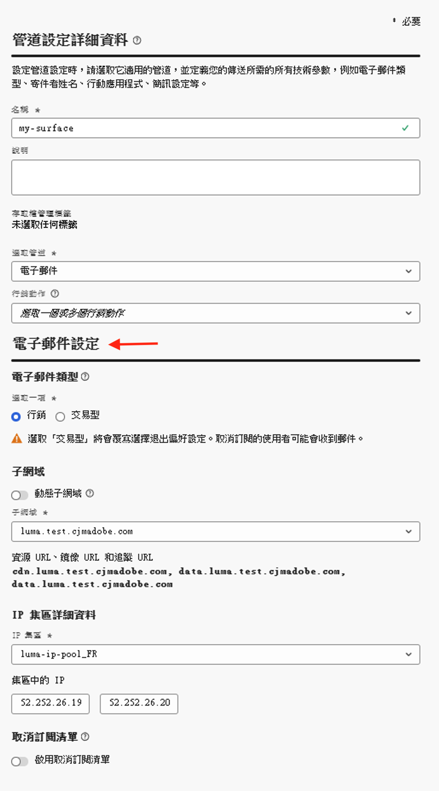
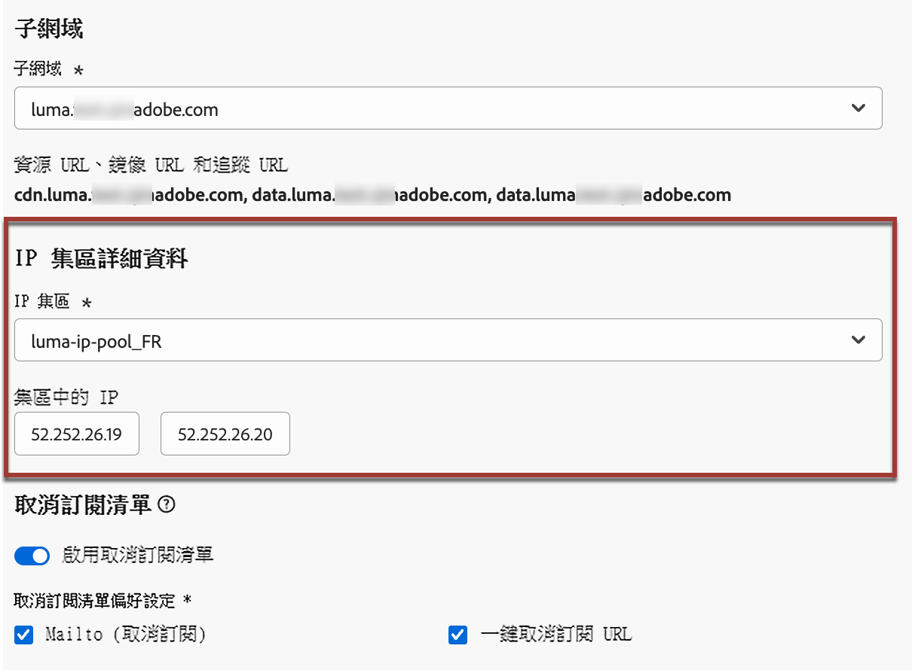
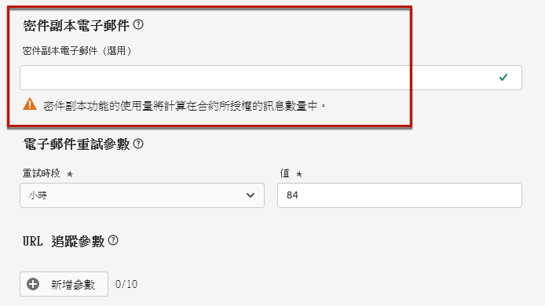
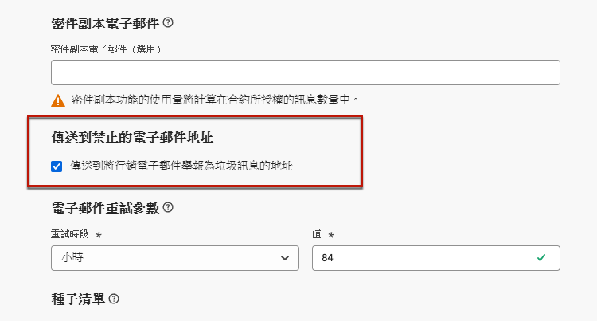
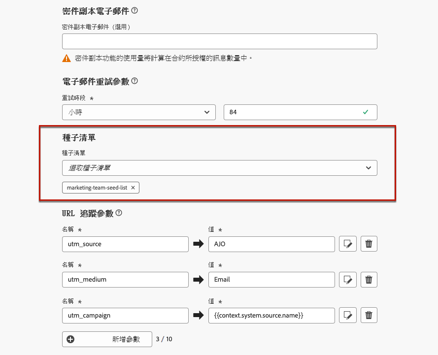
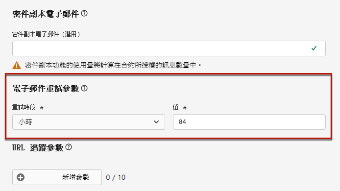
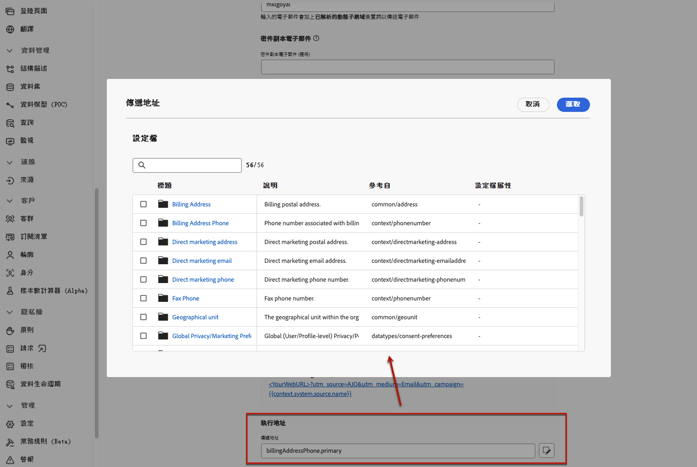

# 設定電子郵件設定 {#email-settings}

若要開始建立電子郵件，您必須設定電子郵件管道設定，定義郵件訊息所需的所有技術參數。[了解如何建立設定](../configuration/channel-surfaces.md)

>[!NOTE]
>
>為了維護您的聲譽並改善您的傳遞能力，在建立電子郵件設定之前，請設定您用於傳送電子郵件的子網域。[了解更多](../configuration/about-subdomain-delegation.md)

在管道設定的專用區段中定義電子郵件設定，如下所述。

{width="50%" align="left"}

電子郵件設定依照下列邏輯傳送通訊：

* 對於批次歷程，不適用於在進行電子郵件表面設定之前已啟動的批次執行。下次重複或新的執行時會擷取變更。

* 若是交易型訊息，下次通訊時會立即套用變更（最多延遲五分鐘）。

>[!NOTE]
>
>更新的電子郵件組態設定會在使用組態的歷程或行銷活動中自動擷取。

## 電子郵件類型 {#email-type}

>[!CONTEXTUALHELP]
>id="ajo_admin_presets_emailtype"
>title="定義電子郵件類型"
>abstract="選取使用此設定時將傳送的電子郵件類型：促銷用的行銷型電子郵件 (需使用者同意)，或非商業的交易型電子郵件 (還可在特定情況下傳送至取消訂閱的輪廓)。"

在&#x200B;**電子郵件類型**&#x200B;區段中，選取設定的訊息類型：**[!UICONTROL 行銷]**&#x200B;或&#x200B;**[!UICONTROL 交易型]**。

* 對於促銷電子郵件，請選取&#x200B;**行銷**，例如零售商店的每週促銷活動。這些訊息需要使用者同意。

* 對於非商業電子郵件，請選取&#x200B;**交易型**，例如訂購確認、密碼重設通知或傳遞資訊。這些電子郵件可以傳送給&#x200B;**取消訂閱**&#x200B;行銷通訊的使用者。這些訊息只能在特定情境中傳送。

建立訊息時，您必須選擇符合您為電子郵件選取之類別的有效管道設定。

## 子網域 {#subdomains}

選取要用來傳送電子郵件的子網域。

>[!NOTE]
>
>為了增加對電子郵件設定的控制，您可以定義動態子網域。[了解更多](../email/surface-personalization.md#dynamic-subdomains)

為了維護您網域的聲譽、加快 IP 暖身過程並改善傳遞能力，請將您的傳送子網域委派給 Adobe。[了解更多](../configuration/about-subdomain-delegation.md)

## IP 集區詳細資料 {#ip-pools}

選取要與設定關聯的 IP 集區。[了解更多](../configuration/ip-pools.md)

{width="50%" align="left"}

當選取的 IP 集區處於[編輯](../configuration/ip-pools.md#edit-ip-pool)（**[!UICONTROL 處理中]**&#x200B;狀態）且從未與所選子網域關聯時，您無法繼續建立設定。
否則，仍會使用 IP 集區/子網域關聯的最舊版本。如果是這種情況，請將設定儲存為草稿，並在 IP 集區具有&#x200B;**[!UICONTROL 成功]**&#x200B;狀態時重試。

>[!NOTE]
>
>對於非生產環境，Adobe 不會建立立即可用的測試子網域，也不會授予共用傳送 IP 集區的存取權。您需要[委派自己的子網域](../configuration/delegate-subdomain.md)，並使用指派至您組織集區的 IP。

選取 IP 集區後，當游標停留在 IP 集區下拉式清單下方顯示的 IP 位址上時，會顯示 PTR 資訊。[進一步了解 PTR 記錄](../configuration/ptr-records.md)

>[!NOTE]
>
>如果未設定 PTR 記錄，請聯絡您的 Adobe 代表。

## 清單取消訂閱 {#list-unsubscribe}

從清單中選取子網域後，會顯示&#x200B;**[!UICONTROL 啟用取消清單訂閱]** 選項。這項設定預設為啟用。

它可讓您在電子郵件標題中加入一鍵式取消訂閱 URL。 [了解更多](list-unsubscribe.md)

## 標頭參數 {#email-header}

在&#x200B;**[!UICONTROL 標頭參數]**&#x200B;區段中，輸入與該設定所傳送電子郵件類型相關的寄件者名稱和電子郵件地址。[了解更多](header-parameters.md)

## 密件副本電子郵件 {#bcc-email}

您可以將 [!DNL Journey Optimizer] 傳送之電子郵件的相同副本（或密件副本）傳送至密件副本收件匣，以儲存這些電子郵件以供合規性或封存。

若要這麼做，請在管道設定層級啟用&#x200B;**[!UICONTROL 密件副本電子郵件]**&#x200B;選用功能。
[了解更多](../configuration/archiving-support.md#bcc-email)

此外，在定義&#x200B;**[!UICONTROL 密件副本電子郵件]**&#x200B;地址時，請務必使用具有有效 MX 記錄設定的子網域，否則電子郵件設定處理將會失敗。

如果在提交電子郵件設定時發生錯誤，表示您輸入之位址的子網域尚未設定 MX 記錄。請連絡您的管理員以設定對應的 MX 記錄，或使用其他具有有效 MX 記錄設定的位址。

## 傳送到禁止的電子郵件地址 {#send-to-suppressed-email-addresses}

>[!CONTEXTUALHELP]
>id="ajo_surface_suppressed_addresses"
>title="覆寫禁止名單優先順序"
>abstract="即使其電子郵件地址因垃圾郵件投訴而位於 Adobe Journey Optimizer 禁止名單中，您也可以決定傳送交易型訊息到設定檔。此選項預設為停用。"
>additional-url="https://experienceleague.adobe.com/docs/journey-optimizer/using/configuration/monitor-reputation/manage-suppression-list.html?lang=zh-Hant" text="管理禁止名單"

>[!IMPORTANT]
>
>只有當您選取&#x200B;**[!UICONTROL 交易型]**&#x200B;電子郵件類型時，才能使用此選項。[了解更多](#email-type)

在 [!DNL Journey Optimizer] 中，所有標示為硬退回、軟退回和垃圾郵件投訴的電子郵件地址都會自動收集到[禁止名單](../configuration/manage-suppression-list.md)之中，不會被納入到歷程或行銷活動的傳送範圍。

不過，您可以決定繼續傳送&#x200B;**交易型**&#x200B;類型的訊息給設定檔，即使其電子郵件地址因使用者投訴垃圾郵件而列入禁止名單中亦然。

事實上，交易型訊息通常包含有用的預期資訊，例如訂購確認或密碼重設通知。因此，即使他們將您的一封行銷訊息舉報為垃圾郵件，大多數情況下您仍希望客戶收到此類非商業電子郵件。

若要將因垃圾郵件投訴而被禁止的電子郵件地址包含在交易型訊息收件者中，請從&#x200B;**[!UICONTROL 傳送至非禁止的電子郵件地址]**&#x200B;區段中選取對應的選項。

>[!NOTE]
>
>此選項預設為停用。

作為傳遞能力的最佳實務，此選項預設為停用，以確保不會聯絡已選擇退出的客戶。不過，您可以變更此預設選項，然後允許您將交易型訊息傳送給客戶。

一旦啟用此選項，儘管客戶將您的行銷電子郵件標記為垃圾郵件，此類客戶仍可使用目前設定接收您的交易型訊息。請務必根據傳遞能力最佳實務管理選擇退出偏好設定。

## 種子清單 {#seed-list}

>[!CONTEXTUALHELP]
>id="ajo_surface_seed_list"
>title="新增種子清單"
>abstract="選取您所選的種子清單，以自動向您的對象新增特定的內部地址。這些種子地址將在傳遞執行時包含在內，且為了保證目的將收到一份準確的訊息副本。"
>additional-url="https://experienceleague.adobe.com/docs/journey-optimizer/using/configuration/seed-lists.html#use-seed-list" text="什麼是種子清單?"

[!DNL Journey Optimizer] 內的種子清單，可讓您在您的傳送過程中自動包含特定的電子郵件種子地址。[了解更多](../configuration/seed-lists.md)

>[!CAUTION]
>
>目前該功能僅適用於電子郵件管道。

在&#x200B;**[!UICONTROL 種子清單]**&#x200B;區段中選取與您相關的清單。在[本節](../configuration/seed-lists.md#create-seed-list)之中了解如何建立種子清單。

{width="80%"}

>[!NOTE]
>
>一次只能選取一個種子清單。

當行銷活動或歷程中使用目前設定時，在傳送執行時候會包含所選種子清單上的電子郵件地址，這表示他們將會收到傳送的副本以供驗證之用。

在[本節](../configuration/seed-lists.md#use-seed-list)之中了解如何在行銷活動或歷程中使用種子清單。

## 電子郵件重試參數 {#email-retry}

>[!CONTEXTUALHELP]
>id="ajo_admin_presets_retryperiod"
>title="調整重試時段"
>abstract="當電子郵件由於暫時性的軟退信錯誤而傳遞失敗時，將重試 3.5 天 (84 小時)。您可以調整此預設的重試時段以進一步滿足您的需求。"
>additional-url="https://experienceleague.adobe.com/docs/journey-optimizer/using/configuration/monitor-reputation/retries.html" text="關於重試"

您可以設定&#x200B;**電子郵件重試參數**。

依預設，[重試時段](../configuration/retries.md#retry-duration)設定為 84 小時，但您可以調整此設定以更符合您的需求。

您必須輸入下列範圍內的整數值 (小時或分鐘)：

* 若是行銷電子郵件，最小重試時段為 6 小時。
* 若是交易型電子郵件，最小重試時段為 10 分鐘。
* 對於這兩種電子郵件類型，重試時段的上限為 84 小時 (或 5,040 分鐘)。

在[本節](../configuration/retries.md)之中了解重試參數的更多資訊。

## URL 追蹤 {#url-tracking}

您可以使用 **[!UICONTROL URL 追蹤參數]**&#x200B;來測量跨頻道行銷工作的有效性。[了解更多](url-tracking.md)

## 執行地址 {#execution-address}

當您定位設定檔時，資料庫中可能會提供數個電子郵件地址（專業電子郵件地址、個人電子郵件地址等）。

在這種情況下，[!DNL Journey Optimizer] 會在沙箱層級使用&#x200B;**[!UICONTROL 執行欄位]**&#x200B;所指定的位址，以決定優先使用設定檔服務內哪個電子郵件地址。[了解更多](../configuration/primary-email-addresses.md)

>[!NOTE]
>
>若要檢查目前預設使用的欄位，請存取&#x200B;**[!UICONTROL 管理]** > **[!UICONTROL 管道]** > **[!UICONTROL 一般設定]** > **[!UICONTROL 執行欄位]**&#x200B;選單。

不過，您可以在電子郵件管頻道設定層級變更此預設執行欄位。然後，您可以將此設定套用至特定行銷活動或歷程。

若要這麼做，請編輯&#x200B;**[!UICONTROL 傳遞地址]**&#x200B;欄位，並從可用的電子郵件型別XDM欄位清單中選取專案。 [了解更多](../configuration/primary-email-addresses.md#override-execution-address-channel-config)

