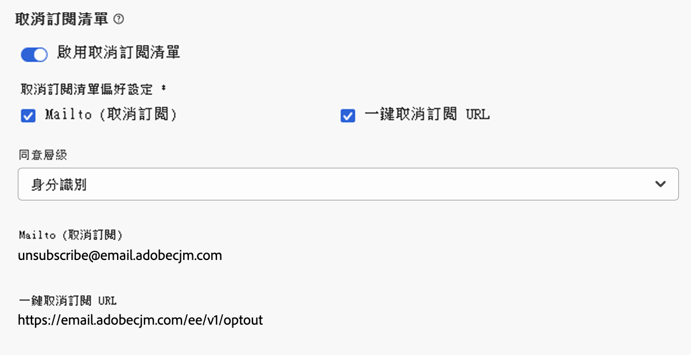

# 設定電子郵件設定 {#email-settings}

若要開始建立電子郵件，您必須設定電子郵件通道設定，以定義訊息所需的所有技術引數。 [瞭解如何建立設定](../configuration/channel-surfaces.md)

>[!NOTE]
>
>為了維護您的信譽並改善您的傳遞能力，在建立電子郵件設定之前，請設定您將用於傳送電子郵件的子網域。 [了解更多](../configuration/about-subdomain-delegation.md)

在通道設定的專用區段中定義電子郵件設定，如下所述。

{width="50%" align="left"}

系統會擷取電子郵件設定，依照下列邏輯傳送通訊：

* 對於批次歷程，不適用於在製作電子郵件表面設定之前已啟動的批次執行。 變更會在下次週期或新的執行時擷取。

* 若是交易式訊息，下次通訊時會立即擷取變更（最多延遲5分鐘）。

>[!NOTE]
>
>更新的電子郵件組態設定會在使用組態的歷程或行銷活動中自動擷取。

## 電子郵件類型 {#email-type}

>[!CONTEXTUALHELP]
>id="ajo_admin_presets_emailtype"
>title="定義電子郵件類型"
>abstract="選取使用此設定時將傳送的電子郵件類型：促銷用的行銷型電子郵件 (需使用者同意)，或非商業的交易型電子郵件 (還可在特定情況下傳送至取消訂閱的輪廓)。"

在&#x200B;**電子郵件型別**&#x200B;區段中，選取設定的訊息型別： **[!UICONTROL 行銷]**&#x200B;或&#x200B;**[!UICONTROL 異動]**。

* 選取&#x200B;**行銷**&#x200B;促銷電子郵件，例如零售商店的每週促銷活動。 這些訊息需要使用者同意。

* 針對非商業電子郵件，選取&#x200B;**異動**，例如訂單確認、密碼重設通知或傳遞資訊。 這些電子郵件可以傳送給&#x200B;**取消訂閱**&#x200B;行銷通訊的設定檔。 這些訊息只能在特定內容中傳送。

建立郵件時，您必須選擇符合您為電子郵件選取之類別的有效通道設定。

## 子網域 {#subdomains}

選取要用來傳送電子郵件的子網域。

為了維護您網域的聲譽，請加快IP暖身過程並改善傳遞能力，將您的傳送子網域委派給Adobe。 [了解更多](../configuration/about-subdomain-delegation.md)

<!--If needed, you can define dynamic subdomains. [Learn more](../email/surface-personalization.md#dynamic-subdomains)-->

## IP集區詳細資料 {#ip-pools}

選取要與設定關聯的IP集區。 [了解更多](../configuration/ip-pools.md)

{width="50%" align="left"}

當選取的IP集區在[版本](../configuration/ip-pools.md#edit-ip-pool)之下（**[!UICONTROL 處理中]**&#x200B;狀態）且從未與選取的子網域建立關聯時，您無法繼續設定建立。 否則，系統仍會使用IP集區/子網域關聯的最舊版本。 如果是這種情況，請將設定儲存為草稿，並在IP集區具有&#x200B;**[!UICONTROL Success]**&#x200B;狀態時重試。

>[!NOTE]
>
>對於非生產環境，Adobe不會建立立即可用的測試子網域，也不會授予共用傳送IP集區的存取權。 您需要[委派您自己的子網域](../configuration/delegate-subdomain.md)，並使用指派給您組織的集區中的IP。

選取IP集區後，當游標停留在IP集區下拉式清單下方顯示的IP位址上時，會顯示PTR資訊。 [進一步瞭解PTR記錄](../configuration/ptr-records.md)

>[!NOTE]
>
>如果未設定PTR記錄，請聯絡您的Adobe代表。

## 清單取消訂閱標頭{#list-unsubscribe}

<!--Do not modify - Legal Review Done -->

從清單中選取[子網域](#subdomains-and-ip-pools)後，會顯示&#x200B;**[!UICONTROL 啟用List-Unsubscribe]**&#x200B;選項。

此選項預設為啟用，在電子郵件標題中加入一鍵式取消訂閱URL，例如：

如果停用此選項，一鍵式取消訂閱URL不會顯示在電子郵件標頭中。

您可以從&#x200B;**[!UICONTROL 同意層級]**&#x200B;下拉式清單中選取同意層級。 它可特定於通道或設定檔身分。 根據此設定，當使用者使用電子郵件標題中的清單取消訂閱URL取消訂閱時，同意會在Adobe Journey Optimizer中以頻道層級或ID層級更新。

List Unsubscribe Header提供兩種功能（Mailto和按一下即可取消訂閱URL，如下所述），除非您取消核取其中一項或兩項功能，否則預設會啟用這兩種功能：

* **Mailto （取消訂閱）**&#x200B;位址，這是將取消訂閱要求路由至以進行自動處理的目的地位址。

  在Journey Optimizer中，取消訂閱電子郵件地址是根據您[選取的子網域](#subdomains-and-ip-pools)，顯示在頻道設定中的預設&#x200B;**Mailto （取消訂閱）**&#x200B;位址。

  {width="80%" align="left"}

* **一鍵取消訂閱URL**，根據您在「頻道組態設定」中設定和設定的子網域，預設為一鍵選擇我們的URL產生的「清單取消訂閱標頭」。

<!--
    >[!AVAILABILITY]
    >
    >One-click Unsubscribe URL Header will be available in Adobe Journey Optimizer starting June 3, 2024.
    >
-->

**[!UICONTROL Mailto （取消訂閱）]**&#x200B;功能和&#x200B;**[!UICONTROL 一鍵取消訂閱URL]**&#x200B;功能是選用功能。 如果您不想使用預設產生的一鍵式取消訂閱URL，可以取消核取該功能。 在已開啟&#x200B;**[!UICONTROL 選擇退出組態]**&#x200B;選項且已取消勾選&#x200B;**[!UICONTROL 一鍵取消訂閱URL]**&#x200B;功能的案例中，如果您將[一鍵選擇退出連結](../privacy/opt-out.md#one-click-opt-out)新增至使用此組態建立的訊息，清單取消訂閱標題將會挑選您已插入電子郵件內文的一鍵選擇退出連結，並將其當做一鍵取消訂閱URL值。

>[!NOTE]
>
>如果您未在訊息內容中新增一鍵退出連結，且頻道設定中取消核取預設的一鍵取消訂閱URL，則不會URL作為List Unsubscribe標頭的一部分傳遞至電子郵件標頭。

在[本節](../email/email-opt-out.md#unsubscribe-header)中進一步瞭解管理訊息中的取消訂閱功能。

## 標頭引數 {#email-header}

在&#x200B;**[!UICONTROL 標頭引數]**&#x200B;區段中，輸入與該設定所傳送電子郵件型別相關的寄件者名稱和電子郵件地址。

* **[!UICONTROL 寄件者名稱]**：寄件者的名稱，例如您的品牌名稱。
* **[!UICONTROL 寄件者電子郵件]**：您要用於通訊的電子郵件地址。
* **[!UICONTROL 回覆（名稱）]**：當收件者按一下電子郵件使用者端軟體中的&#x200B;**回覆**&#x200B;按鈕時，將會使用的名稱。
* **[!UICONTROL 回覆（電子郵件）]**：當收件者按一下電子郵件使用者端軟體中的&#x200B;**回覆**&#x200B;按鈕時，將會使用的電子郵件地址。 [了解更多](#reply-to-email)
* **[!UICONTROL 錯誤電子郵件]**：此地址會收到ISP在傳送郵件幾天後產生的所有錯誤（非同步退件）。 也會在此地址接收郵件答錄機通知和挑戰回應。

  如果您想要在未委派給Adobe的特定電子郵件地址上接收休假通知和質詢回應，您需要設定[轉寄程式](#forward-email)。 在此情況下，請確定您有手動或自動化的解決方案來處理傳入此收件匣的電子郵件。

>[!CAUTION]
>
>**[!UICONTROL 寄件者電子郵件]**&#x200B;和&#x200B;**[!UICONTROL 錯誤電子郵件]**&#x200B;地址必須使用目前選取的[委派子網域](../configuration/about-subdomain-delegation.md)。 例如，如果委派的子網域是&#x200B;*marketing.luma.com*，您可以使用&#x200B;*contact@marketing.luma.com*&#x200B;和&#x200B;*error@marketing.luma.com*。

>[!NOTE]
>
>位址必須以字母(A-Z)開頭，並且只能包含英數字元。 您也可以使用底線`_`、點`.`和連字型大小`-`字元。

### 回覆電子郵件 {#reply-to-email}

定義&#x200B;**[!UICONTROL 回覆（電子郵件）]**&#x200B;地址時，只要電子郵件地址是有效的、格式正確且不含任何錯字的電子郵件地址，您就可以指定該地址。

用於回覆的收件匣將會收到所有回覆電子郵件，但&#x200B;**[!UICONTROL 錯誤電子郵件]**&#x200B;地址中收到的休假通知和質詢回覆除外。

若要確保正確管理回覆，請遵循下列建議：

* 確保專用收件匣有足夠的接收容量，可接收使用電子郵件設定傳送的所有回覆電子郵件。 如果收件匣傳回退信，系統可能不會收到客戶的部分回覆。

* 處理回覆時，須牢記隱私權與合規義務，因為回覆可能包含個人識別資訊(PII)。

* 請勿在回覆收件匣中將郵件標示為垃圾訊息，因為這會影響傳送至此地址的所有其他回覆。

此外，在定義&#x200B;**[!UICONTROL 回覆（電子郵件）]**&#x200B;位址時，請務必使用具有有效MX記錄設定的子網域，否則電子郵件設定處理將會失敗。

如果您在提交電子郵件設定時發生錯誤，表示您輸入之地址的子網域尚未設定MX記錄。 請連絡您的管理員以設定對應的MX記錄，或使用其他具有有效MX記錄設定的位址。

>[!NOTE]
>
>如果您輸入之位址的子網域是[已完全委派給Adobe](../configuration/delegate-subdomain.md#full-subdomain-delegation)的網域，請連絡您的Adobe帳戶主管。

### 轉寄電子郵件 {#forward-email}

若要將[!DNL Journey Optimizer]收到的委派子網域的所有電子郵件轉寄給特定電子郵件地址，請聯絡Adobe客戶服務。

>[!NOTE]
>
>如果用於&#x200B;**[!UICONTROL 回覆（電子郵件）]**&#x200B;地址的子網域未委派給Adobe，轉寄無法用於此地址。

您必須提供：

* 您選擇的轉寄電子郵件地址。 請注意，轉寄電子郵件地址網域無法與委派給Adobe的任何子網域相符。
* 您的沙箱名稱。
* 將使用轉寄電子郵件地址的設定名稱或子網域。
  <!--* The current **[!UICONTROL Reply to (email)]** address or **[!UICONTROL Error email]** address set at the channel configuration level.-->

>[!NOTE]
>
>每個子網域只能有一個轉寄電子郵件地址。 因此，如果多個設定使用相同的子網域，則必須對所有設定使用相同的轉寄電子郵件地址。

轉寄電子郵件地址由Adobe設定。 這可能需要3到4天的時間。

完成後，**[!UICONTROL 回覆（電子郵件）]**&#x200B;和&#x200B;**[!UICONTROL 錯誤電子郵件]**&#x200B;地址收到的所有郵件都會轉寄到您提供的特定電子郵件地址。

## 密件副本電子郵件 {#bcc-email}

您可以將[!DNL Journey Optimizer]所傳送之電子郵件的相同復本（或密件副本）傳送至密件副本收件匣，以儲存這些電子郵件以供合規性或封存。

若要這麼做，請在頻道設定層級啟用&#x200B;**[!UICONTROL 密件副本電子郵件]**&#x200B;選用功能。 [了解更多](../configuration/archiving-support.md#bcc-email)

此外，在定義&#x200B;**[!UICONTROL 密件副本電子郵件]**&#x200B;位址時，請務必使用具有有效MX記錄設定的子網域，否則電子郵件設定處理將會失敗。

如果您在提交電子郵件設定時發生錯誤，表示您輸入之地址的子網域尚未設定MX記錄。 請連絡您的管理員以設定對應的MX記錄，或使用其他具有有效MX記錄設定的位址。

## 傳送到禁止的電子郵件地址 {#send-to-suppressed-email-addresses}

>[!CONTEXTUALHELP]
>id="ajo_surface_suppressed_addresses"
>title="覆寫禁止名單優先順序"
>abstract="即使其電子郵件地址因垃圾郵件投訴而位於 Adobe Journey Optimizer 禁止名單中，您也可以決定傳送交易型訊息到輪廓。此選項預設為停用。"
>additional-url="https://experienceleague.adobe.com/docs/journey-optimizer/using/configuration/monitor-reputation/manage-suppression-list.html?lang=zh-Hant" text="管理禁止名單"

>[!IMPORTANT]
>
>只有當您選取&#x200B;**[!UICONTROL 異動]**&#x200B;電子郵件型別時，才能使用此選項。 [了解更多](#email-type)

在[!DNL Journey Optimizer]中，所有標示為硬退信、軟退信和垃圾郵件投訴的電子郵件地址都會自動收集到[隱藏清單](../configuration/manage-suppression-list.md)中，且不會傳送到歷程或行銷活動。

不過，您可以決定繼續傳送&#x200B;**transactional**&#x200B;型別的訊息給設定檔，即使其電子郵件地址因使用者投訴垃圾郵件而位於隱藏清單中亦然。

事實上，交易式訊息通常包含有用的預期資訊，例如訂單確認或密碼重設通知。 因此，即使他們回報您的一封行銷訊息為垃圾訊息，大部分時間您仍希望客戶收到此類非商業電子郵件。

若要在交易式訊息對象中包含由於垃圾郵件投訴而抑制的電子郵件地址，請從「**[!UICONTROL 傳送至抑制的電子郵件地址]**」區段中選取對應的選項。

>[!NOTE]
>
>此選項預設為停用。

根據傳遞能力的最佳實務，此選項預設為停用，以確保不會聯絡已選擇退出的客戶。 不過，您可以變更此預設選項，然後允許您將交易式訊息傳送給客戶。

啟用此選項後，儘管客戶將您的行銷電子郵件標籤為垃圾訊息，此類客戶仍可使用目前設定接收您的交易式訊息。 請務必根據傳遞能力最佳實務管理選擇退出偏好設定。

## 種子清單 {#seed-list}

>[!CONTEXTUALHELP]
>id="ajo_surface_seed_list"
>title="新增種子清單"
>abstract="選取您所選的種子清單，以自動向您的客群新增特定的內部地址。這些種子地址將在傳遞執行時包含在內，且為了保證目的將收到一份準確的訊息副本。"
>additional-url="https://experienceleague.adobe.com/docs/journey-optimizer/using/configuration/seed-lists.html#use-seed-list" text="什麼是種子清單?"

[!DNL Journey Optimizer]中的種子清單可讓您在傳遞中自動包含特定的電子郵件種子地址。 [了解更多](../configuration/seed-lists.md)

>[!CAUTION]
>
>目前該功能僅適用於電子郵件頻道。

在&#x200B;**[!UICONTROL 種子清單]**&#x200B;區段中選取與您相關的清單。 在[本節](../configuration/seed-lists.md#create-seed-list)中瞭解如何建立種子清單。

>[!NOTE]
>
>一次只能選取一個種子清單。

當行銷活動或歷程中使用目前設定時，在傳送執行時間會包含所選種子清單上的電子郵件地址，這表示他們會收到傳送的副本以供保證。

在[本節](../configuration/seed-lists.md#use-seed-list)中瞭解如何在行銷活動或歷程中使用種子清單。

## 電子郵件重試參數 {#email-retry}

>[!CONTEXTUALHELP]
>id="ajo_admin_presets_retryperiod"
>title="調整重試時段"
>abstract="當電子郵件由於暫時性的軟退信錯誤而傳遞失敗時，將重試 3.5 天 (84 小時)。您可以調整此預設的重試時段以進一步滿足您的需求。"
>additional-url="https://experienceleague.adobe.com/docs/journey-optimizer/using/configuration/monitor-reputation/retries.html" text="關於重試"

您可以設定&#x200B;**電子郵件重試引數**。

依預設，[重試時段](../configuration/retries.md#retry-duration)設為84小時，但您可以調整此設定以更符合您的需求。

您必須輸入下列範圍內的整數值（小時或分鐘）：

* 若是行銷電子郵件，最小重試期間為6小時。
* 對於異動電子郵件，最小重試時間為10分鐘。
* 對於這兩種電子郵件型別，重試期間的上限為84小時（或5040分鐘）。

在[本節](../configuration/retries.md)中進一步瞭解重試。

## URL 追蹤 {#url-tracking}

>[!CONTEXTUALHELP]
>id="ajo_admin_preset_utm"
>title="定義 URL 追蹤參數"
>abstract="使用此區段以將追蹤參數自動附加到電子郵件內容中的 URL。此功能為選用。"

>[!CONTEXTUALHELP]
>id="ajo_admin_preset_url_preview"
>title="預覽 URL 追蹤參數"
>abstract="重新探討要如何將追蹤參數附加到電子郵件內容中出現的 URL。"

您可以使用&#x200B;**[!UICONTROL URL追蹤引數]**&#x200B;來評估跨管道行銷工作的有效性。 此功能為選用。

此區段中定義的引數將會附加至您的電子郵件內容中所包含的URL結尾。 接著，您就可以在Adobe Analytics或Google Analytics等網站分析工具中擷取這些引數，並建立各種效能報表。

您可使用&#x200B;**[!UICONTROL 新增引數]**&#x200B;按鈕，新增最多10個追蹤引數。

若要設定URL追蹤引數，您可以在&#x200B;**[!UICONTROL 名稱]**&#x200B;和&#x200B;**[!UICONTROL 值]**&#x200B;欄位中直接輸入所需的值。

您也可以使用[個人化編輯器](../personalization/personalization-build-expressions.md)來編輯每個&#x200B;**[!UICONTROL 值]**&#x200B;欄位。 按一下版本圖示以開啟編輯器。 從那裡，您可以選取可用的內容屬性和/或直接編輯文字。

下列預先定義的值可透過個人化編輯器取得：

* **Source動作ID**：新增至歷程或行銷活動的電子郵件動作ID。

* **Source動作名稱**：新增至歷程或行銷活動的電子郵件動作名稱。

* **Source id**：傳送電子郵件的歷程或行銷活動的ID。

* **Source名稱**：傳送電子郵件的歷程或行銷活動的名稱。

* **Source版本ID**：傳送電子郵件的歷程或行銷活動版本識別碼。

* **選件ID**：電子郵件中使用的選件識別碼。

>[!NOTE]
>
>您可以結合輸入文字值並使用個人化編輯器中的內容屬性。 每個&#x200B;**[!UICONTROL Value]**&#x200B;欄位可包含最多5 KB的字元數限制。

<!--You can drag and drop the parameters to reorder them.-->

以下是Adobe Analytics和Google Analytics相容URL的範例。

* 與Adobe Analytics相容的URL： `www.YourLandingURL.com?cid=email_AJO_{{context.system.source.id}}_image_{{context.system.source.name}}`

* Google Analytics相容的URL： `www.YourLandingURL.com?utm_medium=email&utm_source=AJO&utm_campaign={{context.system.source.id}}&utm_content=image`

您可以動態預覽所產生的追蹤URL。 每次新增、編輯或移除引數時，預覽都會自動更新。

>[!NOTE]
>
>您也可以將動態個人化追蹤引數新增至電子郵件內容中存在的連結，但無法在設定層級執行此操作。 使用電子郵件設計工具製作訊息時，您必須執行此動作。 [了解更多](message-tracking.md#url-tracking)

## 執行地址 {#execution-address}

>[!CONTEXTUALHELP]
>id="ajo_email_config_execution_address"
>title="定義要使用的地址"
>abstract="當資料庫 (個人、專業等) 中有多個電子郵件地址或電話號碼時，您可以選擇優先傳送哪一個。"

當您定位設定檔時，資料庫中可能會提供數個電子郵件地址（專業電子郵件地址、個人電子郵件地址等）。

在這種情況下，[!DNL Journey Optimizer]會在沙箱層級使用&#x200B;**[!UICONTROL 執行欄位]**&#x200B;中指定的地址，以優先決定要從設定檔服務使用的電子郵件地址。 [了解更多](../configuration/primary-email-addresses.md)

>[!NOTE]
>
>若要檢查目前預設使用的欄位，請存取&#x200B;**[!UICONTROL 管理]** > **[!UICONTROL 管道]** > **[!UICONTROL 一般設定]** > **[!UICONTROL 執行欄位]**&#x200B;功能表。

不過，您可以在電子郵件通道設定層級變更此預設執行欄位。

若要這麼做，請編輯&#x200B;**[!UICONTROL 傳遞地址]**&#x200B;欄位，並從可用的電子郵件型別XDM欄位清單中選取專案。

執行欄位會更新，然後作為主要地址使用。 它會覆寫沙箱層級的一般設定。
