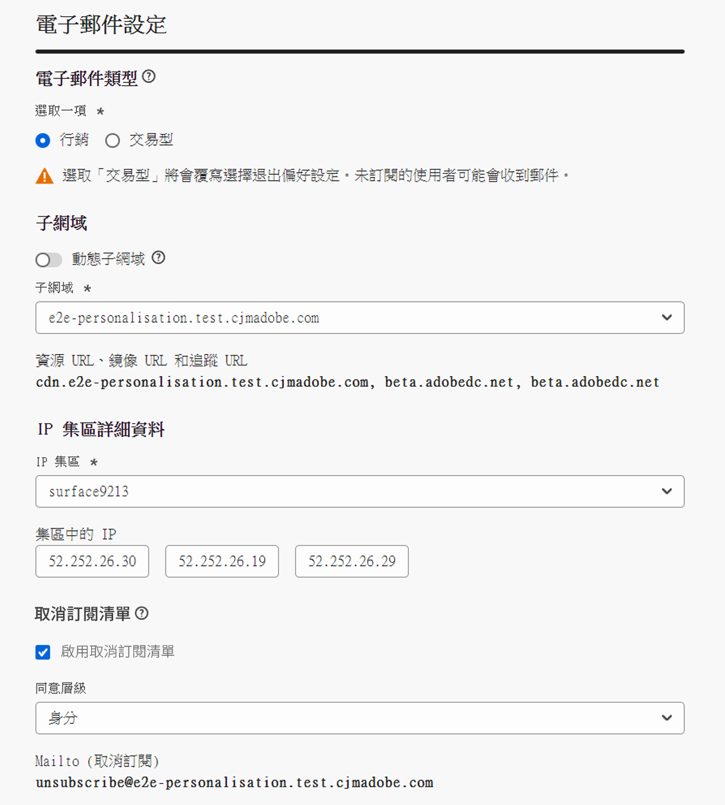
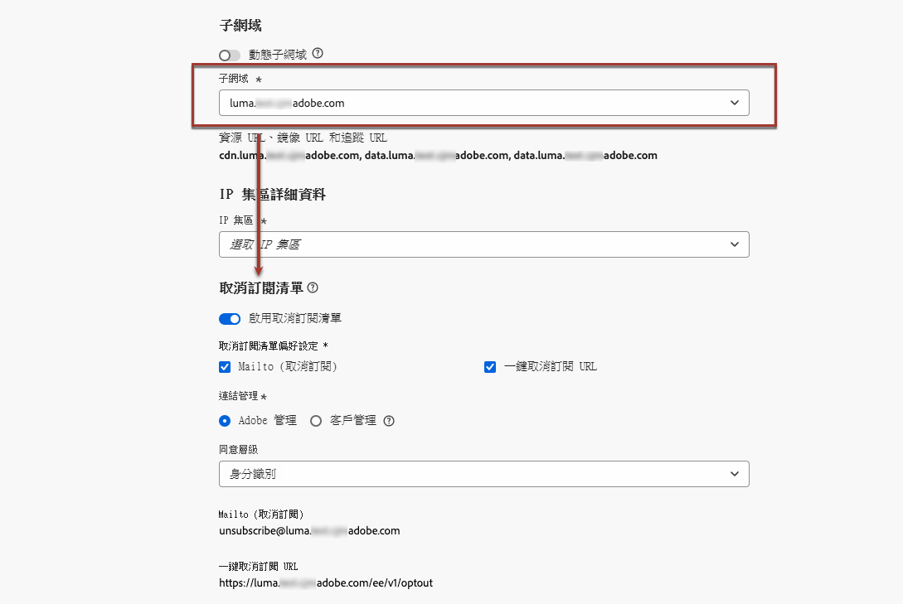
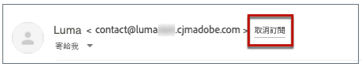
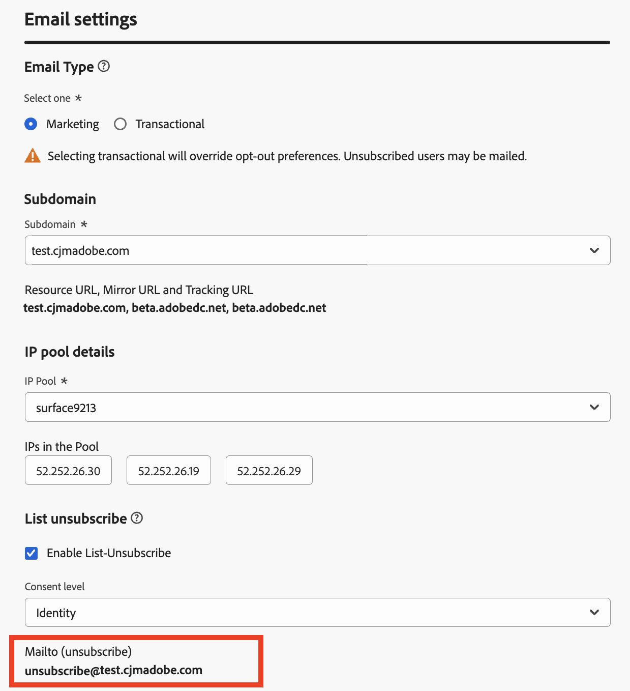
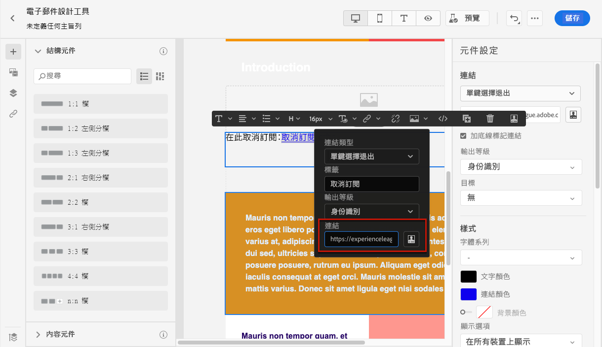

# 設定電子郵件設定 {#email-settings}

若要開始建立電子郵件，您必須設定電子郵件通道介面，以定義訊息所需的所有技術引數。 [瞭解如何建立表面](../configuration/channel-surfaces.md)

在管道表面設定的專用區段中定義電子郵件設定。

系統會擷取電子郵件表面設定，依照下列邏輯傳送通訊：

* 對於批次歷程，不適用於在製作電子郵件表面設定之前已啟動的批次執行。 下次重複或新的執行時會擷取變更。

* 若是交易式訊息，下次通訊時會立即擷取變更（最多延遲5分鐘）。

>[!NOTE]
>
>更新的電子郵件表面設定將在使用表面的歷程或行銷活動中自動擷取。

## 電子郵件型別 {#email-type}

>[!CONTEXTUALHELP]
>id="ajo_admin_presets_emailtype"
>title="定義電子郵件類別"
>abstract="選取使用此表面時將傳送的電子郵件類型：促銷用電子郵件的行銷 (需要使用者同意)，或非商業電子郵件的異動 (還可以傳送至特定內容中取消訂閱的設定檔)。"

在 **電子郵件型別** 區段，選取將與介面一起傳送的訊息型別： **[!UICONTROL 行銷]** 或 **[!UICONTROL 異動]**.

* 選擇 **行銷** 促銷電子郵件，例如零售商店的每週促銷活動。 這些訊息需要使用者同意。

* 選擇 **異動** 用於非商業電子郵件，例如訂單確認、密碼重設通知或傳遞資訊。 這些電子郵件可以傳送給設定檔 **已取消訂閱** 來自行銷通訊。 這些訊息只能在特定內容中傳送。

建立訊息時，您必須選擇符合您為電子郵件選取之類別的有效管道表面。

## 子網域和IP集區 {#subdomains-and-ip-pools}

在 **子網域和IP集區** 區段，您必須：

1. 選取要用來傳送電子郵件的子網域。 [了解更多](../configuration/about-subdomain-delegation.md)

1. 選取要與表面關聯的IP集區。 [了解更多](../configuration/ip-pools.md)

當選取的IP集區位於下方時，您無法繼續建立表面 [版本](../configuration/ip-pools.md#edit-ip-pool) (**[!UICONTROL 處理中]** 狀態)，且從未與所選子網域建立關聯。 否則，系統仍會使用IP集區/子網域關聯的最舊版本。 如果是這種情況，請將表面儲存為草稿，並在IP池具有 **[!UICONTROL 成功]** 狀態。

>[!NOTE]
>
>對於非生產環境，Adobe不會建立立即可用的測試子網域，也不會授予共用傳送IP集區的存取權。 您需要 [委派您自己的子網域](../configuration/delegate-subdomain.md) 並使用指派給貴組織的集區中的IP。

選取IP集區後，當游標停留在IP集區下拉式清單下方顯示的IP位址上時，會顯示PTR資訊。 [深入瞭解PTR記錄](../configuration/ptr-records.md)

>[!NOTE]
>
>如果未設定PTR記錄，請聯絡您的Adobe代表。

## 清單 — 取消訂閱 {#list-unsubscribe}

於 [選取子網域](#subdomains-and-ip-pools) 從清單中， **[!UICONTROL 啟用清單取消訂閱]** 選項隨即顯示。

此選項已預設啟用。

如果您將其保留為啟用，則取消訂閱連結會自動包含在電子郵件標題中，例如：

如果停用此選項，電子郵件標頭中將不會顯示取消訂閱連結。

取消訂閱連結包含兩個元素：

* 一個 **取消訂閱電子郵件地址**，所有取消訂閱的請求都會傳送至。

  在 [!DNL Journey Optimizer]，預設為取消訂閱電子郵件地址 **[!UICONTROL Mailto （取消訂閱）]** 頻道介面中顯示的地址，根據 [選取的子網域](#subdomains-and-ip-pools).

  

* 此 **取消訂閱URL**，此為登陸頁面的URL，一旦取消訂閱，將會重新導向使用者。

  如果您新增 [一鍵退出連結](../privacy/opt-out.md#one-click-opt-out) 對於使用此介面建立的訊息，取消訂閱URL將為一鍵退出連結定義的URL。

  

  >[!NOTE]
  >
  >如果您未在訊息內容中新增一鍵退出連結，則不會向使用者顯示登陸頁面。

瞭解更多有關在訊息中新增標題取消訂閱連結的資訊 [本節](../privacy/opt-out.md#unsubscribe-header).

<!--Select the **[!UICONTROL Custom List-Unsubscribe]** option to enter your own Unsubscribe URL and/or your own Unsubscribe email address.(to add later)-->

## 標頭引數 {#email-header}

在 **[!UICONTROL 標頭引數]** 區段，輸入與該介面所傳送電子郵件型別相關的寄件者名稱和電子郵件地址。

* **[!UICONTROL 寄件者名稱]**：寄件者的名稱，例如您的品牌名稱。

* **[!UICONTROL 寄件者電子郵件]**：您要用於通訊的電子郵件地址。

* **[!UICONTROL 回覆（姓名）]**：收件者按一下 **回覆** 電子郵件使用者端軟體中的「 」按鈕。

* **[!UICONTROL 回覆（電子郵件）]**：收件者按一下 **回覆** 電子郵件使用者端軟體中的「 」按鈕。 [了解更多](#reply-to-email)

* **[!UICONTROL 錯誤電子郵件]**：在此地址上接收ISP在傳送郵件幾天後產生的所有錯誤（非同步退信）。

>[!CAUTION]
>
>此 **[!UICONTROL 寄件者電子郵件]** 和 **[!UICONTROL 錯誤電子郵件]** 位址必須使用目前選取的 [委派的子網域](../configuration/about-subdomain-delegation.md). 例如，如果委派的子網域為 *marketing.luma.com*，您可以使用 *contact@marketing.luma.com* 和 *error@marketing.luma.com*.

>[!NOTE]
>
>位址必須以字母(A-Z)開頭，並且只能包含英數字元。 您也可以使用底線 `_`，點`.` 和連字型大小 `-` 個字元。

### 回覆電子郵件 {#reply-to-email}

定義 **[!UICONTROL 回覆（電子郵件）]** 位址，只要電子郵件地址是有效的、格式正確且不含任何拼寫錯誤，您就可以指定任何電子郵件地址。

若要確保正確管理回覆，請遵循下列建議：

* 用於回覆的收件匣會收到所有回覆電子郵件，包括休假通知和挑戰回應，因此請確定您已制定手動或自動化流程來處理登入此收件匣的電子郵件。

* 確保專用收件匣有足夠的接收容量，可接收使用電子郵件介面傳送的所有回覆電子郵件。 如果收件匣傳回退信，系統可能不會收到客戶的部分回覆。

* 處理回覆時，須牢記隱私權與合規義務，因為回覆可能包含個人識別資訊(PII)。

* 請勿在回覆收件匣中將郵件標示為垃圾訊息，因為這會影響傳送至此地址的所有其他回覆。

此外，在定義 **[!UICONTROL 回覆（電子郵件）]** 位址，請確定您使用的子網域具有有效的MX記錄設定，否則電子郵件表面處理將會失敗。

如果您在提交電子郵件介面時發生錯誤，表示您輸入之地址的子網域尚未設定MX記錄。 請連絡您的管理員以設定對應的MX記錄，或使用其他具有有效MX記錄設定的位址。

>[!NOTE]
>
>如果您輸入之位址的子網域是 [已完全委派](../configuration/delegate-subdomain.md#full-subdomain-delegation) 若要Adobe，請聯絡您的Adobe客戶主管。

### 轉寄電子郵件 {#forward-email}

如果您想要轉寄到特定的電子郵件地址，則所有收到的電子郵件都會是 [!DNL Journey Optimizer] 如需委派的子網域，請聯絡Adobe客戶服務。 您將需要提供：

* 您選擇的轉寄電子郵件地址。 請注意，轉寄電子郵件地址網域無法與委派給Adobe的任何子網域相符。
* 您的沙箱名稱。
* 要使用轉寄電子郵件地址的表面名稱。
* 目前 **[!UICONTROL 回覆（電子郵件）]** 在管道表面層級設定的地址。

>[!NOTE]
>
>每個子網域只能有一個轉寄電子郵件地址。 因此，如果多個表面使用相同的子網域，則必須對所有表面使用相同的轉寄電子郵件地址。

轉寄電子郵件地址將由Adobe設定。 這可能需要3到4天的時間。

## 密件副本電子郵件 {#bcc-email}

您可以傳送所傳送電子郵件的相同復本（或密件副本） [!DNL Journey Optimizer] 並儲存在「密件副本」收件匣中，以供合規性或封存之用。

若要這麼做，請啟用 **[!UICONTROL 密件副本電子郵件]** 通道曲面層級的選用特徵。 [了解更多](../configuration/archiving-support.md#bcc-email)

此外，在定義 **[!UICONTROL 密件副本電子郵件]** 位址，請確定您使用的子網域具有有效的MX記錄設定，否則電子郵件表面處理將會失敗。

如果您在提交電子郵件介面時發生錯誤，表示您輸入之地址的子網域尚未設定MX記錄。 請連絡您的管理員以設定對應的MX記錄，或使用其他具有有效MX記錄設定的位址。

## 傳送至隱藏的電子郵件地址 {#send-to-suppressed-email-addresses}

>[!CONTEXTUALHELP]
>id="ajo_surface_suppressed_addresses"
>title="覆寫隱藏清單優先順序"
>abstract="您可以決定傳送交易式訊息給設定檔，即使其電子郵件地址由於垃圾郵件投訴而位於Adobe Journey Optimizer隱藏清單中亦然。 此選項預設為停用。"
>additional-url="https://experienceleague.adobe.com/docs/journey-optimizer/using/configuration/monitor-reputation/manage-suppression-list.html" text="管理隱藏清單"

>[!IMPORTANT]
>
>只有當您選取 **[!UICONTROL 異動]** 電子郵件型別。 [了解更多](#email-type)

在 [!DNL Journey Optimizer]，所有標示為硬退信、軟退信和垃圾郵件投訴的電子郵件地址都會自動收集到 [隱藏清單](../configuration/manage-suppression-list.md) 且已排除在傳送歷程或行銷活動之外。

不過，您可以決定繼續傳送 **異動** 輸入設定檔，即使其電子郵件地址由於使用者投訴垃圾郵件而位於隱藏清單中。

事實上，交易式訊息通常包含有用的預期資訊，例如訂單確認或密碼重設通知。 因此，即使他們回報您的一封行銷訊息為垃圾訊息，大部分時間您仍希望客戶收到此類非商業電子郵件。

若要在交易式訊息對象中包含由於垃圾郵件投訴而抑制的電子郵件地址，請從以下位置選取對應的選項： **[!UICONTROL 傳送至隱藏的電子郵件地址]** 區段。

>[!NOTE]
>
>此選項預設為停用。

根據傳遞能力的最佳實務，此選項預設為停用，以確保不會聯絡已選擇退出的客戶。 不過，您可以變更此預設選項，然後允許您將交易式訊息傳送給客戶。

啟用此選項後，儘管客戶將您的行銷電子郵件標籤為垃圾訊息，此類客戶將能夠使用目前介面接收您的交易式訊息。 請務必根據傳遞能力最佳實務管理選擇退出偏好設定。

## 種子清單 {#seed-list}

>[!CONTEXTUALHELP]
>id="ajo_surface_seed_list"
>title="新增種子清單"
>abstract="選取您所選的種子清單，以自動向您的對象新增特定的內部地址。這些種子地址將在傳遞執行時包含在內，且為了保證目的將收到一份準確的訊息副本。"
>additional-url="https://experienceleague.adobe.com/docs/journey-optimizer/using/configuration/seed-lists.html#use-seed-list" text="什麼是種子清單?"
>additional-url="https://experienceleague.adobe.com/docs/journey-optimizer/using/configuration/seed-lists.html#create-seed-list" text="建立種子清單"

中的種子清單 [!DNL Journey Optimizer] 可讓您在傳送中自動包含特定的電子郵件種子地址。 [了解更多](../configuration/seed-lists.md)

>[!CAUTION]
>
>目前該功能僅適用於電子郵件頻道。

選取與您相關的清單，在 **[!UICONTROL 種子清單]** 區段。 瞭解如何在中建立種子清單 [本節](../configuration/seed-lists.md#create-seed-list).

>[!NOTE]
>
>一次只能選取一個種子清單。

當行銷活動或歷程中使用目前介面時，在傳送執行時間會包含所選種子清單上的電子郵件地址，這表示他們會收到傳送的副本以供保證。

瞭解如何在行銷活動或歷程中使用種子清單 [本節](../configuration/seed-lists.md#use-seed-list).

## 電子郵件重試引數 {#email-retry}

>[!CONTEXTUALHELP]
>id="ajo_admin_presets_retryperiod"
>title="調整重試時段"
>abstract="當電子郵件由於暫時性的軟退信錯誤而傳遞失敗時，將重試 3.5 天 (84 小時)。您可以調整此預設的重試時段以進一步滿足您的需求。"
>additional-url="https://experienceleague.adobe.com/docs/journey-optimizer/using/configuration/monitor-reputation/retries.html?lang=zh-Hant" text="關於重試"

您可以設定 **電子郵件重試引數**.

根據預設， [重試時段](../configuration/retries.md#retry-duration) 設為84小時，但您可以調整此設定以更符合您的需求。

您必須輸入下列範圍內的整數值（小時或分鐘）：

* 若是行銷電子郵件，最小重試期間為6小時。
* 對於異動電子郵件，最小重試時間為10分鐘。
* 對於這兩種電子郵件型別，重試期間的上限為84小時（或5040分鐘）。

進一步瞭解中的重試 [本節](../configuration/retries.md).

## URL追蹤 {#url-tracking}

>[!CONTEXTUALHELP]
>id="ajo_admin_preset_utm"
>title="定義 URL 追蹤參數"
>abstract="使用此區段以將追蹤參數自動附加到電子郵件內容中的 URL。此功能為選用。"

>[!CONTEXTUALHELP]
>id="ajo_admin_preset_url_preview"
>title="預覽 URL 追蹤參數"
>abstract="重新探討要如何將追蹤參數附加到電子郵件內容中出現的 URL。"

您可以使用 **[!UICONTROL URL追蹤引數]** 評估各管道行銷的成效。 此功能為選用。

此區段中定義的引數將會附加至您的電子郵件內容中所包含的URL結尾。 接著，您就可以在Adobe Analytics或Google Analytics等網站分析工具中擷取這些引數，並建立各種效能報表。

您可使用新增最多10個追蹤引數 **[!UICONTROL 新增引數]** 按鈕。

若要設定URL追蹤引數，您可以直接在 **[!UICONTROL 名稱]** 和 **[!UICONTROL 值]** 欄位。

您也可以編輯每個 **[!UICONTROL 值]** 欄位使用 [運算式編輯器](../personalization/personalization-build-expressions.md). 按一下版本圖示以開啟編輯器。 從那裡，您可以選取可用的內容屬性和/或直接編輯文字。

下列預先定義的值可透過「運算式編輯器」使用：

* **來源動作ID**：新增至歷程或行銷活動的電子郵件動作ID。

* **來源動作名稱**：新增至歷程或行銷活動的電子郵件動作名稱。

* **來源ID**：傳送電子郵件時伴隨的歷程或行銷活動ID。

* **來源名稱**：傳送電子郵件的伴隨歷程或行銷活動的名稱。

* **來源版本ID**：傳送電子郵件的伴隨歷程或行銷活動版本的ID。

* **優惠ID**：電子郵件中使用的選件ID。

>[!NOTE]
>
>您可以組合輸入文字值，並使用運算式編輯器中的內容屬性。 每個 **[!UICONTROL 值]** 欄位可包含最多5 KB的字元數。

<!--You can drag and drop the parameters to reorder them.-->

以下是Adobe Analytics和Google Analytics相容URL的範例。

* Adobe Analytics相容的URL： `www.YourLandingURL.com?cid=email_AJO_{{context.system.source.id}}_image_{{context.system.source.name}}`

* Google Analytics相容的URL： `www.YourLandingURL.com?utm_medium=email&utm_source=AJO&utm_campaign={{context.system.source.id}}&utm_content=image`

您可以動態預覽所產生的追蹤URL。 每次新增、編輯或移除引數時，預覽都會自動更新。

>[!NOTE]
>
>您也可以將動態個人化追蹤引數新增至電子郵件內容中存在的連結，但這在介面層級是不可能的。 使用電子郵件設計工具製作訊息時，您必須執行此動作。 [了解更多](message-tracking.md#url-tracking)
