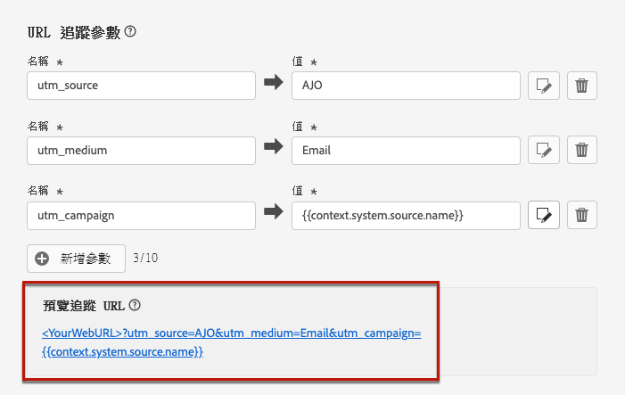

# 設定電子郵件設定 {#email-settings}

要開始建立電子郵件，您需要設定電子郵件通道曲面，以定義郵件所需的所有技術參數。 [瞭解如何建立曲面](../configuration/channel-surfaces.md)

在通道表面配置的專用部分定義電子郵件設定。

按照以下邏輯接收用於發送通信的電子郵件表面配置：

* 對於批處理和拆分行程，它不適用於在建立電子郵件表面配置之前已啟動的批處理或拆分執行。 更改將在下次重複或新執行時進行。

* 對於事務性消息，將立即為下次通信接收更改（最多5分鐘延遲）。

>[!NOTE]
>
>更新的電子郵件表面設定將在使用該表面的行程或市場活動中自動拾取。

## 電子郵件類型 {#email-type}

>[!CONTEXTUALHELP]
>id="ajo_admin_presets_emailtype"
>title="定義電子郵件類別"
>abstract="選取使用此表面時將傳送的電子郵件類型：促銷用電子郵件的行銷 (需要使用者同意)，或非商業電子郵件的異動 (還可以傳送至特定內容中取消訂閱的設定檔)。"

在 **電子郵件類型** 部分，選擇將與曲面一起發送的消息類型： **營銷** 或 **事務性**。

* 選擇 **營銷** 用於促銷電子郵件：這些消息需要用戶同意。

* 選擇 **事務性** 非商業電子郵件（例如，訂單確認、密碼重置通知或交貨資訊）。

>[!CAUTION]
>
>**事務性** 電子郵件可以發送到從營銷通信中取消訂閱的個人資料。 這些消息只能在特定上下文中發送。

建立郵件時，必須選擇與您為電子郵件選擇的類別匹配的有效通道曲面。

## 子域和IP池 {#subdomains-and-ip-pools}

在 **子域和IP池** ，您必須：

1. 選擇要用於發送電子郵件的子域。 [了解更多](../configuration/about-subdomain-delegation.md)

1. 選擇要與曲面關聯的IP池。 [了解更多](../configuration/ip-pools.md)

當所選IP池位於以下位置時，無法繼續建立曲面 [版本](../configuration/ip-pools.md#edit-ip-pool) (**[!UICONTROL 處理]** 狀態)，且從未與所選子域關聯。 否則，仍將使用IP池/子域關聯的最舊版本。 如果是這種情況，請將曲面另存為草稿，並在IP池具有 **[!UICONTROL 成功]** 狀態。

>[!NOTE]
>
>對於非生產環境，Adobe不建立現成的test子域，也不授予對共用發送IP池的訪問權限。 你需要 [委派自己的子域](../configuration/delegate-subdomain.md) 並使用分配給您組織的池中的IP。

選擇IP池後，當懸停在IP池下拉清單下顯示的IP地址上時，PTR資訊將可見。 [瞭解有關PTR記錄的詳細資訊](../configuration/ptr-records.md)

>[!NOTE]
>
>如果未配置PTR記錄，請聯繫您的Adobe代表。

## 清單 — 取消訂閱 {#list-unsubscribe}

在 [選擇子域](#subdomains-and-ip-pools) 清單中， **[!UICONTROL 啟用清單 — 取消訂閱]** 按鈕。

此選項已預設啟用。

如果保持啟用狀態，則取消訂閱連結將自動包含在電子郵件標題中，例如：

如果禁用此選項，則電子郵件標題中不會顯示取消訂閱連結。

取消訂閱連結包含兩個元素：

* 安 **取消訂閱電子郵件地址**，所有取消訂閱請求都發送到。

   在 [!DNL Journey Optimizer]，取消訂閱電子郵件地址是 **[!UICONTROL Mailto（取消訂閱）]** 顯示在通道表面的地址，根據 [選定子域](#subdomains-and-ip-pools)。

   

* 的 **取消訂閱URL**，即登錄頁的URL，在取消訂閱後將重定向用戶。

   如果添加 [按一下選擇退出連結](../privacy/opt-out.md#one-click-opt-out) 對於使用此曲面建立的消息，取消訂閱URL將是為按一下「選擇退出」連結定義的URL。

   

   >[!NOTE]
   >
   >如果您不在消息內容中添加一鍵退出選項連結，則不會向用戶顯示登錄頁。

瞭解有關將標題取消訂閱連結添加到郵件的詳細資訊 [此部分](../privacy/opt-out.md#unsubscribe-header)。

<!--Select the **[!UICONTROL Custom List-Unsubscribe]** option to enter your own Unsubscribe URL and/or your own Unsubscribe email address.(to add later)-->

## 標題參數 {#email-header}

在 **[!UICONTROL 標題參數]** 部分，輸入與使用該曲面發送的電子郵件類型關聯的發件人姓名和電子郵件地址。

* **[!UICONTROL 發件人名稱]**:發件人的名稱，如您的品牌名稱。

* **[!UICONTROL 發件人電子郵件]**:要用於通信的電子郵件地址。

* **[!UICONTROL 答復（名稱）]**:收件人按一下 **答復** 按鈕。

* **[!UICONTROL 答復（電子郵件）]**:收件人按一下 **答復** 按鈕。 [了解更多](#reply-to-email)

* **[!UICONTROL 錯誤電子郵件]**:ISP在發送數天郵件（非同步綁定）後生成的所有錯誤都會在此地址上接收。

>[!CAUTION]
>
>的 **[!UICONTROL 發件人電子郵件]** 和 **[!UICONTROL 錯誤電子郵件]** 地址必須使用當前選定的地址 [委託子域](../configuration/about-subdomain-delegation.md)。 例如，如果委派的子域是 *營銷.luma.com*，您可以使用 *contact@marketing.luma.com* 和 *error@marketing.luma.com*。

>[!NOTE]
>
>地址必須以字母(A-Z)開頭，並且只能包含字母數字字元。 您還可以使用下划線 `_`，點`.` 連字元 `-` 字元。

### 回復電子郵件 {#reply-to-email}

定義 **[!UICONTROL 答復（電子郵件）]** 地址，您可以指定任何電子郵件地址，前提是該地址是有效地址，格式正確且沒有任何類型。

為確保正確的答復管理，請遵循以下建議：

* 用於回復的收件箱將接收所有回復電子郵件，包括外出通知和質詢回應，因此確保您擁有手動或自動處理登錄到此收件箱的電子郵件的流程。

* 確保專用收件箱有足夠的接收容量來接收使用電子郵件介面發送的所有回復電子郵件。 如果收件箱返回回復，則可能無法收到客戶的一些回復。

* 處理答復時必須考慮到隱私和合規義務，因為答復可能包含個人身份資訊(PII)。

* 不要在回復收件箱中將郵件標籤為垃圾郵件，因為它會影響發送到此地址的所有其他回復。

此外，在定義 **[!UICONTROL 答復（電子郵件）]** 地址，確保使用具有有效MX記錄配置的子域，否則電子郵件表面處理將失敗。

如果在提交電子郵件表面時遇到錯誤，則表示未為您輸入的地址的子域配置MX記錄。 請與管理員聯繫以配置相應的MX記錄或使用具有有效MX記錄配置的其他地址。

>[!NOTE]
>
>如果您輸入的地址的子域是 [全權](../configuration/delegate-subdomain.md#full-subdomain-delegation) 要Adobe，請與Adobe客戶經理聯繫。

### 轉發電子郵件 {#forward-email}

如果要轉發到特定電子郵件地址，則所有收到的電子郵件 [!DNL Journey Optimizer] 對於委派的子域，請與Adobe客戶服務部門聯繫。 您需要提供：

* 您選擇的轉發電子郵件地址。 請注意，轉發電子郵件地址域與委託給Adobe的任何子域不匹配。
* 沙盒名稱。
* 將使用轉發電子郵件地址的表面名稱。
* 當前 **[!UICONTROL 答復（電子郵件）]** 在通道表面層設定的地址。

>[!NOTE]
>
>每個子域只能有一個轉發電子郵件地址。 因此，如果多個曲面使用同一子域，則所有這些曲面都必須使用相同的轉發電子郵件地址。

轉發電子郵件地址將通過Adobe設定。 這可能需要3到4天。

## 密件抄送電子郵件 {#bcc-email}

您可以發送由 [!DNL Journey Optimizer] 發送到密件抄送收件箱，在該收件箱中，這些郵件將儲存為符合性或存檔目的。

為此，請啟用 **[!UICONTROL 密件抄送電子郵件]** 在通道曲面級上可選特徵。 [了解更多](../configuration/archiving-support.md#bcc-email)

此外，在定義 **[!UICONTROL 密件抄送電子郵件]** 地址，確保使用具有有效MX記錄配置的子域，否則電子郵件表面處理將失敗。

如果在提交電子郵件表面時遇到錯誤，則表示未為您輸入的地址的子域配置MX記錄。 請與管理員聯繫以配置相應的MX記錄或使用具有有效MX記錄配置的其他地址。

## 電子郵件重試參數 {#email-retry}

>[!CONTEXTUALHELP]
>id="ajo_admin_presets_retryperiod"
>title="調整重試時段"
>abstract="當電子郵件由於暫時性的軟退信錯誤而傳遞失敗時，將重試 3.5 天 (84 小時)。您可以調整此預設的重試時段以進一步滿足您的需求。"
>additional-url="https://experienceleague.adobe.com/docs/journey-optimizer/using/configuration/monitor-reputation/retries.html" text="關於重試"

您可以配置 **電子郵件重試參數**。

預設情況下， [重試時間](../configuration/retries.md#retry-duration) 設定為84小時，但您可以調整此設定以更好地滿足您的需要。

必須在以下範圍內輸入整數值（以小時或分鐘為單位）:

* 對於市場營銷電子郵件，最短重試時間為6小時。
* 對於事務性電子郵件，最短重試時間為10分鐘。
* 對於這兩種電子郵件類型，最大重試時間為84小時（或5040分鐘）。

在中重試時瞭解更多資訊 [此部分](../configuration/retries.md)。

## URL跟蹤 {#url-tracking}

>[!CONTEXTUALHELP]
>id="ajo_admin_preset_utm"
>title="定義 URL 追蹤參數"
>abstract="使用此區段以將追蹤參數自動附加到電子郵件內容中的 URL。此功能為選用。"

>[!CONTEXTUALHELP]
>id="ajo_admin_preset_url_preview"
>title="預覽 URL 追蹤參數"
>abstract="重新探討要如何將追蹤參數附加到電子郵件內容中出現的 URL。"

您可以使用 **[!UICONTROL URL跟蹤參數]** 以衡量您跨渠道的營銷工作的成效。 此功能為選用。

本節中定義的參數將附加到電子郵件內容中包含的URL的末尾。 然後，您可以在Web分析工具(如Adobe Analytics或Google Analytics)中捕獲這些參數，並建立各種效能報告。

使用 **[!UICONTROL 添加新參數]** 按鈕

要配置URL跟蹤參數，可以直接在 **[!UICONTROL 名稱]** 和 **[!UICONTROL 值]** 的子菜單。

也可以編輯每個 **[!UICONTROL 值]** 欄位 [表達式編輯器](../personalization/personalization-build-expressions.md)。 按一下「版本」表徵圖以開啟編輯器。 從中，您可以選擇可用的上下文屬性和/或直接編輯文本。

以下預定義值可通過表達式編輯器獲得：

* **源操作ID**:添加到行程或市場活動的電子郵件操作的ID。

* **源操作名稱**:添加到行程或市場活動的電子郵件操作的名稱。

* **源ID**:與電子郵件一起發送的行程或市場活動的ID。

* **源名稱**:與電子郵件一起發送的行程或市場活動的名稱。

* **源版本ID**:與電子郵件一起發送的行程或市場活動版本的ID。

* **服務ID**:電子郵件中使用的優惠的ID。

>[!NOTE]
>
>您可以將鍵入的文本值與使用表達式編輯器中的上下文屬性結合起來。 每個 **[!UICONTROL 值]** 欄位可包含最多5 KB的字元。

<!--You can drag and drop the parameters to reorder them.-->

以下是與Adobe Analytics和Google Analytics相容的URL的示例。

* Adobe Analytics相容URL: `www.YourLandingURL.com?cid=email_AJO_{{context.system.source.id}}_image_{{context.system.source.name}}`

* Google Analytics相容URL: `www.YourLandingURL.com?utm_medium=email&utm_source=AJO&utm_campaign={{context.system.source.id}}&utm_content=image`

可動態預覽結果的跟蹤URL。 每次添加、編輯或刪除參數時，預覽都會自動更新。

>[!NOTE]
>
>您還可以將動態個性化跟蹤參數添加到電子郵件內容中存在的連結中，但在表面層不可能這樣做。 使用電子郵件設計器創作郵件時，需要執行此操作。 [了解更多](message-tracking.md#url-tracking)
