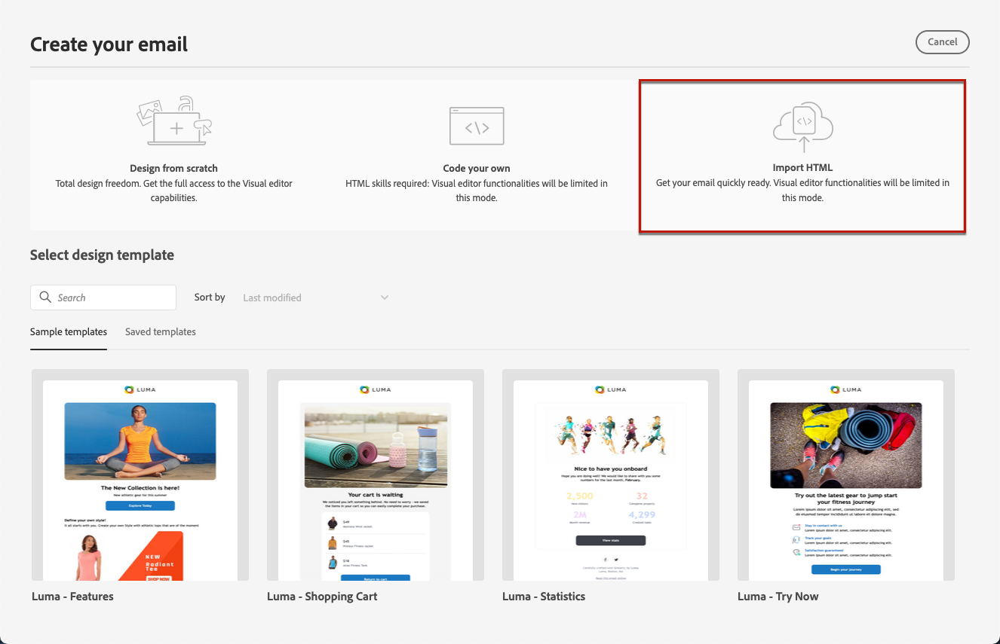
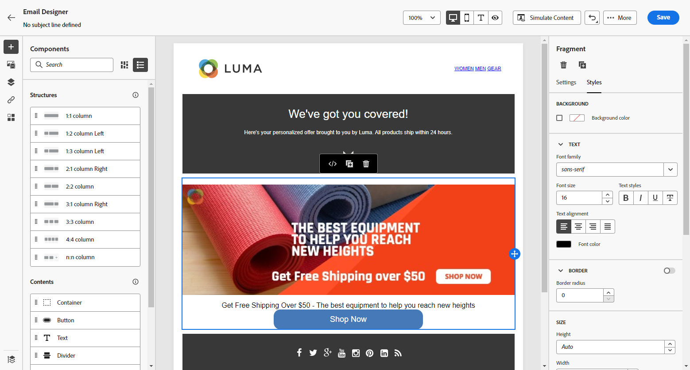

# 匯入電子郵件內容 {#existing-content}

>[!BEGINSHADEBOX]

**在此頁面上：**&#x200B;瞭解如何以HTML檔案或.zip資料夾形式匯入現有的HTML內容，以及如何轉換內容，以便使用電子郵件Designer進行編輯和個人化。

>[!ENDSHADEBOX]

[!DNL Journey Optimizer]可讓您匯入現有的HTML內容，以設計您的電子郵件。 此內容可以是：

* **HTML檔案**，包含合併的樣式表；
* **.zip資料夾**&#x200B;包含HTML檔案、樣式表(.css)和影像。

  >[!NOTE]
  >
  >.zip 檔案結構沒有限制。 不過，參照必須是相對參照，而且符合.zip資料夾的樹狀結構。

>[!TIP]
>
>如果您有影像設計（JPEG或PNG），而不是HTML檔案，您可以使用[影像到HTML轉換器](../content-management/image-to-html.md)，透過AI自動將它們轉換為可編輯的HTML電子郵件範本。

若要匯入包含 HTML 內容的檔案，請依照以下步驟操作：

1. 從電子郵件Designer首頁，選取&#x200B;**[!UICONTROL 匯入HTML]**。

   

1. 拖放包含 HTML 內容的 HTML 或 .zip 檔案，然後按一下「**[!UICONTROL 匯入]**」。

   

1. 上傳HTML內容後，您的內容將處於&#x200B;**[!UICONTROL 相容性模式]**。

   在此模式中，您只能個人化您的文字、新增連結或包含資產至您的內容。

1. 若要能夠利用電子郵件Designer內容元件，請存取&#x200B;**[!UICONTROL HTML轉換工具]**&#x200B;索引標籤，然後按一下&#x200B;**[!UICONTROL 轉換]**。

   

   >[!NOTE]
   >
   > 在HTML檔案中使用`<table>`標籤做為第一個圖層可能會造成樣式遺失，包括上層圖層標籤中的背景和寬度設定。

1. 您現在可以根據需要，使用電子郵件Designer功能個人化匯入的檔案。 [了解更多](content-from-scratch.md)

## 作法影片 {#video}

瞭解如何匯入現有的 HTML 內容、調整設計、新增鏡像頁面和取消訂閱連結，以及如何編寫內容的程式碼。

>[!VIDEO](https://video.tv.adobe.com/v/334102?quality=12)
