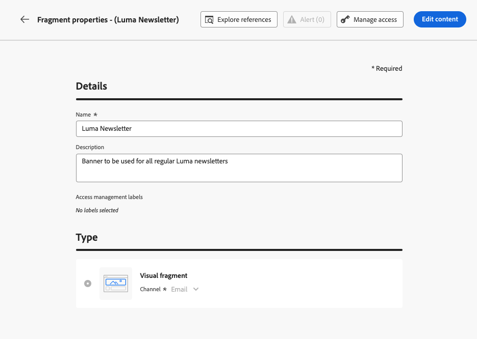
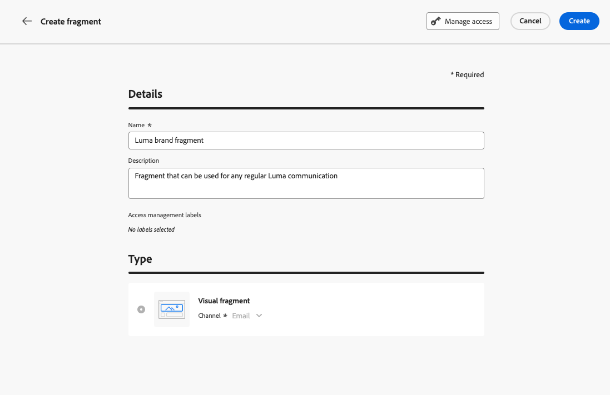
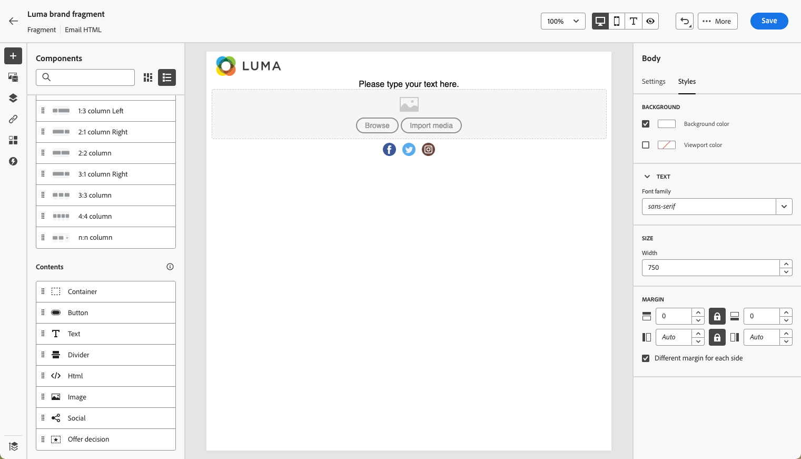

# 使用片段 {#fragments}

片段是可重複使用的元件，可在一封或多封電子郵件中加以參照 [!DNL Journey Optimizer] 行銷活動和歷程。

此功能允許預先建置多個自訂內容區塊，可供非技術行銷使用者在改良的設計流程中快速組合電子郵件內容。

➡️ [在本影片中瞭解如何管理、編寫和使用片段](#video-fragments)

>[!CAUTION]
>
>若要建立、編輯和封存片段，您必須擁有 **[!DNL Manage Library Items]** 許可權包含在 **[!DNL Content Library Manager]** 產品設定檔。 [了解更多](../administration/ootb-product-profiles.md#content-library-manager)

若要充分利用片段：

* 建立您自己的片段。 另請參閱 [建立片段](#create-fragments)
* 視需要在電子郵件中多次使用。 另請參閱 [使用片段](#use-fragments)

>[!NOTE]
>
>此功能目前僅適用於電子郵件。

## 存取及管理片段 {#access-manage-fragments}

若要存取片段清單，請選取「 」 **[!UICONTROL 內容管理]** > **[!UICONTROL 片段]** 從左側功能表。

在目前沙箱上建立的所有片段 — 來自 **[!UICONTROL 片段]** 功能表，使用 [另存為片段](#save-as-fragment) 選項 — 會顯示。

您可以在建立或修改日期篩選片段。 您可以選擇顯示所有片段，或僅顯示目前使用者建立或修改的專案。 您也可以顯示 **[!UICONTROL 已封存]** 片段。 [了解更多](#archive-fragments)

從 **[!UICONTROL 更多動作]** 圖示旁，您可以：

* 復製片段。

* 使用 **[!UICONTROL 探索引用]** 檢視歷程、行銷活動或使用範本的選項。 [了解更多](#explore-references)

* 封存片段。 [了解更多](#archive-fragments)

### 編輯片段 {#edit-fragments}

若要編輯片段，請遵循以下步驟。

1. 從以下位置按一下所需的專案： **[!UICONTROL 片段]** 清單。
1. 從片段屬性中，您可以 [探索引用](#explore-references)， [管理其存取權](../administration/object-based-access.md)，並更新片段詳細資訊，包括 [標籤](../start/search-filter-categorize.md#tags).

   

1. 選取對應的按鈕來編輯內容，就像從頭開始建立片段時一樣。 [了解更多](#create-from-scratch)

>[!NOTE]
>
>當您編輯片段時，變更會自動傳播到包含該片段的所有電子郵件或範本，但中使用的電子郵件除外 **[!UICONTROL 即時]** 歷程或行銷活動。 您也可以中斷原始片段的繼承。 [了解更多](#break-inheritance)

<!--Changes made to a fragment are not propagated to live journeys or campaigns where it is used.-->

<!--When added to an email, if you want to modify a fragment for a specific email, you can break the synchronization with the original fragment. The fragment becomes part of the email content and the changes will not be synchronized anymore. [Learn more](#break-inheritance)-->

### 探索引用 {#explore-references}

您可以顯示目前使用片段的歷程、行銷活動和內容範本清單。

若要這麼做，請選取 **[!UICONTROL 探索引用]** 來自 **[!UICONTROL 更多動作]** 「片段」清單或「片段屬性」畫面中的「 」功能表。

選取索引標籤以在歷程、行銷活動和範本之間切換。 您可以檢視其狀態，然後按一下名稱，重新導向至已引用片段的對應專案。

>[!NOTE]
>
>如果片段用於歷程、行銷活動或範本中，且標籤阻止您存取該片段，您會在選取的標籤上方看到警告訊息。 [深入瞭解物件層級存取控制(OLAC)](../administration/object-based-access.md)

### 封存片段 {#archive-fragments}

您可以從不再與您的品牌相關的專案清除片段清單。

若要這麼做，請按一下 **[!UICONTROL 更多動作]** 圖示並選取「 」 **[!UICONTROL 封存]**. 它會從片段清單中消失，從而防止使用者在未來的電子郵件或範本中使用它。

>[!NOTE]
>
>如果您封存用於電子郵件或內容範本中的片段， <!--it will remain in the email or template, but you won't be able to select it from the fragment list to edit it-->電子郵件或範本不受影響。

若要取消封存片段，請在 **[!UICONTROL 已封存]** 專案並選取 **[!UICONTROL 取消封存]** 從 **[!UICONTROL 更多動作]** 功能表。 現在仍可從片段清單存取，並可用於任何電子郵件或範本。

## 建立片段 {#create-fragments}

建立片段的方式有兩種：

* 使用，從頭開始建立片段 **[!UICONTROL 片段]** 專用功能表。 [了解作法](#create-template-from-scratch)

* 設計電子郵件或內容範本時，請將部分內容儲存為片段。 [了解作法](#save-as-template)

儲存後，您的片段即可用於歷程、行銷活動或範本。 無論是從頭建立還是從現有內容建立，您現在都可以在建立任何內容時使用此片段 [電子郵件](get-started-email-design.md) 或 [內容範本](content-templates.md) 範圍 [!DNL Journey Optimizer]. [了解更多](#use-fragments)

### 從頭開始建立 {#create-from-scratch}

>[!CONTEXTUALHELP]
>id="ajo_create_fragment"
>title="定義專屬片段"
>abstract="從頭開始建立獨立的片段，使您的內容可在多個歷程和行銷活動中重複使用。"

若要從頭開始建立片段，請遵循下列步驟。

1. 透過存取片段清單 **[!UICONTROL 內容管理]** > **[!UICONTROL 片段]** 左側功能表。

1. 選取 **[!UICONTROL 建立片段]**.

1. 填寫片段詳細資訊，即名稱和說明（如果需要）。

   

   >[!NOTE]
   >
   >目前僅限 **[!UICONTROL 視覺片段]** 型別和 **電子郵件** 管道受支援。

1. 若要指派自訂或核心資料使用標籤給片段，請選取「 」 **[!UICONTROL 管理存取權]**. [深入瞭解物件層級存取控制(OLAC)](../administration/object-based-access.md).

1. 選擇或建立Adobe Experience Platform標籤，從 **[!UICONTROL 標籤]** 將片段分類的欄位有助改善搜尋。 [了解更多](../start/search-filter-categorize.md#tags)

1. 按一下&#x200B;**[!UICONTROL 建立]**。

1. 此 [電子郵件設計工具](get-started-email-design.md) 顯示。 視需要編輯您的內容，就像處理歷程或行銷活動中的任何電子郵件一樣。

   >[!NOTE]
   >
   >您可以新增個人化欄位和動態內容，但片段中不支援內容屬性。

   

1. 片段準備就緒後，請按一下 **[!UICONTROL 儲存]**.

1. 如有需要，請按一下片段名稱旁的箭頭，以返回 **[!UICONTROL 詳細資料]** 並加以編輯。

   

此片段現在已準備好用於建立任何 [電子郵件](get-started-email-design.md) 或 [內容範本](content-templates.md) 範圍 [!DNL Journey Optimizer]. [了解作法](#use-fragments)

### 另存為片段 {#save-as-fragment}

設計時 [內容範本](content-templates.md) 或 [電子郵件](get-started-email-design.md) 在行銷活動或歷程中，您可以將部分內容儲存為片段以供未來重複使用。 請依照下列步驟以執行此操作。

1. 在 [電子郵件設計工具](get-started-email-design.md)，按一下畫面右上方的省略符號。

1. 選取 **[!UICONTROL 另存為片段]** （從下拉式功能表）。

   

1. 此 **[!UICONTROL 另存為片段]** 熒幕顯示。 在該處選取您要納入片段中的元素，包括個人化欄位和動態內容。 請注意，片段中不支援內容屬性。

   >[!CAUTION]
   >
   >您只能選取彼此相鄰的截面。 您無法選取空的結構或其他片段。

   

1. 按一下&#x200B;**[!UICONTROL 建立]**。填寫片段詳細資訊，即名稱和說明（如果需要）。

   

   >[!NOTE]
   >
   >目前僅限 **[!UICONTROL 視覺片段]** 型別和 **電子郵件** 管道受支援。

1. 若要指派自訂或核心資料使用標籤給片段，請選取「 」 **[!UICONTROL 管理存取權]**. [深入瞭解物件層級存取控制(OLAC)](../administration/object-based-access.md).

1. 選擇或建立Adobe Experience Platform標籤，從 **標籤** 將範本分類以改善搜尋的欄位。 [了解更多](../start/search-filter-categorize.md#tags)

1. 按一下 **[!UICONTROL 建立]** 再來一次。 片段會儲存至 **[!UICONTROL 片段]** 清單，可從存取 [!DNL Journey Optimizer] 專用功能表。

   它會變成獨立的片段，可以 [已存取](#access-manage-fragments)， [已編輯](#edit-fragments) 和 [已封存](#archive-fragments) 如同該清單上的任何其他專案。

您現在可以在建置任何 [電子郵件](get-started-email-design.md) 或 [內容範本](content-templates.md) 範圍 [!DNL Journey Optimizer]. [了解作法](#use-fragments)

>[!NOTE]
>
>對該新片段所做的任何變更都不會傳播到該新片段來自的電子郵件或範本。 同樣地，在該電子郵件或範本中編輯原始內容時，不會修改新片段。

## 使用片段 {#use-fragments}

您可以在以下專案中使用片段： [電子郵件](get-started-email-design.md) 在歷程或行銷活動中，或在 [內容範本](content-templates.md).

1. 使用開啟任何電子郵件或範本內容 [電子郵件設計工具](get-started-email-design.md).

1. 選取 **[!UICONTROL 片段]** 圖示加以檢視。

   

1. 隨即顯示目前沙箱上建立的所有片段清單。 您可以：

   * 透過開始輸入其標籤來搜尋特定片段。
   * 以遞增或遞減順序排序片段。
   * 變更片段的顯示方式（卡片或清單檢視）。

1. 您也可以重新整理清單。

   >[!NOTE]
   >
   >如果您在編輯內容時修改或新增了某些片段，清單會以最新變更更新。

1. 從清單拖放任何片段到您要插入它的區域。

   

1. 如同任何其他元件，您可以在內容中移動片段。

1. 選取片段以在右側顯示對應的窗格。 從那裡，您可以從您的內容中刪除片段或複製它。 您也可以從片段上方顯示的內容功能表直接執行這些動作。

   

1. 從 **[!UICONTROL 設定]** 標籤，您可以：

   * 選擇您要顯示片段的裝置。
   * 視需要在新索引標籤中開啟片段以編輯。 [了解更多](#edit-fragments)
   * 探索引用。 [了解更多](#explore-references)

1. 您可以使用進一步自訂您的片段 **[!UICONTROL 樣式]** 標籤。

1. 如有需要，您可以中斷具有原始片段的繼承。 [了解更多](#break-inheritance)

1. 新增任意數量的片段，並且 **[!UICONTROL 儲存]** 您的變更。

### 中斷繼承 {#break-inheritance}

當您編輯片段時，變更會同步。 它們會自動傳播至所有 **[!UICONTROL 草稿]** 歷程/行銷活動以及包含該片段的內容範本。

>[!NOTE]
>
>變更不會傳播至中使用的電子郵件 **[!UICONTROL 即時]** 歷程或行銷活動。

新增至電子郵件或內容範本時，預設會同步片段。

不過，您可以中斷原始片段的繼承。 在這種情況下，片段內容會複製到目前設計中，且變更將不再同步。

若要中斷繼承，請遵循下列步驟：

1. 選取片段。

1. 按一下內容工具列中的解鎖圖示。

   

1. 該片段會成為不再連結至原始片段的獨立元素。 編輯它，就像內容中的任何其他內容元件一樣。 [了解更多](content-components.md)

## 操作說明影片 {#video-fragments}

了解如何管理、編寫和使用 [!DNL Journey Optimizer] 內的片段。

>[!VIDEO](https://video.tv.adobe.com/v/3419932/?quality=12)
