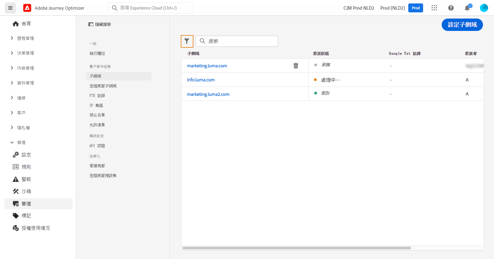
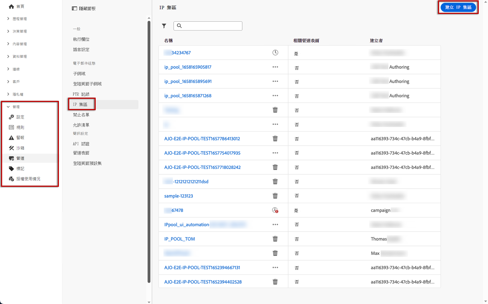
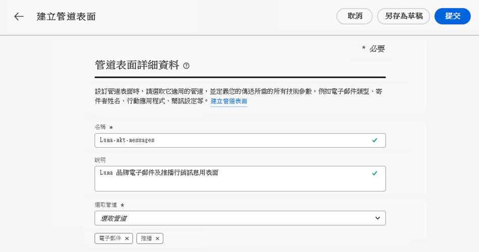
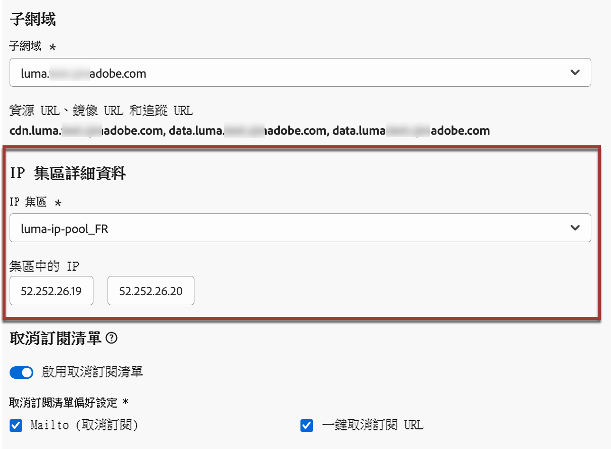
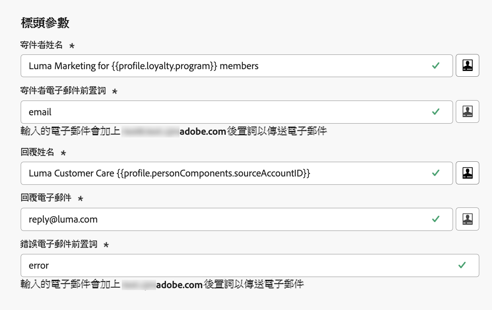
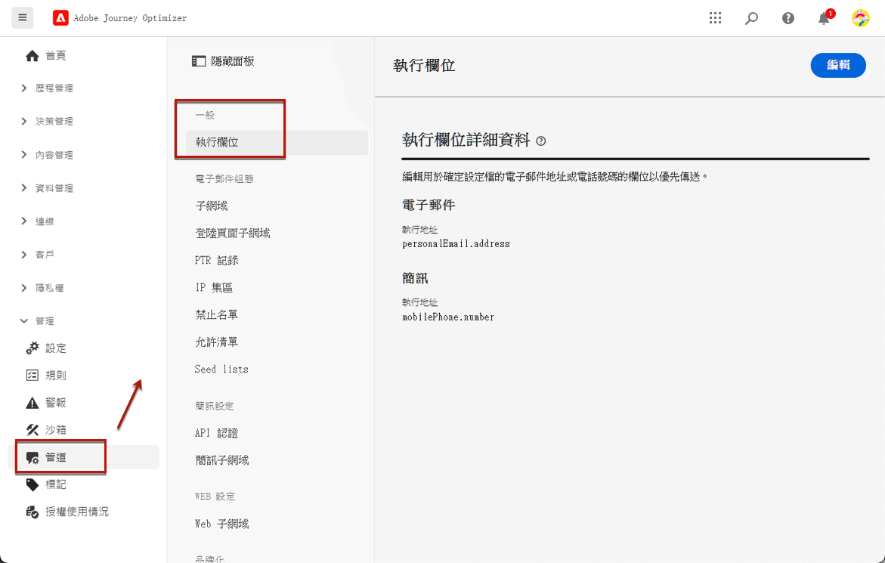
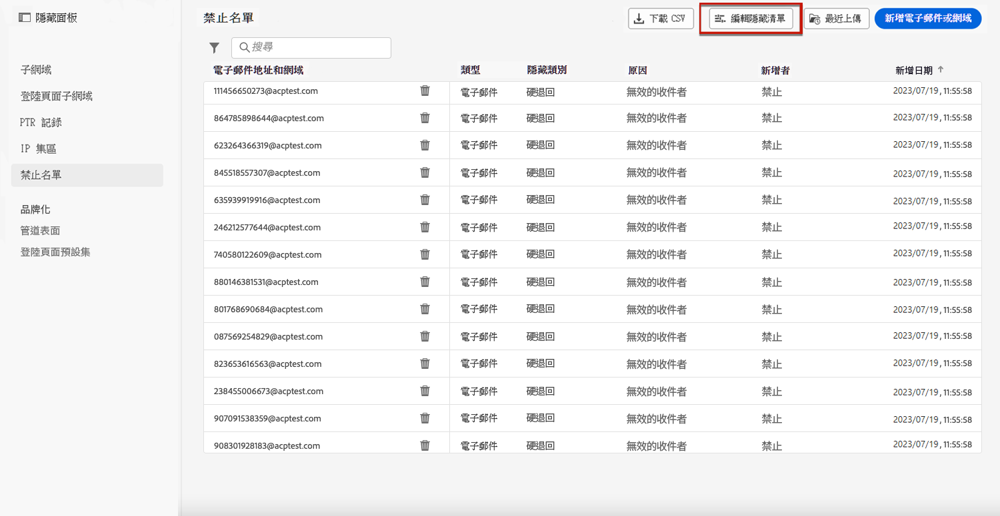

# 開始使用電子郵件設定 {#get-starte-email-config}

>[!BEGINSHADEBOX]

**在此頁面上：**&#x200B;瞭解在Adobe Journey Optimizer中設定電子郵件通道的基本步驟，從委派子網域和建立IP集區，到設定通道設定、執行欄位和重試。

>[!ENDSHADEBOX]

在 Adobe Journey Optimizer 中設定電子郵件管道，是建立具影響力、個人化電子郵件體驗，進而有效吸引客群的閘道。

本節將引導您完成透過[!DNL Journey Optimizer]傳送電子郵件所需遵循的基本設定步驟。 您也會瞭解如何設定電子郵件標題、個人化多個品牌的設定、啟用分析的URL追蹤，甚至新增一鍵取消訂閱連結以方便使用者。 每個主題都建立在上一個主題的基礎之上，為您提供工具，讓您能夠微調電子郵件策略，同時保持控制和精確度。

為了能夠在 [!DNL Journey Optimizer] 透過歷程與行銷活動傳送電子郵件，您必須執行許多設定步驟。 以下列出這些步驟：

1. 若要確保最佳傳遞能力並保護您的聲譽，首先將要用於傳送 [!DNL Journey Optimizer] 電子郵件的&#x200B;**子網域委派給 Adobe**。 這些子網域將決定要追蹤的網頁和鏡像頁面 URL 等元素。 [了解更多](../configuration/about-subdomain-delegation.md)

   

1. 建立 IP 集區，將使用執行個體佈建的 **IP 位址分組**。 [了解更多](../configuration/ip-pools.md)

   

1. 建立&#x200B;**管道設定**，然後選取&#x200B;**[!UICONTROL 電子郵件]**&#x200B;管道。 [了解更多](../configuration/channel-surfaces.md)

   

1. 在每個電子郵件管道設定中，設定傳送電子郵件所需的所有&#x200B;**技術參數**。 [了解更多](email-settings.md)

   * 可在此處選取要用於傳送電子郵件的子網域，以及要與設定關聯的 IP 集區。 [了解更多](email-settings.md#ip-pools)

   

   * **[!UICONTROL 來自電子郵件前置詞]**&#x200B;和&#x200B;**[!UICONTROL 錯誤電子郵件前置詞]**&#x200B;使用目前選取的[委派子網域](../configuration/about-subdomain-delegation.md)。 可選擇地，**[!UICONTROL 寄件者名稱]**&#x200B;和&#x200B;**[!UICONTROL 寄件者電子郵件]**&#x200B;可識別不同的傳輸合作對象（完整的&#x200B;**寄件者**&#x200B;位址，未繫結至該子網域尾碼）。 [了解更多](header-parameters.md#sender-header)

   

1. 透過設定其他進階引數來完成您的電子郵件通道設定，例如啟用密件副本、定義分析的URL追蹤或新增一鍵取消訂閱連結以方便使用者。 [了解更多](email-settings.md)

1. 在 Adobe Experience Platform 有多個地址可用時，確定收件者優先使用的&#x200B;**執行欄位**。 [了解更多](../configuration/primary-email-addresses.md)

   

1. 管理將電子郵件地址傳送至禁止名單前執行&#x200B;**重試**&#x200B;的天數。 [了解更多](../configuration/manage-suppression-list.md)

   

:::: landing-cards-container
:::

開始使用電子郵件組態

了解設定電子郵件功能的基本步驟，包括子網域委派、IP 集區和禁止名單管理。

[開始設定電子郵件](get-started-email-config.md)
:::

:::

定義電子郵件組態設定

透過如密件副本、禁止覆寫和 URL 追蹤等進階功能，設定電子郵件組態以提高傳遞能力、遵循法規和自訂。

[進行設定](email-settings.md)
:::

:::

啟用並設定取消清單訂閱

了解如何啟用「取消清單訂閱」功能，在收件者選擇退出的電子郵件標頭中包含一鍵式取消訂閱 URL。

[設定取消清單訂閱](list-unsubscribe.md)
:::

:::

設定電子郵件標頭參數

自訂寄件者和回覆電子郵件地址、處理錯誤，以及轉寄電子郵件以進行有效通訊。

[設定標頭參數](header-parameters.md)
:::

:::

設定電子郵件管道的 URL 追蹤

設定 URL 追蹤參數，以評估電子郵件行銷活動的效益並與分析工具整合。

[設定 URL 追蹤](url-tracking.md)
:::

:::

個人化電子郵件組態設定

設定動態子網域、個人化標頭和 URL 追蹤，以提供量身打造的電子郵件體驗。

[設定個人化電子郵件](surface-personalization.md)
:::

::::
