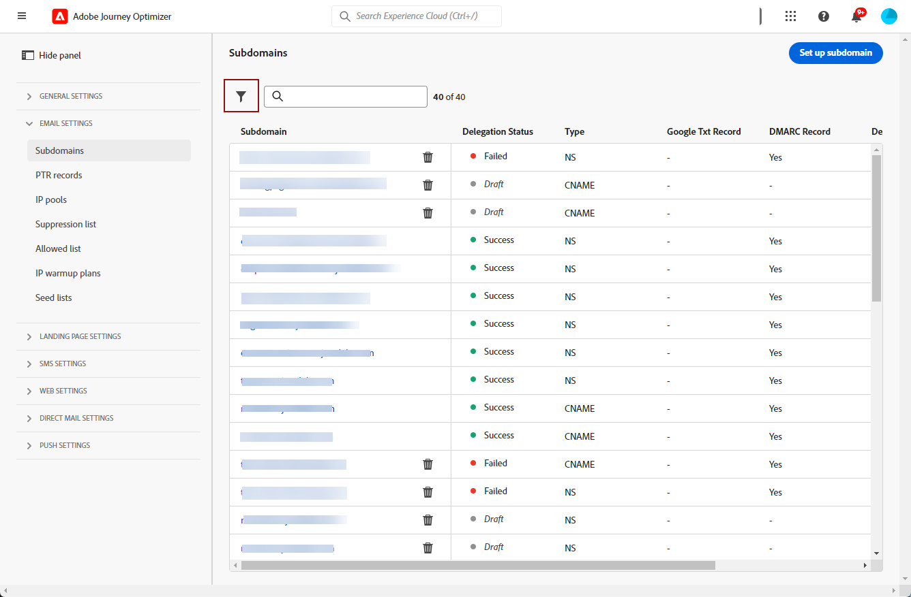

# 開始使用電子郵件設定 {#get-starte-email-config}

為了能夠在 [!DNL Journey Optimizer] 透過歷程與行銷活動傳送電子郵件，您必須執行許多設定步驟。

1. 若要確保最佳傳遞能力並保護您的聲譽，請從&#x200B;**將您用來傳送電子郵件的**&#x200B;子網域[!DNL Journey Optimizer]委派給Adobe開始。 這些子網域將決定要追蹤的網頁和鏡像頁面 URL 等元素。 [了解更多](../configuration/about-subdomain-delegation.md)

   

1. 建立IP集區，將&#x200B;**與您執行個體布建的IP位址分組**。 [了解更多](../configuration/ip-pools.md)

   

1. 建立&#x200B;**頻道設定**&#x200B;並選取&#x200B;**[!UICONTROL 電子郵件]**&#x200B;頻道。 [了解更多](../configuration/channel-surfaces.md)

   

1. 在每個電子郵件通道設定中，設定傳遞電子郵件所需的所有&#x200B;**技術引數**。 [了解更多](email-settings.md)

   * 可在此處選取要用於傳送電子郵件的子網域，以及要與設定關聯的 IP 集區。[了解更多](email-settings.md#subdomains-and-ip-pools)

   

   * 此&#x200B;**[!UICONTROL 寄件者電子郵件]**&#x200B;和&#x200B;**[!UICONTROL 錯誤電子郵件]**&#x200B;地址必須使用目前選定的委派子網域。 [了解更多](email-settings.md#email-header)

   

1. 當Adobe Experience Platform中有數個位址可用時，決定優先使用哪些&#x200B;**執行欄位**。 [了解更多](../configuration/primary-email-addresses.md)

   

1. 管理將電子郵件地址傳送至禁止名單前執行&#x200B;**重試**&#x200B;的天數。[了解更多](../configuration/manage-suppression-list.md)

   
