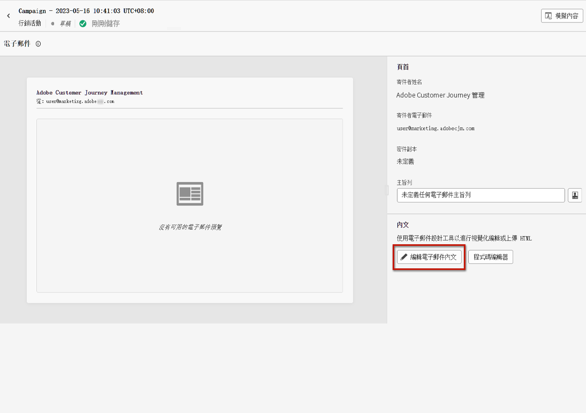
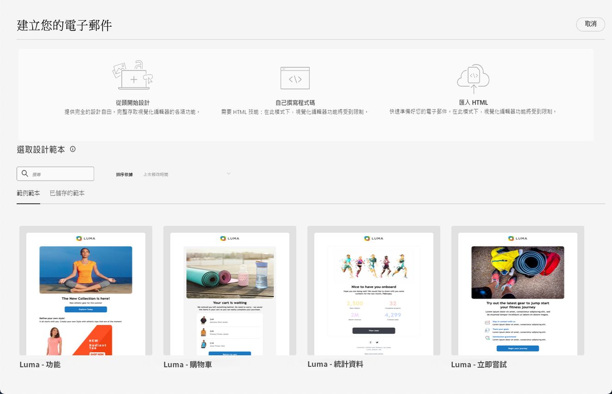
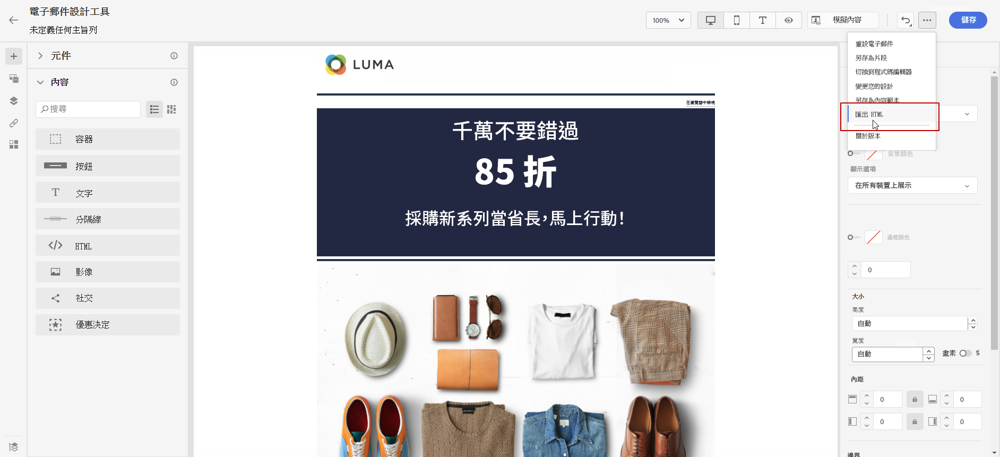

# 開始使用電子郵件設計 {#get-started-content-design}

您可在 [!DNL Journey Optimizer] 匯入現有內容或善用內容設計功能：

* 利用[!DNL Journey Optimizer] **電子郵件設計功能**&#x200B;來建立或匯入回應式電子郵件。[了解更多](content-from-scratch.md)

* 利用 **Adobe Experience Manager Assets Essentials** 豐富您的電子郵件，建立並管理您自己的資產資料庫。[了解更多](../integrations/assets.md)

* 查找 **Adobe Stock 相片**&#x200B;建立內容並改進電子郵件設計。[了解更多](../integrations/stock.md)

* 根據客戶的輪廓屬性建立個人化和動態訊息，以增強客戶體驗。深入瞭解[個人化](../personalization/personalize.md)及[動態內容](../personalization/get-started-dynamic-content.md)。

➡️ [在影片中探索此功能](#video)

## 電子郵件設計最佳實務 {#best-practices}

傳送電子郵件時，務必考慮到收件者有可能轉寄郵件，這有時可能會導致電子郵件呈現的問題。使用用於轉寄的電子郵件提供商可能不支援的 CSS 類別時尤其如此，例如，如果您使用「is-desktop-hidden」CSS 類別來隱藏行動裝置上的影像。

若要將這些呈現問題降至最低，建議您盡可能維持電子郵件設計結構的簡單性。 請嘗試使用單一設計以便同時適用於桌面與行動裝置，並避免使用複雜 CSS 類別或其他設計元素，因為可能並非所有電子郵件用戶端均可完全支援。 無論收件者如何檢視或轉寄電子郵件，您都可遵循這些最佳實務來確保其均能以一致的方式正確呈現電子郵件。

請參閱下方表格，即可瞭解電子郵件設計的最佳實務：

| 建議 | 使用時請務必謹慎 | 並不建議 |
|-|-|-|
| <ul><li>結構為<b>以靜態表格為基礎的版面</b></li> <li><b>HTML 表格和巢狀表格</b>，維持版面一致性</li> <li><b>範本寬度</b>介於 600px 到 800px 之間 </li> <li>樣式的<b>簡單、內嵌 CSS</b> </li> <li><b>網頁安全字型</b>兼具通用相容性</li> | <ul><li><b>背景圖片</b>可能不會出現在某些電子郵件平台上。</li><li><b>自訂網頁字型</b>缺少通用支援。</li><li><b>寬版面</b>可能無法在較小的螢幕上正常顯示。</li><li><b>影像圖片</b>只提供有限功能。</li><li>有時會在電子郵件傳送期間，將<b>嵌入 CSS</b> 移除。</li> | <ul><li>電子郵件環境中，通常不會支援 <b>JavaScript</b>。</li> <li> 大多數的平台上，都已封鎖 <b>`<iframe>`</b> 個標籤。 </li> <li><b>Flash</b> 已過時，系統不再提供支援。</li> <li><b>嵌入音訊</b>通常無法正常播放。</li> <li><b>嵌入影片</b>和許多電子郵件平台並不相容。</li> <li> <b>表單</b>無法在電子郵件中正常運作。</li> <li> `
` 分層可能會導致轉譯問題。</li> |

>[!NOTE]
>
>[歐洲協助工具法](https://eur-lex.europa.eu/legal-content/EN/TXT/?uri=CELEX%3A32019L0882){target="_blank"}規定所有數位通訊都應該可供存取。 除了本節中列出的電子郵件設計最佳實務之外，請務必遵循[此頁面](accessible-content.md)上列出的准則，這些准則專用於使用Email Designer建立無障礙內容。

## 建立電子郵件內容的關鍵步驟 {#key-steps}

一旦[新增電子郵件](create-email.md)至歷程或行銷活動，您就可以開始建立電子郵件內容。

1. 在歷程或行銷活動設定畫面，透過&#x200B;**[!UICONTROL 編輯內容]**&#x200B;畫面存取電子郵件設計工具。[了解更多](create-email.md#define-email-content)

   

1. 在電子郵件設計工具首頁，從下列選項選取您希望如何設計電子郵件：

   * 透過電子郵件設計工具介面並善用 [Adobe Experience Manager Assets](../integrations/assets.md) 的影像&#x200B;**從頭開始設計電子郵件**。在[本節](content-from-scratch.md)了解如何設計您的電子郵件內容。

   * 請直接在電子郵件設計工具中，**編寫程式碼或貼上原始 HTML**。在[本節](code-content.md)了解如何撰寫您自己的內容。

     >[!NOTE]
     >
     >在行銷活動中，您還可以從&#x200B;**[!UICONTROL 編輯內容]**&#x200B;畫面選取&#x200B;**[!UICONTROL 程式碼編輯器]**&#x200B;按鈕。[了解更多](create-email.md#define-email-content)

   * 從檔案或 .zip 資料夾&#x200B;**匯入現有 HTML 內容**。在[本節](existing-content.md)了解如何匯入電子郵件內容。
<!-- DOCAC-13676
    * **Convert image designs to HTML templates** using the AI-powered Template Accelerator feature. Learn how to transform static images into editable email templates in [this section](image-to-html.md).-->

從內建或自訂範本清單中    * **選取現有內容**。 在[本章節](../email/use-email-templates.md)中瞭解如何使用電子郵件範本。
    
    

1. 一旦定義並個人化您的電子郵件內容，您就可以匯出內容以供驗證或稍後使用。按一下&#x200B;**[!UICONTROL 匯出 HTML]** 以在您的電腦儲存包含您的 HTML 及資產的 zip 檔。

   

## 作法影片 {#video}

了解如何使用訊息編輯器建立電子郵件內容。

>[!VIDEO](https://video.tv.adobe.com/v/334150?quality=12)

了解如何設定內容實驗以進行 A/B 測試並探索電子郵件內容，以最佳方式推動您的業務目標。

>[!VIDEO](https://video.tv.adobe.com/v/3447342?captions=chi_hant)
