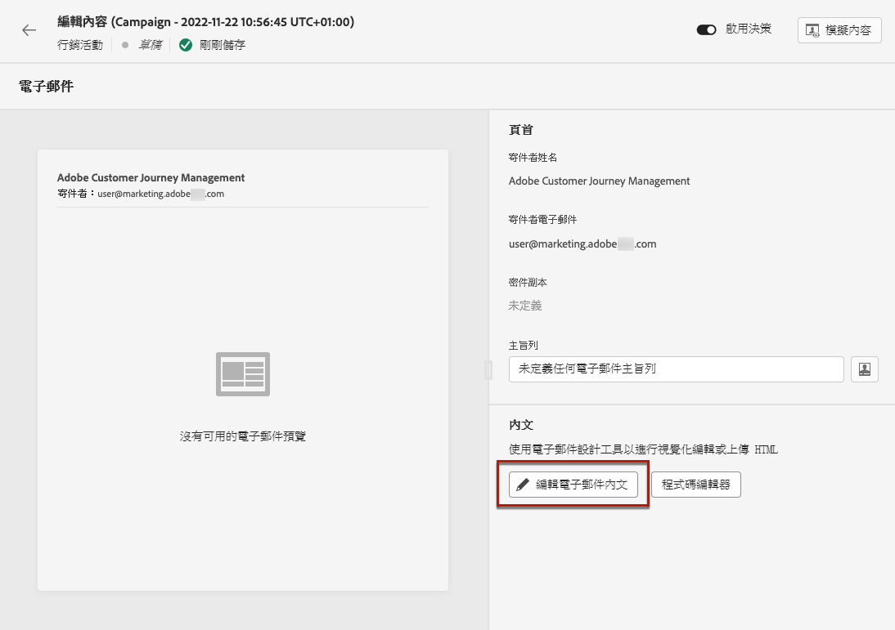

# 開始使用電子郵件設計 {#get-started-content-design}

您可以在 [!DNL Journey Optimizer] 或利用內容設計功能：

* 使用 [!DNL Journey Optimizer] **電子郵件設計功能** 來設計或匯入回應式電子郵件。 [深入了解](content-from-scratch.md)

* 運用 **Adobe Experience Manager Assets Essentials** 若要豐富您的電子郵件內容，請建立及管理您自己的資產資料庫。 [深入了解](assets-essentials.md)

* 查找 **Adobe Stock Photos** 來建立內容並改善電子郵件設計。 [深入了解](stock.md)

* 根據客戶的設定檔屬性建立個人化和動態訊息，以增強客戶體驗。 深入了解 [個人化](../personalization/personalize.md) 和 [動態內容](../personalization/get-started-dynamic-content.md).

➡️ [在影片中探索此功能](#video)

一旦您 [新增電子郵件](create-email.md) 至歷程或行銷活動，您可以開始建立電子郵件內容。

1. 在歷程或行銷活動設定畫面中，逐一瀏覽 **[!UICONTROL Edit content]** 螢幕存取電子郵件設計工具。 [深入了解](create-email.md#define-email-content)

   

1. 在電子郵件設計工具首頁上，從以下選項選擇您要如何設計電子郵件：

   * **從草稿開始設計您的電子郵件** 透過電子郵件設計工具的介面，並運用 [Adobe Experience Manager Assets Essentials](assets-essentials.md). 了解如何在 [本節](content-from-scratch.md).

   * **編碼或貼上原始HTML** 直接在電子郵件設計工具中。 了解如何在 [本節](code-content.md).

      >[!NOTE]
      >
      >在促銷活動中，您也可以選取 **[!UICONTROL Code Editor]** 按鈕 **[!UICONTROL Edit content]** 螢幕。 [深入了解](create-email.md#define-email-content)

   * **匯入現有的HTML內容** 或.zip資料夾。 了解如何在 [本節](existing-content.md).

   * **選取現有內容** 從內建或自訂範本的清單。 了解如何使用電子郵件範本 [本節](email-templates.md).

   

## 作法影片 {#video}

了解如何使用訊息編輯器建立電子郵件內容。

>[!VIDEO](https://video.tv.adobe.com/v/334150?quality=12)