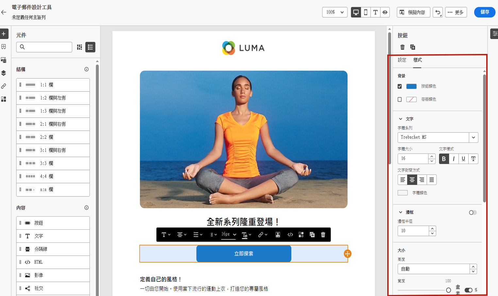

# 開始使用電子郵件樣式 {#get-started-email-style}

在 [!DNL Journey Optimizer] 中開始建立電子郵件內容後，您可從電子郵件設計工具&#x200B;**[!UICONTROL 樣式]**&#x200B;窗格調整許多樣式參數與屬性。

您可將變更套用至電子郵件內文、結構元件或內容元件。

請依照下列連結，了解如何調整電子郵件的某些樣式設定。

* 了解如何[個人化您的電子郵件背景](backgrounds.md)
* 了解如何[管理垂直對齊方式及邊框間距](alignment-and-padding.md)
* 了解如何[自訂內嵌樣式屬性](inline-styling.md)
* 瞭解如何[新增自訂CSS至您的電子郵件內容](custom-css.md)
* 瞭解如何[管理深色模式內容](dark-mode.md)

>[!NOTE]
>
>[歐洲協助工具法](https://eur-lex.europa.eu/legal-content/EN/TXT/?uri=CELEX%3A32019L0882){target="_blank"}規定所有數位通訊都應該可供存取。 在[中設計內容時，請務必遵循](../email/accessible-content.md)此頁面[!DNL Journey Optimizer]所列的特定樣式准則，例如調整顏色、標籤和圖示以確保清晰度，以及針對行動裝置和回應式佈局最佳化設計。