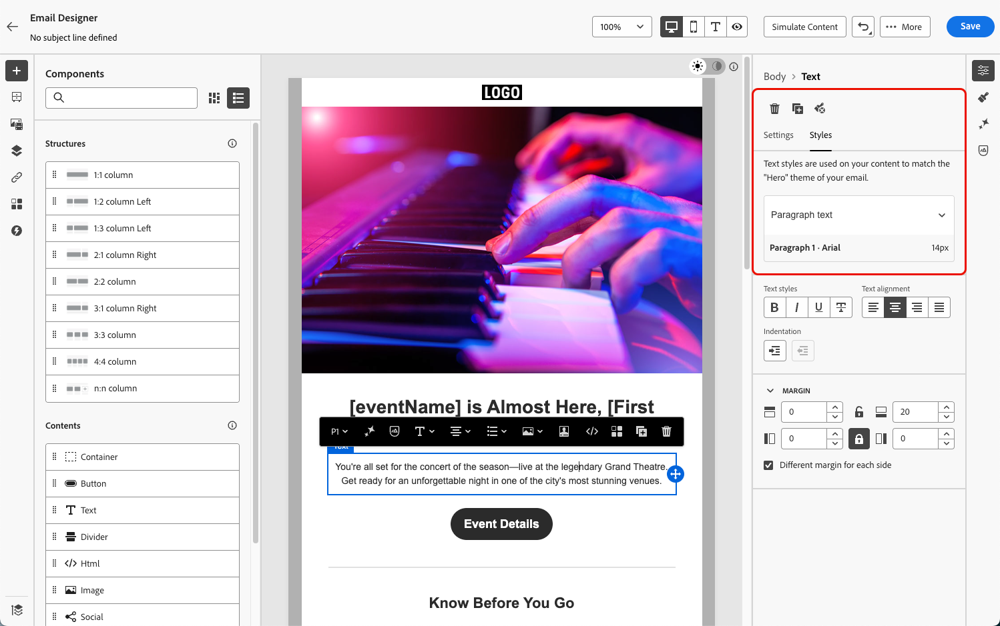

# 開始使用電子郵件樣式 {#get-started-email-style}

在 [!DNL Journey Optimizer] 中開始建立電子郵件內容後，您可從電子郵件設計工具&#x200B;**[!UICONTROL 樣式]**&#x200B;窗格調整許多樣式參數與屬性。

您可將變更套用至電子郵件內文、結構元件或內容元件。

選取電子郵件中的任何元素，然後按一下&#x200B;**[!UICONTROL 樣式]**&#x200B;標籤。 所選元素的所有樣式選項都會顯示在右窗格中。

例如，如果您選取文字元件：

* 您可以調整該段落的&#x200B;**[!UICONTROL 背景顏色]**&#x200B;和&#x200B;**[!UICONTROL 字型顏色]**；
* 您可以更新&#x200B;**[!UICONTROL 文字]**&#x200B;參數，例如字型系列、大小、高度、對齊方式等，並使用&#x200B;**[!UICONTROL 縮排]**&#x200B;設定來管理行上第一個字元前的間距；
* 您也可以調整文字元件的&#x200B;**[!UICONTROL 邊框]**、**[!UICONTROL 邊界]**&#x200B;和&#x200B;**[!UICONTROL 內距]**&#x200B;等選項。

如果您使用預設的[內容範本](use-email-templates.md)，或是將主題套用至電子郵件，您只能調整部分樣式設定以符合選取的主題。 [進一步了解主題](apply-email-themes.md)

請依照下列連結，探索如何調整電子郵件的某些特定樣式設定。

* 了解如何[個人化您的電子郵件背景](backgrounds.md)
* 了解如何[管理垂直對齊方式及邊框間距](alignment-and-padding.md)
* 了解如何[自訂內嵌樣式屬性](inline-styling.md)
* 了解如何[將自訂 CSS 新增至您的電子郵件內容](custom-css.md)
* 了解如何[管理深色模式內容](dark-mode.md)

>[!NOTE]
>
>[歐洲無障礙法案](https://eur-lex.europa.eu/legal-content/EN/TXT/?uri=CELEX%3A32019L0882){target="_blank"}規定所有數位通訊都應該能透過無障礙方式取得。 在 [!DNL Journey Optimizer] 中設計內容時，請務必遵循[此頁面](../email/accessible-content.md)所列的特定樣式指南，例如調整顏色、標籤和圖示以確保清晰度，以及針對行動裝置和回應式版面最佳化設計。