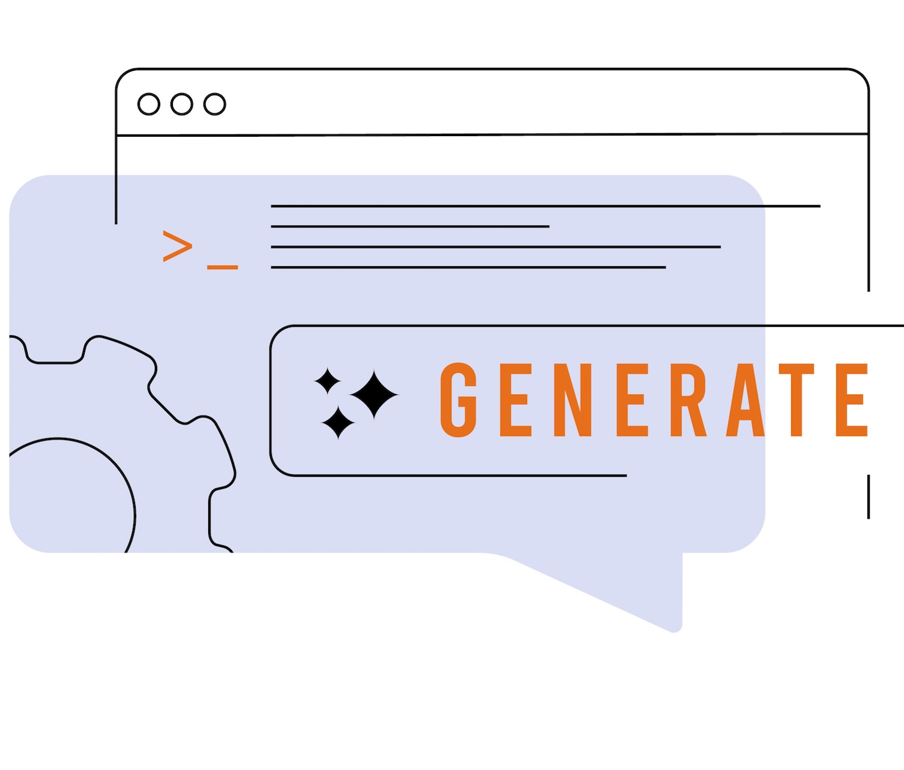

# 開始使用電子郵件 {#get-started-email}

>[!CONTEXTUALHELP]
>id="ajo_homepage_card4"
>title="設計電子郵件"
>abstract="使用 **Adobe Journey Optimizer** 傳送電子郵件訊息給客戶。您可以在電子郵件設計工具建立、個人化以及預覽訊息。"

使用 [!DNL Journey Optimizer] 傳送電子郵件訊息給客戶。 您可以在電子郵件設計工具建立、個人化以及預覽訊息。

可建立的電子郵件傳遞：

* 在&#x200B;**歷程**&#x200B;中：將&#x200B;**[!UICONTROL 電子郵件]**&#x200B;活動新增至您的歷程，並定義基本設定，使用&#x200B;**[!UICONTROL 動作：電子郵件]**&#x200B;右側窗格建立訊息內容。[了解如何建立歷程](../building-journeys/journey-gs.md)

* 在&#x200B;**行銷活動**&#x200B;中：一旦建立行銷活動，請選取&#x200B;**[!UICONTROL 電子郵件]**&#x200B;作為動作並定義基本設定。[了解如何建立行銷活動](../campaigns/create-campaign.md#configure)

>[!IMPORTANT]
>
>如果這是您第一次建立電子郵件，請確定已設定電子郵件通道。 [了解更多](email-settings.md)

<table style="table-layout:fixed"><tr style="border: 0;">
<td>

<a href="create-email.md"><strong>建立電子郵件</strong>

</td>
<td>

<a href="get-started-email-design.md"><strong>設計電子郵件</strong></a>

</td>
<td>

<a href="email-opt-out.md"><strong>電子郵件選擇退出管理</strong></a>

</td>
<td>

<a href="email-settings.md"><strong>設定電子郵件頻道</strong></a>

</td>
</tr></table>

<table style="table-layout:fixed"><tr style="border: 0;">
<td>

<a href="../content-management/generative-email.md"><strong>用於內容產生的 AI 助理</strong>

</td>
<td>

<a href="../content-management/fragments.md"><strong>使用電子郵件內容片段</strong></a>

</td>
<td>

<a href="../personalization/personalize.md"><strong>個人化您的電子郵件內容</strong></a>

</td>
<td>

<a href="../integrations/assets.md"><strong>結合 Adobe 應用程式與解決方案</strong></a>

</td>
</tr></table>
